# How the Season 2 server runs the cog bodies, tick by tick

Research report on the Paintbot Season 2 engine (`coworld-ctf`), for James and
coding agents who know the game but not the code. Researched against commit
`28405185` on 2026-09-03.

## Executive summary

Every 41.67 ms (24 ticks per second) the game thread runs one tick. For the cogs
in Season 2 "play seats", that tick has a fixed shape: the server first applies
any play calls and module uploads that arrived from the policies since the last
tick, then builds each cog a fog-filtered picture of the world, then hands all
of those pictures to the shell in a single call. Inside that call the shell runs
one pass per stage rather than one pass per cog: it advances the background
compiler, handles births and deaths, works out each cog's fallback order and
emergency reflexes, builds each cog's view, runs the policy's uploaded
WebAssembly plays under a hard instruction budget, folds their answers into one
standing order per cog, and finally runs each cog's body once to turn that order
into the same eight-button input mask a human would press. The server writes
those masks into the simulation step, records them in the replay (the only part
of all this that the replay ever re-executes), and observes any deaths the step
caused. A new play call takes effect the same tick it is read, but each play in
it is started under a server-wide quota of two per tick, so a list of several
plays comes fully to life over several ticks with the engine's built-in default
behaviour covering the gap, and the cog does not start walking until a path has
been planned, which is itself rationed per tick.

Two things stand out for anyone trying to understand behaviour from the outside.
First, the tracing that exists is uneven: the standing-order changes, play
faults, planning stalls, follower state and weapon-path outcomes are all logged
per tick to the server's stdout and mostly to the replay, but the shell's own
per-tick timing counters are never printed in production, a play's `log` calls
are silently discarded, and the compile-time profiler does not cover the shell
at all. Second, several inputs the design promises to the body are not wired
today: the server never feeds hazards, kill feed, aggressor or shout events, so
the grenade and spray reflexes can never trigger, a `holdFire` policy can never
return fire, and the default play's cover-hold rule can never fire. The three
engine reflexes are also always armed above every play list, where the design
says a call opts in. These are recorded as findings in section 10, not fixed.

## Table of contents

1. [The cast, in plain words](#1-the-cast-in-plain-words)
2. [The clock and the threads](#2-the-clock-and-the-threads)
3. [One tick, end to end](#3-one-tick-end-to-end)
4. [Inside the shell step](#4-inside-the-shell-step)
5. [What persists between ticks](#5-what-persists-between-ticks)
6. [When the policy calls a new play](#6-when-the-policy-calls-a-new-play)
7. [How long each part takes](#7-how-long-each-part-takes)
8. [The outcomes, catalogued](#8-the-outcomes-catalogued)
9. [Where the tracing goes](#9-where-the-tracing-goes)
10. [Findings: code versus design, and gaps](#10-findings-code-versus-design-and-gaps)
- [Appendix A: the constants](#appendix-a-the-constants)
- [Appendix B: global versus per-cog, the master table](#appendix-b-global-versus-per-cog-the-master-table)
- [Appendix C: the guard vocabulary](#appendix-c-the-guard-vocabulary)
- [Appendix D: return codes a play can see](#appendix-d-return-codes-a-play-can-see)
- [Sources](#sources)

---

## 1. The cast, in plain words

- The **simulation** owns the world: positions, bullets, zone, hit points. It
  advances one tick at a time from one input mask per cog.
- The **shell** is the Season 2 layer that produces those input masks for play
  seats. It lives in `src/shell/` and the simulation only meets it where masks
  are collected (`docs/designs/strategy-play-calling-shell-2026-08-29.md:195-207`).
- A **seat** is one roster slot; Season 2 has up to 32 (`src/ctf/sim_types.nim:653`).
  A **play seat** is a slot driven by uploaded plays rather than by direct input.
- A **body** is the engine-owned executor for one cog: what it currently knows
  (its *belief*), its navigation state, its weapon state. One body per live
  play seat (`src/shell/body.nim:307-330`).
- A **standing order** is the single instruction the body is currently carrying
  out: hold here, or walk to this point, plus a combat policy that says who may
  and may not be shot. It persists until replaced
  (`docs/designs/strategy-play-calling-shell-2026-08-29.md:186-193`).
- A **play** is a small WebAssembly program the policy uploaded. A *movement
  play* (the code says "controller") emits standing orders; a *targeting play*
  (the code says "overlay") emits only combat policy that is layered onto
  whichever movement play is active (`docs/designs/strategy-play-calling-shell-2026-08-29.md:2098-2112`).
- A **call** is the policy's ordered list of play entries with parameters and
  optional conditions (the code calls the list a "ladder" and the conditions
  "guards"). One call stands per seat; a new call replaces it
  (`docs/designs/strategy-play-calling-shell-2026-08-29.md:2077-2141`).
- The **default play** is engine-native code that always sits at the bottom of
  the list: rotate ahead of the zone, stay near the partner, otherwise hold
  (`src/shell/default_play.nim:47, 77-112`).
- A **reflex** is engine-native emergency behaviour (clear a grenade, clear
  spray, escape the zone) that can take over the standing order
  (`src/shell/reflexes.nim:1-30`).
- The **policy** is the player's program (usually an LLM harness) on the other
  end of a websocket. It uploads plays, sends calls, and receives a view of the
  world a few times a second. It never touches the tick directly.
- An **annotation** is a note the server writes into the replay file when
  something about a seat's order changes (a new standing order, a death, a
  play fault). Annotations describe behaviour; they are not part of the
  simulation's hash and playback never re-executes them
  (`src/shell/types.nim:188-218`).

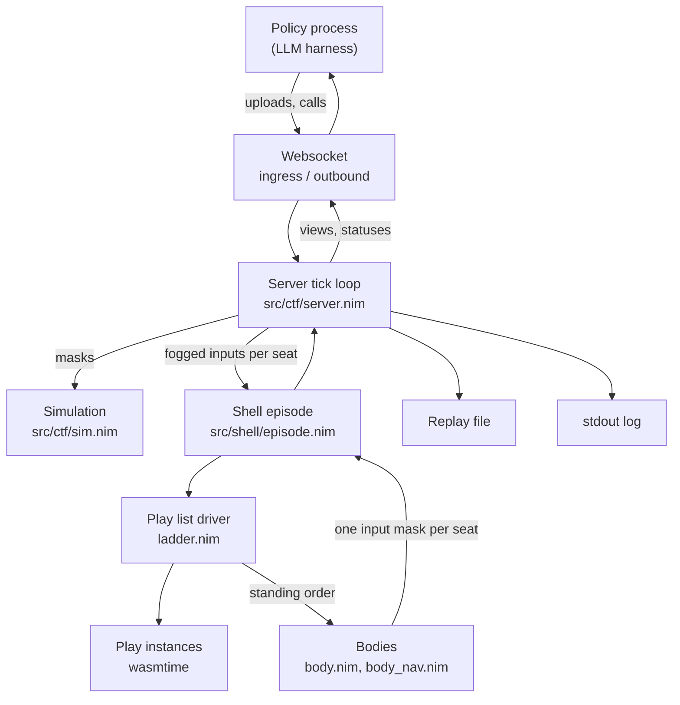

Figure 1 — The pieces and the direction data flows. The simulation never reads
shell state; it only receives input masks, which is also all the replay records.

---

## 2. The clock and the threads

- The game thread runs one tick every 41.67 ms and sleeps in 1 to 2 ms slices
  until the next one is due (`src/ctf/server.nim:3125-3145`;
  `src/ctf/sim_types.nim:532`).
- Frames that miss their slot are counted as late and reported once at
  shutdown; they are not otherwise logged (`src/ctf/server.nim:5526-5536, 5470-5484`).
- Four other kinds of thread exist, and only two of them touch the shell.

The tick itself runs entirely on the game thread. The websocket server has four
worker threads that only enqueue incoming packets into bounded per-seat queues
(`src/ctf/server.nim:3963-3967`; `src/shell/ingress.nim:1-6`). The WebAssembly
runtime starts one wall-clock ticker thread that wakes every 5 ms and increments
a counter the runtime checks at loop edges (the runtime calls each 5 ms tick an
"epoch"), which is how a runaway play is stopped by wall-clock time as well as
by instruction count
(`src/shell/runtime.nim:120-126, 176-180`). The module compile plane starts
exactly two worker threads that hash, validate and compile uploaded plays; the
tick thread only admits uploads and commits finished results
(`src/shell/compile_plane.nim:4-6, 202-214, 401-448`).

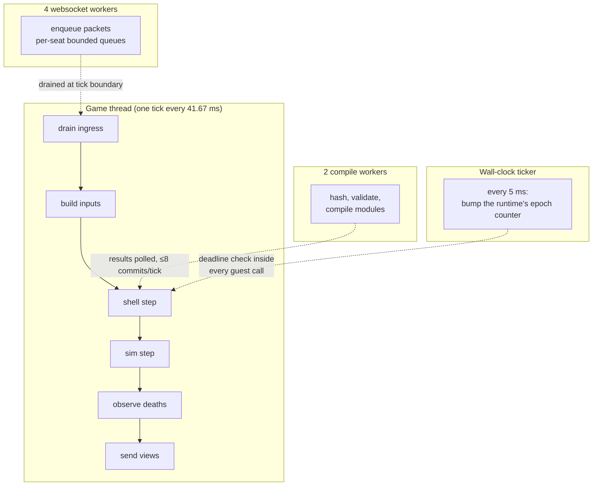

Figure 2 — Threads. Everything that decides a cog's behaviour runs on the game
thread; the other threads only feed it asynchronously.

At normal speed each frame runs exactly one tick; a live "speed" command can run
several ticks per frame, and everything below is per tick
(`src/ctf/server.nim:4925`).

---

## 3. One tick, end to end

- Ten steps, in a fixed order, on the game thread. Each is labelled below with
  its scope: once per tick (global), once per play seat, or, for two steps, a
  special case explained in place.
- The shell runs as a single call in step 3 that loops over the seats internally;
  its internals are section 4.
- The simulation step (step 8) is where the masks take effect; deaths it causes
  are handled in step 9 of the same tick.

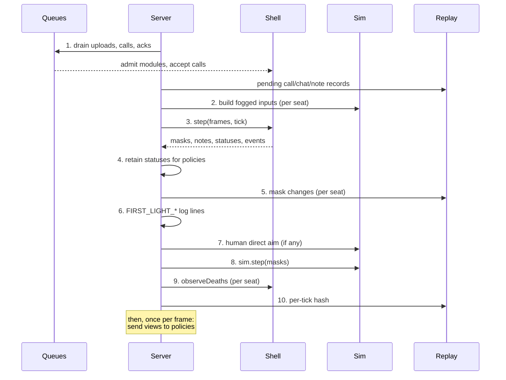

Figure 3 — The order of one tick as the server runs it
(`src/ctf/server.nim:4925-5135`).

**Step 1, ingress drain (global).** Uploads, calls and status acknowledgements
that the websocket threads queued since the last boundary are moved onto the
game thread and applied immediately, under a lock
(`src/ctf/server.nim:1430-1500`). An upload goes to the compile plane's
admission check; a call goes to the play-list driver, which validates it and
replaces the seat's standing list in the same call (section 6). Lobby chat and
ballots are drained next, and then every pending replay record (lifecycle,
chat, accepted calls, annotations) is written to the replay file
(`src/ctf/server.nim:4927-4932, 1810-1858`).

**Step 2, build inputs (per play seat).** For every player whose slot is a play
seat and whose seat is not terminally gone, the server refreshes that player's
field of view and builds the cog's picture of the world: its own state, its duo
partner's position and aim, every visible enemy as a track, and every fixed
pickup point inside its fog as an item sighting
(`src/ctf/server.nim:3658-3705`). It also attaches the zone facts the default
play needs (current and next rectangle, damage rate, ticks to the next shrink,
a "rotate target" at most 192 px toward the next zone's centre)
(`src/ctf/server.nim:3745-3777`). Four belief fields that the body type can
carry are never filled here: hazards, kill feed, aggressor events and shouts
(only `visibleTracks` and `sightedItems` are ever assigned, `:3671, :3694`).
Section 10 covers the consequences.

**Step 3, the shell step (one call; per seat inside).** `episode.step(frames, tick)` does all the
per-cog reasoning and returns one input mask per present play seat plus the
tick's annotations, installs, statuses, planning events and two timing sums
(`src/ctf/server.nim:4957-4958`; `src/shell/episode.nim:133-145`).

**Step 4, retain statuses (global).** Module compile results and play-list
outcomes are appended to each seat's durable status list, which is what the
policy reads back (`src/ctf/server.nim:4959-4961, 854-935`).

**Step 5, apply and record masks (per seat).** Each returned mask overwrites
that player's input for this tick and is written to the replay only if it
differs from the last recorded mask for that player
(`src/ctf/server.nim:4963-4977`; `src/ctf/replays.nim:201-222`).

**Step 6, log lines (global).** Section 9 lists them; most print only when
something happened or once a second (`src/ctf/server.nim:4978-5008`).

**Step 7, human direct aim (per human seat, if enabled).** When a configuration
allows a human to point a turret with the cursor, that bearing is applied and
recorded here. It never touches a play-seat cog; it is listed only because it
sits between the masks and the step (`src/ctf/server.nim:5015-5029`).

**Step 8, the simulation step (global).** The tick counter increments, and for
each cog the mask is applied: movement, aim turning, trigger pulls, grenade
charging (`src/ctf/sim.nim:6828-6900`).

**Step 9, observe deaths (per seat).** Any play seat whose player died in that
step is cleared on the same tick: a "clear on death" annotation is written, the
body is dropped, and in battle royale the seat is marked eliminated so it never
reactivates (`src/ctf/server.nim:5073-5092`; `src/shell/episode.nim:1224-1238, 975-985`).

**Step 10, the per-tick hash (global).** The simulation's state hash for this
tick is written to the replay so playback can prove it re-simulated the same
world. It does not affect any cog (`src/ctf/server.nim:5127`).

**After the tick, once per frame.** The server sends each play-seat socket its
pending context, chat transcript and, at most once every `viewIntervalTicks`
(default 6, so four times a second) or whenever a status is pending, a JSON view
built from the same fogged source the plays read
(`src/ctf/server.nim:1701-1808`; `src/shell/outbound.nim:228-232`;
`src/ctf/sim_types.nim:995`).

---

## 4. Inside the shell step

- Seven stages, each a pass over the seats, in a fixed order
  (`src/shell/episode.nim:1059-1222`).
- Two stages are global (compile progress; danger and planning scheduler). The
  rest iterate the play seats.
- The body's actual execution (movement and weapons) is the sixth stage and is
  the only work counted in the "body" timing sum; everything before it counts
  toward the "runtime" sum.

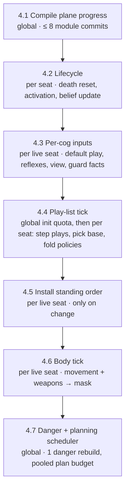

Figure 4 — The seven stages of `episode.step`. Stages 4.2 through 4.5 are timed
into the "runtime" sum; 4.6 into the "body" sum; 4.1 and 4.7 into neither
(`src/shell/episode.nim:1090, 1112, 1118, 1197-1198, 1213-1215`).

### 4.1 Compile plane progress (global)

- Resets each seat's uploads-this-tick counter (`src/shell/episode.nim:1077`;
  `src/shell/compile_plane.nim:242-244`).
- Starts the two compile workers if needed, hands them queued uploads, polls
  finished results, and commits at most eight finished uploads per tick,
  round-robin by seat (`src/shell/compile_plane.nim:625-635, 603-623`;
  `src/shell/types.nim:410`).
- A committed, valid module becomes a *binding*: a play name the seat's calls
  can now refer to (`src/shell/episode.nim:697-706, 644-670`).

Outcomes per upload: ready (name bound), or rejected with a reason; both become
statuses the policy will see.

### 4.2 Lifecycle (per seat)

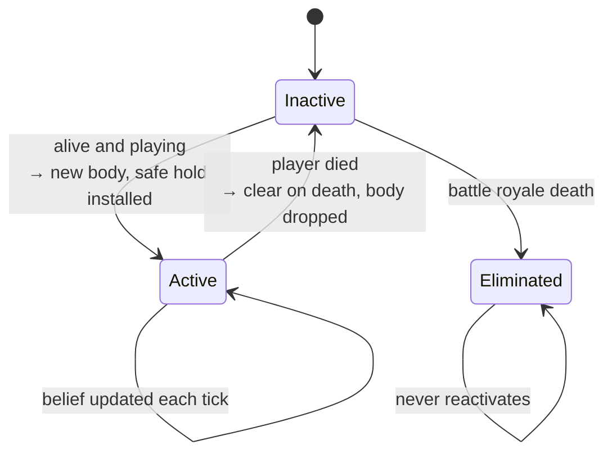

Figure 5 — A play seat's lifecycle. In battle royale a dead seat is
eliminated; in other modes it would reactivate on respawn with reason "respawn"
(`src/shell/episode.nim:1080-1112, 975-1015`).

Activation creates the body and installs a **safe hold** order (stand still,
neutral combat policy) with a replay annotation and an install record whose
rule is `safe_hold` and provenance `default` (`src/shell/episode.nim:987-1015`).
The body's navigation buffers were allocated when the episode was built, not
here (`src/shell/body_nav.nim:197-233`). For an already-active, living seat this
stage only updates belief from the new inputs (`src/shell/episode.nim:1102`).
Note that the body tick in 4.6 updates belief again with the same inputs
(`src/shell/body.nim:1272`); the update is idempotent, so this is wasted work
rather than a behaviour difference.

### 4.3 Per-cog inputs (per live seat)

For each active, living seat the episode computes, in this order
(`src/shell/episode.nim:1130-1160`):

1. **The default play's decision.** Facts are gathered (threats fresh this tick,
   partner, zone) and the four rules are tried in priority order
   (`src/shell/standing_order.nim:56-78`; `src/shell/default_play.nim:77-112`):
   rotate if the next shrink is 120 ticks or fewer away; walk toward the
   partner if it is more than 256 px away; hold cover if threats are visible and
   a cover goal was supplied; otherwise hold. Because the server always supplies
   no cover goal (`src/ctf/server.nim:3777`), the third rule never fires in
   production. The decision is computed every tick for every live seat, whether
   or not it ends up being used.
2. **Reflex observers.** All three reflexes are observed for every seat every
   tick, and the first active one that can plan an escape becomes a *native
   base* that outranks every uploaded play (`src/shell/episode.nim:501-504,
   1144-1148`; `src/shell/reflexes.nim:657-726`). Zone escape arms when the cog
   would be outside the current zone within 72 ticks and releases above 96
   (`src/shell/reflexes.nim:22-23, 636-642`). The grenade and spray observers
   read the body's hazard list, which is never fed (section 3, step 2).
3. **The view bytes** the plays will read: a fixed-layout binary frame built
   from the body's fogged state (`src/shell/episode.nim:1153-1156, 262-275`).
   This is built for every live seat every tick, even when no play exists to
   read it.
4. **The context bytes** (roster, map, partner) and the **guard facts**: eleven
   named quantities such as `self.hp_frac`, `partner.dist`,
   `world.nearest_enemy_dist`, resolved from the body so a call's conditions
   are evaluated over what the cog actually knows
   (`src/shell/episode.nim:528-597`; Appendix C).

### 4.4 The play-list tick

The driver is called once with all 32 seat inputs (`src/shell/episode.nim:1162`;
`src/shell/ladder.nim:647-657`). It does one global thing, then one pass per
seat.

**Initialization quota (global).** New entries need a live WebAssembly
instance before they can run. At most two instances are created or retuned per
tick across the whole server, and at most one per seat, granted round-robin
starting where the previous tick stopped (`src/shell/ladder.nim:466-502`;
`src/shell/types.nim:354-356`). Creating an instance means: a fresh runtime
store with a 1 MiB memory cap, an instruction budget, a wall-clock deadline,
four host functions linked in, instantiation from a pre-reserved pool, then the
play's `play_init` under an initialization budget of 500,000 instructions
(`src/shell/instance.nim:300-375, 479-497`; `src/shell/runtime.nim:19-26`;
`src/shell/types.nim:350`). Outcomes: live; or faulted (instantiation failed,
init trapped or returned nonzero), which permanently disables that entry for
the life of the call. A retune (same play, new parameters) uses the same quota
and either succeeds or is refused, in which case the entry is dropped
(`src/shell/ladder.nim:403-455`).

**Per seat.** Figure 6 shows the selection.

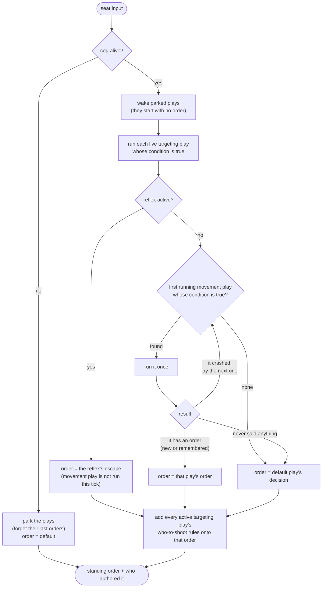

Figure 6 — How one seat's order is chosen each tick
(`src/shell/ladder.nim:571-645`). A "remembered" order is the last accepted
emission of that entry (the code calls it the cached emission); a play that says
nothing this tick keeps standing on what it last said.

Stepping one entry means one guest call: set the step budget of 50,000
instructions and the wall-clock deadline of four 5 ms epochs, ask the play to allocate a
buffer, copy the view in, call `play_step` (`src/shell/instance.nim:499-522,
410-415`; `src/shell/types.nim:345`). During that call the play may call back
into the engine: `emit` at most twice (its order or policy, validated on the
spot, with an unreachable goal snapped to the nearest reachable point),
`nearest_reachable` and `nearest_cover` at most twice between them, and `log`
at most four times (`src/shell/abi.nim:91-115`; `src/shell/emit_validator.nim:301-351`).
The last accepted emission of the call wins. If it differs byte-for-byte from
the entry's cached emission it replaces it, stamped with this tick; an
identical re-emission changes nothing (`src/shell/ladder.nim:550-560`).

A fault during a step (trap, budget exhausted, deadline hit, nonzero return,
too many emits or allocations, bad buffer) permanently disables the entry:
caches cleared, sandbox destroyed, a "play faulted" status minted, and, if it
was the selected movement play, the driver falls through to the next passing
one in the same tick (`src/shell/ladder.nim:540-549, 616-628`).

The assertion at the end pins the worst case: no more than three guest steps
per seat per tick (two targeting plays plus one movement play), so 96 across a
full roster (`src/shell/ladder.nim:657`; `src/shell/types.nim:358`).

### 4.5 Install the standing order (per live seat)

The chosen order gets one final stamp (an idle-aim centre if the play did not
set one; the code calls this step the *finisher*) and is compared with the body's current standing order on three
things: its canonical bytes (one fixed, byte-for-byte encoding, so equal orders
always compare equal), who authored it (the code calls this *provenance*: entry,
default, or reflex, plus which targeting plays contributed), and which call it
came from. The code numbers a seat's calls with a counter it calls the *call
epoch*; that is unrelated to the runtime's 5 ms wall-clock epochs in section 2. Only if any
differ does the body receive a new standing order and a replay annotation get
written (`src/shell/episode.nim:1180-1195`; `src/shell/standing_order.nim:123-177`).
Giving the body a new order cancels any route plan in flight and pins the new
goal's route field so it cannot be evicted (`src/shell/body.nim:548-573`).

Each install also becomes a `FIRST_LIGHT_INSTALL` record naming the rule
(entry id, default rule, or reflex) and the provenance (`src/shell/episode.nim:1017-1035`).

### 4.6 The body tick (per live seat)

One call per active living seat, and the only work counted as "body" time
(`src/shell/episode.nim:1207-1214`; `src/shell/body.nim:1266-1347`).

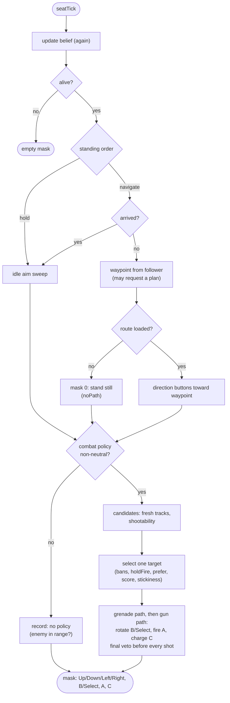

Figure 7 — What one body does in one tick. Firing the gun suppresses the
movement bits for that tick and starts a short "fire freeze" on movement
(`src/shell/body.nim:1281-1292, 1326-1329`).

Movement is a *follower* walking a pre-planned route: the waypoint advances
when the cog is within one 8 px navigation cell of it, and the mask is the
compass octant toward the waypoint (`src/shell/body_nav.nim:687-693, 706-717`).
The follower requests a new plan when the goal moved more than two cells, the
cost profile changed, there is no route and none pending, the cog has been
stuck for eight ticks, a moving target has gone twelve ticks since the last
plan, or the previous plan was cancelled before landing
(`src/shell/body_nav.nim:719-762`). Until a route lands the cog stands still and
its follower state is recorded as "no path".

Weapons only run when the standing order's combat policy is non-neutral (some
ban, ward, preference, or hold-fire flag). Target selection is one route:
exclude banned and protected seats, honour hold-fire (return fire only), rank
by the policy's preference tags, then by a score of wound, range band, aim
cost, shield and spray, then apply stickiness (keep the current target for at
least eight ticks unless a clearly better one appears)
(`src/shell/body.nim:759-762, 975-1039`). Every concrete shot re-checks the
policy immediately before pressing the button (`src/shell/body.nim:1157-1248`).

The body records two outcome labels per tick: what the follower did (idle,
following, stale path, no path) and why the weapon path did or did not fire
(seven cases, listed in section 8) (`src/shell/body.nim:288-304, 1331-1343`).

### 4.7 Danger and planning scheduler (global)

Two pieces of work are spread across ticks rather than done per cog per tick,
and both run after the body ticks (`src/shell/episode.nim:1219-1222`):

- **Danger field rebuild.** Each seat keeps a grid of how exposed each cell is
  to the enemies it can see. A seat rebuilds it only on ticks where
  `tick mod 32 == seat mod 32`, from at most the eight nearest visible enemies,
  with rays capped at the live gun range (`src/shell/body_nav.nim:30, 44,
  412-447, 470-485`). With 32 seats that is exactly one rebuild per tick, and
  each seat's field is at most 32 ticks (1.33 s) stale. The field feeds route
  cost, not shooting.
- **Cold-plan budget.** Route planning is a resumable A* search where one "work
  unit" is one heap pop, expansion, connector candidate or path-reversal step
  (`src/shell/body_planner.nim:4-7`). Each tick the pool is 256 units per
  configured seat; pending plans are served round-robin from where the last
  tick stopped until the pool is spent, a finished plan installs its route, and
  any leftover units go to warming one route-distance field
  (`src/shell/body_nav.nim:31, 572-628`). Because this runs after the body
  ticks, a plan requested this tick gets its first slice this tick and the
  follower can use the route next tick.

Plan-budget events (a plan suspended for lack of budget, or one that needed
more than one visit finally completing or failing) are drained here and
printed by the server (`src/shell/body_nav.nim:259-280`).

---

## 5. What persists between ticks

- Five lifetimes matter: the episode, a seat's body, the seat's call, a play
  instance, and the cached emission and standing order that sit between them.
- "Call version" below is the per-seat counter the code calls the call epoch,
  not the runtime's 5 ms wall-clock epoch.
- Nothing here is re-run at replay time; the replay only re-applies masks.

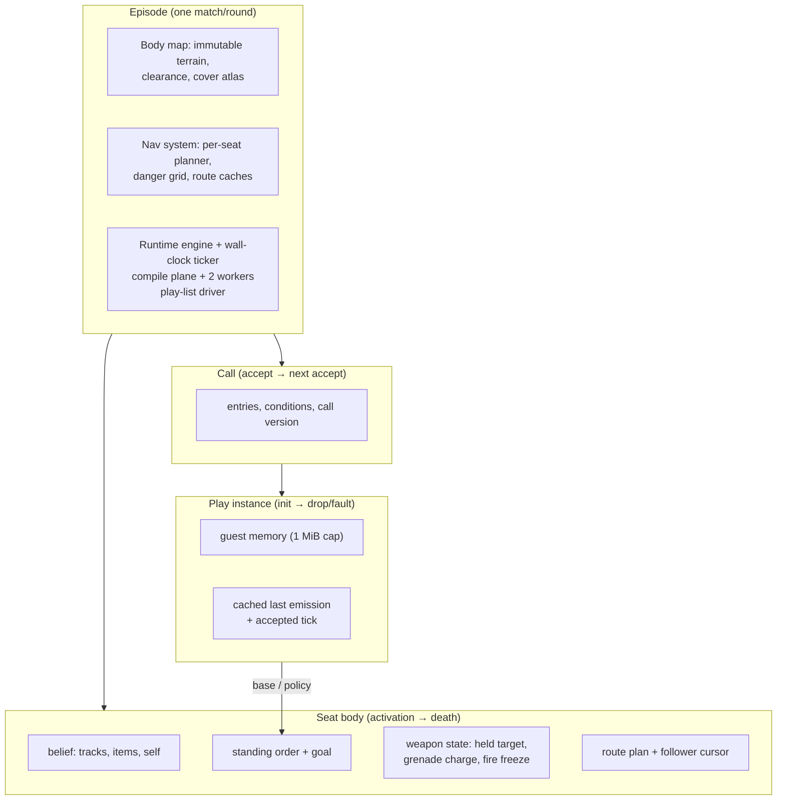

Figure 8 — Lifetimes. An instance can outlive a call (adopted by the next call
if the entry id, play and module hash match) and outlives the cog's death
(parked, with its cache cleared) (`src/shell/ladder.nim:329-352, 574-589`).

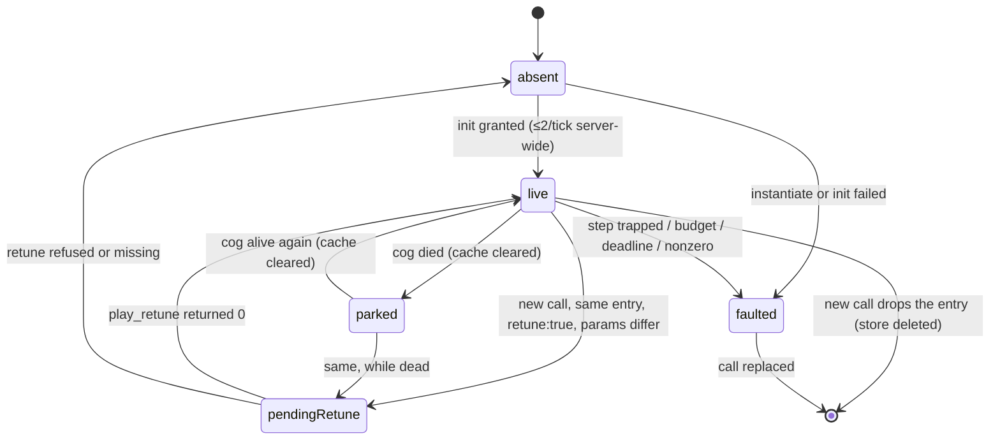

Figure 9 — The five states of one play entry's instance
(`src/shell/types.nim:106-115`; `src/shell/ladder.nim:329-352, 403-455, 540-549, 574-589`).
A faulted entry stays faulted for the life of the call.

Three things are worth stating about what does **not** persist:

- A cached emission is cleared on death, on unparking, when an entry enters the
  retune state, and on fault; guest memory survives a retune, the engine's
  memory of what the guest last said does not (`src/shell/ladder.nim:340-349,
  578, 588`).
- The standing order is recomputed from scratch every tick from the selected
  base and the currently active targeting plays; the previous standing order is
  never an input, only the comparison target for "did it change"
  (`src/shell/standing_order.nim:123-145`).
- The route plan is cancelled the moment a new standing order arrives, even if
  the new goal is the same cell (`src/shell/body.nim:564-566`); the follower's
  own "goal moved more than two cells" test is what avoids a replan in that
  case (`src/shell/body_nav.nim:730-732, 752-758`).

---

## 6. When the policy calls a new play

- A call takes effect at the next tick boundary and its first effect on the cog
  can be the same tick, but only if its play is already instantiated.
- Instantiation is rationed to two per tick server-wide, so full ladders and
  full rosters reach shape over several ticks with the default play covering.
- Walking starts only when a route has been planned under the pooled budget.

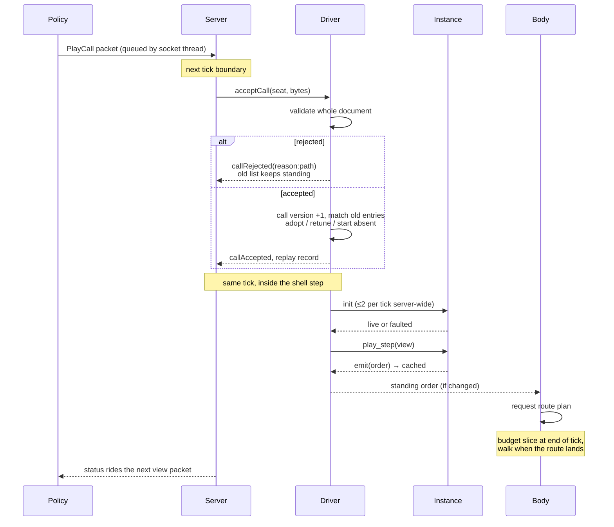

Figure 10 — From a call leaving the policy to the cog moving
(`src/ctf/server.nim:794-852`; `src/shell/ladder.nim:297-365, 466-502`;
`src/shell/episode.nim:1162-1195`).

**Validation is total and atomic.** The whole call is checked before any of it
takes effect: the fixed byte encoding, size, every play name bound and ready, parameter
types and ranges against the play's manifest, condition expressions against the
path vocabulary, entry and overlay caps. Any failure rejects the whole call
with a named reason and path (`schemaInvalid`, `guardInvalid`, `callTooLarge`,
`playUnknown`, `playNotReady`, `nonCanonical`, the last meaning the JSON was
not in the one fixed byte encoding the engine requires) and the previous list keeps
standing (`src/shell/call_validation.nim`; `src/shell/ladder.nim:313-320`).
Conditions are checked for validity here, not evaluated: acceptance passes an
empty fact context (`src/shell/episode.nim:781`).

**Replacement follows one table.** Each new entry is matched against the old
list by entry id, play name and module hash. Identical parameters: the old
instance, state and cached emission are adopted silently. `retune: true` with
different parameters: the instance is kept but enters the retune state, its
cache is not carried, and at its quota turn `play_retune` runs; nonzero, a
trap, or a missing export drops it. Anything else starts absent, and every old
entry with no match is closed, freeing its sandbox
(`src/shell/ladder.nim:329-356`; design table at
`docs/designs/strategy-play-calling-shell-2026-08-29.md:2178-2192`).

**The quota shapes the first ticks.** With two instantiations per tick across
the server and one per seat, a four-entry list for one seat needs at least four
ticks to be fully live, and 32 seats all calling on the same tick need at least
16 ticks before every seat has even its first entry live. An entry that is not
yet live cannot be selected, so the default play (or an armed reflex) drives
the cog meanwhile (`src/shell/ladder.nim:562-569`). Entries whose condition is
false are never instantiated at all; a `supply_run` that never triggers never
costs an instance (`src/shell/ladder.nim:383-401, 457-464`).

**Movement waits for a route.** The standing order can be installed and
executed in the same tick it was emitted, but the follower has no route yet, so
the mask is zero and the seat is counted as "no path" until planning lands.
How long that takes depends on the route and on how many seats are planning:
one 900 px route on the league map costs about 17,000 work units
(`src/shell/body_nav.nim:12-13`); a seat planning alone gets the whole pool
(8,192 units per tick with 32 seats configured) and lands in two or three
ticks, while 32 seats planning at once get about 256 units each and need on the
order of 67 ticks. The gate report measured, under the older flat 256-unit
budget, one tick for a near goal and 496 to 536 ticks (20 to 22 s) for the
worst typical and far routes (`docs/reports/body-lane-gate-report-2026-08-31.md:86-104`);
the pooled budget is what replaced that behaviour after hosted cogs "stood
where they spawned until the zone killed them" (`src/shell/body_nav.nim:10-21`).

**Statuses reach the policy late, by design.** The accept or reject status is
appended to the seat's durable list and travels inside the control envelope of
the next view packet, which goes out when a status is pending or at most every
six ticks (`src/shell/outbound.nim:109-135, 190-232`; `src/ctf/server.nim:1782-1808`).

---

## 7. How long each part takes

- The whole tick has 41.67 ms. The design's allowance for the shell is a
  quarter of that, 10.425 ms, split into body, view, and runtime shares
  (`docs/reports/body-lane-gate-report-2026-08-31.md:33-35`).
- The probe and containment harness gate the body at 5 ms and the runtime at
  4 ms for 32 seats (`tools/first_light_probe.nim:18-19`;
  `src/shell/containment.nim:60-63`).
- Measured costs after the rulings sit well inside those gates except the view
  build, which was reported as a miss.

Two measurement passes are quoted: "P0", the first provisional benchmark pass
(2026-08-30, on a busy shared Apple M4, so treat as upper bounds), and the
quiet-window gate report that followed (2026-08-31, M4 and a 1-vCPU x86 box).

| Work | Scope per tick | Budget or cap | Measured | Source |
|---|---|---|---|---|
| Frame | once | 41.67 ms | late frames counted only at shutdown | `sim_types.nim:532`; `server.nim:3132, 5477` |
| Danger rebuild | one seat per tick | K = 32 stagger, ≤ 8 sources | 0.976 ms M4, 0.912 ms 1-vCPU x86 (one seat) | `body_nav.nim:30, 44`; gate report §2, §4 |
| Body executor (`seatTick`) | 32 seats | 5 ms gate | 0.883 ms (32 seats); P0 mixed batch 0.91 ms p95 | gate report §2; measurement `:191` |
| Targeting scan | 32 seats × 31 tracks | part of body | 0.37 ms p95 (P0) | measurement `:183` |
| Follower step | 32 seats | part of body | < 1 µs | measurement `:159` |
| Cold planning | pooled, round-robin | 256 × seats units | ~0.101 ms at 256 units; "a few ms" at 8,192 | gate report §3; `body_nav.nim:19-21` |
| View build + encode | every live seat | 2.5 ms share | 3.51 ms (32 seats, JSON), reported miss | gate report §2, §10 |
| Reflex path | every live seat | 15 ms budget | ~2.7 ms (32 seats, worst shape) | `reflexes.nim:25`; `test_shell_episode_ladder.nim:1046-1048` |
| Guest step | ≤ 3 per seat, ≤ 96 total | 50,000 instructions; 4 × 5 ms wall clock | not measured in repo | `types.nim:345`; `runtime.nim:24-25` |
| Guest init / retune | ≤ 2 server-wide | 500,000 instructions | not measured in repo | `types.nim:350, 354-355` |
| `nearest_cover` host call | ≤ 2 spatial calls per step | ≤ 192 calls/tick | ≈ 13.3 µs each, ≈ 2.6 ms worst tick | gate report §7 |
| Module commit | once | ≤ 8 per tick | off-thread compile, not measured on tick | `types.nim:410` |
| Episode map build | once per episode | none | 351–362 ms M4 (P0), 434 ms M4 / 963 ms x86 | measurement `:146`; gate report §4 |
| First plans at activation | once per activation | none | 96 ms M4, ~213 ms x86 (32 scattered seats) | gate report §6 |

Sources: `docs/reports/body-lane-gate-report-2026-08-31.md`,
`docs/reports/body-measurement-2026-08-30.md` (the P0 pass). The gate report's
quiet-window and x86 figures are the ones to quote.

Before the rulings that shaped the current code, the worst 32-seat tick
measured 189 ms against the 10.4 ms allowance, an 18× miss; the danger rebuild
alone was 108.7 ms for 32 seats and one cold plan 65 ms
(`docs/reports/body-lane-gate-report-2026-08-31.md:33-41`;
`docs/reports/body-measurement-2026-08-30.md:155, 165`). The stagger, source
cap, range cap and budget are what brought those into the table above.

**What is instrumented, and what is not.** The episode sums wall-clock time
into two fields per tick, one for the body ticks and one for lifecycle plus the
play-list phase (`src/shell/episode.nim:133-145`). Only the first-light probe
and the tests read them (`tools/first_light_probe.nim:436-453`); the server
never prints them. The tests deliberately measure CPU time rather than wall
time because a preempted thread on a loaded box fails a wall-clock gate without
doing any extra work (`tests/test_shell_episode_ladder.nim:986-1012, 1038-1052`).
In production the only pacing signal is the frame limiter's late-frame count,
printed once at shutdown and written to the metrics JSON.

---

## 8. The outcomes, catalogued

- Every stage has a small closed set of outcomes; this section lists them so a
  log line or replay record can be read back to a cause.

**A guest call** (init, step, retune) ends one of three ways
(`src/shell/instance.nim:447-467`; `src/shell/abi.nim`):

| Outcome | Causes | Effect |
|---|---|---|
| Success | returned 0 | any accepted emission is cached |
| Fault | trap (out-of-bounds, unreachable, stack over 256 KiB), instruction budget exhausted, wall-clock deadline, nonzero return, illegal or excess host call, bad buffer | entry faulted for the call's life; sandbox destroyed; `playFaulted` status, replay annotation, log line |
| Retune refused | nonzero, trap, or no `play_retune` export | entry dropped (absent); `retuneRefused` status |

**An emit** returns a code to the play without ending the call
(`src/shell/abi.nim:38-46`; `src/shell/emit_validator.nim:301-351`): 0 accepted,
1 accepted with the goal snapped to the nearest reachable point, and negative
codes for schema, range, unreachable goal, unknown reference, wrong class
(a movement play emitting policy or vice versa), or too large. Appendix D has
the full list.

**The standing order's author** each tick is one of `entry:<id>`, `default`,
or `reflex:<name>`, plus the list of targeting plays whose policy was folded in
(`src/shell/episode.nim:395-403`; `src/shell/types.nim:157-186`). When the
author or the bytes or the originating call change, an install record and a replay
annotation are written; otherwise nothing.

**The follower** reports idle, following, stale path (walking an older route
while a newer plan computes), or no path (standing still)
(`src/shell/body.nim:288-294`).

**The weapon path** reports one of seven (`src/shell/body.nim:296-304`):

| Label | Meaning |
|---|---|
| `fired` | attack or grenade button pressed this tick |
| `aligning` | shootable target held; rotating, cooling down or winding up |
| `none_shootable` | fresh tracks, none in range with a clear line |
| `vetoed` | shootable tracks, all excluded by bans, wards or hold-fire |
| `no_enemy` | policy active, no fresh track |
| `no_policy` | neutral policy; weapon path never ran |
| `no_policy_enemy_in_range` | neutral policy while an enemy was shootable |

**Seat lifecycle** writes `install_safe` on activation and `clear_on_death` on
death; a call writes `callAccepted` or `callRejected`; a module writes
`moduleAccepted` then `moduleReady` or `moduleRejected`
(`src/shell/types.nim:117-125, 188-218`).

---

## 9. Where the tracing goes

- Four live sinks (stdout, replay, policy statuses, shutdown files), one
  compile-time profiler that does not cover the shell, and two in-memory traces
  that production never reads.

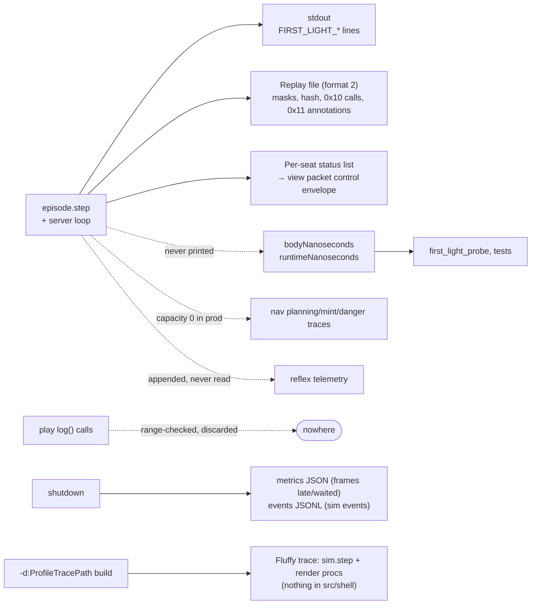

Figure 11 — Every place tracing goes, and the dead ends
(`src/ctf/server.nim:4978-5008, 5470-5500`; `src/shell/instance.nim:186-202`;
`src/shell/body_nav.nim:139-144, 216-218`; `~/.nimby/pkgs/bitworld/src/bitworld/profile.nim`).

**Stdout.** All lines carry `tick=` so they join against each other and the
replay. In the demo, stdout is redirected to a `server.log`; hosted, it is the
container log (`tools/run_first_light.sh:84-88`).

| Line | When | What it carries | Source |
|---|---|---|---|
| `FIRST_LIGHT enabled …` | episode reset | seat count, reason | `server.nim:3832` |
| `FIRST_LIGHT_PLAY_UPLOAD/COMMIT/CALL` | demo config only | upload/commit/call results | `episode.nim:820-847` |
| `FIRST_LIGHT_MOVEMENT` | any seat moving or aiming, else every 24 ticks | seats, moving, aiming counts | `server.nim:4978-4983` |
| `FIRST_LIGHT_INSTALL` | per standing-order install | tick, seat, rule, provenance, bytes hash, bytes | `server.nim:4987-4988`; `episode.nim:1240-1244` |
| `FIRST_LIGHT_ANNOTATION kind=play_fault` | per fault | seat, player name, call version, entry, runtime reason | `server.nim:4989-4992`; `episode.nim:1283-1300` |
| `FIRST_LIGHT_ANNOTATION kind=clear_on_death` | per death | seat, generation | `server.nim:5089-5092` |
| `FIRST_LIGHT_PLAN_BUDGET` | per event | seat, revision, visits, units, suspended/completed/failed | `server.nim:4996-4998`; `episode.nim:1256-1264` |
| `FIRST_LIGHT_NAV` | once a second, and every event tick, when non-empty | pending plans, stale-path seats, no-path seats | `server.nim:4999-5005` |
| `FIRST_LIGHT_COMBAT` | once a second | the seven weapon outcomes with seat lists | `server.nim:5006-5008`; `episode.nim:1271-1281` |
| `FIRST_LIGHT_ZONE` | only with `FIRST_LIGHT_ZONE_LOG=1` | zone rects, phase, dps | `server.nim:4984-4986, 3779-3800` |
| `Frame pacing: …` | shutdown | skipped/waited/late frame counts | `server.nim:5477` |

The `install_safe` and `accepted_intent` annotations that `step` produces are
not echoed as `FIRST_LIGHT_ANNOTATION`; they appear as `FIRST_LIGHT_INSTALL`
lines instead, and `FIRST_LIGHT_DEMO.md` documents how to read a fault line
next to an install line on the same tick
(`docs/designs/FIRST_LIGHT_DEMO.md:52-88`).

**Replay.** The replay is the determinism artifact: mask changes (deduped) and
the per-tick hash are what playback re-applies; play-call records (type `0x10`)
and behaviour annotations (type `0x11`: accepted intent, clear on death,
install safe, play fault) are non-hashed notes for display and analysis
(`src/ctf/replays.nim:201-222`; `src/ctf/replay_codec.nim:293-315`;
`src/shell/types.nim:269-272`). Playback never constructs a body or runs a play
(`src/shell/episode.nim:345-355`).

**Policy statuses.** Each seat keeps up to 64 status entries, 16 of them
reserved for spontaneous faults, each capped at 256 bytes; the whole list rides
in every view packet's control envelope (`src/shell/types.nim:306-309`;
`src/shell/outbound.nim:109-135, 190-212`). This is the only channel through
which a policy learns that its play faulted.

**Dead ends.** A play's `log` host call has its bytes range-checked and then
discarded (`src/shell/instance.nim:186-202`). The navigation system's planning,
minting and danger traces are ring buffers whose capacity is zero in production
(`src/shell/body_nav.nim:197-218`; `src/shell/episode.nim:318` passes no
capacity). Reflex trigger/release telemetry is appended to each seat's reflex
state and never read (`src/shell/reflexes.nim:644-655`). The compile-time
profiler measures `sim.step` and some render procs when built with
`-d:ProfileTracePath`, and nothing under `src/shell/` is marked for it
(`src/ctf/sim.nim:6828-6832`; `src/ctf/server.nim:3314-3419`).

---

## 10. Findings: code versus design, and gaps

- These are observations from reading the code at `28405185`, recorded rather
  than fixed. Each names the affected behaviour and the evidence.
- Items 1 to 5 change what a cog does or what a play author can rely on; 6 to 8
  are cost and observability; 9 to 11 are bookkeeping.

1. **Behaviour. Reflexes are always armed, natively, above every list.** The episode
   subscribes all three reflexes for every seat at call version zero
   (`src/shell/episode.nim:501-504`). The design says a call opts in by listing
   reflexes as entries so their priority is the player's choice
   (`docs/designs/strategy-play-calling-shell-2026-08-29.md:2214-2222`).
2. **Behaviour. A selected reflex skips the movement play's step.** When a reflex supplies
   the base, the controller branch is not executed, so the play misses ticks
   while the reflex holds (`src/shell/ladder.nim:601-608`). The design states
   the selected guest controller is always stepped (`:2255-2258`).
3. **Behaviour. The default play's cover-hold rule is unreachable in production.** The
   server always passes no cover goal (`src/ctf/server.nim:3777`), and the rule
   requires one (`src/shell/default_play.nim:100-104`). `FIRST_LIGHT_DEMO.md`
   lists `brCoverHold` among the rules you should see
   (`docs/designs/FIRST_LIGHT_DEMO.md:38-41`).
4. **Behaviour. Four belief inputs are never fed.** The server fills only self, partner,
   visible tracks and item sightings (`src/ctf/server.nim:3658-3705`). With
   hazards empty the grenade and spray reflexes can never trigger; with
   aggressor events empty, `holdFire` means never fire (return fire requires a
   recorded aggressor, `src/shell/body.nim:920-925, 1003`) and the `revenge`
   preference is always zero (`:692-696`). Item sightings themselves were only
   wired on 2026-09-02 (commit `8cb5efe3`), which is the pattern here.
5. **Play authoring. Play `log` output is discarded** (`src/shell/instance.nim:186-202`). A play
   author has no channel for diagnostics other than emitting.
6. **Cost. Belief is updated twice per seat per tick**, once in lifecycle and once
   inside the body tick (`src/shell/episode.nim:1102`; `src/shell/body.nim:1272`).
   Idempotent, but it is a full re-sort of items, events and hazards.
7. **Cost. View bytes are built for every live seat every tick**, even when the seat
   has no live play to read them (`src/shell/episode.nim:1153-1156`). The
   32-seat view build was the one measured miss against its share
   (`docs/reports/body-lane-gate-report-2026-08-31.md:180-186`).
8. **Observability. Shell timing is invisible in production.** The two per-tick timing sums are
   read only by the probe and tests (section 7); the profiler does not cover the
   shell; the late-frame counter is printed only at shutdown.
9. **Bookkeeping. The planning-budget documentation has drifted.** The gate report describes
   a "256-unit/tick server-wide budget" (`docs/reports/body-lane-gate-report-2026-08-31.md:42`);
   the code pools 256 units per configured seat and explains why
   (`src/shell/body_nav.nim:4-21`).
10. **Bookkeeping. Two instantiations per tick is a small quota for a 32-seat roster.** It is
    deliberate (it bounds worst-tick init cost), but it means a synchronized
    re-call across the roster spends 16 ticks before every seat has its first
    entry live (`src/shell/types.nim:354-356`; section 6).
11. **Bookkeeping. Reflex telemetry accumulates unread** (`src/shell/reflexes.nim:644-655`).
    It grows only on trigger/release transitions, so the leak is slow, but it is
    a seq that is never drained.

---

## Appendix A: the constants

| Name | Value | Meaning | Source |
|---|---|---|---|
| `TargetFps` | 24 | ticks per second | `sim_types.nim:532` |
| `MaxPlayers` | 32 | seats | `sim_types.nim:653` |
| `ViewIntervalTicksDefault` | 6 | ticks between views to the policy | `sim_types.nim:995` |
| `MaxCallsPerSeatPerTick` | 2 | calls admitted per seat per tick | `types.nim:300` |
| `MaxCallBytes` | 4096 | call size in its fixed byte encoding | `types.nim:301` |
| `MaxLadderEntries` | 16 | entries per call | `types.nim:302` |
| `MaxActiveOverlays` | 2 | targeting plays active at once | `types.nim:303` |
| `MaxStepsPerSeatPerTick` | 3 | guest steps per seat per tick | `types.nim:358` |
| `StepFuel` | 50,000 | instructions per `play_step` | `types.nim:345` |
| `InitFuel` | 500,000 | instructions per init/retune | `types.nim:350` |
| `MaxInitsPerSeatPerTick` | 1 | | `types.nim:354` |
| `MaxInitsPerTick` | 2 | server-wide, round-robin | `types.nim:355` |
| `MaxEmitsPerStep` | 2 | | `types.nim:359` |
| `MaxSpatialCallsPerStep` | 2 | `nearest_reachable` + `nearest_cover` | `types.nim:363` |
| `MaxLogCallsPerInvocation` | 4 | | `types.nim:391` |
| `MaxCompileCommitsPerTick` | 8 | | `types.nim:410` |
| `EpochPeriodMs` / `EpochDeadlineTicks` | 5 ms / 4 | wall-clock guest deadline | `runtime.nim:24-25` |
| `MaxMemoryBytes` | 1 MiB | guest linear memory | `runtime.nim:21` |
| `MaxWasmStackBytes` | 256 KiB | guest stack | `runtime.nim:20` |
| `RuntimePoolSlots` | 514 | pre-reserved instance slots | `runtime.nim:23` |
| `DangerCadenceK` | 32 | danger rebuild stagger | `body_nav.nim:30` |
| `MaxDangerSources` | 8 | nearest threats per rebuild | `body_nav.nim:44` |
| `ColdPlanBudgetPerTick` | 256 | work units per seat per tick (pooled) | `body_nav.nim:31` |
| `NavCell` | 8 px | navigation cell | `body_map.nim:13` |
| `BrRotateLeadTicks` | 120 | default play rotates this early | `default_play.nim:42` |
| `BrPartnerLeashPx` | 256 | default play partner leash | `default_play.nim:45` |
| `ReflexZoneTriggerTicks` / `ReflexZoneReleaseTicks` | 72 / 96 | zone-escape hysteresis | `reflexes.nim:22-23` |
| `MaxRetainedStatusEntries` / `StatusFaultReserve` | 64 / 16 | policy status list | `types.nim:306-307` |

## Appendix B: global versus per-cog, the master table

| Step | Scope | Cadence | Source |
|---|---|---|---|
| Ingress drain; replay record drain | once | every tick | `server.nim:4927-4932` |
| Body inputs + zone fallbacks | per play seat | every tick | `server.nim:4936-4956` |
| Compile plane progress + commits | once | every tick, ≤ 8 commits | `episode.nim:1077-1078` |
| Death reset / activation / belief | per seat | every tick | `episode.nim:1080-1112` |
| Default decision, reflex observers, view + context bytes, guard facts | per live seat | every tick | `episode.nim:1130-1160` |
| Init / retune quota | once, round-robin | ≤ 2 per tick | `ladder.nim:466-502` |
| Targeting-play steps, movement-play step, fold | per seat (all 32 slots) | every tick | `ladder.nim:571-655` |
| Standing-order install | per live seat | only on change | `episode.nim:1180-1195` |
| `seatTick` movement + weapons | per live seat | every tick | `episode.nim:1207-1214` |
| Danger rebuild | one seat per tick | each seat every 32 ticks | `body_nav.nim:470-485` |
| Planning budget | once, pooled | every tick | `body_nav.nim:572-628` |
| Mask apply + replay write | per seat | every tick; record on change | `server.nim:4963-4977` |
| Log lines | once | per event / per second | `server.nim:4978-5008` |
| `sim.step` | once | every tick | `server.nim:5044` |
| `observeDeaths` | per seat | every tick | `server.nim:5073-5092` |
| Views to policies | per seat | ≤ every 6 ticks, or on status | `server.nim:1701-1808` |

## Appendix C: the guard vocabulary

Conditions on call entries are boolean expressions over these paths, resolved
each tick from the seat's own body (`src/shell/episode.nim:528-597`;
`src/ctf/policy_page.nim:144-219`). `-1` means "never observed" for the
distance paths.

| Path | Type | Meaning |
|---|---|---|
| `self.hp_frac` | number | hit points as a fraction, shield included |
| `partner.alive` | bool | |
| `partner.dist` | number | pixels, −1 if no partner |
| `partner.in_combat` | bool | an enemy track within 200 px of the partner |
| `world.enemy_count` | number | fresh enemy tracks |
| `world.nearest_enemy_dist` | number | pixels, −1 if none |
| `world.weakest_enemy_hp` | number | −1 if no hp known |
| `world.in_zone` | bool | |
| `world.zone_dist` | number | 0 inside, else distance to the zone edge |
| `world.medkit_dist` | number | nearest present medkit, −1 if none seen |
| `world.item_dist` | number | nearest other present item, −1 if none |
| `intent.*` | | 0 / false on a ladder guard |

## Appendix D: return codes a play can see

From `emit` (`src/shell/abi.nim:38-46`; `src/shell/emit_validator.nim:301-351`):

| Code | Name | Meaning |
|---|---|---|
| 0 | ok | accepted as sent |
| 1 | normalized | accepted; navigate goal snapped to the nearest reachable point |
| −1 | schema violation | malformed or wrong fields; also returned when the emit itself faulted the call |
| −2 | range violation | a value out of range; also returned by a spatial call over quota |
| −3 | unreachable goal | no reachable point near the requested goal |
| −4 | unknown reference | a seat or team reference that does not exist |
| −5 | class mismatch | movement play emitted policy, or targeting play emitted an order |
| −6 | too large | over 4096 bytes |

From `nearest_reachable` / `nearest_cover`: a packed point, −1 for no answer,
−3 for out-of-map arguments, −2 when over the two-call quota
(`src/shell/instance.nim:204-298`).

## Sources

- `src/ctf/server.nim` — tick loop (`4925-5135`), body inputs (`3599-3800`),
  episode reset (`3818-3845`), frame limiter and metrics (`3125-3145, 3188-3212,
  5470-5536`), ingress drain (`1430-1560`), consumers and statuses (`756-935`),
  view pump (`1701-1808`), replay drain (`1810-1858`), profiler hooks (`3896, 5437`).
- `src/ctf/sim.nim:6828-6900`; `src/ctf/sim_types.nim:467, 532, 653, 995`;
  `src/ctf/replays.nim:197-230`; `src/ctf/replay_codec.nim:293-315`;
  `src/ctf/policy_page.nim:144-219`.
- `src/shell/episode.nim` — `step` (`1059-1222`), `observeDeaths` and formatters
  (`1224-1300`), lifecycle helpers (`975-1057`), reflex and guard inputs
  (`501-660, 925-973`), compile/admit/accept (`697-800`), views (`262-295`),
  init/reset/close (`298-388`), result type (`133-145`).
- `src/shell/ladder.nim` — `acceptCall` (`297-365`), quotas (`367-502`), fold,
  step, selection, driver (`504-657`).
- `src/shell/instance.nim` — host calls (`142-300`), instance and invocations
  (`300-545`). `src/shell/runtime.nim:17-26, 120-180`. `src/shell/abi.nim`.
  `src/shell/emit_validator.nim:301-351`. `src/shell/call_validation.nim`.
  `src/shell/guards.nim`. `src/shell/compile_plane.nim:1-20, 202-246, 401-530,
  603-636`. `src/shell/types.nim:80-220, 294-462`.
- `src/shell/body.nim` — types (`1-330`), activation and belief (`519-660`),
  combat selection (`759-1050`), actuation and `seatTick` (`1073-1348`).
  `src/shell/body_nav.nim` (whole). `src/shell/body_planner.nim:1-20, 692-793`.
  `src/shell/body_map.nim:1-60, 397, 851-916`. `src/shell/body_cache.nim:1-60`.
  `src/shell/standing_order.nim`. `src/shell/default_play.nim`.
  `src/shell/finisher.nim`. `src/shell/reflexes.nim:1-30, 636-726`.
  `src/shell/outbound.nim:109-247`. `src/shell/containment.nim:60-92`.
- `tools/first_light_probe.nim:1-20, 415-455`; `tools/run_first_light.sh:60-140`;
  `tests/test_shell_episode_ladder.nim:975-1070`.
- `docs/designs/strategy-play-calling-shell-2026-08-29.md` §3.1–3.3, §4.1–4.2,
  §7.0–7.4; `docs/designs/FIRST_LIGHT_DEMO.md`; `docs/designs/BR_PLAYS.md`;
  `docs/reports/body-lane-gate-report-2026-08-31.md`;
  `docs/reports/body-measurement-2026-08-30.md`.
- `~/.nimby/pkgs/bitworld/src/bitworld/profile.nim:1-80`.
- Git: `28405185` (per-tick logging), `8cb5efe3` (item sightings and guard
  context wired).
