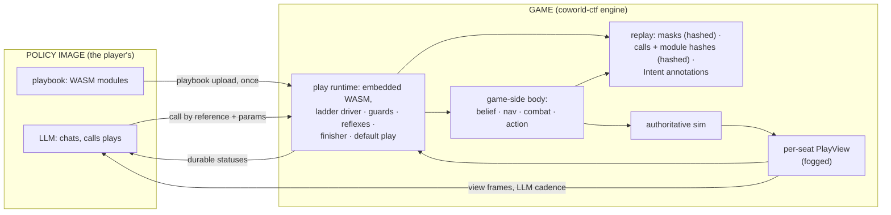

# The Play-Calling Shell: Player-Authored WASM Plays Over a Game-Side Body

**Status:** LIVING DESIGN, IMPLEMENTED · **Date:** 2026-08-30 (supersedes the 2026-08-29 and
earlier 2026-08-30 revisions; see Appendix H for the decision record and
revision history; gate/default state updated 2026-09-01) · **Author:** James's coding agent, direction from James ·
**Reviewers:** Codex (cross-agent, round-gated), Maxwell (coordinating; his
`BR_PLAYS.md` supplies the reference play menu) · **Canonical home:** this
file, in `coworld-ctf`.

Companion reading: `docs/reports/maxwell-s2-paradigms-2026-08-29.md` (the
research report on Maxwell's Season 2 substrate, with a plain-language primer
in its section 0) and `docs/recon/paintbot-s2-policy-shell-2026-08-29.md`
(the branch inventory). Citation style: bare paths are this repository;
`PBP:` is `coworld-paintbot-player`; `origin/<branch>:` marks files on
unmerged branches. Stencil, the bot this design borrows its body from, lives
in James's private lab; lab files are cited `LAB:` and are reference
material only. This design changes nothing in that lab.

---

## 1. What this design builds

Season 2 pits language-model "policies" against each other, first in the new
Battle Royale mode and over time in the other modes (classic CTF, and likely
King of the Hill). Each policy directs a robot (a cog) during the match,
talks with the other policies in the engine's lobby chat phase before it
starts (section 9), and shouts during it.

The premise James and Maxwell have been building toward all season is
flashing scripts to the bot. This design is the most direct realization of
that idea: a policy's whole job is to produce mini-programs. It uploads
them as WebAssembly modules, the game slots them in, and the game runs
them. The system has three parts, owned by two parties.

**The game owns the body.** The engine hosts, for every Season 2 seat, a
ported and improved version of stencil's execution machinery: per-seat
belief, navigation, the planner, combat, and action resolution. The game
runs that loop every tick. A seat's standing order is a typed `Intent`
(section 4), and the body executes the current `Intent` continuously until a
new one arrives.

**The game owns the play runtime.** The engine embeds a WebAssembly runtime
(section 7) and runs every seat's plays inside it, at tick rate, under
memory caps and per-step instruction budgets. Around the plays, the engine
owns all the orchestration: the ladder driver that decides which plays are
active, the guard evaluator, the emergency reflexes, the finisher, and the
default play. The engine also defines everything a play may see and say:
the per-seat, fog-filtered `PlayView` (section 5), the play ABI (section
6), and the seat protocol that carries playbooks and calls (section 4.3).
All of it lives in this repository and is versioned with the game.

**The player owns the plays.** A play is a WebAssembly module the player
builds in any language that targets wasm32 (Nim is the blessed toolchain,
not a rule) against the engine-published play ABI: read the view, hold
private state, emit an `Intent`. Players develop, refine, and evolve their
plays and playbooks privately, over time, with experience, forum discussion,
and cooperation. The player's LLM, inside the policy image, uploads the
playbook, then selects plays from it and fills in their parameters: it calls
plays; it never writes code at runtime.

The division of labor at runtime, in one pass: the policy uploads its
playbook once and then sends calls, each a ladder of play names with
parameters. Every tick, the game builds the seat's view, steps the active
plays in the embedded runtime against it, validates what they emit, folds
the result into the standing `Intent`, and executes it with the body. At
human cadence, the policy's LLM watches a slower stream of the same view
frames, chats in the lobby, and re-calls whenever the situation changes.


Figure 1: The runtime shape. The game computes what a seat may know,
runs the player's plays against it, and executes what they order. Four
things cross the socket: modules and calls going in, view frames and
durable statuses coming out, plus chat in both directions (the lobby
huddle before the match, shouts during it). Nothing that runs at tick rate crosses a
wire.

## 2. Goals and non-goals

Goals:

1. Specify the game-side body: what is ported from stencil, what is improved
   during the port, and how it stays cleanly separated from the rest of the
   engine.
2. Specify the play ABI: the exports a module implements, the imports it
   may call, the memory and instruction budgets, the state model, and the
   validation pipeline for uploaded modules.
3. Specify the seat protocol: playbook upload, call by reference with
   parameters, the durable status list and its acknowledgment, with named
   limits and deterministic overflow.
4. Specify the engine's play runtime: the embedded WebAssembly runtime and
   its choice, the ladder driver, guards, reflexes, the finisher, and the
   default play.
5. Adopt Maxwell's ladder-of-plays call format and his seven-play reference
   menu, and make sure the parameter system covers what those plays need.
6. Keep replays deterministic under the new boundary, reusing the recording
   machinery that already exists.
7. Support multiple game modes from the start. Battle Royale is the first
   target, not the design's shape.

Non-goals:

- Changing James's stencil lab in any way. Stencil is source material; the
  port copies from it and then diverges freely.
- Preserving stencil's CTF strategy or its exact behavior. The port keeps
  what makes stencil good at executing (movement, aiming, fighting,
  validated navigation) and deliberately discards its strategy layer and its
  habit of mutating shared state during decisions.
- The match app's own pre-round chat for its local onepage bots, and its
  front end. Both continue as they are; section 9 states how they split
  from the engine's lobby chat phase, which this design does specify.
- The offline play-authoring pipeline (log harvesting, forum mining). Plays
  are ordinary code; how a player decides what to write is their business.
- The Arena component build of the game (`arena/`, the game itself compiled
  to a WebAssembly component). This design targets the standard Docker
  image's native server (`/bin/ctf`, `Dockerfile`), where a runtime can be
  embedded; running plays under the Arena build is out of scope by James's
  ruling.
- Re-executing plays during replay playback. Playback stays a pure record
  reader (section 8).

## 3. The game-side body

- The body is stencil's execution machinery, ported into this repository
  and run by the game for every Season 2 seat.
- It lives in its own module namespace, separate from the sim, and talks to
  the sim through the same narrow surfaces any player does.
- The port discards stencil's strategy layer entirely and makes four
  rulings for this design: one target-acquisition route, type-enforced
  goal validation, the removal of the pursuit override, and a bounded
  route-field cache.

### 3.1 What the body is

Per Season 2 seat, the game maintains and runs:

- **Belief.** The seat's knowledge of the world: tracked enemies and allies,
  item memory, zone state, and the navigation map. Because this now runs
  inside the game, it is fed directly from sim truth filtered through the
  seat's fog rules. The label-string parsing that client-side bots do today
  is unnecessary here, though the sim's fog remains the authority on what a
  seat may know.
- **The world map.** Stencil's spatial model (`LAB:worldmap.nim:173-209`
  is the source being ported), split in the port into two layers with
  different owners, because the lab object is not immutable: it carries
  lazily built route fields, a duck-contrast cache, and gate tables
  (`LAB:worldmap.nim:70-94`), route queries build grid-sized Dijkstra
  fields on demand (`:908-917`), and the duck phase writes its cache on
  demand (`:957-1009`). The **episode layer** is built once per episode
  before any seat activates (section 10's barrier), is immutable
  afterward, and is shared by every seat: the clearance field, the
  walkable grid, connected components, rooms and chokepoints, cover
  sectors, and the firing-position atlas. The **seat layer** is each
  seat's own bounded caches over that shared layer: at most
  `MaxRouteFieldsPerSeat` (4) route fields and `MaxDuckEntriesPerSeat`
  (256) duck results, least-recently-used eviction, memory counted in
  the per-seat budget, and cold-query cost counted in the tick budget.
  The body and both spatial imports read the shared layer and the
  seat's own caches, never another seat's, so query order across seats
  cannot change any result, latency class, or retained memory; a
  32-seat test permutes seat order and asserts exactly that.
- **The executor.** Stencil's action resolution (`LAB:action.nim:402-551`),
  navigation follower with its corridor rule (`LAB:nav.nim`), pure weighted
  A* planner (`LAB:planner.nim`), and combat layer (`LAB:fight.nim`),
  executing the seat's current `Intent` every tick: plan and follow a route
  to the intent's goal, manage micro-movement within the allowed set, pick
  and engage targets under the intent's combat policy, and emit the seat's
  button mask into the sim.

The body executes a *standing order*. An `Intent` persists until a play
replaces it, and the body re-plans, re-aims, and re-fires under it every
tick without any further play involvement. A play that emits nothing for a
thousand ticks has a cog that keeps competently doing the last thing it
was told.

### 3.2 Separation from the game logic

The body is not sim code and must not entangle with it. It lives in its own
namespace (`src/shell/`), with three hard rules:

1. The sim never calls into `src/shell/` except at the one seam where seat
   masks are collected each tick, and `src/shell/` reads sim state only
   through the same fog-filtered accessors that build the `PlayView`. The
   body has no privileged view of the world; it knows what its seat knows.
2. The body sits outside the determinism hash boundary, exactly as the
   paintball control layer does (`src/ctf/control.nim:1-13`): it may use
   floating point and hold state, because it is **never re-run during
   playback**. What the replay records for determinism is the body's
   *output*: the per-cog button masks, written every tick through the
   existing mask-change records precisely as paintball writes its compiled
   masks (`src/ctf/server.nim:2062-2089`), and played back through the
   existing mask playback path (`src/ctf/replays.nim:392-400,445-455`).
   Replays, seeking, keyframes, and the WASM viewer therefore need no new
   machinery and no body-state serialization, and the body is free to use
   platform floating point. The `Intent` stream is also recorded,
   but as non-hashed annotation records for display and analysis
   (section 4.3), the way paintball records its redacted directive
   records.
3. Season 2 is the default (`season2Shell: true`), but shell execution remains
   conjunctive: it is reachable only in a **play-seat episode**, with at least
   one `slots[].control: "play"`. A default all-input roster stays on the
   direct-input path. Explicit `season2Shell: false` selects a deprecated live
   mode and boot-refuses unless `allowDeprecatedModes: true`.

The play runtime of section 7 lives in the same namespace, under the same
gate, on the same side of the hash boundary: plays run in the server
process, but their output reaches the record only as masks (hashed) and
annotations (not hashed).

### 3.3 The eight ported-with-improvement rulings

**One target-acquisition route.** The ported combat layer routes every
target choice through the scored selector (`scoreTarget`,
`LAB:fight.nim:162-283`). The nearest-enemy fallback path that stencil's
gun uses outside a firefight, and the spray selector's independent scan,
both collapse into the one scored route with mode-appropriate scoring
terms. The no-shoot filter of section 4.2 applies at that single route,
with a final veto immediately before each weapon's fire decision as defense
in depth.

**Type-enforced goal validation.** Stencil's law that no navigation goal
reaches the executor without passing reachability validation becomes a
compile-time guarantee inside the engine. The engine's `makeIntent`
accepts only a `ValidatedGoal`, a type whose sole constructor is the
validation function itself (the port of `reachableGoal`/`nearestReachable`,
`LAB:strategy.nim:107-110`). An unvalidated goal is a compile error, not a
code-review catch. Plays reach the same validator through a host function
(section 6.1), so a play's goal is validated by the engine's exact test,
never by a copy.

**No pursuit override.** Stencil's post-decision spray-pursuit override
(`LAB:strategy.nim:504-514`) is not ported. Plays that want pursuit
behavior express it as a play.

**Bounded route-field cache.** A fourth ruling, forced by the seat layer
of section 3.1, and named as a ruling because it can change planner
output rather than only its cost. In stencil, route-field membership is
behavioral: `peekRouteDistance` returns `none` rather than building a
missing field (`LAB:worldmap.nim:923-938`), and the default-enabled
planner oracle uses that optional result to strengthen its heuristic
(`LAB:planner.nim:149-155`, `LAB:config.nim:118-121`), so with an
unbounded cache every goal ever queried strengthens later plans. The
port keeps the oracle but bounds the cache, with one pin: the field for
the seat's current standing goal is never evicted, so a plan toward the
standing goal always sees its own field, and eviction can only weaken
the heuristic for a *different* goal, never change the route to the
current one. The differential allowlist of section 3.4 includes this
ruling, and a fixed CTF golden cycles a seat through more than
`MaxRouteFieldsPerSeat` goals, evicts the original field, and compares
the next plan against stencil with the difference attributed.

**Staggered danger-field rebuilds.** A fifth ruling, forced by P0's
body measurement (2026-08-30): thirty-two seats rebuilding their
multi-source danger fields on the same tick cost ~109 ms on a fast
development core — an order of magnitude over the body's share of the
quarter-tick budget, and the hosted CPU floor is slower. The port
therefore staggers rebuilds deterministically: seats rebuild on a
round-robin cadence (a fixed fraction per tick, the divisor chosen from
the measured burst so the per-tick share fits with margin), so a seat's
danger field may be up to one cadence period stale, by a bounded and
deterministic amount. Stencil never ran thirty-two bodies in one
process, so this is the honest model, not a compromise of one. The
differential allowlist covers it, and a golden pins the cadence.

**Bounded cold planning per tick.** A sixth ruling, from the same
measurement: one cold worst-case plan on the giant field cost ~65 ms —
alone exceeding the entire quarter-tick allowance — so a mass retarget
(every seat replanning at once) is unboundable without a rule. The port
bounds cold-planning WORK per tick — a deterministic search-expansion
budget, not a plans-per-tick count, because one cold plan alone exceeds
the allowance: a plan that exhausts the tick's budget suspends with
resumable search state and continues on a later tick, and seats queue
for budget in seat-index round-robin resuming where the last tick
stopped (the house quota pattern of §6.1's `MaxInitsPerTick`). A seat
whose plan is suspended keeps executing its standing route. The
differential allowlist covers the delay; a golden pins the queue order
under a mass retarget. Whether the cold plan itself is reducible (a
warm oracle, coarse-first planning) is a named P1 investigation, not a
gate: the queue makes the tick safe either way.

**Capped danger-rebuild sources.** A seventh ruling, from the same
measurement's sharpest edge: one seat rebuilding its danger field
against all 31 other seats as sources measured ~13.1 ms — over the
entire quarter-tick allowance on that seat's scheduled turn, and
staggering (ruling five) cannot shrink a single rebuild. The port caps
the sources per rebuild at the 8 nearest live threats, selected
deterministically (distance, then seat index); the far tail of a
31-source field contributes little to the gradient a body actually
follows. The differential allowlist covers it, and a golden pins the
selection at the cap boundary.

**Danger rays capped at weapon range.** An eighth ruling, one level
down the same arithmetic: even an 8-source rebuild measured ~3.3 ms
provisional, over the body's everything-else share by itself, because
stencil's danger rays are effectively map-wide — an artifact of stock
CTF's 1050 px gun range covering small boards. The port caps danger-ray
reach at the live `gunRange` (331 px derived on Battle Royale), which
is §4.2's standing doctrine applied to one more consumer: danger beyond
the range anyone can shoot from is not danger. Ray cost scales with
reach, so this is also the per-rebuild cost lever staggering and the
source cap cannot provide. The differential allowlist covers it, and a
golden pins field values at the range boundary against a beyond-range
source.

**Atlas candidate thinning.** A ninth ruling, ratified in the freeze
package (2026-08-31): the port mints cover posts only from even nav-cell
coordinates, i.e. a 16 px candidate grid, while leaving the cover-bearing
test, sector rays, reach calculation, bucket order, and duck scoring
unchanged. This is the named reserve from P0 made concrete: it reduces
the worst-case `nearest_cover` host-call scan without changing the
meaning of any retained post. The differential allowlist covers the
membership change by comparing the port's thinned atlas against
stencil's full atlas filtered to the same 16 px grid, and a golden pins
post positions, reach values, and order.

### 3.4 Porting verification

The port is verified by a temporary adapter that runs the ported body and
stencil's original side by side on identical inputs and compares executor
outputs. The scope of that comparison is stated plainly, because two
facts bound it. Stencil cannot run Battle Royale at all (its world model
waits for endzones and lacks the zone percepts), so the differential test
covers **CTF only**. And the nine rulings of section 3.3 change behavior
on purpose, so blanket output equality is not the expectation: the
differential test targets the *unchanged* subcomponents (the planner's
routes, the follower and corridor behavior, the unmodified combat paths)
with exact-match criteria on fixed-seed cases, plus an explicit allowlist
of expected differences attributable to each ruling. Battle Royale
behavior is validated without a stencil oracle: body invariants (goals
always validated, the corridor rule holds, no-shoot never violated),
golden fixed-seed scenarios, and full-episode runs on the current engine.
The adapter is scaffolding: it is deleted when the gate passes, and there
is no permanent compatibility layer and no goal of preserving stencil's
strategic behavior.

## 4. The Intent contract

- The `Intent` is the one order type a play can give the body. It is
  stencil's ten-field contract plus a combat policy, minus the fields the
  discarded strategy layer owned.
- Intents are emitted by plays in-process (section 6.1), validated as they
  are emitted, applied the same tick, and recorded as annotation records;
  the determinism artifact is the mask stream the body emits under them
  (section 3.2).
- The combat policy carries the alliance semantics plays need: teams and
  seats that must never be shot, and wards to protect, with threat
  detection that uses aim bearing rather than distance alone.

### 4.1 The type

The `Intent` is specified field by field against stencil's ten-field
struct (`LAB:types.nim:189-215`). Each stencil field is deliberately
retained, replaced, or deleted:

| Stencil field | Disposition |
|---|---|
| `kind` (NavigateTo, Hold) | retained |
| `point: Option[Point]` | retained; in the ABI encoding it is a plain point in map pixels, present exactly when `kind` is `NavigateTo`, and the engine validates and, where stencil's resolver would, normalizes it when the play emits it (section 6.1; the SDK's `ValidatedGoal` type of section 6.3 is authoring discipline, not an encoded token) |
| `arriveRadius: float` | retained; pixels, bounded [0, map diagonal] |
| `movingGoal: bool` | retained |
| `profile` (default, carrier, hunter) | retained as an enum |
| `micro` (permission set) | retained as a set of named flags, minus the pursuit flag (deleted with the override) |
| `idleAimCenterBrads: Option[int]` | retained; 0..255 |
| `clampToEndzone: bool` | retained; meaningful in CTF, ignored where no endzones exist |
| `suppressFireFreeze: bool` | retained |
| `reason: string` | retained; telemetry only, capped at 64 bytes |

**Amendment (owner-specced, 2026-09-02/03 — the S2 give-item exchange):**
one optional field, `handoff` (`"gun" | "hopper" | "bandage"`, omitted when
absent), the STANDING give-item declaration. Valid only in mode `br` —
it is a duo fact, rejected elsewhere exactly like `duo:` seat references.
The target is deliberately not a field: it is always the duo partner,
resolved by the engine at execution through the `sim.declareHandoff`
consent seam (the engine half landed in PR #379; the 0x10 play-call
record remains the attribution record, and the sim-applied declaration
rides the replay chat stream the way the policy-page reflash does).
The neutral value is omitted, so every pre-amendment intent encodes
byte-identically; per the strictness rule of Appendix P.1 a
pre-amendment engine rejects a non-neutral `handoff` loudly by name.
Movement semantics are untouched — the declaration rides the standing
order and the body's mask stream stays the determinism artifact.

One field is added, the combat policy:

```nim
type
  CombatPolicy* = object
    noShoot*: ProtectedSet       # teams and seats never fired on
    protect*: ProtectedSet       # wards: bias position + targeting to defend
    prefer*: seq[PreferTag]      # target preference tags, in priority order
    holdFire*: bool              # do not initiate fire (return fire allowed)
  ProtectedSet* = object
    teams*: set[Team]
    seats*: seq[SeatRef]         # cross-team, per-seat references
```

Everything empty or false is the neutral value and the default. Seat-level
references exist because Maxwell's `pact` negotiates alliances with
specific duos, not only whole teams; `prefer` and `holdFire` exist because
his `target_law` is a standing filter over who to shoot and when to start
shooting. Betrayal responses and pact end conditions are play logic, not
policy fields: the overlay play that owns the pact watches the view every
tick and changes the policy it emits.

The encoding a play emits is versioned, schema-tagged JSON with declared
units (pixels, brads, ticks), explicit optional fields, canonical ordering
and deduplication for the protected sets, and hard caps on list lengths
and string sizes. The caps are the roster's own sizes, so that folding
any number of valid policies can never exceed them: `seats` at most 32
(`MaxPlayers`), `teams` at most 16, `prefer` at most the four distinct
tags with duplicates rejected, `reason` at most 64 bytes. A golden byte fixture pins the encoding for the Nim SDK
and any other producer. "On change" means byte inequality of the
canonical encoding; a play may emit every step, and a byte-identical
re-emission is accepted without changing the engine's cached output or
its accepted tick (section 7.4), so emitting every step costs fuel and
nothing else.
An encoded `Intent` is small (well under a kilobyte) and never crosses a
socket: it moves from guest memory to the engine in one copy.

### 4.2 Never-shoot, and what protecting means

Members of the `noShoot` set join the protected set that every friendly-fire
check consults, in every weapon path: they are excluded from target
scoring, the gun's corridor check treats them as blockers, the spray cone
refuses to activate over them, the grenade planner treats them as
must-not-splash and never counts them as target value, and an in-flight
grenade charge is re-validated the tick the policy changes, cancelled
rather than force-released if it now violates the set. A final veto before
each weapon's fire decision refuses a `noShoot` endpoint however it was
acquired.

Protecting a ward means two things the body does and one thing plays do.
The body biases positioning toward a threatened ward when the intent's goal
allows it, and it up-weights threats-to-wards in target scoring, so the cog
prefers shooting whoever endangers its ward. Interposition (physically
blocking the line of fire) is play territory, expressed through movement
goals, as Maxwell's `bodyguard` play does with its `interpose` parameter.

A *threat to a ward* is detected with aim bearing, not proximity alone. An
enemy is threatening a ward when it is within the live weapon range of the
current map and its aim bears on the ward within an angular tolerance; the
same test against the seat's own cog gives `aimedAtUs`. Weapon range is
read from the live `gunRange` configuration field, never a constant,
because the engine derives it per map (stock CTF is 1050 px, effectively
map-wide on small boards; Battle Royale's giant field derives 331 px from
the equal-share territory formula in
`origin/maxwell/ladder-scout-tooling:docs/designs/BR_MAPGEN.md` section
4.1). A proximity term (enemy fresh and near the ward) remains as a
secondary signal for enemies whose aim is not currently readable. Both
tracks must be fresh within the track time-to-live, and threat candidates
never include members of `noShoot` or `protect` (allies are not threats to
each other).

### 4.3 The seat protocol, validation, and recording

Season 2 is a **server-enforced seat protocol**, not a library property. A
seat is marked a **play seat** in the trusted match configuration (per
seat, per episode). For such seats the server sends the `PlayContext` and
the LLM-cadence `PlayView` frames, and accepts exactly: module uploads,
play calls, the status-acknowledgment packet, lobby chat during the
lobby phase, and in-match chat. Direct input masks
(`0x84`) on a play seat are ignored, deterministically and with telemetry,
so no player image can drop below the play boundary for an edge; ready
packets (`0x85`) are likewise ignored, because a play seat's tick-rate
work runs in-process and the seat counts as ready on every tick (section
7.4). Non-play seats (humans, legacy bots) keep the mask protocol
untouched, and mixed rosters are simply per-seat configuration.

The play-seat messages use leading bytes outside the Sprite v1 client set
(`0x81`–`0x86`, `bitworld/spriteprotocol.nim:34-39`), and the server's
play-seat receive arm dispatches on the leading byte before anything
reaches the Sprite parser, which would reject an unknown type anyway
(`spriteprotocol.nim:495-502`). Chat is unchanged in both directions
and is part of this protocol, not an afterthought: a play seat sends a
shout with the existing Sprite v1 chat packet (`0x81`, in the table),
the engine applies it under the shout rules every seat plays by today
(living shouter, at most ten characters, one per second, audible within
`ShoutRange`, `docs/RULES.md:477-492`, `src/ctf/sim.nim:2236-2253`),
and a play seat *hears* shouts through its `PlayView` gameplay payload
(section 5), the same fogged, jittered, anonymous-slot-letter facts a
Sprite client reads off the speech-bubble label. The play packets are
normative here, because a protocol with
named limits and no byte layout cannot be implemented interoperably or
tested at its limits. The play packets (`0xA0` to `0xB2`) are binary
WebSocket messages, exactly one packet per message, all integers
little-endian, every packet beginning with its opcode byte and a
protocol version byte (`1`; any other value rejects the packet), with
every reserved byte zero or the packet is rejected; the legacy `0x81`
chat row is the one exception and keeps the Sprite codec's framing:

| Packet | Direction | Layout | Largest valid size |
|---|---|---|---|
| `ModuleUpload` `0xA0` | client to server | `u8 op, u8 ver, u64 uploadId, u32 len, u8[len] wasm` | 14 + 262144 = 262158 |
| `PlayCall` `0xA1` | client to server | `u8 op, u8 ver, u64 proposalId, u32 len, u8[len] canonical ladder JSON` | 14 + 4096 = 4110 |
| `StatusAck` `0xA2` | client to server | `u8 op, u8 ver, u8[6] reserved, u64 mark` | 16, fixed |
| Chat `0x81` | client to server | the existing Sprite v1 chat packet, under the Sprite codec's own rules rather than this table's: `u8 op, u16 len, u8[len]` with a raw `u16` length, non-printable bytes dropped by the parser, the text truncated to ten characters afterward by `sanitizeShout`, and several Sprite client packets legal in one message (`bitworld/spriteprotocol.nim:477-484,504-526`, `src/ctf/sim.nim:2226-2253`); a message whose leading byte is a Sprite opcode is handed whole to that parser, and masks and ready packets inside it are ignored on a play seat | 3 + 65535 raw, bounded by the per-socket receive limit |
| `LobbyChat` `0xA3` | client to server | `u8 op, u8 ver, u32 len, u8[len] UTF-8 text`; accepted only during the lobby chat phase (section 9) | 6 + 512 |
| `LobbyChat` `0xB2` | server to client | `u8 op, u8 ver, u64 ordinal, u32 tick, u8 seat, u8 team, u32 len, u8[len] UTF-8 text`; one message per packet, broadcast to every play seat, never coalesced | 20 + 512 |
| `PlayContext` `0xB0` | server to client | `u8 op, u8 ver, u32 controlLen, u8[controlLen] control JSON, u32 ctxLen, u8[ctxLen] context JSON` | 10 + 20480 + 65536 |
| `PlayView` `0xB1` | server to client | `u8 op, u8 ver, u32 tick, u32 controlLen, u8[controlLen] control JSON, u32 viewLen, u8[viewLen] view JSON`; `viewLen = 0` is a control-only frame (pre-activation, or a dead seat) | 14 + 20480 + 32768 |

Every packet's total size is an exact equation of its length fields,
checked with overflow-safe arithmetic, with no trailing bytes permitted:
`0xA0` and `0xA1` total `14 + len`; `0xA2` total `16`; `0xA3` total
`6 + len`; `0xB0` total `10 + controlLen + ctxLen`; `0xB1` total
`14 + controlLen + viewLen`; `0xB2` total `20 + len`. A
decoder reads the second length only after range-checking the first
slice against the message, and each length is also checked against its
own cap. Any disagreement, truncation, or trailing byte rejects the
packet, and malformed goldens cover each length field independently in
both directions. The two server-to-client packets
carry the gameplay bytes (context, view) as a separate slice from the
socket-only control envelope (section 5), so the gameplay slice is
byte-identical to what the play instances receive. Byte-golden
encode/decode fixtures pin every packet, including a maximum-size
`ModuleUpload`, and rejection fixtures cover a wrong version, a nonzero
reserved byte, a short header, and a `len` mismatch. The policy image is
player-owned arbitrary code, and nothing in it is trusted; the
guarantees live in what the server accepts, validates, records, and
refuses.

The protocol is a small explicit state machine, because startup,
rejection, and reconnect are where implicit contracts rot:

- **Pre-activation state.** A play seat's protocol begins when its
  socket registers, which can be well before the seat activates (the
  lobby wait, and the map barrier of section 10). At registration the
  server assigns control generation 1, sends the `PlayContext` (its
  gameplay payload depends only on the mode, map, and the configured
  closed roster of section 5.1, all known at registration), and from
  then on sends **control-only `PlayView`
  frames** (`viewLen = 0`, `tick` = the current lobby tick) at the view
  cadence and whenever a status is minted, so every status reaches the
  client and every acknowledgment works before the first playing tick.
  Uploads, calls, acknowledgments, admission budgets, backpressure, and
  reconnect all behave exactly as after activation; an accepted call
  becomes the current declaration and its entries activate lazily once
  the seat does. The forced-build golden of section 10 pins this state.
- **Activation.** When a play seat activates, the server bumps the
  generation, installs a safe standing `Intent` (hold at spawn, empty
  combat policy) at call epoch zero, and the engine's default play
  (section 7.3) is the active controller. A policy that never sends
  anything, or that dies at startup, plays the default; there is no
  undefined window.
- **Module upload.** A `ModuleUpload` message carries a client-chosen,
  numerically monotonic `uploadId` and the raw bytes of one module. The
  server admits it, runs the validation pipeline of section 6.2 (size,
  budget, and id checks synchronously at the tick boundary; hashing,
  validation, compile, and the manifest probe on the compile workers),
  and reports through the durable status list: `moduleAccepted(uploadId)`
  at admission, then either `moduleReady(uploadId, name, sha256)` or
  `moduleRejected(uploadId, reason)`. Names come from the module's own
  manifest, never from the message. The manifest is a small JSON
  document the module itself emits when the engine calls its
  `play_manifest` export during the upload probe (section 6.2): the ABI
  version, the play's name and class, its supported modes, and its
  parameter schema. It lives inside the module's own bytes (the SDK
  generates it from the play's declaration), the engine reads it once at
  upload, and the parsed copy stays beside the compiled module for the
  episode. Names are **scoped per seat**: the binding map is `(seat,
  name) -> hash`, every seat may upload its own `pact` (Maxwell's
  negotiated-alliance reference play, section 6.4, is the obvious name
  many playbooks will share), and a call resolves names only within its
  own seat's map
  (the compiled-code cache still deduplicates globally by hash, sharing
  bytes but never names or outcomes). Within a seat and an episode a
  name binds to exactly one content hash: a second module whose manifest
  claims a bound name is rejected (`nameBound`) unless its bytes are
  identical, in which case the upload is a no-op acceptance
  (`moduleReady` again, same hash). Said plainly: **a bound name is
  never replaced within an episode.** A policy that wants a revised play
  mid-match uploads the new bytes under a new name (`pact_v2`) and calls
  that; the per-episode module and byte budgets bound how often it can,
  and nothing a running ladder holds is ever swapped underneath it.
  Terminal outcomes and bindings are
  committed in `uploadId` order within a seat, whatever order the
  compile pool finishes in, so a same-name race is decided by the
  protocol's admitted order and never by worker timing.
  Uploads are allowed at any time in the episode under one per-episode
  budget (modules and bytes, limits table below) that is **charged at
  admission and never refunded**, with one exception: a byte-identical
  re-upload of a hash this episode has already seen (or is still
  compiling) is refunded and never compiled or probed again; it joins
  the hash's content outcome and then commits through this seat's own
  name map (section 6.2), so a hash that is ready in one seat can still
  be `nameBound` in another. A content-rejected module therefore costs
  its budget, and the same bad bytes can never be compiled twice, so a
  hostile client's total compile work per episode is bounded by its byte
  budget. There is no separate pre-match phase, and nothing is
  evicted before the episode ends. The reference client uploads its
  playbook during the pre-game wait, before the first call, and P0
  measures how long a reference playbook takes to become ready under 32
  seats uploading at once, so the opening-call latency is a number rather
  than a hope.
- **The call transaction.** A `PlayCall` message carries a client-chosen,
  numerically monotonic `proposalId` and the ladder JSON of section 7.1,
  naming plays by their bound names. At the tick boundary the server
  validates the whole call (section 7.1: names bound and ready, classes,
  parameters against each module's manifest schema, guards) and, on
  acceptance, assigns the next call epoch, makes it the **current
  declaration**, drops the outgoing ladder's instances (except retune
  adoptions, section 7.2), and reports `callAccepted(proposalId, epoch,
  tick)`. The ladder driver evaluates the new ladder from that tick's
  play step onward; its entries then **activate** individually and
  lazily, under the guards and the initialization quotas of section 7.2,
  and an entry may never activate at all. "Activation" in this document
  always means an entry instance starting, never the call; there is no
  call-level activation event. A rejected call
  (`callRejected(proposalId, reason)`, with the named error and parameter
  path) leaves the standing ladder untouched. Epoch zero is reserved and
  means "no declaration": the server's safe initial order and the default
  play run under it, and the record says so rather than pretending
  attribution.
- **Play faults.** A play that traps, exhausts its budget, or breaks the
  ABI's per-step rules (section 6.1) is faulted for the life of the
  ladder instance (section 7.2), reported as
  `playFaulted(epoch, entryId, reason)`, and the standing order continues
  under the remaining entries or the default play. Recovery is the LLM's
  business: a new call re-instantiates.
- **Bounded ingress.** Arbitrary player code feeds these queues, so
  uploads and calls have per-seat admission budgets per tick (message
  count and aggregate bytes), with deterministic overflow: excess messages
  are dropped at receive, reported through aggregate overflow counters in
  the view (dropped-count per kind, never an unbounded list of dropped
  ids). Admitted messages are processed in order at the tick boundary.
- **Statuses are durable, cumulative, and acknowledged by a dedicated
  message.** Every outcome above is an ordered entry in one per-seat
  status list, each carrying a server-assigned monotonic **status
  ordinal** and an immutable **origin generation**: the seat's control
  generation at the moment the operation was admitted (for an upload's
  terminal entry, the admission generation, even when compilation
  finishes after a bump) or at the moment an autonomous event such as a
  fault occurred. A replaced process reading old entries beside a new
  current generation can therefore tell which era each belongs to;
  goldens cover reconnect, replacement, death and respawn, and a compile
  that completes across a generation bump. Entries ride every `PlayView` frame until acknowledged, and
  the client acknowledges with a small fixed-size `StatusAck` packet
  carrying one ordinal high-water mark. A coalesced or lost frame cannot
  swallow an outcome because unacknowledged entries persist; a frame is
  also sent on any tick that mints a status entry (bounded to one
  frame per tick), so the LLM learns outcomes at tick latency rather than
  view-cadence latency. The acknowledged mark must be nondecreasing and
  no greater than the highest ordinal issued; an out-of-range or future
  mark is rejected without changing any state. Wherever this document says
  a status is "in the view," it means an entry in this list.
- **The retained state is hard-bounded, and the release valve cannot
  jam.** Per seat, unacknowledged status entries are capped at 64, and
  every entry's **complete canonical serialized JSON value** (tag,
  ordinal, origin generation, ids, and the reason or parameter path,
  escaping included) is capped at 256 bytes, with reasons and paths
  truncated to fit, so the retained bytes are bounded by construction at
  16384. The two control envelopes are separate schemas with separate
  maxima, each capped at 20480 bytes. The `PlayView` envelope carries
  the status list, the counters, and the generation: 16384 for the
  entries plus 4096 for syntax and the mandatory fields, and a golden
  with 64 worst-case entries, maximum ordinals, reasons, and paths, and
  saturated counters proves it fits by construction. The `PlayContext`
  envelope carries the recovery state and **no status list**: the
  accepted call's canonical bytes (at most 4096), its proposal id, the
  sixteen-entry playbook inventory (name, hash, state: at most 128 bytes
  each, 2048 in all), the budgets, floors, generation, epoch, and
  high-water mark, which a maximum-recovery golden with worst-case
  escaping proves fits in the same 20480. After a reconnect the context
  packet is sent first and the first `PlayView` that follows carries the
  retained statuses.
  Capacity is **reserved at admission** for every outcome an
  admitted message can still produce: an upload reserves two entries
  (`moduleAccepted` now, one terminal entry later); a call reserves one
  entry for its own outcome plus one for every entry marked
  `"retune": true`, the safe pre-validation bound on later
  `retuneRefused` outcomes, releasing the unused ones once validation
  has settled how many retunes can be scheduled and releasing
  all of them on rejection after minting only `callRejected`; and an
  admission that cannot reserve is refused with the backpressure counter
  rather than admitted into a list that could not hold its result. These
  are regular slots, never the fault reserve. The status union is
  therefore: `moduleAccepted`, `moduleReady`, `moduleRejected`,
  `callAccepted`, `callRejected`, `retuneRefused(epoch, entryId,
  reason)`, and `playFaulted`, every one carrying its ordinal and origin
  generation inside the 256-byte encoding rule. Autonomous outcomes, which no admission gates, have their own
  reserved capacity: 16 of the 64 entries are held for `playFaulted`
  records (one per possible instance), and if a seat somehow exhausts
  even those, further faults increment a saturating `faultsDropped`
  counter in the frame instead of minting entries. At the admission cap
  the server stops admitting new uploads and calls and reports the fact
  through a bounded aggregate backpressure counter in every frame. A
  boundary test fills the list, lets every pending upload complete,
  accepts a maximum-retune call whose every retune then refuses over
  later ticks, and faults every remaining instance, and asserts that
  every terminal outcome landed and nothing was minted past the caps. The
  `StatusAck` gets a **coalescing slot inside a total read budget**, with
  the guarantee scoped plainly, because one ordered websocket stream
  cannot both stop inspecting at a cap and promise to find an
  acknowledgment hidden behind a flood. Per seat per tick, the server
  classifies at most a fixed number of delivered messages and bytes
  across all message types (64 messages, 524288 bytes; limits table
  below); classification happens in the websocket message handler, where
  the transport has already delivered a complete message, so the fixed
  cost per inspected message is one leading-byte dispatch, and **the
  first message past either budget disconnects the seat**. Within the
  budget, `StatusAck` packets coalesce to the greatest well-formed mark
  and are processed exactly once, before backpressure. The reference
  client sends its acknowledgment as the first message after each frame,
  so for any conforming client the release valve is inspected first; a
  client that buries its acknowledgment behind 64 hostile messages
  disconnects itself, which is the intended outcome.
- **The transport bound, below the handler.** The pinned websocket layer
  assembles each complete message and appends it to an uncapped
  per-socket queue before any handler runs (`mummy.nim:551-573,658-752`),
  and its default single-message limit is 64 KiB (`mummy.nim:1474-1504`),
  which is *smaller* than a valid module upload. Two transport-level
  requirements are therefore part of the contract, named as P2 work, and
  both are **per-socket, selected at registration**, because a global
  limit would break existing traffic: the shared server also carries
  legacy player sockets whose debug-sprite messages legitimately run to
  32 KiB per tick (`src/ctf/server.nim:60-66,1123-1146`), and the design
  promises non-play seats an untouched protocol. The patch adds a
  per-WebSocket receive limit checked from the frame header before
  allocation: 262158 bytes on play seats (the largest valid client
  message, a maximum-size `ModuleUpload` with its 14-byte header, from
  the packet table above), and the existing effective limit on every
  other route. It also adds the
  per-socket pending-update cap: at most 128 pending message events or
  1048576 pending bytes, counting **every client-originated message event
  including ping and pong**. In the pinned transport, ping and pong are
  ordinary message events on the same per-socket queue
  (`mummy.nim:68-84,710-752`), so exempting them would leave an unbounded
  flood path of legal empty control frames; only the open event and the
  single terminal close/error notification, which a client cannot flood,
  sit outside the caps. Breaching a cap is one atomic transition: further
  enqueue is rejected, queued message events are purged, exactly one
  terminal close/error event is dispatched so the application's
  socket-owned state is cleaned exactly once, and the transport queue is
  removed only after that cleanup runs. The pinned Mummy has neither a
  per-socket receive limit nor an enqueue hook, so this is an explicit
  dependency patch (or fork) in P2; the handler-side counters above are
  semantic admission, not the hostile-input bound, and the design does
  not pretend otherwise. Tests inventory every route on the shared
  server: a valid near-32-KiB debug-sprite message on a legacy seat still
  passes; a 262159-byte message on a play seat is rejected
  pre-allocation; a large outbound viewer frame is unaffected (the limits
  are receive-side only); a sender faster than the worker drain keeps
  queued bytes and post-breach callbacks within the caps, with 32 seats
  breaching simultaneously, exactly one cleanup callback per socket, and
  no residual entries in the server's socket-owned tables; a stalled
  worker drain flooded with empty ping frames, with empty pong frames,
  and with a mixed control-and-data sequence (each breaching at the exact
  event cap, no post-breach messages, one cleanup, no residual state);
  and a valid acknowledgment placed both before and after 64 hostile
  messages.
- **Deduplication and idempotency, within the window.** Outcomes are
  retained exactly until their entries are acknowledged, after which ids
  at or below the acknowledged floor are rejected as stale rather than
  being replayable forever. Re-sending an unacknowledged `uploadId` or
  `proposalId` with byte-identical content returns the original outcome
  (and, for calls, the originally assigned epoch and tick) without
  re-applying or re-recording anything; reusing an id with different
  bytes, or an id below the floor, is a named rejection. Deduplication
  state survives reconnect. A retry can therefore never allocate a second
  epoch, double-count a module against the budget, or double-record a
  call. Tests cover lost frames, duplicate sends, duplicates across
  reconnect, and id reuse; a client that floods unique ids for many ticks
  without ever acknowledging (bounded memory, deterministic backpressure);
  a million-duplicate-acknowledgment flood (asserting a fixed upper bound
  on messages and bytes *inspected* in one tick, as well as on retained
  bytes and the final coalesced state); and a quiet wall-clock client that
  acknowledges correctly and sends nothing else.

The limits themselves are wire constants of the protocol version, not
per-deployment configuration, because they define when a correct client
starts losing messages:

| Limit | Value |
|---|---|
| Module size (bytes, raw wasm) | 262144 |
| Modules per seat per episode (admitted uploads, nonrefundable except a byte-identical re-upload of a hash this episode already knows, ready or rejected) | 16 |
| Upload bytes per seat per episode (raw bytes of admitted uploads, same refund rule) | 2097152 |
| Module uploads admitted per seat per tick | 1 |
| Call proposals admitted per seat per tick | 2 |
| Call size (canonical ladder JSON; Appendix P) | 4096 bytes |
| Ladder entries per call | 16 |
| Overlay entries per call (`MaxActiveOverlays`; bounds guest steps per seat per tick at three; P0-retuned 4→2) | 2 |
| Retained unacknowledged status entries per seat (of which 16 reserved for faults) | 64 |
| Status entry size (complete serialized value; reasons truncated to fit) | 256 bytes |
| Retained unacknowledged status bytes per seat (implied) | 16384 |
| Control envelope (`controlLen`, either packet; view: entries plus 4096 for syntax and fields; context: the recovery state) | 20480 bytes |
| 64-bit identities in JSON (`uploadId`, `proposalId`, epoch, ordinals, generation) | decimal strings, no leading zeros, full `uint64` range |
| `StatusAck` packet size (fixed) | 16 bytes |
| Socket messages classified per seat per tick (all types; first over-budget message disconnects) | 64 |
| Socket bytes classified per seat per tick (all types; same disconnect rule) | 524288 |
| Per-socket receive limit, play seats (frame header, pre-allocation) | 262158 bytes |
| Per-socket pending message events (transport queue; all client-originated events incl. ping/pong) | 128 |
| Per-socket pending bytes (transport queue) | 1048576 |
| LLM-bound view frame interval (`viewIntervalTicks`, per-episode config) | default 6, range [1, 48] |
| Lobby chat message size (`LobbyChatMaxBytes`, raw UTF-8 payload measured before validation; accepted bytes are unchanged) | 512 bytes |
| Lobby chat messages per seat per phase / minimum spacing | 16 / 24 ticks |
| Lobby chat phase length (`lobbyChatTicks`, per-episode config, wall-clock paced; section 9) | default 720 (30 s), range [0, 4320] |
| Lobby join abort (the existing `lobbyJoinTimeoutTicks`; untouched unless the episode is a play-seat episode, where the presence budget replaces it; section 9) | as configured today |
| Play-seat bind deadline (`playSeatBindTicks`, per-episode config, shell-gated; section 9) | default 7200 (300 s), range [1, 14400], required positive with any play seat |
| Per-socket outbound queue (`MaxOutboundEvents` / `MaxOutboundBytes`; enqueued server-originated packets; section 9) | 256 / 2097152 |
| Transcript replay pump (`ReplayPumpBatch`, `0xB2` packets enqueued per tick from the socket's cursor; section 9) | 64 |
| `uploadId`, `proposalId`, epoch, status ordinals | uint64, monotonic, no wrap within an episode |
| Backpressure and discard counters | uint32, saturating |

Boundary tests exercise each value at limit-minus-one, at the limit, and
one past it, across all 32 seats simultaneously. The runtime's own
budgets (instance memory, fuel, emission caps) are in section 6.1's table.

- **Lifecycle.** The context and view carry a monotonic per-seat **control
  generation**, assigned at registration (1) and bumped on seat
  activation, death, respawn, reconnect, and policy replacement; every
  status entry carries the generation it originated in, so a policy can
  tell which era a status belongs to.
  On death the standing `Intent` is cleared and the ladder **parks**: no
  play steps while there is no cog, and instances keep their memory. On
  respawn the server reinstalls the safe order and the ladder resumes
  stepping the same tick, so the first emission replaces the safe hold
  within the respawn tick; a play whose answer has not changed simply
  emits it again and the dedupe rule accepts it as a fresh application
  (the safe hold, not the pre-death bytes, is what stood). On disconnect
  nothing changes at all: the ladder keeps running (an absent policy is
  an AFK strategist, not an AFK cog), and only the LLM's ability to
  re-call is lost until it returns.
- **Process replacement.** A reconnecting or replaced process receives,
  in its fresh `PlayContext`, the full recovery state: the current control
  generation, the current epoch, the **accepted call itself** (canonical
  bytes and proposal id), the playbook inventory (every bound name with
  its hash and ready state, and the remaining upload budget), the next
  expected `uploadId` and `proposalId` floors, and the status-ordinal
  high-water mark: enough to resume without guessing and without
  re-uploading. It has nothing to reinstantiate; the ladder never left
  the server.
- **The socket lifecycle behind a play seat.** "Only the socket changes"
  is a server transaction the current code does not have, so it is
  specified here and named as P2 work. Today a closed player socket is
  recorded as a leave and handed to `sim.removePlayer`, which deletes the
  live player and its index-keyed state
  (`src/ctf/server.nim:2306-2339`,
  `roster.nim:462-470`); the admission path treats an already-present
  identity as an error (`roster.nim:462-467`); and main's admission loop
  admits unresolved player sockets only during `Lobby`
  (`src/ctf/server.nim:1647-1655`). A play seat instead has a
  **persistent seat** with a socket-binding state machine of four
  states, `unbound` (before the first registration), `bound`, `lost`,
  and `closed`, and these transitions: *bind* authenticates the
  configured slot and token and atomically attaches the socket to the
  seat, in any phase, without `removePlayerAt`, without a leave or join
  record, and without index compaction; *loss* (transport close or
  error) moves the seat to `lost`, records a leave marker in telemetry
  only, and changes nothing in the sim, the ladder, or the cog. That
  promise is only worth something if no *other* seat's departure can
  shift a play seat's index underneath it, and today it can: the
  non-squad close path deletes a leaver from the masks, inputs,
  overlays, and sim (`src/ctf/server.nim:1520-1536`), and
  `removePlayerAt` deletes the row and shifts every later index
  (`src/ctf/roster.nim:437-449`). So in a play-seat episode
  (`season2Shell` enabled and at least one `"play"` slot; every rule in this
  bullet is gated on that, and the default-enabled all-input roster keeps the
  direct-input behavior) **no seat is ever compacted before episode teardown**: an input
  seat that disconnects keeps its row, its standing and pressed masks
  are held at zero (an AFK player, which the sim already handles), and
  results attribute it with the existing leave outcome; configured-slot
  index and `sim.players` index are therefore the same stable identity
  for the whole episode, and nothing play-owned (socket binding, body,
  cog, ladder, masks, overlays, replay attribution, recovery context)
  ever needs remapping. An input seat's tombstone accepts a **rebind**
  during the lobby (the same slot and token re-authenticate onto the
  same row, restoring its input; the presence budget of section 9.2
  pauses), and none once the match is Playing, which is today's
  Lobby-only admission rule kept. The replay must be able to tell a
  reconnectable tombstone from a terminal one, and the legacy leave
  record carries only time and seat (`bitworld/replays.nim:285-291`), so
  play-seat episodes write **three new lifecycle records** instead of
  reusing `ReplayLeave`, each `u8 type, u32 replayTimeMs, u8 seat`
  (little-endian; `replayTimeMs` is the codec's time unit, as a leave
  carries it, `bitworld/replays.nim:73-83`): `ReplayDisconnectRecord`
  (`0x14`, a reconnectable tombstone), `ReplayKickRecord` (`0x15`, a
  terminal tombstone), and `ReplayRebindRecord` (`0x16`). The bumped
  format reserves its opcodes in one block so nothing collides: `0x10`
  play call, `0x11` behavior annotation, `0x12` manifest, `0x13` lobby
  chat, `0x14` to `0x16` the lifecycle records above (the codec's
  existing types are `0x01` to `0x06`, `bitworld/replays.nim:74-79`).
  None is a reinterpreted `ReplayJoin`, whose playback requires
  `join.player == sim.players.len` and appends a row
  (`src/ctf/replays.nim:383-390`). The lifecycle records live in the
  lifecycle stream beside joins and leaves and are covered by the
  gameplay hash chain like them, not by a manifest arm. Playback tracks
  each seat as `connected`, `reconnectable` (after a disconnect record),
  or `terminal` (after a kick record); a reader rejects a rebind whose
  seat is out of range, whose time runs backward, whose seat is a play
  seat (a play seat's transport loss writes no lifecycle record at all,
  because nothing in the sim changes), or whose seat is not in
  `reconnectable` (so a rebind after a kick, a duplicate rebind, and a
  rebind without a disconnect are all rejections). The rebind mutator
  clears the row's tombstone at the same boundary live rebind does and
  touches nothing else; keyframes carry the three-way state so a seek
  lands on it correctly; and within one time value the lifecycle records
  are ordered after legacy leave records and before input, chat, lobby
  chat, and game-start records. Byte goldens for all three records and
  rejection fixtures for input kick then rebind, play kick then rebind,
  play transport loss then a forged rebind, a duplicate rebind, backward
  time, and a valid input disconnect then rebind pin it. The tombstone is
  **seat state that survives game initialization and reset**, with one
  normative accounting model rather than a choice. A seat tombstoned
  *before* a game starts is accounted as a **never-participating seat**
  for that game, and its **physical state is inert, not skipped**,
  because `startGame` is also the only loop that normalizes every row
  for a new game (position, alive, lives, health, cooldowns, carried
  objective, combat counters, `src/ctf/sim.nim:340-391`), and a row
  left un-normalized would carry stale death, carrying, or combat state
  into the next game. So `startGame` initializes a tombstoned row to one
  canonical inert state: dead, zero lives, no carried objective (an
  objective it held is returned by the existing drop rule), no spawn
  occupancy, and no eligibility for collision, targeting, damage, kills,
  objectives, respawn, or team-elimination counts (it counts as already
  eliminated), and the same inert state is applied the moment a seat is
  tombstoned during the lobby before the first game, since `addPlayer`
  had created it as an ordinary live row. `startGame` skips only its
  *accounting* (no team assignment, no game count, no `won` reset;
  today `recordGameTeamAssigned` would set its team, clear `won`, count
  the game, and reset `abandoned`, `src/ctf/sim.nim:340-392`,
  `src/ctf/roster.nim:550-562`). A seat tombstoned *during* a game is
  physically an AFK body (present, zero input) and is accounted as an
  abandoning participant, with the same reward as a removed leaver gets
  today, which needs one deliberate step because the row is now
  retained: today the server marks the account abandoned and removes
  the player (`src/ctf/server.nim:1525-1536`), so `finishGame`'s
  active-row loop never sees it and the account fallback loop pays it
  exactly once as a non-active account with `hasTeam` true
  (`src/ctf/sim.nim:2834-2856`; the time-limit draw branch has the same
  shape, `:2801-2815`). So `finishGame` splits the two tombstone kinds:
  a pre-start tombstone is excluded from every branch (active and
  fallback), while an in-game tombstone is **skipped by the active-row
  pass and paid once by the existing account fallback**, with the same
  `hasTeam`, reward, `won`, wins, and draw behavior a removed player
  gets today; achievements and reward packets follow the same split.
  Paired goldens run the legacy removal path and the tombstone path
  side by side for a win, a loss, a time-limit draw, and a mutual-wipe
  draw and assert identical account counters and final rewards. Its
  result status is the existing leave outcome. `resetGame`
  never clears a tombstone (`src/ctf/sim.nim:3898-3901` today clears
  `abandoned` for every account); only a `ReplayRebindRecord` (a real rebind) does, so a later
  game in a `maxGames > 1` episode never revives a seat without a real
  rebind. Replay keyframes and seeks carry both states. Goldens pin the
  exact results JSON and account counters for pre-start absence,
  in-game abandonment, a lobby rebind before the first start, and the
  next game of a `maxGames > 1` episode, with first-game and second-game
  cases where the tombstoned seat was previously alive, dead, and
  carrying an objective, asserting physical state and gameplay events as
  well as hashes; and native and WASM round trips
  with seeks for leave then rebind before the first start and leave then
  rebind in a later lobby, asserting presence state, masks, rewards,
  results, indices, and hashes. The replay says the same thing: a
  play-seat episode never writes a legacy `ReplayLeave` for a retained
  seat; it writes the disconnect or kick record above, whose playback
  marks the row abandoned (reconnectable or terminal) and zeroes its
  masks in place instead of calling `removePlayerAt` (which today deletes
  the row and, for non-squad games, its masks and overlays,
  `src/ctf/replays.nim:353-381`). Format-1 files and non-play episodes
  keep their destructive leave semantics, and the writer, the eager scan
  and keyframes, both readers, and gate 2 (a lower-index input loss
  round-tripping with identical hashes, indices, results attribution,
  and seeks) cover the new records. Start sufficiency
  in `joining` and `countdown` (section 9.2) counts **connected** seats,
  input seats with a live socket and play seats that are bound, so an
  abandoned row does not count toward `minPlayers` and the existing
  reset rule keeps its meaning. An administrative *kick* in a shell
  episode is a **terminal tombstone**, never `removePlayerAt`, and it
  is defined by seat type. For an input seat: socket closed, no rebind
  accepted, masks zero, row kept. For a play seat the runtime must stop
  too, or the ladder would emit again next tick and the body would
  overwrite the zero mask: the ladder is dropped (every instance and
  its Store released, no fault records), the standing order is replaced
  by the safe hold at epoch zero with an `installSafeIntent(reason:
  kicked)` annotation, the control generation bumps, and the seat's
  play step and body are **disabled for the rest of the episode**, so
  its masks are zero by construction on every later tick rather than
  by a one-time write; the `ReplayKickRecord` marks the terminal
  tombstone, the annotation says why, and the recorded mask stream is
  zeros from that tick. Episode teardown is the only removal. Goldens: a
  lower-index input seat disconnects during chat and again during play
  while a later play seat stays bound, then the play seat rebinds; a
  countdown with an abandoned input row; a kick of a lower-index input
  seat with a later play seat live; and a kick of a play seat, run on
  through later ticks and a replay seek, asserting the ladder state,
  the annotation, and an all-zero mask stream; *rebind*
  from `lost` or `bound` (the duplicate-connection rule: **the newest
  authenticated socket wins**, because a stale socket that cannot be
  closed by its own image is the common failure) bumps the control
  generation *before* any message from the new socket is admitted,
  closes or demotes the old socket, and discards every message still
  queued from it at the next drain by socket identity, so old and new
  messages racing in one drain can never interleave; and *close*, the
  only destructive transition, happens on episode teardown (an
  administrative kick is the tombstone above, never a removal), never on
  transport loss, and is the one path that still reaches the roster's
  removal. Goldens run in the tick
  loop: loss during `Playing`; rebind after loss; rebind while the old
  socket is still alive; old and new messages racing in the same drain;
  and an explicit kick; each asserting a stable cog and seat index, the
  ladder's state, the replay records, the generation sequence, and the
  recovered context.
- **What attribution means, precisely.** The server runs the bytes it
  received, under the call it accepted. Every order that stands was
  assembled from specific instances of specific module hashes under a
  specific epoch (a controller's, the default play's, or a reflex's base
  order, plus the overlay policies active that tick), and the annotation
  record names each of them. So the record proves two different things
  and viewer copy must keep them apart: the call record proves what a
  seat **declared** (the accepted ladder, with the module hashes it
  bound); each `acceptedIntentChange` proves which plays **executed** the
  order that stood, by naming the base instance and every contributing
  overlay instance. A declared entry
  whose guard never passed, that waited on the initialization quota, that
  was outranked by an earlier controller, or that faulted never executed,
  and nothing in the record says it did; a golden pins a sixteen-entry
  call whose later entries stay pending or guard-false for a whole
  episode. What the earlier boundary could not say at all, that a named
  play executed, the annotation now says by construction.

Recording is three streams with three jobs, and their relationship to the
hash chain is stated precisely because the machinery differs.

The **mask stream** is the determinism artifact: the per-cog masks the
body emits, recorded and played back through the existing machinery
(section 3.2), so replay correctness is inherited rather than built.

The **call records** keep the semantics Maxwell's flash channel
established: an accepted call is written into sim bookkeeping fields, its
content hash and the seat's epoch counter are mixed into the game hash,
and playback re-applies the record deterministically
(`src/ctf/sim_state.nim:303-315,382-425`,
`replays.nim:579-605`). Those semantics are kept on purpose: the apply
function drives no gameplay, and the hash coupling is what makes a
dropped or shifted record detectable, which is the negative-control
property section 8 relies on. A call record carries the canonical ladder
bytes and, for every entry it names, a **code identity**: a tagged
union that is the seat-bound module hash for a player play and, for an
engine-native entry (a reflex), the reserved name plus the engine's
GameVersion, which is what versions a native play's implementation.
Both arms enter the record's content hash, so the record pins *which
code* ran, not only which names were called; only module-hash arms
appear in the playbook archive's manifest, since native entries have no
bytes to archive. A byte golden and a replay negative control cover a
call naming every reflex. Module bytes
themselves are not in the replay: the existing string-carrying records
have a 16-bit length prefix (the reason `MaxPolicyPageBytes` is 60000,
`src/ctf/sim_types.nim:871-879`), a
module is up to 256 KiB, and playback never executes one. Uploaded
modules are archived beside the replay as a per-episode **playbook
archive** keyed by hash, so broadcast and analysis surfaces can show a
play's code and verify it against the recorded hash; the replay alone
proves which hashes ran.

The **Intent stream** is a new, genuinely non-hashed annotation record,
and its physical format is decided here rather than deferred, because the
replay codec rejects unknown versions and unknown record bytes by design
(the reflash lane spent a player-byte flag inside the chat record
specifically to avoid a version bump,
`src/ctf/replays.nim:286-304`). This
design takes the other path deliberately: **Season 2 replays bump the
replay format version.** The new version adds the call record as its own
record type (`0x10`; no more chat-record flag), the per-seat behavior annotation
array, and the end-of-episode manifest (per-seat record counts and
ordered-chain hashes). An annotation is a tagged union with an explicit
discriminant and byte-golden layouts: `acceptedIntentChange(tick, seat,
epoch, provenance, canonical Intent bytes)`, where `provenance` is
structured because a standing order is a composite: a **base** (the
controller entry's `entryId` and module hash with the tick its order was
emitted, or a reserved tag for the default play or a reflex) and the
**ordered list of overlay contributors** active on that tick (each with
`entryId`, module hash, the tick its policy was accepted, and the
canonical policy's hash), so a retained policy from an overlay that
emitted nothing this tick is attributed to the tick it was accepted,
and a byte-identical re-emission keeps its original accepted tick
(section 7.4), so provenance is stable while outputs are stable. The
`epoch` an annotation carries is the **effective order epoch**, which
is distinct from the seat's current declared epoch: it advances to a
call's epoch only on the first tick an entry of that call
contributes to the standing order (fresh output, adopted output, an
overlay policy, or a listed reflex), and until then it keeps its prior
value (epoch zero when only the default has ever stood). A new
annotation is written whenever the standing order's canonical bytes,
**its provenance, or its effective order epoch** changes: a guard flip
or contributor swap that happens to yield identical bytes still updates
who is credited; a new call whose adopted entries keep standing with
identical output gets one annotation saying the order now stands under
the new epoch; and a new call whose entries never activate, or are still
waiting on the initialization quota, changes nothing and gets none,
because the default order standing under it is not that call executing.
Goldens pin the timeline for a never-activating call, a call delayed by
the quota, an adopted controller, an overlay-only contribution over the
default, and a triggered reflex;
`clearOnDeath(tick, seat, generation)`;
`installSafeIntent(tick, seat, generation, epoch = 0, reason, canonical
bytes)`, written unconditionally at seat activation (`reason:
activation`) and again at each respawn (`reason: respawn`), recording the
exact bytes that became standing, always at the reserved epoch zero
because a server-synthesized order is by definition undeclared (the
accepted call epoch, if any, remains current for the seat's next play
emission); and `playFault(tick, seat, epoch, entryId, reason)`, which is
metadata and never changes the standing order. The unconditional
activation record is what makes the array complete: a seat whose plays
never emit still has an annotation stating exactly what stood from
activation to death. Same-tick ordering records the transitions in the
exact order the server made them, keyed by (tick, phase, ordinal): the
tick's accepted changes come first (that is when they happened), then a
death caused by that tick's sim step, then, on a later tick, the respawn
install before the same tick's post-respawn accepted change. No sort is
imposed over the truth; a viewer's most-recent-record cursor therefore
shows a cog that took an order and died on the same tick as cleared,
which is what stood. Goldens pin exactly that pair and its
respawn inverse. Seeking gets its own cursor, like the existing cursors.
The compatibility contract is stated plainly, and it names the code
that stands in its way, because today it is false at two levels: the
codec's reader lives in the vendored `bitworld` package and rejects any
format version other than its own (`bitworld/replays.nim:361-363`) and,
eight lines later, any `gameVersion` string other than its own
(`bitworld/replays.nim:370-371`), so no archived replay from any earlier
GameVersion loads through it, which is why every GameVersion bump today
re-records the fixtures. This design does not change `bitworld`, which
every other bitworld game shares; it adds a **coworld-ctf-side load
override** in P2 that owns the two checks for this game: it accepts
format versions 1 and 2 and writes only 2, and it accepts a
`gameVersion` from a **maintained allowlist** in `sim_types.nim` naming
every version whose direct-input simulation rules are byte-identical to the
current engine's (a new entry is added when a shell-only change leaves that
surface unchanged; a direct-input rule change empties the list, since playback re-simulates and
an older replay would diverge silently). New readers therefore load
every archived replay the allowlist covers, an explicit contract rather
than an accident; old viewers cannot load Season 2 replays, which is
acceptable because a Season 2 replay is only interesting in a viewer
that can display strategies anyway. A test loads one archived fixture
per allowlisted version and one from outside the list (rejected by
name). Playback skips the annotation arrays
entirely (no sim mutator in their path); a truncated or selectively
dropped annotation stream fails manifest verification loudly.

What enters the annotation array is defined exactly by those variants:
standing-order changes the engine accepted and the lifecycle records
above, so the array alone tells the truth about what order stood at every
tick. Rejected emissions, dropped messages, and duplicates never enter it;
their story lives in telemetry. A strategy-aware viewer reconstructs the
standing order at any seek point from the array's cursor: the most recent
`acceptedIntentChange`, `clearOnDeath`, or `installSafeIntent` at or
before the target tick (fault records annotate but never change the
reconstruction), with epoch zero rendering as "no declaration." Native and
WASM viewer goldens cover seeks landing on epoch zero, across a death and
respawn, across a disconnect, across a fault, onto a tick carrying
multiple variants, onto provenance-only changes (an overlay guard
turning off, a controller that did not emit while an overlay changed, a
retune, a fault) with several overlays contributing, and onto an
epoch-only change (an identical call replacement, and an
identical-parameter adoption); the manifest's
ordered-chain hash covers provenance, so the negative controls detect a
dropped or altered contributor as well as dropped bytes.

## 5. The PlayView and the query vocabulary

- The `PlayView` is a compact, serialized, per-seat, per-tick snapshot of
  everything a play may know. It is the entire observation space of the
  play layer, for plays and for the LLM alike.
- The game builds it every tick and hands the same gameplay bytes to two
  readers: the seat's play instances, in-process, every tick; and the
  policy's LLM, over the socket, at view cadence, where a separate
  control envelope travels beside them.
- The view names the game mode explicitly. Players extend its vocabulary
  by pull request to this repository.

The view is two messages with two lifetimes. Each starts from one
selected gameplay model, then has two encodings: a fixed-layout binary
copy for `play_init` or `play_step`, and canonical JSON for the
socket/replay copy. The control envelope exists only on the socket
(section 4.3's packet table carries it as a separate slice). The play's
binary payload is capped at `MaxBinaryContextBytes` or
`MaxBinaryViewFrameBytes`; the socket/replay JSON payload is capped at
`MaxContextBytes` or `MaxViewFrameBytes`. The control envelope is capped
at 20480 bytes on its own (section 4.3 derives that number), and the
guest never sees it. Each encoding has its own golden.

**The `PlayContext`, once per episode** (re-sent on reconnect, and handed
to every play instance at init). Gameplay payload: the episode-static
facts, which are the game mode (section 5.1), the map identity and
dimensions, the roster (teams, seat references, and each seat's display
name — added 2026-09-02 so huddle partners can be addressed by name), the seat's own
identity and duo, the live weapon range, and the view interval. The
firing-position and cover atlas the body derives for this map stays
engine-side and is reached by host query (below). Control envelope: the
seat's full control-recovery state of section 4.3.
This inventory is normative: a field the protocol needs at reconnect
lives here or nowhere.

The context carries no navigation raster. Under the earlier boundary a
policy needed a walkable-grid screen to avoid round-tripping invalid goals
over the socket; now a play validates goals through the engine's exact
validator by host function (`nearest_reachable`, section 6.1), so no copy
of the grid, exact or approximate, needs to exist anywhere but the engine.

**The `PlayView`, every tick**: the seat's current fogged knowledge in
structured form. Gameplay payload: self state, tracked allies and enemies
(position, team, health where known, aim, and freshness), item memory,
zone rectangles and phase timing in Battle Royale, capture objectives in
CTF, the seat's own standing `Intent` and active call epoch, the
**shouts the seat has heard** (team color, the shouter's anonymous slot
letter, the text, the jittered position, and the tick, exactly the
facts a Sprite client's speech-bubble label carries), and the hazard
fields of Appendix R. Control envelope: the unacknowledged
statuses, the overflow and backpressure counters, and the control
generation. Nothing about hidden enemies, other seats' orders, or match
scoring crosses into the view; the fog rules that bound a human player
bound it.

The tick pipeline is one fixed order, so the plays and the body can never
see different worlds: fog sampling, then belief fold, then the view
snapshot (a direct projection of the seat's belief at that instant), then
the play step under the ladder (section 7.2), then body execution under
the standing `Intent`, then the sim step. The view a play reads for tick N
is exactly the belief the body executes against at tick N, and the
gameplay payload the LLM receives for tick N is the same selected model
encoded as the socket/replay JSON copy.

Socket/replay encoding for both messages is the same versioned,
schema-tagged JSON as the `Intent`, with a golden byte fixture.
Play-facing encoding is the fixed-layout little-endian binary frame
specified by `BINARY-VIEW-SPEC.md`: a 32-byte header, a 12-byte
section table entry with `record_stride`, fixed-size records, explicit
presence bits for optional fields, and shout text in one tail blob.
Engine-to-play is binary, but play-to-engine emissions stay canonical
JSON; the asymmetry is deliberate because plays parse large inbound
views but only write small intents, and the emit validator, replay
reconstruction, and canonical hash contract already own the outbound
JSON bytes. One rule applies to every 64-bit identity wherever it
appears in JSON (status entries, recovery state, the call epoch in the
gameplay view): it is encoded as a decimal string with no leading zeros,
never a JSON number, because a JSON number cannot carry the full
`uint64` range through common clients while the binary packet headers
can; a numeric or malformed spelling is a schema rejection, and
cross-language goldens cover `2^53 - 1`, `2^53`, and the largest
`uint64` in a status entry, a recovery state, and a view. Tagged JSON
encoding and binary section/stride versioning are what make "adding
fields is compatible" true: an older reader ignores tags or unknown
sections it does not know, and skips grown binary records by the
frame-declared stride. The payload maxima of section 6.1 are enforced
on the encoded bytes: `MaxBinaryContextBytes` and
`MaxBinaryViewFrameBytes` for the play-facing binary copies, and
`MaxContextBytes` and `MaxViewFrameBytes` for the socket/replay JSON
copies. The element caps bound the schema and reader buffers; they are
not delivery promises. Every variable-length field has a deterministic
selection order applied *before* encoding, and the byte cap governs the
trimmed model the producer emits, so the encoded payload is always
complete valid JSON or a complete valid binary frame and within its cap.
The caps: tracked entities, at most the roster (32);
item memory, 32 entries, keeping the freshest then the nearest;
aggressor events against self, 16, most recent first; the public kill
feed, 32, most recent first; heard shouts, at most one per live shouter
and so at most the roster (32), which is the same bound the Sprite path
has (`ShoutMaxCount = MaxPlayers`, `src/ctf/global.nim:370-377`); and
hazard lists per Appendix R.1. The firing-position and cover atlas is deliberately **not** in the
context: the source atlas creates a post for every cover-bearing
navigation cell (`LAB:worldmap.nim:716-740`), so its cardinality scales
with map area, and its ranking is query-dependent on anchor, threats,
bearing, and radius (`LAB:worldmap.nim:792-814`), so no static
truncation preserves what plays ask of it. The complete atlas stays
engine-side and plays reach it through the bounded `nearest_cover` host
query of section 6.1, exactly as they reach the goal validator. With
the atlas out, the context is small and its maximum is a constant of
the roster and map dimensions. A size golden proves the byte cap against
the producer's real deterministic selection at the frozen cap value; it
does not promise that every theoretical maximum-cardinality section can
ship simultaneously. A fixture one past each cap states exactly which
rows survive. P0 measures the build-and-encode cost times 32 seats
against those selected maxima.

The query vocabulary (`play_queries`) is the read API over the decoded
view that the engine ships in the play SDK (section 6.3): fact getters,
distance and freshness helpers, the threat tests of section 4.2
(`aimedAtUs`, threats-to-ward), and the goal validator that mints
`ValidatedGoal` values. Queries return plain values and never expose
mutable internals. The vocabulary is engine code in this repository,
documented for play authors, and deliberately open to extension: **a
player whose play needs a fact the view does not carry files a pull
request extending the view and its queries.** That invitation is part of
the contract and gets stated prominently in the contributor
documentation, because the vocabulary growing with the play ecosystem is
how the design is supposed to work.

Serialization discipline: the view format is versioned with the game, and
adding fields is backward-compatible for built plays (unknown fields
ignored on decode). Removing or changing a field's meaning is an ABI
version event (section 6.1) and, when confined to play-seat behavior, an entry
in the replay allowlist of section 4.3 rather than a GameVersion bump, unless
it also changes the direct-input simulation.

### 5.1 Game mode, derived not declared

`GameMode` is a three-value enum: `gmCtf`, `gmKoth`, `gmBr`. It is derived
server-side from the authoritative configuration in one place: `brMode`
true means `gmBr`; otherwise `hill` true means `gmKoth`; otherwise
`gmCtf`. Configuration validation rejects inconsistent gate combinations
(for example `brMode` with `hill`) rather than letting a bare enum
disagree with the mechanics enabled, a hazard the existing
config comments already warn about in other forms (team count is not a
mode, `src/ctf/sim_types.nim:1421-1425`). Per mode, the schema tests pin
which observations exist (zone facts only in `gmBr`, capture objectives
only in `gmCtf`, hill facts only in `gmKoth`), which `Intent` fields are
meaningful (`clampToEndzone` only in `gmCtf`), and that a configuration
whose mode the shell does not support cannot mark seats as play seats.
What makes a seat a play seat is one configured field, because the
whole protocol boundary hangs on a trusted per-seat choice and nothing
in the configuration model carries one today (`PlayerSlotConfig` has
name, token, team, color, and skin, `src/ctf/sim_types.nim:1338-1345`;
`readConfigSlots` reads exactly those, `src/ctf/sim_config.nim:197-239`;
the hosted manifest's slot schema is closed, `additionalProperties:
false`, `coworld_manifest_paintbot.json:66-79`). The field is
`slots[].control`, a closed enum: `"input"` (the default direct-mask protocol)
or `"play"`. It is parsed by
`readConfigSlots`, echoed by the config serializer, recorded in the
replay header's configuration like every other slot field (so playback
and viewers know each seat's kind), and added to the hosted manifest's
slot schema, with `slots[]` required whenever any slot is `"play"`. It
composes with the default-true Season 2 selector (`season2Shell`, default on
since the P36 core inversion; section 3.2) in one direction: a `"play"` slot
with explicit `season2Shell: false` is a validation error
(`playSeatRequiresShell`), while the default configuration with no `"play"`
slot is legal, stays on the direct-input path, and plays byte-identically to
an explicit-disabled configuration — the house rule. Goldens cover an
explicit-disabled all-input roster, an all-play roster, and a mixed roster,
proving per seat the opcode dispatch, the readiness rule, and mask
rejection of section 4.3.

The same validation enforces the **roster freeze** play seats depend on:
a configuration with any play seat must declare a closed roster
(`closedRoster`) in which **every** slot carries a `players[].name`, a
token, and an explicit `slots[].team`. That is a new, stricter
requirement than the engine imposes today: `PlayerSlotConfig` has name,
token, team, color, and skin, with team optional
(`src/ctf/sim_types.nim:1338-1345`, `src/ctf/sim_config.nim:197-260`),
the hosted manifest requires names and tokens but leaves `slots[]`
optional (`coworld_manifest_paintbot.json:34-79,119-124`), and the live
server otherwise grows `sim.players` one admission at a time
(`src/ctf/server.nim:395-426,1620-1667`), open rosters can keep filling
to `MaxPlayers` (`src/ctf/roster.nim:107-120`), and the lobby starts at
`minPlayers` rather than at a full house (`src/ctf/sim.nim:3903-3923`).
There is no per-slot duo field and this design adds none: a **duo is
defined**, deterministically, as a Battle Royale team, whose sixteen
teams of two seats are the duos (`duo:navy` means the two configured
seats of team navy), so `duo:` references are valid only in `gmBr` and
are rejected by name (`noDuosInMode`) in `gmCtf` and `gmKoth`, where
`seat:` references remain available (this is why `target_law` and
`supply_run` can declare CTF). That definition is only true under a
roster-shape invariant the engine does not enforce today (the
engine checks that `teams` is 2, 4, or 16 and that a slot's
team index is below it, nothing more,
`src/ctf/sim_config.nim:717-729`),
so play-seat validation in `gmBr` **requires the launch shape
exactly**: 32 configured slots, all 16 teams present, each with
exactly two slots. Rejections are named for a missing team, a singleton
team, a three-seat team, a 32-slot roster with a duplicated team, and a
closed roster with fewer than 32 slots, and a golden proves every seat
has one unique, reciprocal partner, which is what the context's duo
field and `bodyguard`'s default ward rely on. With the roster closed by
configuration, the `PlayContext`'s roster, seat references, and duo
identities are functions of configuration alone, complete at the first
registration, and unchanged by a lobby leave or a process replacement
(those replace the socket behind a seat, not the seat); early calls
validate their roster references against that configured roster.
Goldens cover a Battle Royale roster with its sixteen duos, a CTF
roster where a `duo:` reference is rejected, and the first play seat
registering before the last seat has connected, with an identical
context and an accepted early call naming the late seat.
The mode is also exposed to guards and plays as three context-backed
boolean paths (`mode.is_ctf`, `mode.is_koth`, `mode.is_br`, exactly one
true), because the guard language deliberately has only numeric and
boolean values and gains no enum or string kind for this. Once-per-episode
context paths and per-frame view paths share one evaluator registry;
golden guard cases cover all three modes and the rejection of a path the
current mode does not provide.

### 5.2 What the reference plays require: the observation matrix

Each reference play's inputs map to a named context, view, or query fact,
**with its fog provenance stated**, because every event fact here must be
derivable from what the seat itself could observe. The engine's internal
event stream (`SimEvent`) records exact shooters and victims for analysis
and is explicitly a global, omniscient channel
(`src/ctf/sim_types.nim:1795-1806`); nothing in the view is ever sourced
from it. The player-visible reality is the baseline: firing is silent, and
a jittered impact is the only trace a shot leaves for bystanders
(`src/ctf/labels.nim:78-80`). Two visibility grants are made deliberately
and documented as such, rather than smuggled: a **public kill feed**
(killer team and victim seat, tick-stamped; this is consistent with
alive-team counts being public, which already reveals deaths), and **victim-private
hit feedback** (a seat knows when it was hit, from which direction, and
the shooter's identity only if the shooter was visible to it at that
moment; otherwise the aggressor is recorded as anonymous-with-direction).
A ward's plight is observable only through the seat's *own* perception:
impacts near a visible ward, and the ward's own track state.

| Fact | Where it lives | Fog provenance | Needed by |
|---|---|---|---|
| alive team count | view (`world.alive_teams`) | public by design | `pact` end conditions, guards |
| zone rectangles, phase index, ticks to next shrink | view, `gmBr` only | public (already on every frame) | `edge_ride`, default |
| tracked entities: position, team, hp where known, aim, freshness | view | seat's own fog | all |
| `aimedAtUs` / aimed-at-ward | query over tracks + live weapon range (section 4.2) | derived from fog-visible aim | `pact` (`protect`), `bodyguard` |
| aggressor events against self, window 120 ticks | view (per-seat event list) | victim-private hit feedback (identity only if shooter was visible; else anonymous + direction) | `pact` (`onBetrayal`), `target_law` return fire |
| aggressor events against a visible ward | query over own perception (impacts near ward + visible shooters) | seat's own fog only | `bodyguard` (peel) |
| kill feed: killer team, victim seat, window 240 ticks | view (event list) | public by design (deliberate grant); carries no killer seat and no location | `jackal` (`joinWhen: afterKill`) |
| active-fight detection: clustered own-perceived impacts and visible/stale tracked positions | query over own perception only | a public off-screen kill may raise awareness but never yields a navigable location; approach targets come only from the seat's own fog | `jackal` |
| both-weakened: min known hp of clustered fighters | query | fog-visible hp only (unknown hp excluded) | `jackal` |
| contested item: enemy track within pickup radius of a known item | query | seat's own fog | `supply_run` (`contested`) |
| partner's live position and aim | view (duo telemetry) | **deliberate grant**: a duo shares live position+aim telemetry, always fresh while both live, documented and tested as a grant rather than fog-derived; no access to the partner's orders or targeting | `crossfire`, `bodyguard` |
| bounty mark on a tracked enemy | view (track attribute) | fog-derived from the visible veteran marker (the ember plume, `src/ctf/glory.nim:861-868`), with track freshness; never the hidden level itself; an unseen or stale marker, or a mode without one, reads false | `target_law` (`ptBounty`) |
| cover: best atlas post against given threat positions | host query `nearest_cover` over the engine-side atlas (section 6.1); the play supplies threat positions from its own fog-visible tracks | map-static, public (the query reveals only map facts) | `edge_ride`, `bodyguard`, default |
| own standing `Intent`, call epoch | view | seat-private | all |
| heard shouts: team color, anonymous slot letter, text, jittered position, tick | view (event list) | the game's existing shout audibility, sampled by the same code path the Sprite frame uses: every live shout the seat can hear (`shoutAudibleTo`, within `ShoutRange`, a fifth of the map width, through walls and fog; `src/ctf/sim.nim:2278`, `src/ctf/global.nim:6000-6022`), one per shouter because a re-shout replaces the old one (`src/ctf/sim.nim:2255-2268`), the position jittered with the same helper as the bubble, the identity resolved at frame build with the same resolver so a departed shouter reads `?` (`src/ctf/roster.nim:82-105`), expiring when the bubble does; a 32-audible-shout golden compares the field to the Sprite frame (`docs/RULES.md:477-492`) | the policy's LLM (in-match negotiation), any play |

Hazards get their own rows, because the three reflexes cannot run on
facts the matrix does not carry, and their provenance is the most
delicate (the current player contract distinguishes a visible airborne
grenade, an anonymous jittered landing sound, the thrower's own private
target, and visible blast stages; `src/ctf/labels.nim:66-77`). The
reflexes are engine code and read the engine's own hazard bookkeeping
directly (section 7.3); the rows below define what the *view* carries so
that player plays see the same hazards the reflexes act on, under the
same fog:

| Hazard fact | Where it lives | Fog provenance | Needed by |
|---|---|---|---|
| visible airborne grenade: predicted blast center and ticks to blast (current position is display metadata) | view (Appendix R) | fog-visible object only | `reflex_clear_grenade`, plays |
| anonymous blast cue: jittered position of a blast that already happened, no thrower | view (audio event; lifetime in Appendix R) | the audible cue every player gets | plays (history only; it is post-blast and nothing can evade it) |
| own thrown grenade: exact target and timing | view (seat-private) | thrower's own knowledge | plays using grenades |
| spray attack evidence: a visible attacker's cone (origin, aim, engine reach/width), or the victim-known impact position and direction | view + victim-private feedback (tagged union, Appendix R) | fog-visible attacker, else anonymous | `reflex_clear_spray`, plays |
| zone damage imminence: outside-with-dps-live, or shrink reaches the cog within the Appendix R horizon | query over zone facts | public zone markers | `reflex_zone_escape`, plays |

The exact serialized fields, units, caps, lifetimes, and each reflex's
trigger, release, goal, and precedence semantics are normative in
Appendix R; P3 builds to that appendix and cannot claim the reflexes until
every row there is view-backed.

Adversarial fog tests pin the boundary: an unseen shooter yields an
anonymous aggressor event; an attack on an unseen ward yields nothing; an
off-screen kill appears only as the public feed tuple (killer team,
victim seat, tick) with no location; and the duo telemetry grant ends
exactly when it says it does: the partner's row drops to ordinary
stale-track handling when the partner dies, and never before. A play
never learns another seat's orders: `crossfire` works from the partner's
granted live aim, not its target selection.

The `prefer` tags of the combat policy are a closed enum
(`ptWeakened`, `ptIsolated`, `ptRevenge`, `ptBounty`) with fully
deterministic semantics. Each tag maps to a normalized score in [0, 1]
from facts the body holds: weakened is one minus the target's known hp
fraction (unknown hp scores 0); isolated is the target's distance to its
nearest ally, capped at and normalized by weapon range; revenge is 1 only for a target identified in the seat's own aggressor
events (against self or a ward) within the window (never from the kill
feed, whose team-level tuple cannot name a target seat), and 0 for
anonymous attackers; bounty is 1 if the target's track carries the fresh fog-visible
bounty marker of the matrix row above, and 0 when the marker is unseen,
stale, or the mode has none. Ordering is lexicographic in tag order
(the tuple of tag scores is compared element-wise, so an earlier tag
strictly outranks all later ones), and the final tie-break is the
existing deterministic chain in the ported target scorer. `holdFire`
means the body never initiates: it fires only at targets with a live
aggressor event against self or a ward inside the 120-tick window, and
the permission expires with the window. Tags and `holdFire` never
override the `noShoot` filter. Golden selector cases cover conflicting
tags, stale tracks, an unseen or stale bounty marker, and `holdFire`
against an anonymous attacker (direction known but identity unknown: no
initiation, since no identified target carries the permission).

## 6. Plays: the WASM ABI, validation, and the SDK

- A play is a wasm32 module implementing the play ABI: a manifest that
  declares its name, class, and parameter schema; an `init` that receives
  its parameters; a `step` that reads the view and emits an `Intent` (or,
  for an overlay, a `CombatPolicy`).
- The ABI is buffer-shaped: the engine writes bytes into the instance's
  memory and the instance hands bytes back through one `emit` import. The
  encodings are the same versioned JSON the socket uses, so one golden
  fixture pins them everywhere.
- Plays and playbooks belong to players. They are uploaded per episode,
  validated and compiled by the engine, and run only inside the runtime's
  sandbox under memory and instruction budgets.

### 6.1 The ABI

A play module is a **core WebAssembly module** (not a component), because
every candidate runtime instantiates core modules through its C API
without a canonical-ABI layer, and because the whole interface fits in
five exports and four imports. The ABI version is `1`; a module declares
it in its manifest, and the engine refuses any other value. Bumping the
ABI version changes only play-seat behavior, so it is an allowlist
entry under section 4.3's rule, and a GameVersion bump only if the
direct-input simulation changes with it.

**Exports the module must provide.**

| Export | Signature | Contract |
|---|---|---|
| `memory` | linear memory | exactly one, exported; declared maximum ≤ `MaxInstancePages` (the validator rejects a missing maximum) |
| `play_alloc` | `(len: i32) -> i32` | returns a pointer to at least `len` writable bytes inside `memory`. Allocations happen in **batches**: a batch is every `play_alloc` the engine makes to prepare one consumer invocation (`play_manifest`, `play_init`, `play_step`, or `play_retune`), and it ends only when that consumer returns. Within a batch every returned buffer must be pairwise disjoint and stay valid until the batch ends; `play_alloc` calls never end a batch. Only after the consumer returns may the module reuse any of that storage. Returning 0, an out-of-range region, or a region overlapping an earlier buffer of the same batch is a fault (the engine checks all three before writing) |
| `play_manifest` | `() -> ()` | called once, on a probe instance at upload; must `emit` the manifest JSON exactly once |
| `play_init` | `(paramsPtr, paramsLen, ctxPtr, ctxLen: i32) -> i32` | receives the entry's canonical params JSON and the `PlayContext` bytes, each in a buffer the engine obtained from `play_alloc` and filled before the call; returns 0 on success, nonzero to fault |
| `play_step` | `(viewPtr, viewLen: i32) -> i32` | receives the view frame bytes in a `play_alloc` buffer; may `emit` at most `MaxEmitsPerStep` times; returns 0, or nonzero to fault |
| `play_retune` (optional) | `(oldPtr, oldLen, newPtr, newLen: i32) -> i32` | offered the outgoing and incoming canonical params in two `play_alloc` buffers; 0 adopts the new params with state intact, nonzero refuses (section 7.2) |

The calling convention is deliberately dumb: for every host-to-guest
buffer the engine calls `play_alloc(len)`, writes the bytes at the
returned pointer, and passes pointer and length as plain `i32`
arguments; there are no structs, no globals, and no multi-value returns.
Two buffers passed to one call come from two consecutive `play_alloc`
calls of the same batch, in argument order; the batch rule above is what
makes the second allocation unable to clobber the first, and the engine
guarantees that the bytes of every buffer it passed to a call stay
unmodified by the host for the duration of that call. The hostile
allocator fixture includes an allocator that answers the batch's second
call with the first call's pointer, which must fault before any write. Every guest pointer the engine
touches, in either direction (a `play_alloc` result, or the `ptr`/`len`
of an `emit` or `log` call), is range-checked before use: `ptr` and
`len` non-negative, `ptr + len` computed without overflow, and the whole
range inside the current size of the exported memory; a failed check
faults the instance and the engine never dereferences it. The SDK hides
all of this; a golden trace of the exact call sequence for init, step,
and retune pins it, and a hostile-pointer fixture (zero, overlapping,
past-the-end, and overflowing ranges) pins the checks.

**Imports the module may use.** All live in one module namespace, `play`,
and a module importing anything else is rejected at validation. Nothing
here is WASI; a play has no clock, no I/O, no randomness the engine did
not give it, and no engine internals.

| Import | Signature | Contract |
|---|---|---|
| `emit` | `(ptr: i32, len: i32) -> i32` | hands bytes to the engine. During `play_manifest`: the manifest. During `play_step`: an `Intent` (controller) or `CombatPolicy` (overlay) in canonical JSON. Validated synchronously; returns a fixed ABI code (table below): `0` accepted, `1` accepted with the goal normalized, or a negative rejection. Within one step the **last accepted** emission stands. Calls outside those two exports fault the instance. |
| `log` | `(level: i32, ptr: i32, len: i32) -> ()` | telemetry to the seat's play log, `MaxLogBytesPerCall` per call, `MaxLogCallsPerInvocation` per guest invocation, dropped silently past the caps |
| `nearest_reachable` | `(x: i32, y: i32) -> i64` | the engine's goal validator (section 3.3), legal only during `play_step`: the packed `(x << 32) \| y` of the nearest reachable point for this seat (both coordinates are non-negative and below 2³¹, so the packed value is never negative), −1 if the validator's definition yields no point, −2 once the step has used its `MaxSpatialCallsPerStep`, or −3 for an invalid argument (below) |
| `nearest_cover` | `(x: i32, y: i32, radius: i32, bearingBrads: i32, threatsPtr: i32, threatsLen: i32) -> i64` | the engine's cover query over the thinned static atlas (section 5.2 and ruling nine): the packed point of the best retained cover post within `radius` pixels of `(x, y)`, ranked by the ported atlas scorer exactly as the lab defines it, with `bearingBrads` as its optional bearing (−1 means none, which selects each post's maximum-reach sector as the lab's `none` does; 0..255 selects the sector the lab's `some(bearing)` would) and the threat positions as its threat list for the facing term, then phase-one truncation, the duck-contrast phase, and the lab's tie order (`LAB:worldmap.nim:766-839`), so lab parity is testable in both bearing forms after filtering stencil's atlas to the same 16 px candidate grid; −1 if none, −2 past the shared `MaxSpatialCallsPerStep`, −3 for an invalid argument; `radius` is clamped to `MaxCoverRadiusPx`, and every supported map is validated at load so that no disc of that radius contains more than `MaxCoverPostsExamined` posts (below), which is what makes "best over the retained atlas within the radius" and "bounded work per call" the same statement |

The threat buffer is byte-level ABI like every other `ptr, len` pair,
with one difference stated explicitly: `threatsLen` counts **points**,
in `[0, MaxCoverThreats]`, each point two little-endian signed `i32`
values at byte offsets `8·i` and `8·i + 4`, so the range check uses
`byteLen = threatsLen × 8` computed without overflow; any alignment is
accepted; when the count is zero the pointer is ignored. Byte goldens
cover a full buffer, zero count, an unaligned pointer, an overflowing
count, a buffer whose last pair is truncated (a failed range check, so
a fault), and one past the cap (−3).

Both spatial imports take guest-controlled integers at a memory-safety
boundary, so their domains are part of the ABI, not of the port: `x`
and `y` must lie inside the map (`0 ≤ x < mapWidth`, `0 ≤ y <
mapHeight`), `radius` must be positive (then clamped), `bearingBrads`
must be −1 or in 0..255, and every threat pair must lie inside the map;
any violation returns −3 without touching the atlas, and all arithmetic
on these values is performed in 64-bit
after validation, never in native `int` before it (the lab's own
implementation forms `x ± radius` in native width first,
`LAB:worldmap.nim:742-760`, which the port must not copy). Fixtures
cover `INT32_MIN`, `INT32_MAX`, zero, negative and excessive radius,
coordinates at the map edge and one past it, bearings at 255, 256, and
−2, threat lists at and past the cap, and a threat buffer that fails
the pointer range check (a fault, like any bad pointer), for both
imports; and cover-parity goldens include cases where a supplied
bearing selects a different sector than the post's maximum-reach
sector. Both imports validate in one fixed order, and the first failure
decides the result: (1) invocation legality (outside `play_step` is a
fault); (2) the shared quota, incremented on every call including the
failing ones, so the ninth call returns −2 immediately and touches
nothing after this point; (3) scalar and count validation (−3);
(4) the checked pointer-range validation of the threat buffer (a
fault); (5) point-domain validation of the threat pairs (−3); (6) atlas
or raster work. An over-quota call therefore never dereferences a
hostile pointer in any conforming implementation, and cross-product
fixtures pair the eighth and ninth calls with invalid coordinates, a
one-past count, a truncated buffer, and a bad pointer.

The validator is **stencil's test, unchanged**, not a cell-lattice
approximation of it: `nearestReachable(point, fromPoint)` searches every
pixel within a Euclidean radius of `ValidatorRadiusPx` (256, which is
stencil's `32 * NavCell` with an 8-pixel cell, `LAB:config.nim:66`, an
*engine* constant asserted equal), accepts only pixels that are
standable at pixel level (`LAB:worldmap.nim:250-255`) and in the same
4-connected component as `fromPoint`, and returns the minimum squared
pixel distance with row-major pixel index as the tie-break
(`LAB:worldmap.nim:369-404`); `fromPoint` is the seat's own cog position
on this tick, and a cog that is not itself standable (component 0)
gets −1 exactly as stencil returns `none`. That is what "−1" means: the
same function answers a play's `nearest_reachable`, the engine's own
`ValidatedGoal` constructor, the default play, and the reflexes, so a
goal is valid or not by one definition. What changes is only the
*cost*: stencil's ring scan can examine every pixel of a 256-pixel disc
before answering −1, which is not a per-call cost the tick can carry at
the ABI's call caps, so the port answers from an **exact precomputed
table** instead. For each component that contains a spawn point (the
only components a cog can occupy), the episode layer holds a per-pixel
raster of the minimum squared distance to a standable pixel of that
component, built once at the barrier with a linear-time exact Euclidean
distance transform; a query reads that value (−1 if it exceeds 256²),
then resolves stencil's tie order by scanning the lattice offsets at
exactly that squared distance in row-major order (a precomputed list
per squared distance, at most a few dozen entries) for the first
standable same-component pixel. The result equals the ring scan's by
construction, the work per call is a lookup plus a bounded tie scan,
and the table's memory (four bytes per pixel per spawn component;
about 22 MB per component on the giant field) is measured in P0 and
capped by a play-seat map validator at `MaxValidatorTableBytes`. Parity
fixtures against stencil's own scan pin: the nearest valid pixel not at
a cell center; a valid pixel between 248 and 256 pixels away; a
squared-distance tie broken by row-major index; a nearer pixel in a
different component that must lose to a farther one in the cog's
component; a query exactly at 256 and one past it (−1); a
non-standable cog (−1); and per-step exhaustion (−2).

**Which imports each export may use.** A guest **invocation** is one
metered operation consisting of the preparation batch (its `play_alloc`
calls) and the consumer call they prepare. The invocation's fuel is
installed and the epoch deadline set **before the first `play_alloc`**,
the allocations and the consumer draw from that one allotment, and the
per-invocation counters reset at the same point: `ManifestFuel` for
`play_manifest`, `InitFuel` for `play_init` and `play_retune`,
`StepFuel` for `play_step`. `play_alloc` is guest code like any other:
it is called at most `MaxAllocsPerInvocation` times per invocation,
each request at most the consumer's input cap, every import faults
inside it, and a trap, fuel exhaustion, deadline, or import violation
during allocation has exactly the terminal result of the consumer it
was preparing failing: for `play_manifest`, the module is rejected; for
`play_init` and `play_step`, the instance faults (`playFault`,
`playFaulted`); for `play_retune`, the refusal row of section 7.2's
table applies (instance dropped, `retuneRefused`, entry `absent` and
free to initialize lazily later). Hostile fixtures cover an
infinite-loop allocator, a fuel-burning allocator, and each import
called from inside allocation, once per consumer, asserting the exact
state, status, and annotation.

| Export | `emit` | `log` | `nearest_reachable`, `nearest_cover` |
|---|---|---|---|
| `play_alloc` | faults | faults | fault |
| `play_manifest` | exactly once (the manifest); a second call or none faults | up to `MaxLogCallsPerInvocation` | fault |
| `play_init` | faults | up to `MaxLogCallsPerInvocation` | fault |
| `play_step` | up to `MaxEmitsPerStep` | up to `MaxLogCallsPerInvocation` | up to `MaxSpatialCallsPerStep` between them, then −2 |
| `play_retune` | faults | up to `MaxLogCallsPerInvocation` | fault |

Init and retune therefore have a host-work bound of a few bounded log
copies and nothing else, which is why P0's worst tick counts host work
only for steps.

The view reaches the play as bytes rather than through host-function
getters for three reasons: the encoding already exists and is golden;
one buffer per step costs one host call rather than dozens; and a
getter-per-field surface would turn every view extension (section 5)
into an ABI change. The `Intent` leaves the same way for the same
reasons.

**What `emit` does with a navigation goal.** The guest's encoded
`Intent` carries a plain pixel point; the `ValidatedGoal` proof of
section 3.3 exists only inside the engine, so `emit` is where it is
reconstructed, and the transaction is normative. For a controller
emission of kind `NavigateTo` (a point is required; a `Hold` with a
point, or a `NavigateTo` without one, is a schema rejection), the
engine runs the section 6.1 validator, `nearestReachable(point,
cogPosition)`, with the seat's cog position on this tick. No result
rejects the emission (`unreachableGoal`). A result equal to the point
accepts it (`0`). A different result **normalizes** the emission,
exactly as stencil's own producers use the resolver's returned point
rather than the requested one (`LAB:strategy.nim:107-110`): the
accepted canonical bytes, and therefore the cache, the standing order,
and the annotation, carry the returned point, and `emit` answers `1` so
the play knows. This mandatory lookup is the engine's, charged to the
tick budget and **never to the guest's spatial-call quota**, so a play
that has spent its eight imports still gets its emission validated; P0
counts `MaxEmitsPerStep` such lookups per worst step. It is a stricter
check than a call's `point` parameter receives (Appendix P validates a
parameter point only as integral and in-map; reachability is judged
when a play turns it into a goal), and the document does not pretend
the two are the same code. Goldens: an exact point, a blocked point
normalized, a nearer pixel in another component losing to the cog's
component, no result, the quota already exhausted, and a raw non-SDK
module exercising each case.

**Return codes of `emit`**, fixed for ABI version 1, so a play in any
language implements the same contract as the Nim SDK:

| Code | Meaning |
|---|---|
| `0` | accepted as emitted |
| `1` | accepted, navigation goal normalized to the validator's point |
| `-1` | schema violation (unknown field, wrong type, missing or forbidden point, bad `uint64` spelling) |
| `-2` | range violation (a bounded field outside its bounds) |
| `-3` | unreachable goal |
| `-4` | unknown seat or team reference |
| `-5` | class mismatch (a controller emitting a policy, or the reverse) |
| `-6` | emission larger than `MaxEmitBytes` |

Codes are stable within an ABI version; a play must treat any negative
code it does not know as a rejection, so future codes cannot break an
old play. Conditions that fault the instance (more than
`MaxEmitsPerStep` calls, `emit` outside its window, a bad pointer)
never return: the guest simply does not resume. A non-SDK fixture
invokes every code and every faulting condition.

**Budgets.** These are runtime constants of the ABI version, named so P0
can measure against them and tests can hit them at the boundary. The
values are provisional until P0's measurement (section 10) confirms that
32 seats at full budget fit the tick; if they do not, the values change,
not the mechanism.

| Budget | Value |
|---|---|
| `MaxInstancePages` (linear memory, 64 KiB pages) | 16 (1 MiB) |
| `MaxInstancesPerSeat` | 16 (one per ladder entry; equals the entries cap) |
| `StepFuel` (fuel units per `play_step`; host-call bodies are not fuel-metered and are bounded by the per-step call caps below; P0-retuned 200,000→50,000 — the measured worst tick metered ~32M guest instructions at the old value) | 50,000 |
| `InitFuel` (per `play_init` or `play_retune`; P0-retuned) | 500,000 |
| `MaxInitsPerSeatPerTick` (instances initialized or retuned per seat per tick; section 7.2) | 1 |
| `ManifestFuel` (per `play_manifest`) | 1,000,000 |
| `MaxAllocsPerInvocation` (`play_alloc` calls per invocation; two is the most any consumer needs) | 2 |
| `MaxActiveOverlays` (overlay entries per call; call validation rejects more; P0-retuned) | 2 |
| `MaxStepsPerSeatPerTick` (implied: `MaxActiveOverlays` overlays plus one controller) | 3 |
| `MaxEmitsPerStep` (P0-retuned; P3 additionally carries a ≤15 µs per-emit validation acceptance — the spike measured ~62 µs, a parse cost, not a contract) | 2 |
| `MaxEmitBytes` | 4096 |
| `MaxSpatialCallsPerStep` (`nearest_reachable` and `nearest_cover` together; PM freeze ruling 2026-08-31 after lane C measured the real scorer at 19.9-20.2 µs/call at the 1536-post cap — linear in the cap, ≈13.3 µs extrapolated at the frozen 1024; de-provisioned from P0's 8→4 retune to fit the runtime share) | 2 |
| `MaxCoverRadiusPx` (`nearest_cover` search radius clamp; bounds posts examined per call; P0-adjusted 600→331, the BR derived weapon range, after the BR golden map measured 2,564 posts in a 600px disc — stencil-identical — with no radius ≥256 fitting the old cap) | 331 |
| `MaxCoverThreats` (threat positions per `nearest_cover` call) | 8 |
| `MaxCoverPostsExamined` (retained atlas posts any `MaxCoverRadiusPx` disc may contain after ruling-nine 16 px atlas thinning; asserted for every map at load in play-seat configurations, which reject a denser map; frozen from 1536→1024 by the 2026-08-31 generator census under thinning, see section 10) | 1024 |
| `MaxRouteFieldsPerSeat` / `MaxDuckEntriesPerSeat` (seat-layer caches, section 3.1) | 4 / 256 |
| `ReflexCandidateSpacingPx` / `ReflexCandidateRadiusPx` / `MaxReflexCandidates` (Appendix R.2's planning primitive) | 16 / 256 / 1089 |
| `MaxLogCallsPerInvocation` / `MaxLogBytesPerCall` | 4 / 256 |
| `MaxBinaryViewFrameBytes` (play-facing fixed-layout binary play-view frame; ruled at 8192 after measurement corrected the original full-scan assumption: reference plays must read only needed sections and retain at least 50% of `StepFuel` on populated maximum frames; `edge_ride` measured 3,508 fuel and `pact` 20,117) | 8192 |
| `MaxBinaryContextBytes` (play-facing fixed-layout binary play-context frame; the 60% rule would allow ~150 KB, the actual context frame is ~140 B, and 8192 is chosen for symmetry with the view cap and bounded-allocation hygiene, not derived) | 8192 |
| `MaxViewFrameBytes` (JSON socket/replay play-view payload; retained for the canonical JSON copy while the play's fixed-layout binary view frame has its own cap) | 32768 |
| `MaxContextBytes` (JSON socket/replay play-context payload; no atlas, section 5; retained for the canonical JSON copy under the same socket/replay versus play-binary split) | 65536 |
| `MaxInitsPerTick` (server-wide, all seats; round-robin across seats by seat index, resuming where the last tick stopped; P0-retuned) | 2 |
| `ValidatorRadiusPx` (stencil's `32 * NavCell`, an *engine* constant; queries answered from the exact precomputed table) | 256 |
| `MaxValidatorTableBytes` (play-seat map validator cap on the per-spawn-component canonical-winner rasters) | 268435456 |
| `MaxPendingCompileBytes` (server-wide raw bytes admitted but not yet finished; admission backpressures past it) | 8388608 |
| `MaxCompileCommitsPerTick` (finished results committed per tick boundary, round-robin by seat) | 8 |
| `MaxCompiledCacheBytes` (server-wide resident compiled-module cache, reserved at admission; provisional until P0 measures expansion) | 268435456 |
| `MinCompiledReservationBytes` (P0 floor for compiled-cache admission reservation) | 524288 |
| `CompiledBytesPerRawByte` (P0 multiplier for compiled-cache admission reservation; reservation is `max(raw_bytes * 16, 512 KiB)`) | 16 |
| `MaxFunctionsPerModule` (P0, new: §6.2 interface-check cap on defined functions; one lever that keeps compiled-cache reservation honest) | 4096 |
| Epoch ticker period / step deadline (guest-code wall-clock backstop only) | 5 ms / 4 epochs |
| Guest stack (`max_wasm_stack`) | 256 KiB, overflow traps |

Fuel is the enforcement mechanism for compute, and it is what makes the
server's bill bounded: a play that runs out of fuel mid-step traps, and a
trap is handled exactly like any other (below). Fuel is deterministic and
testable, so it is the budget the design reasons about. The epoch
deadline of section 7.0 is a second bound on **guest code only**: epoch
checks happen at function entry and loop back-edges in compiled
WebAssembly, and nothing about them can interrupt a synchronous host
function. Host work is therefore bounded the other way, by construction:
`emit` and `log` do a bounded copy and parse of at most `MaxEmitBytes`
or `MaxLogBytesPerCall`; `nearest_reachable` costs one table lookup
plus a bounded tie scan (above); `nearest_cover` examines
at most `MaxCoverPostsExamined` posts (a value the map validator
asserts for every disc of the clamped radius on every map a play-seat
configuration loads, rejecting a denser map, with a one-past-density
fixture; frozen by the 2026-08-31 thinned-atlas census, section 10) and
scores each against at most `MaxCoverThreats` threats, with the
seat-layer duck cache cold in the worst case; and each is capped in
calls per invocation. The worst-case host work per seat per tick is the product of
those caps, and P0 and gate 3 measure it with a hostile module that
spends every call at its bound, on all 32 seats. Neither the fuel value
nor the deadline is a tuning knob per deployment; both are constants of
the ABI version.

**Faults.** A trap (unreachable, out-of-bounds, stack overflow, an
explicit `unreachable`), fuel exhaustion, the epoch deadline, a nonzero
return from `init` or `step` (a nonzero return from `retune` is a
refusal, section 7.2, not a fault), `play_alloc` returning 0, more than
`MaxEmitsPerStep` calls to `emit` in one step, or `emit` called outside
its window all **fault the instance**. An emission that merely fails
validation does not: the play receives the error code and may try again
within its emit budget, and a step whose emissions were all rejected
leaves the standing order untouched. A faulted step is atomic: its emissions are
discarded, the standing `Intent` is untouched, and the instance is never
called again for the life of the ladder (section 7.2). The engine records
`playFault` and mints the `playFaulted` status. A fault can never take
down the server, stall the tick, or leak past the instance: that is the
runtime's sandbox promise, and P3 tests it with a trapping module, an
infinite loop, a memory-growth loop, a stack-recursion bomb, and an
emit-flood module, each under all 32 seats at once.

**State.** Instance memory is the play's private cross-tick state; the
engine never reads it and never serializes it. World knowledge persists
across play changes because it lives in the game-side belief, visible
through the view, so a newly activated play is never amnesiac about the
world, only about its predecessor's internal latches. When an instance
is created, replaced, parked, or dropped is defined by the ladder rules
of section 7.2.

**Determinism.** The runtime is configured for deterministic execution
within one server build (NaN canonicalization on, no non-deterministic
proposals enabled), which makes the play harness of section 6.3
reproducible. Nothing in replay depends on it (section 8).

### 6.2 The validation pipeline for uploads

An upload passes through these stages in order; the first failure names
its reason in `moduleRejected` and nothing later runs.

1. **Admission** (tick thread, synchronous, constant time): size ≤
   262144, the per-tick admission budget, the per-episode module and byte
   budgets (charged by raw size now; refunded only if hashing proves the
   bytes identical to a hash this episode already processed), `uploadId`
   monotonic and above the floor, and a reserved status slot for the
   terminal outcome. Nothing here reads the module's contents.
2. **Hashing** (compile worker): the content hash (SHA-256), which
   selects the upload's entry in the **global per-episode hash table**.
   That table owns content work only, in three states: `inFlight`
   (with a list of waiting uploads), `contentInvalid` (a cached
   rejection reason from stages 3 through 6), or `compiled` (the module
   plus its parsed manifest). The first upload of a hash is the leader
   and runs stages 3 through 6; an identical hash arriving while the
   leader is in flight, from this seat or any other, joins the waiters
   and neither compiles nor probes; a hash already terminal joins its
   outcome immediately. Every waiter then commits on its own, in its
   seat's `uploadId` order, at stage 7. Content outcomes are global;
   seat-local outcomes never enter this table.
3. **Binary validation** (compile worker): the runtime's validator with a
   fixed feature set: the WebAssembly 2.0 core features (bulk memory,
   sign extension, non-trapping float conversions, multi-value, reference
   types, fixed-width SIMD) and nothing else; threads, shared memory,
   exceptions, tail calls, garbage collection, memory64, and the component
   model are refused by name.
4. **Interface check**: exactly one exported memory with a declared
   maximum ≤ `MaxInstancePages`; at most `MaxFunctionsPerModule` defined
   functions (the compiled-size reservation's honesty lever, refused as
   `tooManyFunctions`); the required exports with the exact
   signatures of section 6.1; the optional `play_retune` if present with
   the exact signature; imports a subset of the `play` namespace with
   exact signatures; no start function (a start function runs before the
   engine can meter it).
5. **Compile** on the compile worker, never on the tick thread. Compiled
   modules are cached per episode by hash, and the cache is accounted
   **by reservation**: admission charges `MaxCompiledCacheBytes` with the
   larger of the module's raw size times `CompiledBytesPerRawByte` and
   `MinCompiledReservationBytes`; the finished artifact, and the queue slot it
   waits in before commit, live inside that reservation, which is settled to
   the measured size at commit and the excess released. An artifact that
   exceeds its reservation, which the bound is meant to make impossible, is
   discarded with
   `moduleRejected(cacheFull)` rather than admitted over the cap;
   `MaxPendingCompileBytes` releases at the same commit; a duplicate
   hash refunds both. Because commits happen in `uploadId` order per
   seat and seats commit in seat order at one tick boundary,
   simultaneous completions have a defined order, and tests exercise
   completions at cap-minus-one, at the cap, and one over, in reverse
   worker order. The compiler's own working set is measured in P0 with a
   per-worker peak-memory acceptance; if in-process compilation cannot
   hold it, the memory-limited worker-process path is required, not
   optional. There is no wall-clock cap on
   compilation, and the design does not pretend one: `wasmtime_module_new`
   is one synchronous call with no cancellation, and abandoning a stuck
   thread would silently shrink the pool. The bound on compile work is
   algorithmic and measured instead: a 256 KiB module with the section
   6.2 feature set has a compile cost Cranelift bounds by input size, and
   P0 measures the worst case with adversarial shapes (one enormous
   function, maximal locals, deepest nesting the size cap allows, and
   maximal function count) on the server's CPU class. The acceptance is
   that no valid module compiles in more than two seconds; if one does,
   the module size cap comes down until that holds. Total hostile compile
   work per seat per episode is then bounded by the byte budget, and the
   failure-by-hash cache keeps any bad module from compiling twice.
   Moving compilation into killable worker processes is the named
   escalation if measurement disproves the bound.
6. **Manifest probe**: instantiate under `ManifestFuel` and
   `MaxInstancePages`, call `play_manifest`, require exactly one `emit`,
   parse it against the manifest schema: `abi` (must be 1), `name`
   (`[a-z][a-z0-9_]{0,31}`, not a reserved name: `default`, `reflex_*`),
   `class` (`controller` or `overlay`), `doc` (≤ 256 bytes), `modes`
   (nonempty subset of `ctf`, `koth`, `br`), `retune` (bool; must equal
   whether `play_retune` is exported), and `params` (a schema in the
   `ParamSpec` language of Appendix P.1, validated against P.1's caps).
   The probe instance lives in its own Store on the shared Engine (a
   Module belongs to the Engine that compiled it, so there is one Engine
   per server and the pooling allocator, which is Engine configuration,
   is sized in section 7.0 with dedicated slots for probes), and the
   Store is dropped when the probe ends, returning its slot.
7. **Commit** (tick thread, at a tick boundary, at most
   `MaxCompileCommitsPerTick` results per tick, round-robin by seat):
   results are committed strictly in `uploadId` order per seat, a
   finished later upload waiting until every earlier admitted upload of
   that seat has its terminal outcome. Every terminal class commits
   here, with its reservations settled in the same step. Content success
   through this seat's name map: the name binds (`moduleReady`), or the
   name is taken by different bytes (`moduleRejected(nameBound)`, a
   seat-local outcome never cached by hash); in both cases the pending
   bytes release, the cache reservation settles to the measured size (a
   `nameBound` waiter holds no cache share of its own, since the artifact
   is the leader's), and the module and byte budgets stay charged.
   Content failure (`contentInvalid` from binary validation, the
   interface check, compilation, the manifest probe, or `cacheFull`):
   `moduleRejected(reason)` for the leader and every waiter, the
   artifact if any discarded, pending bytes and the cache reservation
   released, budgets still charged, and the reason cached globally by
   hash. A duplicate of a hash that reached `compiled` refunds its
   budget charge and its reservations at commit, as section 4.3 states.
   Tests cover 32 seats each uploading a different module named `pact`;
   one seat whose two different `pact` modules finish compiling in
   reverse order; identical bytes uploaded concurrently within one seat
   and across seats while the leader is in flight; a seat-local name
   conflict against a globally compiled hash; and each failure stage
   finishing in reverse order.

Stages 2 through 6 run on a small pool of compile workers (default two
threads, a server configuration value sized from the deployment's
actual CPU quota rather than the visible core count), draining per-seat
queues round-robin so one seat's sixteen uploads cannot delay another
seat's first. Each seat's queue is bounded at `MaxModulesPerSeat`
pending, admission-refused past it, and two server-wide budgets bound
the compile plane as a whole: `MaxPendingCompileBytes` of admitted but
unfinished raw bytes, and `MaxCompiledCacheBytes` of resident compiled
modules for the episode, either of which backpressures admission
deterministically when full (the same counter and refusal as the status
cap). Threads are not a CPU reservation, so the tick thread's isolation
from a saturated pool is a P0 measurement with an acceptance criterion,
not an assumption; if the measurement fails, the workers get affinity
and priority, or move behind the worker-process boundary section 6.2
already names, with their own CPU and memory limits. The tick thread
only ever touches finished modules, handed over through a queue drained
at the tick boundary. A call naming a module
whose upload is still in flight is rejected `moduleNotReady`, and the
reference client waits for `moduleReady` before calling.

### 6.3 Building a play: the toolchain and the SDK

Nim is the blessed toolchain because the repository already pins a
Nim-to-wasm32 path: `arena/config.nims` builds the whole game with Nim
2.2.6, wasi-sdk 33's clang, `--cpu:wasm32 --mm:arc --exceptions:goto
-d:useMalloc --noMain` and the reactor execution model (`arena/README.md`
pins the versions). A play build is that recipe minus WASI: the SDK's
`play.nims` produces a module whose imports are exactly the `play`
namespace, which means the Nim runtime's own I/O and exit paths are
replaced by SDK stubs that route panics to `log` and then trap. The
acceptance for the SDK is a build test asserting that a hello-play module
lists no import outside `play` and passes the section 6.2 pipeline. Any
other language targeting wasm32 (Rust, C, Zig, AssemblyScript) is equally
acceptable; the ABI is the rule, the toolchain is a convenience.

The SDK (`play_sdk`, engine code in this repository) is the recommended
authoring layer, not a requirement and not a security boundary:

- the `PlayContext` and `PlayView` decoders and the `play_queries`
  vocabulary of section 5;
- the `Intent`, `CombatPolicy`, and `ValidatedGoal` types with canonical
  encoders, where `ValidatedGoal`'s only constructor calls
  `nearest_reachable`, so an unvalidated goal cannot be encoded;
- typed `emit` wrappers per class, so a controller cannot emit a
  `CombatPolicy` by accident;
- the export scaffolding (`play_alloc`, the init/step trampolines, the
  manifest emitter) so an author writes `init`, `step`, and optionally
  `retune` against typed state, in the shape the earlier design's
  `newController`/`newOverlay` constructors had.

The engine also ships a **play harness** (`tools/play_harness`): a native
program that loads a module through the same embedded runtime and the
same validation pipeline the server uses, feeds it recorded or
hand-written view frames, and prints its emissions and fuel use. Players
test plays offline with it, and every reference play's tests are harness
goldens. Because the harness and the server share one runtime and one
validator, a play that passes the harness is a play the server accepts.

### 6.4 The reference playbook

The engine repository ships a public reference playbook implementing the
seven plays of `docs/designs/BR_PLAYS.md`,
each evidence-backed by Season 1 measurement, each as an SDK-built module:

| Play | Class | What it does | Key parameters (full schemas: Appendix P) |
|---|---|---|---|
| `pact` | overlay | negotiated alliance: never target partners, optionally defend them, dissolve at an agreed endgame | `partners` (seat/duo refs), `holdFire` end condition, `protect`, `onBetrayal` |
| `edge_ride` | controller | ride the safe zone's inside margin through cover, enter late | `margin`, `coverBias`, `enterLead` |
| `bodyguard` | controller | ward-relative movement: leash, interpose, peel attackers | `ward`, `leash`, `interpose`, `peelHp` |
| `jackal` | controller | loiter at earshot of a fight, join when cheap, leave with the profit | `earshot`, `joinWhen`, `exitAfter` |
| `target_law` | overlay | the standing targeting filter: never/prefer lists, hold-fire trigger | `never`, `prefer`, `holdTrigger` |
| `supply_run` | controller | detour to reachable medkits and items when wounded | `whenHpBelow`, `detourMax`, `contested` |
| `crossfire` | controller | duo spacing and angles so both guns bear without friendly-fire geometry | `spacing`, `minAngle` |

These plays exercise every boundary feature: `pact` and `target_law` drive
the combat policy (section 4.2), `bodyguard` drives ward threat detection
and interposition-by-movement, `edge_ride` drives the zone view, and
`supply_run` drives item memory. The reference playbook is public: it is
the worked example play authors copy from, and the competitive floor every
private playbook must beat. James's `avoid_conflict` concept is covered by
`pact` plus `edge_ride`; additional plays (predictive zone rotation beyond
`edge_ride`, and others) are ordinary playbook growth.

Plays are written per mode or made mode-aware through the view's explicit
`GameMode`; a playbook may carry CTF plays, Battle Royale plays, or both,
a module's manifest declares the modes it supports, and the ladder's
guards can select by mode.

## 7. The play runtime and the call format

- The engine embeds a WebAssembly runtime and owns everything around the
  player's plays: the ladder driver, the guard evaluator, reflexes, the
  finisher, and the default play.
- A call is Maxwell's ladder-of-plays: an ordered list of play names with
  parameters and optional guards. One active ladder stands per seat; the
  LLM replaces it whenever it likes, including mid-match.
- Calls and module hashes are hash-coupled replay records; behavior is
  recorded as masks.

### 7.0 The embedded runtime

The runtime is **wasmtime, through its C API (`libwasmtime`), with the
Cranelift compiler on both the Linux x86_64 server and macOS arm64
development machines.** The choice follows a comparison of wasmtime,
WAMR, wasm3, wasmer, and wasmi against this design's requirements
(Appendix W has the table and sources); the reasons it wins are these.

1. **Per-step budgets work in the fast execution mode.** wasmtime
   exposes both fuel (a deterministic per-instruction count that traps on
   exhaustion) and epoch interruption (a signal-safe atomic ticker checked
   at loop back-edges and function entry) in the C API. WAMR's instruction
   metering is interpreter-only; wasm3 has no runtime metering at all, so
   a call-free `loop {}` cannot be stopped without pre-instrumenting the
   module; wasmer's metering sits in a C API its own documentation marks
   unstable.
2. **Memory is capped where the design needs it.** `wasmtime_store_limiter`
   caps growth per store, the module's declared maximum is enforced, and
   the pooling allocator pre-reserves instance slots so instantiation on
   the tick thread never maps memory.
3. **Traps are values.** Every trap, including stack overflow under
   `max_wasm_stack`, returns to the caller as a `wasmtime_trap_t`; the
   host keeps running. That is the fault model of section 6.1.
4. **The sandbox has a real process behind it.** Continuous fuzzing,
   long-term-support patch lines, and a published advisory stream
   (twelve advisories from an April 2026 audit, with x86_64 Cranelift
   unaffected by both criticals) are what "pinned version tracked against
   advisories" in section 11 means in practice.
5. **Integration is flat.** A stable C API, prebuilt static and dynamic
   libraries for both platforms every release, and an existing
   Futhark-generated Nim wrapper to crib from; the roughly fifteen
   functions this design needs are a small hand-written binding.

The costs are accepted: a 13 to 19 MB runtime library in the server image;
a JIT that needs executable memory; monthly major versions, so the
version is pinned and bumped deliberately on a long-term-support line;
and compiled-module caching only from the server's own store, never from
untrusted bytes.

The configuration this design specifies, for P0 to measure against:
Cranelift (Winch is incompatible with epoch interruption and had a
critical advisory in April 2026; Pulley is an interpreter kept in reserve
only if JIT were ever forbidden); fuel consumption on, with `StepFuel`
set before every `play_step`; epoch interruption on, with one ticker
thread per server incrementing the epoch every 5 ms and a deadline of
four epochs per guest call, as a wall-clock backstop on guest code (it
cannot and does not bound host functions, section 6.1); `max_wasm_stack`
256 KiB, well under the tick thread's stack; **one Engine per server and
one Store per play instance**, the Store owning the instance, its
limiter, its fuel and deadline, and the per-invocation host state, and
dropped the moment the instance is dropped, faulted, or refused at
retune, because wasmtime reclaims an instance's pooled resources only
when its Store is dropped (a long-lived per-seat Store would retain
every replaced ladder's instances until the episode ended); the pooling
allocator sized for `MaxInstancesPerSeat` times 32 gameplay slots plus
one probe slot per compile worker, so a manifest probe can never find
the pool full while every gameplay slot is legitimately occupied, with
the per-memory cap of section 6.1, and the linear-memory virtual
reservation and guard size configured down from the defaults so the
slots do not reserve terabytes of address space; a replacement soak
that accepts hundreds of full ladders per seat and asserts allocated
slots never exceed the retained logical instances and return to
baseline after every drop and at episode teardown; NaN canonicalization
on; and `wasmtime_module_validate` followed by
a full compile at upload, so an upload rejects anything the compiler
refuses. The runner-up, WAMR in fast-interpreter mode with instruction
metering, and the interpreter alternative, wasmi, are recorded in
Appendix W in case the JIT bet is ever reversed.

### 7.1 The ladder of plays

A call is a JSON document in the shape Maxwell's plays document proposes,
with guards written in the engine's existing JSON expression form:

```json
{ "plays": [
    {"play": "target_law",  "params": {"never": ["duo:navy"], "holdTrigger": ["<", ["get", "world.alive_teams"], 9]}},
    {"play": "pact",        "params": {"partners": ["duo:navy"], "holdFire": {"aliveTeams": 2}, "protect": true}},
    {"play": "supply_run",  "when": ["<", ["get", "self.hp_frac"], 0.4], "params": {"detourMax": 500}},
    {"play": "edge_ride",   "params": {"margin": 220, "coverBias": 0.8}}
] }
```

The engine's ladder driver evaluates the entries top-down each tick.
Every *overlay* entry whose guard passes is active, and their combat
policies fold in order (union of bans and wards, preferences concatenated,
`holdFire` if any). The first *controller* entry whose guard passes is the
active controller: its instance steps, the folded combat policy is stamped
onto its emitted `Intent`, and the result goes to the finisher. In the
example, `target_law` and `pact` stand under whichever of `supply_run` or
`edge_ride` is moving the cog, which is exactly the layering Maxwell's
menu requires. A guardless controller always passes, so the last entry is
the ladder's floor. A single controller with no overlays is the trivial
case, which is James's original one-active-play model. Bans are monotone
by construction: nothing a later entry emits can un-ban what an earlier
entry banned. The fold is deterministic and cannot overflow: protected
references are unioned and canonicalized (sorted, deduplicated), which
stays within the roster-sized caps of section 4.1 for any number of
overlays; preference tags are concatenated in ladder order and
deduplicated keeping the first occurrence, so the folded list holds at
most the four distinct tags; `holdFire` is the disjunction. A call may
carry at most `MaxActiveOverlays` overlay entries (two, P0-retuned from
four), which is what bounds guest steps per seat per tick at three
(every passing overlay plus one controller) and makes P0's worst tick a
fixed number; overlays are
never rationed across ticks, because a safety policy that arrives late
is a stale safety policy. A four-overlay golden at every cap pins the
fold.

Guards use the closed operator set of the engine's page-expression
language (`src/ctf/policy_page.nim`) in
its native JSON s-expression form, over the same view paths plays read.
The module today parses only whole pages and keeps its expression type
private (`policy_page.nim:73-94,260-308`), so P3 includes the scoped work
of exposing a standalone parse-validate-evaluate API for a single boolean
expression, reusing its existing validator and its named-error and
nearest-path suggestions. Grammar limits (expression depth, node count),
rejection of non-finite numbers, and golden validation errors are part of
that API's contract. Guards are engine code evaluated in-process; they are
never WASM.

Each entry carries a stable `entryId` (a string, unique within the call;
defaulted from play name and position when the caller omits it), and each
entry owns at most one play instance (section 7.2).

Call validation is loud and total before anything takes effect: an
unbound or not-yet-ready play name, a play whose manifest excludes the
current mode, a parameter type or range violation against the play's
manifest schema, a malformed guard, an unknown guard path, more entries
than the cap, more overlay entries than `MaxActiveOverlays`, or a call
over the size cap each reject the whole call with
a named error and the offending path, and the standing ladder continues.
The policy's LLM gets the error text in `callRejected`; retrying is its
business.

### 7.2 Instances, replacement, and retune

An entry's instance is created **lazily**, the first tick its play
becomes active (guard passes for an overlay; first passing controller for
a controller): the engine instantiates the entry's module under the
budgets of section 6.1, runs `play_init` with the entry's canonical
params and the `PlayContext`, and, in the same tick, runs its first
`play_step`. A guarded `supply_run` that never triggers never costs an
instance. Initialization is rationed so a call that activates many
entries at once cannot spend sixteen `InitFuel` budgets in one tick, and
so thirty-two seats re-calling on the same tick cannot spend thirty-two:
at most `MaxInitsPerSeatPerTick` instances are created (or retuned) per
seat per tick, in ladder order, and at most `MaxInitsPerTick` across the
whole server, granted round-robin by seat index and resuming on the next
tick where the last one stopped. An active entry still waiting for its
initialization is treated as not passing on that tick, so the driver
falls through to the next initialized passing controller or the default
play, and overlays not yet initialized contribute nothing until they
are. A fresh four-entry call therefore reaches its full shape over a few
ticks, with the default play covering the gap; goldens pin the
tick-by-tick activation order within one ladder and across seats. Once created, an instance persists while the ladder stands,
across guard flapping, so a `supply_run` that triggers twice resumes its
own memory; it is stepped only on ticks it is active. It also persists
across the seat's death and respawn (parked, section 4.3), which is what
lets `pact`'s and `target_law`'s latches survive respawn as Appendix P
requires.

An instance has five states: `absent` (not yet activated), `live`,
`parked` (seat dead), `pendingRetune` (adopted, waiting for its quota
turn), and `faulted`. A faulted entry's guard is treated as permanently
false for the life of the ladder, so the driver falls through to the
next entry (or the default play) without re-evaluating the fault every
tick, and a faulted overlay contributes nothing. A `pendingRetune` entry
is likewise treated as not passing and contributing nothing until its
retune completes: its guest memory is retained but quarantined, its
host-side cached output is cleared, and no output produced under the
old parameters is ever installed or attributed under the new epoch.

Replacing the ladder is governed by one table. For each entry of the
new call, matched against the outgoing ladder by `entryId` and play name
(and therefore, because names are bound per seat, by module hash):

| Outgoing entry | New entry has `retune: true` and params identical | `retune: true` and params differ | no `retune` or no match |
|---|---|---|---|
| `live` or `parked` | adopted silently, same state, cached output kept (it was produced under these same parameters) | adopted as `pendingRetune`, its cached output cleared on entry (section 7.4); at its quota turn `play_retune` runs under `InitFuel`: 0 restores `live` (or `parked` if the seat is dead) with the new params and no cached output until a fresh step accepts one; nonzero, a trap, or a missing export drops it, mints `retuneRefused(epoch, entryId, reason)`, and the entry becomes `absent` | dropped; entry `absent` |
| `pendingRetune` | dropped; entry `absent` (a retune that never ran is not adoptable) | dropped; entry `absent` | dropped; entry `absent` |
| `absent` or `faulted` | entry `absent` | entry `absent` | entry `absent` |

Retunes and fresh initializations share the same per-seat and
server-wide quotas of section 6.1, granted in ladder order within a
seat; a retune needs no living cog, so a parked pending retune proceeds
at its turn. A call admits only as many `retune` entries as it can
reserve status capacity for (one `retuneRefused` slot each, at
admission). Nothing is preserved silently across a parameter change,
and dropping an instance writes no fault record. This is the knob for
"adjust the plan without forgetting," scoped so that a ladder with two
entries of the same play can never mis-adopt the wrong one. A 32-seat
golden with several changed adopted entries per seat spans the ticks the
quota needs and asserts that no old-parameter emission is attributed to
the new epoch, alongside goldens for death and respawn during a pending
retune and for a second replacement arriving while one is pending.

### 7.3 Reflexes, the finisher, and the default play

Three fixed pieces sit above and below the player's plays. All three are
engine-native Nim in `src/shell/`, not WASM modules: they need no
sandbox, they read the engine's hazard bookkeeping directly, and a
player cannot replace them, only position them.

**Reflexes** are engine-authored emergency entries a call can splice
above the player's plays: grenade evasion, spray evasion, and (Battle
Royale) zone escape when damage is imminent. A call opts in by listing
them, in the order it wants, as ordinary ladder entries with reserved
names (`"play": "reflex_clear_grenade"` and so on, no parameters); their
priority is therefore the player's choice, per entry, by position. The
reference ladders in the playbook show the recommended arrangement.
Reflex state is engine-owned and survives ladder replacement, and reflex
observers run every tick regardless of subscription, so a mid-emergency
call change never blinds the new ladder to an emergency already in
progress. Their semantics are normative in Appendix R.

**The finisher** stamps what every `Intent` must carry and no play should
have to remember: the idle-aim center (where the cog scans when it has no
target; the body requires it) and the provenance (the base entry's
`entryId` and module hash, `reflex:<name>`, or `default`, plus the
contributing overlays), which is what the annotation record's
`provenance` field carries.

**The default play** is the ladder's implicit final controller, always
present: a competent, parameterless survival controller per mode (in
Battle Royale: rotate ahead of the zone, hold cover, stay near the
partner). It steps whenever no controller entry passes, whether because
every guard failed, every controller faulted, the call was rejected, or
no call was ever accepted (epoch zero). If the policy process dies
outright, nothing changes on the server: the ladder keeps running and the
default play keeps backing it.

### 7.4 The per-tick play step, and what died with the wire

The engine keeps every instance's **last accepted output** as host-side
state beside the instance: for a controller entry (and for each reflex
and the default play) its last accepted pre-overlay `Intent`, for an
overlay its last accepted `CombatPolicy`, each tagged with the tick it
was accepted and its canonical hash. That cached output has three rules.
It belongs to its entry, never to the seat: the **base order** for a
tick is the cached output of *the controller selected this tick* (the
first passing controller, a triggered reflex above it, or the default
play), so when selection moves from A to B because a guard flips or a
reflex triggers or releases, A's order stops standing that same tick
even if B emits nothing. Selection is two-stage: the selected guest
controller is always stepped (that is how a silent-until-ready
controller gets its chance to speak), and if it ends the step with no
cached output (never emitted, or cleared, or faulted this tick), the
engine-native default play is computed in the same tick and its order
is the base, without changing which guest was selected. The default is
**computed on every tick it is the actual fallback** (zone, threats,
and partner state can change every tick, so nothing about a silent
guest makes its last answer reusable); its cost is outside guest fuel
and inside the tick budget (P0 counts 32 of them in the worst tick),
and the only thing cached is its last accepted output, for the
annotation predicate, so an unchanged result writes nothing. A golden
holds the guest silent while zone, threat, and partner state change and
asserts the default's order changes on the same tick. There is
therefore always a base, and it always names its real source. And a **byte-identical re-emission
does not touch the cache**: `emit` returns success, but the accepted
tick and the output's identity stay as they were, so a play that emits
the same answer every step produces one annotation, not one per tick. A
cached output is cleared (the entry contributes nothing until a fresh
step accepts new output) on seat activation, on death and respawn, when
the entry enters `pendingRetune`, when it faults, and when it is
dropped; guest memory survives a retune, the host's memory of what the
guest last said does not, because that output was produced under the
old parameters.

The **standing order** is what the body executes, and it is
**recomputed from scratch every tick** as the finisher applied to the
fold of the base order with the cached policies of the overlays active
*this tick*; the previous standing order is never an input to the fold.
An overlay that is active and emitted nothing this tick contributes its
cached policy; an overlay whose guard is false, that is
`pendingRetune`, faulted, or dropped, or that has no cached policy yet,
contributes nothing, so its bans and holds leave the standing order on
that exact tick without any controller emission. Goldens pin: a pact
ending, a `target_law` hold releasing, an overlay guard turning false,
and an overlay faulting, each removing its contribution on the tick it
happens; controller selection moving A to B and reflex to A where the
newly selected controller emits nothing for several ticks and then
emits (default base until then, exact standing order and provenance
each tick); a retune succeeding with the first several post-retune
steps emitting nothing (no old output installed or attributed); and a
long run of identical emissions from one controller and four overlays
(record count and bytes constant after the first accepted values).

The engine's per-seat play step, in the fixed pipeline position of
section 5, is: run the reflex observers; evaluate guards over the view;
step each active overlay and cache any accepted `CombatPolicy`; select
the base controller and step it, then compute the default play if it
still has no cached output (the two-stage rule above), caching any
accepted `Intent`; fold the active overlays' cached policies onto the
base order; finish; and, if the resulting canonical bytes, their
provenance, or the **effective order epoch** (section 4.3) differ from
the standing order's, install the new standing order and write the
annotation. All of it runs on the
tick thread, sequentially per seat in seat order, under fuel. The only
asynchrony in the design is the compile pool of section 6.2, which
hands finished modules to the tick thread through a queue drained at the
tick boundary.

Because plays now run in-process, the earlier boundary's client-side
frame loop has no counterpart here. What fell away with it: the dirty-state
transitions, the semantic-rejection suppression set, the idempotent
Intent retry, the per-bump send-state matrix, the Intent-lane status
list, the `callActivated` event, the reconnect reinstantiation
convention, the policy-side goal screen, and the fast-mode readiness
dance all existed because an `Intent` crossed a lossy socket from a
process the server could not see into. None of that machinery has a job
now. A play's emission is validated the instant it is made and the play
sees the verdict as `emit`'s return value; the server holds the ladder,
so a reconnect resumes nothing; and readiness is trivial, because a play
seat's tick-rate work completes inside the tick. In fast-mode recording
(`src/ctf/server.nim:1019`) a play seat is always ready; its LLM sends
calls at wall-clock pace and the sim does not wait for it, which is the
correct meaning of a fixture run.

What survives on the policy side is small: connect, send the playbook,
wait for `moduleReady`, send calls, read view frames and statuses,
acknowledge, chat. The skeleton image is a few hundred lines in any
language with a websocket client.

### 7.5 The record of calls and modules

An accepted call is the literal fulfillment of Maxwell's flash channel:
the script is flashed onto the bot, and the record says so. The channel
keeps its established semantics (section 4.3): the accepted call is
written into sim bookkeeping, its content hash and the seat's epoch
counter are mixed into the game hash under the Season 2 gate, and playback
re-applies the record so a dropped or shifted call diverges the hash
chain. The record is extended to carry each entry's code identity
(section 4.3: module hash, or native name plus GameVersion), so it pins
the code, and it moves from the chat-record flag to its own record type
in the bumped replay format. Analysis can associate every recorded
`Intent` annotation with its call epoch and with the entries and module
hashes that assembled it, or with the reserved epoch zero that
explicitly means "no declaration."

The same protocol work performs the agreed rename of the flash
machinery's vocabulary from "page" to "play call" (procedure names, the
replay decoder, config field names, and documentation), coordinated with
Maxwell; the wire magic string is retired with the `0x86` ride, since
play-seat messages have their own leading bytes.

## 8. Determinism and validation

- The determinism artifact is the mask stream the body emits, recorded and
  replayed through machinery that already exists and already ships with
  negative controls. Playback never runs the body, any play, an LLM, or
  the network.
- Call records (with module hashes) are hash-coupled recorded inputs that
  carry no behavior; the Intent stream is a genuinely non-hashed
  annotation array in the bumped replay format. The call epoch ties the
  two together for analysis and broadcast.
- Everything above the masks (the body, the play runtime, the plays, the
  LLM) sits outside the determinism boundary, exactly where paintball
  puts its control layer and its LLM.

The boundary follows the paintball precedent literally
(`src/ctf/server.nim:2015-2021`, `src/ctf/control.nim:1-13`): the layer
that may use floating point and hold state is never re-run; its per-tick
output is recorded, and playback re-applies recorded masks into the
deterministic sim. This design inherits that machinery unchanged, which is
most of why its replay story is short.

Fuel metering makes play execution reproducible in principle, and the
temptation to record uploads and calls, re-execute the plays in playback,
and drop the masks is real. It is rejected, and the reasons are recorded
so the argument does not recur: playback would need every uploaded module
and the full play runtime in every viewer (a WebAssembly runtime inside
the browser's WebAssembly viewer); seeking would cost as much as
simulating; archived replays would break on any runtime, fuel-accounting,
or ABI change; and the body below the plays uses unhashed floating point
anyway, so the masks would still be the artifact. Masks remain the
determinism artifact, and playback stays a pure record reader.

Acceptance gates, in order:

1. **Port fidelity.** The CTF-only differential test of section 3.4
   passes on its unchanged-subcomponent corpus with the per-ruling
   allowlist, and Battle Royale passes its invariant, golden, and
   end-to-end validations. The adapter is then deleted.
2. **Recording round trip.** A live match with mid-match play emissions
   and calls replays bit-identically off the mask stream, including
   seeking across call boundaries and native-to-WASM viewer playback;
   the call record's paired negative controls (drop the records; shift
   them one tick; alter a module hash) each diverge its verification;
   annotation records survive round-tripping with their epochs and
   sources intact; the playbook archive verifies against the
   recorded hashes; and the lobby transcript round-trips with its four
   negative controls (a record dropped, reordered, altered, and the
   array truncated) each failing manifest verification.
3. **Runtime containment.** Under all 32 seats at once, each of the
   hostile modules of section 6.1 (trap, infinite loop, memory growth,
   recursion bomb, emit flood, validator flood, hostile pointers) faults
   its own instance and nothing else, the tick's play step stays within
   its measured budget while the control plane runs at its maximum at
   the same time (64 call validations and 32 upload admissions per tick,
   sustained, with retunes pending, the compile pool saturated, commits
   at `MaxCompileCommitsPerTick`, and the compiled cache at its cap), and
   the seat continues under the remaining entries or the default play.
4. **End to end, local.** In the match app: a full Battle Royale episode
   with policies negotiating in the engine's lobby chat phase, uploading
   the reference playbook and running its ladders, at least one mid-match
   re-call, one mid-match upload, and in-match shouts heard through the
   view, and the replay viewer displaying the lobby transcript and the
   executed plays: the
   shape of Maxwell's verified 32-seat episodes
   (`rt_episode/`), upgraded to the
   play boundary.
5. **End to end, hosted.** A skeleton-image policy on the platform's
   default resource envelope receives its context, talks in the lobby
   chat phase with the other seats, uploads a playbook, composes and
   sends an opening call that names a partner it negotiated with, plays
   a full episode, shouts and hears shouts, and re-calls mid-match.

## 9. The lobby chat phase, and the match app

- Pre-match negotiation between policies is a first-release feature, by
  James's ruling, and the engine owns it: a **lobby chat phase** in which
  every play seat hears every other play seat, with no fog, before the
  first playing tick.
- It rides the socket every play seat already has and the lobby phase the
  engine already runs, so it works identically on the hosted platform and
  in Maxwell's local match app, with no platform transport and no new
  container-start choreography.
- In-match chat is the existing shout, unchanged (section 4.3). The two
  are different things on purpose: the huddle is open prose between
  strategists; the shout is a ten-character, fog-bound, one-per-second
  battlefield call.

### 9.1 Why the engine, and not the platform or the app

Today the pre-round huddle exists only inside Maxwell's local match app:
its match daemon runs a bounded LLM chat before it spawns the game
(`PBP:origin/maxwell/lobby-chat`), the engine refuses shouts before the
Playing phase (`src/ctf/sim.nim:2236-2253`), and the hosted platform has
no chat transport of any kind. The two ways to add one differ mostly in
what they require of other people. A platform-orchestrated huddle needs
a new transport between containers, a barrier that keeps containers
alive and idle until every one has joined, a transcript store, and
rules for how that transcript reaches the game; none of that exists in
the runner, whose contract with a container is one websocket to one game
(`personal_paintbot/player-build.md:10-22`). An engine lobby phase needs
nothing outside this repository. The runner's actual order is: start
the game container, wait for its health endpoint, then launch the
player containers (local, `coworld/runner/runner.py:397-447`; hosted,
`coworld/runner/kubernetes_runner.py:559-587` in the metta repository),
which is exactly the order an engine-owned lobby wants, because the
game sits in `joining` (section 9.2) until the required seats bind and
the bind deadline bounds how long it will wait. Every play seat already
has a socket and a pre-activation control channel (section 4.3). So the
engine owns it.

### 9.2 The phase

With any play seat configured, the lobby runs as three substates on the
existing lobby tick, and the transition table below is the contract: it
says which clock owns each substate, what a rebind, a roster loss, a
zero setting, or an early or late map build does, and P2 tests every
crossing named in it.

The lobby today is one state with one clock: `stepLobby` starts or
decrements the `startWaitTicks` countdown as soon as `sim.players.len
>= minPlayers`, resets it when the roster falls short, and starts at
once when `startWaitTicks <= 0` (`src/ctf/sim.nim:3903-3923`); admission
happens only during `Lobby` (`src/ctf/server.nim:1647-1655`); and a
finite match whose roster stays short for `lobbyJoinTimeoutTicks` (an
existing field, default 0 meaning never, hosted variants set 7200;
`src/ctf/sim_types.nim:1406-1413`, `src/ctf/sim_config.nim:32-35`,
`coworld_manifest_paintbot.json:194-205`) aborts with a no-show player
failure (`src/ctf/server.nim:1578-1596`). With play seats the lobby
becomes three substates, each with one owner clock, in this order, and
nothing below changes a configuration with no play seat:

| Substate | Entry | While in it | Exit |
|---|---|---|---|
| `joining` | lobby begins | roster sufficiency means the existing `minPlayers` rule **and** every configured play seat bound (section 4.3's socket lifecycle). In a non-play episode the existing `lobbyJoinTimeoutTicks` abort is unchanged (it advances only while `sim.players.len < minPlayers`, `src/ctf/sim.nim:3903-3913,3065-3076`, and its default 0 means never). Inside a **play-seat episode** — `season2Shell` enabled **and** at least one `control: "play"` slot; the default-enabled all-input roster is not one — it is **suppressed**, so exactly one clock owns lobby termination and a simultaneous expiry cannot produce two artifacts (`src/ctf/server.nim:1578-1596` would otherwise blame `nextPlayerSlot` on the same tick): a new **presence budget**, `playSeatBindTicks`, which is a cumulative absence clock for the whole pre-activation period, not a first-bind timer. On every lobby tick from lobby start until Playing, in `joining`, `chatting`, and `countdown` alike, it advances whenever `everyPlaySeatBound AND connectedSeatCount >= minPlayers` is false (so an optional input slot above `minPlayers` never consumes budget, and a play seat `lost` counts as absent just like one never bound), regardless of `sim.players.len`. A successful rebind pauses it without resetting it and never replays chat. Play-seat episodes must set it positive; without a play seat the field is inert. Its default is 7200 (five minutes), longer than the hosted runner's 180-second pod-startup allowance. On expiry the episode reports the **lowest absent configured slot** through the existing player-failure path and lists every other absent seat diagnostically. Uploads and calls flow throughout. Goldens cover missing and rebinding play/input seats, open and closed rosters, both lobby substates, the legacy timeout on a default-enabled all-input roster, and the explicit-false-plus-play validation error. | roster sufficient: connected input seats and bound play seats reach `minPlayers`, and every play seat is bound |
| `chatting` | once per episode, when `joining` exits and `lobbyChatTicks > 0` | the chat step below. The `startWaitTicks` countdown is **held**, not running. A play seat losing and rebinding its socket does not restart or extend the phase (persistent seat). An input seat leaving does not end chat and does not compact anything (section 4.3's no-compaction rule for play-seat episodes); if the roster is short when `countdown` re-checks sufficiency, the existing reset rule applies. | `lobbyChatTicks` elapsed, or skipped entirely when it is 0 |
| `countdown` | `chatting` exits (or `joining` exits when chat is skipped) | the existing `startWaitTicks` logic, unchanged in shape: runs while sufficient, resets while short, immediate when 0, where "sufficient" is the connected-seat predicate of `joining` (an abandoned input row does not count) | countdown reaches 0 and the section 10 map barrier is satisfied (the map build starts when `joining` begins, so it normally finishes during chat) |

**The chat step.** The phase lasts `lobbyChatTicks` (default 720,
thirty seconds at the real tick rate; zero skips chat while preserving the
rest of the play-seat episode). It is paced by the wall clock even when
`fastMode` is on: the server's early frame advance, which fires whenever
every current player is ready (`src/ctf/server.nim:1005-1025`) and
which play seats would trigger every tick because they always count as
ready (section 4.3), is **suspended during `chatting`**, so 720 ticks
is thirty seconds for an all-play roster and for a mixed one alike,
while the ticks and ordinals recorded stay deterministic. Fixtures that
need a fast lobby set `lobbyChatTicks` to 0 or a few ticks and script
the transcript. A play seat sends `LobbyChat` (`0xA3`, section 4.3), admitted by one
ordered algorithm so that every implementation accepts the same inputs
and writes the same bytes: (1) the raw payload is at most
`LobbyChatMaxBytes` (512), measured before anything else, else dropped;
(2) it must be valid UTF-8 with no overlong or surrogate encodings, else
rejected (`lobbyText`); (3) every scalar must be outside the C0 and C1
control ranges (U+0000 to U+001F, U+007F to U+009F) except U+000A, which
is the one line break allowed, and outside U+2028 and U+2029, else
rejected (`lobbyText`); (4) no normalization is applied and no
character is altered, so the accepted bytes are exactly the bytes sent;
(5) a payload that is empty, or whose every byte is `0x20` or `0x0A`
(an ASCII predicate on purpose, so no runtime's notion of Unicode
whitespace enters the decision; a non-ASCII space is content), is
rejected (`lobbyText`); then the rate caps: at most 16 messages per seat per
phase and no two closer than 24 ticks, a message past either dropped
at admission with the overflow counter, and one sent outside
`chatting` rejected (`lobbyClosed`). The accepted bytes are the
**canonical text**: the `0xB2` packet, the replay record, and the
manifest hash all carry exactly them. Byte goldens cover invalid UTF-8,
a multibyte scalar straddling the 512th byte, combining sequences
(accepted unchanged), a control character, a lone newline, an
whitespace-only payload, a payload of non-ASCII spaces (accepted), and
a 513-byte payload. The engine stamps each accepted
message with a **lobby ordinal** (per episode, monotonic across all
seats), the tick, and the sender's seat index and team, and broadcasts
it as a `LobbyChat` (`0xB2`) packet to every play seat, sender
included, in ordinal order. Identity is open on purpose: a policy
negotiating a pact must be able to name its partner, and the `seat:N`
and `duo:<team>` references it hears are exactly the `SeatOrDuoRef`
forms its calls use (Appendix P.1), so "we will not shoot you" in the
lobby becomes `pact` with `partners: ["duo:navy"]` in the opening call
with no translation. Player display names are not in the packet — a seat
is a seat on the wire — but since 2026-09-02 (James: "let them be
identified") every `PlayContext` roster row carries the seat's display
name (`name`, the closed roster's `players[].name`, at most 64 bytes), so
a policy maps `seat -> name` once from its context, addresses partners by
name in the huddle, and still writes `seat:N` in its calls.

**Delivery is ordered, at-least-once, deduplicated by ordinal.** An
ordered websocket proves order on one surviving connection and nothing
about whether the client consumed the last packet before a disconnect,
so the contract is stated as what the engine can promise. Every `0xB2`
carries its ordinal; a conforming client keeps the highest ordinal it
has applied and ignores any packet at or below it, and never coalesces
`0xB2` packets (they are not frames). On every bind, including the
first, the server atomically snapshots the transcript high-water mark
`H`, sends the `PlayContext` with `H` in its control envelope, then
replays ordinals `1..H` as `0xB2` packets in order, and only then opens
the live stream; a message accepted while that replay is in flight gets
ordinal `H+1` or later and is queued behind the replay, so a rebinding
socket can never see `H+1` before `H`. The replay is bounded by the
phase caps (32 seats × 16 messages × 532 bytes, about 272 KiB) and
travels through the server's **outbound queue**, which this design
defines because the transport caps of section 4.3 are all receive-side:
per play-seat socket the server keeps one ordered outbound queue,
bounded at `MaxOutboundEvents` (256) and `MaxOutboundBytes` (2 MiB),
and the bound covers **every unsent byte through the transport**, not
only the application's own deque. That needs a second transport patch
beside the receive-side one of section 4.3, because in the pinned Mummy
`WebSocket.send` only appends to a server-global send queue and returns
(`mummy.nim:262-291`), the selector thread moves buffers into an
unbounded per-socket deque (`mummy.nim:1232-1255`), and buffers leave
it only when bytes are written (`mummy.nim:1097-1108,1342-1364`), so
treating `send` as a dequeue would free the application's cap while a
non-reading client accumulated unbounded memory inside the transport.
The patch adds per-socket outbound admission (a send that would exceed
the socket's cap is refused to the caller) and a completion callback
per buffer (sent, or dropped on close), cancels a disconnected socket's
queued buffers atomically, and lets the application keep coalescable
frames in its own deque and hand a buffer over only when it is next to
go, so coalescing happens before ownership transfers. The replay cursor
advances only when a packet is admitted into that bounded pipeline, and
capacity is freed only on completion. A real-socket test has the peer
stop reading until the transport's write path backs up and asserts the
per-socket and global queues, bytes, the disconnect, the cleanup, and
the replay cursor all stay bounded. A full legal
transcript is 512 messages, twice the event cap, so the replay is
never enqueued whole: the socket carries a **replay cursor** into the
episode transcript (which is episode memory, not socket memory), and
the pump enqueues the next `0xB2` packets from the cursor only as queue
space frees, at most `ReplayPumpBatch` (64) per tick, with one
`PlayView` frame allowed to enqueue after each batch so a long replay
cannot starve the control channel, and that frame is **control-only**
(`viewLen = 0`, carrying durable statuses): gameplay `PlayView` frames
and live `0xB2` messages above `H` both wait behind the cursor until it
reaches `H`, so "only then opens the live stream" holds exactly. A
wire-order golden at `H > ReplayPumpBatch` distinguishes control-only
frames, gameplay frames, replayed `0xB2`, and a live `0xB2` accepted
during pumping. The queue coalesces only
`PlayView` frames, replacing an unsent frame with the newer one (the
statuses it carried are durable and ride the next frame), and never
coalesces `0xB0` or `0xB2`. Only a reader that stalls long enough for
the bounded queue itself to fill overflows; it is disconnected, the
seat goes to `lost` with its transcript and seat state intact, and a
rebind discards the old socket's queue and starts a fresh cursor at 1.
The constants are in the limits table and the queue is P2 work, with a
maximum-transcript (`H = 512`) bind and rebind golden over a paused
then resumed transport, and a stalled-reader golden that overflows.
Goldens also cover a
disconnect before a message was sent, a disconnect after it was sent
but before the client consumed it, and a message arriving during a
replay.

### 9.3 Record, replay, and fast mode

Every accepted lobby message is a replay record in its own right, with
a physical contract because the codec rejects unknown record bytes and
versions by design (`bitworld/replays.nim:352-362,381-446`). The bumped
format of section 4.3 gains a third array beside the call records and
the per-seat annotations: the **episode transcript**, a global array of
`lobbyChat` records (`0x13`) with the layout `u8 type, u32 replayTimeMs, u64
ordinal, u8 seat, u8 team, u16 len, u8[len] UTF-8 text` (`len ≤ 512`,
little-endian, `replayTimeMs` the codec's time unit like every other
record), stored in ordinal order, which is also time order, and within
one time value placed after that tick's join, leave, and rebind records
and before any call record. It drives no
gameplay, so it is not mixed into the game hash; playback re-applies it
into the lobby transcript the viewer shows (no sim mutator in its
path). The end-of-episode manifest gains a global arm for it, a record
count and an ordered-chain hash beside the per-seat arms, so a
truncated, reordered, edited, or dropped transcript fails verification
loudly; gate 2 carries those four negative controls. The viewers load
the transcript eagerly at file open rather than through the tick
cursor, because the viewer treats the lobby before `startTick` as dead
air and auto-starts playback at Playing (`src/ctf/replays.nim:43-48`):
the transcript panel (native and WASM) shows the whole huddle at any
seek position, expanded before the first playing tick and collapsed
after it. That panel is what lets a broadcast show the negotiation that
produced the opening calls.

### 9.4 The match app

Maxwell's app keeps its own pre-round huddle for the local onepage bots
it drives itself; for seats running shell-built policies it does not run
one, because the engine's phase is the huddle, and running both would
put two negotiations before one match. The app launches shell-built
policies at the same point it launches any player process and then
stays out of the strategy path; its lobby pages, `matchd`, and its
page-generation step remain for its own bots and are not used by
shell-built policies. Coordinating that split, and the transcript panel
in his front end, joins the standing items with Maxwell (section 10,
P0).

Either way, a Season 2 policy image contains its LLM and its playbook of
built modules; it connects to its seat, talks in the lobby, uploads, and
calls.

## 10. Work plan

Ordered by dependency; each phase names its acceptance. One rule
applies to every acceptance below: a golden or test this design names
counts only once it is wired into the sharded suite that CI runs, and
each phase's acceptance includes that check, because a test file that
sits beside the suite without a shard entry runs never and proves
nothing (Maxwell's integration base found a 31-test file that had run
dark since it landed).

- **P0: measure, spike, and map the prerequisites.** Three jobs. First,
  measurement, in two classes because the map has two layers (section
  3.1): **once per episode**, the shared episode layer's build at Battle
  Royale scale (stencil builds all map knowledge in one tick on a field
  6.9 times the old area, `LAB:policy.nim:39-50`,
  `LAB:worldmap.nim:173-209`; the port builds it once, before the
  barrier, not per seat); and **per seat, times 32**, the body's
  per-tick cost, steady-state memory for 32 bodies with their seat-layer
  caches at capacity, and the cold and warm cost of a route field and a
  duck entry;
  per-seat view build-and-encode cost times 32 at tick rate; and, new,
  **play execution at tick rate**, measured in the embedded runtime on
  the hosted server's CPU class as the worst tick the protocol allows:
  32 seats each stepping
  `MaxStepsPerSeatPerTick` instances (two overlays and a controller under
  the retuned caps, 96 guest steps) with every step burning a full `StepFuel`, its two
  allocations, and every host call at its cost-maximizing bound: all
  two spatial calls spent on `nearest_cover` at `MaxCoverRadiusPx`
  with `MaxCoverThreats` threats on the densest supported atlas with the
  seat's duck cache cold (the most expensive mix the ABI admits; P0 must
  show any other mix is cheaper, or measure that one instead), `emit`
  and `log` at their byte caps, plus the engine's own `MaxEmitsPerStep`
  goal-validation lookups per step, measured cold and warm at the
  frozen `MaxCoverPostsExamined` density. That bound is fixed by P0's
  2026-08-31 freeze package, with two constraints that must both
  hold before ABI version 1 is declared: compatibility, meaning P0
  inventories the launch-supported map set (the default arena, every
  curated pool entry, the generator's envelopes, and any hosted
  authored-map path) and asserts the maximum `MaxCoverRadiusPx`-disc post count
  over all of it, since nothing in the atlas construction proves the cap
  (navigation cells are 8 pixels, `LAB:config.nim:66`, and every
  walkable cell with a wall ray within `CoverRayPx` becomes a post,
  `LAB:config.nim:272-280`, `LAB:worldmap.nim:604-635,716-740`, so a
  long wall can exceed it); and the quarter-tick gate. P0 may raise or
  lower the value, or lower `MaxCoverRadiusPx`, until both hold; the
  load-time rejection is shell-gated (play-seat configurations only), so
  no map that plays today stops loading; and the acceptance includes
  the densest launch map as a fixture beside the synthetic one-past
  rejection, plus
  `MaxInitsPerTick` initializations or retunes each burning a full
  `InitFuel`, plus 32 engine-native default-play computations (every
  selected guest controller silent or faulting, section 7.4), plus 32
  seats each running the most expensive reflex plan at once (Appendix
  R.2's primitive at `MaxReflexCandidates` with eight hazards in
  fallback), plus the body and view work, plus the tick boundary's own control-plane
  maximum, which no fuel bounds: 64 worst-case call
  validations and ladder replacements (two per seat, each 4096 bytes
  and sixteen entries), 32 upload admissions, `MaxCompileCommitsPerTick`
  result commits, and maximum status minting and acknowledgment
  processing; with all 512 instance slots resident for the memory
  measurement (512 is the memory capacity; 160 is the execution bound,
  and the two are not the same number). The acceptance rule is fixed here
  so the numbers are not argued later: that worst tick must fit in one
  quarter of the 41.7 ms tick; if it does not, `StepFuel`, `InitFuel`,
  `MaxActiveOverlays`, and the host-call caps come down before anything
  is built on them, and the reference plays must still pass their
  harness goldens at the reduced budgets. P0 also measures the
  validator table of section 6.1 (build time at the barrier and memory
  per spawn component on the giant field, against
  `MaxValidatorTableBytes`) and the compile plane: adversarial compile
  shapes against the two-second acceptance of section 6.2; the resident
  expansion from raw bytes to compiled module for those shapes, which
  sets `MaxCompiledCacheBytes`; and tick latency while the pool is
  saturated with the admitted 32-seat upload workload during the worst
  tick, with tick latency an acceptance criterion in its own right. The
  world-map measurement has its own barrier rule: the map layer is built
  **once per episode, immutable, shared by every seat**, and finished
  before any play seat activates, during the lobby wait that already
  precedes the first playing tick. The protocol is fully usable before
  that barrier (section 4.3's pre-activation state): the context needs
  nothing from the derived layer, so it is sent at registration, and
  uploads, calls, statuses, and acknowledgments all flow; only seat
  activation (the body and instance initialization) waits. If the build
  cannot finish inside the wait on the largest map, the start transition
  waits for it (a named lobby-phase barrier, never a body running on
  partial navigation), and P0 states how long. A forced multi-tick
  build golden covers 32 seats, an early upload and call, a reconnect
  during the build, and activation on the first ready tick.
  Second, the **runtime-embedding spike**: link the chosen runtime's C
  library into the server build on both the Debian image and the Nix
  shell, instantiate a hello-play module from Nim, run it under fuel and
  a memory cap, trap it, and measure instantiation time and per-instance
  resident memory. This is where the section 7 choice is confirmed or
  overturned, with numbers. Third, the prerequisite map: everything this
  design builds on is branch-only today (Battle Royale, the flash
  channel, the expression VM; `br-season2-complete` is the integration
  base and is roughly 300 commits ahead of main), so P0 produces the
  landing plan with Maxwell: which branches merge, in what order, and
  what GameVersion numbers this work claims. The rule for claiming one
  is the codec's: a GameVersion bump orphans every archived replay
  (section 4.3), so a number is claimed only by a change to the direct-input
  simulation, and **this design claims none for P1 through P5**, because
  those engine changes are confined to play-seat episodes; the
  later ABI-version and view-meaning "GameVersion events" of sections 5
  and 6 are bumps only when they change direct-input behavior, and otherwise
  are entries in the allowlist. Engine changes here are gameplay and
  wire changes, so the repository's standing obligations apply and are
  named per phase: replay format compatibility through the section 4.3
  override, fixture re-records only where a bump is claimed, and native
  and WASM viewer parity. One shared dependency is on Maxwell's side of
  the landing plan: the engine wedges above sixteen viewers
  (`dedupObjectPlacements`), which gates every 32-seat acceptance in this
  design (gates 3 through 5) and is scheduled on his pixel-pipe lane; it
  is not needed before P3, and P0 records its expected date.
- **P1: port the body, complete with the combat-policy contract.**
  Stencil's belief, world map, planner, follower, combat, and action
  resolution into `src/shell/`, behind the config gate, with the four
  rulings of section 3.3 applied during the port (including the bounded
  route-field cache with its standing-goal pin and eviction golden),
  **and the full
  `CombatPolicy` execution contract built here, not later**: the single
  acquisition route with the `noShoot` filter and final weapon vetoes,
  grenade re-validation, ward scoring, the aggressor-event inputs, and
  the deterministic preference semantics of section 5.2. Gate 1's
  invariants (including "no-shoot never violated") are only claimable
  because that contract is complete in this phase. Includes the Battle
  Royale percepts stencil lacks (16 teams, zone state, duo partner,
  endzone-free world-map build), built directly on sim truth, and the
  side-by-side adapter proving port fidelity (gate 1).
- **P2: the boundary.** The `PlayContext` and `PlayView` serialization;
  the play-seat protocol of section 4.3 (module upload, call, status
  list, `StatusAck`, budgets, backpressure, idempotency, reconnect
  recovery, and the persistent-seat socket lifecycle with its bind,
  loss, rebind, and close transitions in the server's admission and
  close paths) with its tests; the transport hardening (the per-socket
  receive limit and pending-update cap, and the per-socket outbound
  admission and completion hooks of section 9.2, together one named
  Mummy dependency patch or fork, re-sized for module uploads); the
  replay format bump with the `ReplayRebindRecord`, the
  call record, the annotation array, the manifest, and the playbook
  archive (gate 2), together with the coworld-ctf-side load override and
  its `gameVersion` allowlist of section 4.3 (P2 itself claims no
  GameVersion number; the override is what keeps every allowlisted
  archived replay loading); the lobby chat phase of section 9 (the `0xA3`/`0xB2`
  packets, the three lobby substates with tests for every crossing in
  the transition table, all-play and mixed rosters under both `fastMode`
  values, the suspended early advance, the `lobbyChat` record and its
  manifest arm, the bind-time transcript replay, and the caps); the
  explicit `GameMode` derivation; the no-compaction rule for shell
  episodes and the per-socket outbound queue of section 9; the five new
  configuration fields through the config parser, defaults, validation,
  echo, replay header, and the hosted manifest schema: the per-slot
  `control` of section 5.1, the root `season2Shell` selector of section 3.2
  (default true), the root `viewIntervalTicks` of section 4.3
  (default 6, range [1, 48]), and the root `lobbyChatTicks` (default
  720, range [0, 4320]) and `playSeatBindTicks` (default 7200, range
  [1, 14400]) of section 9 (the existing `lobbyJoinTimeoutTicks` keeps
  its deployed abort semantics everywhere except a play-seat episode,
  where the presence budget replaces it), all of which are now implemented in
  `GameConfig` and the hosted schema;
  the hosted schema admits all four root fields independently of the roster
  (so the default-enabled all-input configuration section 5.1 calls legal is
  host-authorable, and `viewIntervalTicks` simply has no effect without
  a play seat), and goldens cover explicit false with an all-input roster,
  default true with an all-input roster through the hosted schema, the cadence at 1,
  6, 48, and 49 (rejected), `lobbyChatTicks` at 0, 720, 4320, and 4321
  (rejected), `playSeatBindTicks` at 0 with a play seat (rejected) and
  without one (accepted, inert), 1, 7200, 14400, and 14401 (rejected),
  a default-enabled all-input roster with a missing player proving the direct
  clock and artifact, and a `"play"` slot with explicit false (rejected);
  and the page-to-play-call
  rename with Maxwell.
- **P3: the play runtime.** The largest single piece. The embedded
  runtime wrapped in `src/shell/`: engine and store configuration
  (memory limiter, fuel, feature set, deterministic settings), the
  compile worker and per-episode module cache, the validation pipeline
  of section 6.2, the manifest probe, instance lifecycle (lazy init,
  park, fault, drop, retune), the ABI host functions with their budgets,
  and the containment tests of gate 3. Around it: the ladder driver
  (guards via the expression API carved out of the page VM, overlay
  fold, first-eligible controller), reflexes, the finisher, the per-mode
  default play, and the annotation writer. Alongside: the play SDK and
  its `play.nims`, the play harness, and the Docker and Nix build changes
  that link the runtime library. Acceptance: a hello play built with the
  SDK passes the pipeline with no import outside `play`, and gate 3.
- **P4: the reference playbook.** The seven plays of section 6.4, one at
  a time, each as an SDK-built module with harness goldens and its own
  evaluation episodes, implemented purely against the combat-policy and
  observation contracts P1 and P2 already completed. `pact` and
  `target_law` are sequenced first because they exercise those contracts
  hardest.
- **P5: end to end.** The skeleton policy image (connect, upload, call,
  read frames, acknowledge, chat, with a trivial LLM loop), tested at the
  hosted platform's default resource envelope (250m CPU, 256 MiB;
  `personal_paintbot/player-build.md:39`). In the local match app: lobby
  chat to opening call to mid-match re-call to replay display (gate 4),
  with Maxwell's front end reading the recorded calls and the lobby
  transcript. On the hosted platform: the full path including the lobby
  chat phase (gate 5).

## 11. Risks and open questions

1. **Per-seat compute is unmeasured** (P0). Thirty-two bodies plus up to
   160 guest steps per tick (five per seat) and four initializations,
   with 512 instances resident, inside the game process is a real
   compute bet, and it is now on the server's bill by James's explicit
   acceptance. The levers are known (fuel, incremental map build,
   staggered seat initialization, shared immutable map layers across
   seats on the same map) but unpriced until P0.
2. **Untrusted code in the server process.** The runtime's sandbox is the
   security boundary, and a runtime vulnerability is a server compromise.
   Mitigations: a pinned runtime version tracked against its advisories,
   the minimal feature set of section 6.2, no WASI, an unprivileged server
   user, and the containment gate. Moving play execution into a separate
   process is the named escalation if the bet turns out wrong; it is not
   in v1 because it would put a boundary back between the plays and the
   tick.
3. **Nim-to-wasm32 friction for play authors.** The arena build proves the
   toolchain, but stripping WASI from a Nim module and keeping the runtime
   stubs correct is fiddly work the SDK must absorb; the hello-play build
   test is the tripwire.
4. **View vocabulary pressure.** Every play author will want more paths.
   The pull-request valve (section 5) handles growth, but review standards
   for what the view may reveal (fog discipline above all) need writing
   down with the contributor docs.
5. **Guard-language scope creep.** The guard evaluator is the existing
   closed expression language on purpose. Pressure to add branching or
   state to guards should be answered with "write it in the play."
6. **Interposition fidelity.** "Step in front of the bullet" via movement
   goals may need a dedicated micro behavior in the body if plays cannot
   express it responsively enough; deferred until `bodyguard` is built and
   measured.
7. **The lobby chat phase is new engine surface with a wall-clock
   cost.** It is specified (section 9) and owned by the engine, so the
   ownership question is closed, but it adds thirty seconds of lobby to
   every play-seat episode, a transcript panel to both viewers, and a
   split with Maxwell's app-side huddle that has to be agreed rather
   than assumed. Its privacy model is deliberately the simplest one
   (every play seat hears everything); private side channels are a
   later feature if anyone wants them.
8. **Two dependencies sit on Maxwell's side of the landing plan.** The
   engine's wedge above sixteen viewers (`dedupObjectPlacements`) gates
   every 32-seat acceptance here and is scheduled on his pixel-pipe
   lane, and the integration base's file:line citations in this document
   move as his folds land; P0 re-verifies every `origin/` citation
   against the landed base before P1 starts.
9. **The LLM-bound view cadence** is a per-episode configuration
   (`viewIntervalTicks`, default 6) rather than a measured choice; P5's
   hosted run should confirm that four frames a second plus
   status-triggered frames is neither starving the LLM nor drowning it.

---

## Appendix P: parameter representation and the reference schemas

### P.1 The `ParamSpec` kinds, normatively

Every kind has one canonical JSON form. Canonicalization (applied before
validation, byte equality, and recording): object keys sorted, no
insignificant whitespace, shortest-round-trip numbers, set kinds sorted and
deduplicated, ordered-list kinds preserved verbatim. Caps, everywhere: nesting depth at most 4,
list length at most 32, string length at most 64 bytes, whole-call size
at most 4096 bytes. Unknown parameter keys are rejected by name, and every violation is a
named error carrying the parameter path. Roster references use exactly
the prefix-tagged syntax (`"seat:12"`, `"duo:navy"`) everywhere: in
calls, contexts, and records; the shorthand spellings in Maxwell's
reference document (`duo03`) are authoring-time sugar his tooling may
normalize, never valid wire input here.

A play declares its parameters as a schema in this language inside its
manifest (section 6.2); the engine validates the manifest's schema
against these kinds and caps at upload, and validates every call's
parameters against the schema before any instance exists. A schema may
declare at most 16 parameters.

| Kind | Canonical JSON | Validation |
|---|---|---|
| number | `1.5` | finite; within declared `[min, max]`; a spec may add `integer: true`, and every count, tick, hit point, seat number, zone phase, and brad in this document is integral |
| bool | `true` | — |
| string enum | `"cover"` | member of the declared closed set |
| point | `[x, y]` | two integers, map pixels, inside map bounds |
| team list | `["navy", "plum"]` | known team names, deduplicated, sorted |
| set of K | `[k1, k2, ...]` | semantic set: canonicalized by per-element sort + deduplication |
| ordered list of K | `[k1, k2, ...]` | order is meaning; duplicates rejected by name |
| `SeatOrDuoRef` | `"seat:12"` or `"duo:navy"` | prefix-tagged string; the referent exists in the configured roster; `duo:` names a Battle Royale team and is rejected (`noDuosInMode`) outside `gmBr` (section 5.1) |
| tuple | `[a, b]` | fixed arity, per-position kinds (e.g. `leash: [minPx, maxPx]` with `min <= max`) |
| tagged union | `{"aliveTeams": 2}` | exactly one key, drawn from the declared arms, arm-schema validation |
| `ConditionSpec` | `["<", ["get", "self.hp_frac"], 0.4]` | the guard expression API: closed operators, registered paths, depth cap 4, node cap 64, no non-finite literals; delivered to the play as its canonical JSON, which the SDK evaluates with the same closed evaluator compiled into the module |

### P.2 The seven reference play schemas

Modes: all seven ship for `gmBr`; `target_law` and `supply_run` are also
meaningful in `gmCtf` and declare both modes. Defaults are literal; a
parameter with no default is required.

**`pact`** (overlay).
`partners: set[SeatOrDuoRef]` (required, 1..8; canonical sorted + deduplicated) ·
`holdFire: union{aliveTeams: number [2..16] | zonePhase: number [1..8] |
tick: number [0..maxTicks]}` (default `{"aliveTeams": 2}`) ·
`protect: bool` (default false) ·
`onBetrayal: enum{"returnFire", "disengage"}` (default "returnFire").

Behavior semantics: the pact stands until its end condition first
becomes true (alive team count `<=` N, zone phase index `>=` k, or tick
`>=` t), and the end **latches**: once ended, the pact's bans and wards
are gone for the life of this instance, surviving retune and respawn,
resetting only with ladder replacement. A betrayal (a fresh identified
aggressor event from a partner) removes that partner from the pact's
protection and, under `returnFire`, from its ban, for the betrayer only,
also latched for the instance; `disengage` keeps the ban and lets
movement plays react.

**`edge_ride`** (controller).
`margin: number px [40..600]` (default 220) ·
`coverBias: number [0..1]` (default 0.8) ·
`enterLead: number ticks [0..600]` (default 120).

**`bodyguard`** (controller).
`ward: SeatRef` (single seat; default: the context-resolved duo partner;
guarding a whole duo is not a v1 parameter) ·
`leash: tuple[minPx, maxPx]` each `[0..800]` (default `[60, 220]`) ·
`interpose: bool` (default false) ·
`peelHp: number [0..3]` (default 1).

**`jackal`** (controller).
`earshot: number px [100..1200]` (default 500) ·
`joinWhen: enum{"afterKill", "bothWeakened"}` (default "afterKill") ·
`exitAfter: union{kills: number [1..4] | hpFloor: number [0..3]}`
(default `{"kills": 1}`).

**`target_law`** (overlay; modes `gmBr`, `gmCtf`).
`never: set[SeatOrDuoRef]` (default empty; canonical sorted + deduplicated) ·
`prefer: ordered list[enum{"weakened", "isolated", "revenge", "bounty"}]`
(default empty; order is priority; a duplicate tag is a named rejection) ·
`holdTrigger: ConditionSpec` (optional; when absent the overlay imposes
no hold and the body may initiate freely).

Behavior semantics: this is Maxwell's engagement gate, "when to start."
While the condition has never evaluated true, the overlay emits
`holdFire` (return fire at identified aggressors only); on its first
true evaluation the hold **releases and latches released** for the life
of the instance: flapping back to false does not re-impose it. The latch
survives retune and respawn, resetting only with ladder replacement.
Golden cases pin the equality boundaries and a flapping condition.

**`supply_run`** (controller; modes `gmBr`, `gmCtf`).
`whenHpBelow: number [1..3]` (default 2) ·
`detourMax: number px [0..1500]` (default 500) ·
`contested: enum{"avoid", "race"}` (default "avoid").

**`crossfire`** (controller).
`spacing: tuple[minPx, maxPx]` each `[0..600]` (default `[120, 320]`) ·
`minAngle: number brads [0..128]` (default 32).

Engine reflex entries take no parameters: `reflex_clear_grenade`,
`reflex_clear_spray`, `reflex_zone_escape` (the last valid only in
`gmBr`).

### P.3 The example call, golden

The section 7.1 example validates against these schemas exactly as
written; its canonical bytes, and one canonical instance of every tagged
union arm above, are checked-in golden fixtures for the engine validator
and any other implementation, as are canonicalization pairs proving that
two semantically equal set inputs produce identical bytes while reversed
preference lists remain distinct. The seven reference manifests are
likewise golden, and the harness asserts each module emits its manifest
byte-identically.

## Appendix R: hazard observations and reflex semantics, normatively

### R.1 Hazard fields

All positions are integer map pixels; all times are ticks (24 per
second). Values marked *knob* are engine tunables with the given default;
values marked *engine* must equal the engine's own mechanics constants at
build time and are asserted by test, not chosen here. Every capped list
truncates by deterministic urgency, and the view serializer and the
reflexes share one predicate: hazards whose disc or cone covers the cog
first, then ascending ticks-to-blast (or descending recency for impacts),
then ascending distance, then stable event id, so a cap can never drop
the lethal hazard while keeping harmless ones. Over-cap goldens place the
most dangerous hazard last in source order.

These fields serialize into the `PlayView` so that player plays see the
hazards; the reflexes themselves are engine code reading the same
per-seat hazard bookkeeping the serializer reads, so a reflex and a play
never disagree about what is visible.

| Field | Serialized as | Lifetime / freshness | Cap |
|---|---|---|---|
| visible grenade | `{pos: [x,y], predictedBlastPos: [x,y], ticksToBlast: int}`: the blast center is the engine's stored projectile target; `blastRadius` and the player body half-extent are versioned *engine* constants of the ABI contract, not per-record fields; `pos` is display metadata and never the safety input | present while the projectile is fog-visible | 8 per frame |
| blast cue (anonymous, **post-blast evidence**) | `{pos: [x,y] (jittered by the engine), tick: int}`: the audible ring of a blast that has already happened; throwing is silent (`src/ctf/sim.nim:1727-1731`) and the sim creates the ring and applies the damage in the same `explodeGrenade` call (`src/ctf/sim.nim:1865-1890,1910-1944,2048-2063`), so this row carries no `ticksToBlast` and is history for plays (where grenades are being thrown), never an input to evasion | expires 24 ticks after receipt (*knob*, default 24) | 4 retained |
| own throw | `{target: [x,y], releaseTick: int, blastRadius: int (*engine*)}` | until blast resolves | 1 |
| spray attack | tagged union: `visibleCone{attacker: SeatRef, origin: [x,y], aimBrads: int, reachPx: int, maxWidthPx: int, coversSelf: bool, tick}` when the attacker is fog-visible; `coversSelf` is **computed with the complete engine predicate** (`selectArcVictims` including its `paintPathClear` obstruction term, walls and standing barriers included, `sim.nim:1093-1137`, `:777-794`), because cone geometry reconstructed from the fields cannot see dynamic barriers; the geometry fields (`reachPx`/`maxWidthPx` linear pixels, victim `bodyRadiusPx` an *engine* constant) are for display and derived judgment, never the safety input; `anonymousImpact{impactPos: [x,y] (the victim-known jittered trace), incomingDir: brads, tick}` otherwise; the anonymous arm never carries identity or cone origin | cone while fog-visible; impacts retained 48 ticks (*knob*, default 48) | 8 retained |
| zone imminence | derived, not serialized: from the zone rectangles and phase timing already in the view | — | — |

### R.2 Reflex semantics

Every reflex chooses its goal with one **bounded planning primitive**,
defined once here so that no reflex can put unmetered engine-native
work on the tick thread and so that two implementations choose the
same point. The primitive is `planEscape(score)`. Its candidate domain
is **cog-relative**: the points `cog + (dx, dy)` for `dy` then `dx`
each over the inclusive offsets `−256, −240, …, 240, 256` (spacing
`ReflexCandidateSpacingPx` = 16, half-width `ReflexCandidateRadiusPx` =
256), enumerated with `dy` as the outer loop, which defines each
candidate's **ordinal** (0 to 1088, `MaxReflexCandidates` = 1089).
Candidates outside the map rectangle are dropped before validation.
Each survivor is resolved through the section 6.1 validator
(`nearestReachable(candidate, cog)`, a table lookup); a rejected
candidate is dropped; and every later computation (coverage, distance,
arrival, scoring, the emitted goal) uses the **resolved point**, while
the candidate keeps its original ordinal. When two candidates resolve
to the same point, the lower ordinal is kept and the other dropped.
**Arrival** is an integer tick count computed without floating point:
`d` is the route distance in pixels from the seat-layer route field
when that goal's field is resident and otherwise the straight-line
distance, both as integers (straight-line as `isqrt(dx² + dy²)`, the
floor of the square root); the speed is the seat's **live effective
maximum velocity on this tick** in the sim's own fixed-point units,
`v`, read from the same derivation the sim applies (`config.maxSpeed`
with the team handicap, perks, flag-carrier scaling, and paint scaling,
`src/ctf/sim_types.nim:2175-2179,2223-2229`, `src/ctf/sim.nim:2390-2401`)
and deliberately *excluding* the directional trench-exit reduction
(`src/ctf/sim.nim:2402-2419`), which is transient and
direction-dependent. Those units are not pixels: the sim advances one
pixel per `motionScale` velocity units (`src/ctf/sim.nim:570-595`), and
`motionScale` is configurable with only positivity required
(`src/ctf/sim_config.nim:567-570`; the stock 256 and `MaxSpeed` 704,
`src/ctf/sim_types.nim:389-393`, are defaults, not invariants), so the
primitive converts in the sim's terms rather than assuming a scale:
`arrival = (d × motionScale + v − 1) div v`, every product in `int64`,
and `v ≤ 0` (a zero configured speed, which validation does not forbid,
`src/ctf/sim_config.nim:567-601`, or a positive speed the integer
modifiers floor to zero) is **infinite arrival**: such a candidate fails
any hard predicate and ranks after every finite arrival. Arrival is an
**estimate, not a proof**: straight-line under-estimates the route and
the trench exclusion over-estimates speed, so a hard predicate stated
in terms of arrival screens candidates, it does not guarantee the cog
gets there; the primitive never builds a route field, because it runs
inside the tick. Boundary goldens cover a handicapped team, a thruster
perk, a flag carrier, paint scaling, a trench exit, a non-256
`motionScale`, a zero configured speed, and a positive speed that
modifiers floor to zero, each asserting the arrival computed. A **score** is an ordered tuple of keys the
reflex names, each marked *maximize* or *minimize*, compared
lexicographically, and every tuple ends in the same two universal
keys: *minimize* arrival, then *minimize* ordinal. A reflex whose hard
predicate no candidate satisfies uses its stated fallback tuple over
the same domain; a domain with no resolved candidate at all leaves the
standing order unchanged and records `reflexNoGoal` in telemetry.
Goldens include two lattice points that resolve to one point (the
lower ordinal survives) and, for every reflex, a case per tuple key
where that key alone decides. The whole primitive
is therefore at most `MaxReflexCandidates` lookups and score
evaluations per triggered reflex per tick, and P0's worst tick counts
32 seats each triggering the most expensive reflex (grenade, with its
full fallback scoring over eight hazards) at once. Parity goldens place
a strictly better point one spacing outside the square, and one
between lattice points, and assert the primitive's choice, and each
reflex below is a score specialization of this primitive.

Precedence among simultaneously triggered reflexes is ladder position,
as for any entries; within one reflex, triggers and releases are:

**`reflex_clear_grenade`.** Coverage uses the engine's own predicate,
not a disc: with `dx, dy` the offset from `predictedBlastPos` to the
cog's center, `nearX = max(0, |dx| - bodyHalf)`, `nearY = max(0, |dy| -
bodyHalf)`, and the blast covers the cog when `nearX² + nearY² <=
(blastRadius + margin)²`, the exact circle-versus-body-box rule of
`sim.nim:1910-1929`, with the 24-pixel margin (*knob*) added to the
radius term and nowhere else. Trigger: any **visible airborne grenade**
whose coverage predicate is true at its predicted blast position;
the anonymous blast cue of R.1 never triggers, because it is the sound
of a blast that has already resolved, and an unseen grenade in flight
is simply unknown to this seat, as the fog rules intend. Goal, as a
`planEscape` specialization. Hard predicate: **every** triggering
grenade's coverage predicate (the same rounded-box test, margin
included) is false at the resolved point *and* `arrival <` the earliest
triggering detonation. Normal tuple: *maximize* the squared distance
from the resolved point to the nearest triggering blast center; then
the universal keys (*minimize* arrival, *minimize* ordinal). Fallback
tuple, when no candidate satisfies the predicate, over an
**aggregation set** that is the triggering grenades detonating at or
before the candidate's arrival, or, when that set is empty (the
candidate is reachable before every detonation but stays covered), the
complete triggering set: *maximize* the minimum over the set of the
normalized clearance (`nearX² + nearY²` over `(blastRadius +
margin)²`, as an integer ratio compared by cross-multiplication); then
*maximize* the earliest detonation tick in the set; then the universal
keys. Two simultaneous blasts are therefore weighed together rather
than one being arbitrarily "the" blast, and goldens cover a post-blast
cue (no trigger) and the empty-subset fallback case.
Parity goldens hit the on-axis boundary, a corner, a
just-outside-diagonal point, the case where the cog's center lies
outside the raw blast circle while its body box is still covered, and
two fallback cases (same-tick double blast, and one-tick-apart blasts
where optimizing only the first would pick the worse point), all against
the engine's own computation. Release: no triggering grenade remains.

**`reflex_clear_spray`.** Visible-branch coverage is the `coversSelf`
verdict (the engine's own complete predicate, geometry and obstruction
together), never a cone reconstruction from the serialized fields, which
would call a cog behind a wall or a standing barrier covered when the
sim cannot hit it. The cap-ordering urgency predicate uses the same bit,
so an obstructed cone never outranks a real threat. Parity goldens cover
point-blank, max-reach, lateral-edge, body-radius-only overlap, a wall,
a standing barrier, and an unobstructed control against
`selectArcVictims` (`sim.nim:1093-1137`). Trigger: a `visibleCone`
record with `coversSelf`, or two or more retained `anonymousImpact`
records within the impact window. Goal, as a `planEscape`
specialization with no hard predicate. Tuple: *maximize* whether the
resolved point is an atlas cover post (1 or 0; from the engine-side
atlas, the same lookup `nearest_cover` uses); then *maximize* the
squared perpendicular distance from the resolved point to the cone axis
(visible branch: the ray from `origin` along `aimBrads`) or the squared
distance to the centroid of the retained impact positions (anonymous
branch; centroid coordinates as integers, floor of the mean); then the
universal keys. Release: no covering
cone and the impact window has drained; a vanished attacker with fresh
impacts does not release.

**`reflex_zone_escape`** (`gmBr` only). One query defines it:
`ticksUntilOutside(point, zoneTimeline)`, the number of ticks until the
interpolated shrink excludes the point, infinite if the point lies
inside the final rectangle of the current phase pair, and zero when the
point is already outside a damage-dealing zone. Trigger:
`ticksUntilOutside(cog) <= 72` (*knob*, default 72). Release:
`ticksUntilOutside(cog) > 96` (the horizon plus a 24-tick hysteresis,
*knob*). Between phases the query uses the currently announced pair of
rectangles, and a point already inside the next rectangle is never
triggered by the current one's shrink. Goal, as a `planEscape`
specialization with no hard predicate. Tuple: *maximize* whether the
resolved point lies inside the next announced rectangle (1 or 0); then
*maximize* `ticksUntilOutside(resolved point)` with infinity ranking
above every finite value; then the universal keys (*minimize* arrival,
*minimize* ordinal), so the nearest of equally safe points wins.
Because the trigger is time-to-exclusion rather than edge
proximity, a rim-hugging controller and this reflex agree whenever the
margin outruns the shrink; a cross-product test over `edge_ride`'s legal
margins and every reference zone speed pins where they interact, and
ladder position decides when they do.

Fog-negative goldens: an unseen thrower stays anonymous in every field;
no hazard row ever carries a position the seat could not know; and each
reflex's trigger/release pair is exercised at its boundary values.

## Appendix W: the runtime comparison

Checked against live sources on 2026-08-30; the full spike report with
its sixty-odd citations is `docs/reports/wasm-runtime-embedding-2026-08-30.md`.
The requirement set is section 6.1's: per-instance memory caps, a
per-step budget that stops a call-free infinite loop, contained traps,
validation on upload, fast instantiation, a C API callable from Nim, a
permissive license, and a maintained sandbox.

| | wasmtime | WAMR | wasm3 | wasmer | wasmi |
|---|---|---|---|---|---|
| Stable version at check | 48.0.1 (2026-08-24) | 2.4.5 (2026-06-29) | 0.9.0 (2026-08-24, first release in five years) | 7.3.0 (2026-08-21) | 1.1.0; 2.0 in beta |
| License | Apache-2.0 with LLVM exception | Apache-2.0 with LLVM exception | MIT | MIT core; Singlepass compiler BUSL-1.1 since 6.0 | MIT or Apache-2.0 |
| Execution | Cranelift JIT (also Winch, Pulley interpreter) | interpreters, Fast-JIT (x86_64 only), LLVM JIT, AOT | interpreter | Cranelift, Singlepass, LLVM | interpreter |
| Per-step budget | fuel and epochs, both in the C API | instruction limit, interpreters only | none built in; pre-instrument with `wasm-metering`; `m3_Yield` fires only on calls | metering middleware, C API marked unstable; signal interrupter Rust-only and experimental | fuel |
| Call-free infinite loop | trapped (fuel or epoch) | interpreter only | not interruptible | trapped by metering | trapped by fuel |
| Memory cap | store limiter, module max, pooling slots | `max_memory_pages` | compile-time constant | module max, Rust tunables | store limits |
| Sandbox record | continuous fuzzing, LTS back-ports, published advisories (12 in April 2026; x86_64 Cranelift unaffected by both criticals) | 8 advisories 2025–2026, the High ones in the interpreters | no advisory process | 2 advisories ever, both WASI filesystem; no published fuzzing | two external audits |
| Nim bindings | `Nimaoth/nimwasmtime` (Futhark-generated, active to March 2026) | none | `beef331/wasm3` (pinned pre-0.9.0) | dead (2023) | none |

Verdict: wasmtime (section 7.0). Runner-up if the metered path had to be
an interpreter: WAMR with instruction metering, though wasmi (fuel,
limits, audits, a wasm-c-api C library) is the stronger interpreter and
should be re-evaluated first if JIT is ever forbidden. wasm3 is
disqualified by the budget requirement alone; wasmer by the license
split, the unstable metering API, and its churn (two backends and a
target dropped across 7.2 and 7.3). wazero is Go-only and irrelevant.

## Appendix H: decision record and history

This appendix is the design's memory. The body above describes only the
current design; everything decided, superseded, or answered lives here.

### H.0 Season 2 becomes the only supported live mode (James, 2026-09-01)

**Ruling.** `season2Shell` defaults to `true`. Live boot refuses every
pre-Season-2 mode — classic CTF, the first-generation battle-royale variants,
and paintball — unless the configuration explicitly sets
`allowDeprecatedModes: true`. The published paintbot manifest offers only
`battle-royale-s2`; the nine removed variant configurations remain preserved
verbatim in-repo for archaeology, replay work, and deliberate migration use.
The override is one seam for the retained classic test surface, not a second
supported product mode. Existing replay fixtures stay byte-stable by the
inversion's echo rules (verified at train end), and GV50 names the rule
boundary. This makes the product truth unambiguous while preserving the
evidence needed to maintain and verify historical replays.

### H.1 Ratified decisions (James, 2026-08-29 and 2026-08-30)

- Plays are WebAssembly modules sent over the websocket and executed
  game-side in an engine-embedded runtime. The "compiled Nim" requirement
  is dropped: what matters is a module implementing the play ABI. Nim is
  the blessed toolchain, not a rule. (2026-08-30, evening.)
- The game embeds the WebAssembly runtime: per-seat instances, memory
  caps, fuel budgets per step, trap handling, module validation, and an
  import surface that is exactly the play API. James: this runtime "is
  something that we want in the server, and it's what I've been wanting
  this whole time."
- Playbook upload once, then call by reference: every call, the first
  included, is a separate message naming plays and carrying their
  parameters; parameters reach an instance through its `init` export
  (chosen over compile-time parameterization). Mid-match calls are firmly
  in scope; mid-match uploads are allowed under the episode budget.
- The game side owns the orchestration: the ladder driver, reflexes, the
  finisher, and the default play are engine subsystems. James wobbled once
  on whether these belong inside the player's module and landed on
  game-side ("all that stuff should be game side, I think").
- The view stays a wire message, at LLM cadence, for the policy's LLM;
  its content, fog matrix, and deliberate grants are unchanged.
- Compute moves onto the server's bill, with fuel as the enforcement
  mechanism. Accepted explicitly.
- Attribution is real: the server runs the bytes it received, so the
  call record proves the declared ladder and its module hashes, and each
  order's annotation proves which play instance executed it. No client
  assertion is trusted for either.
- The embedded runtime lives in the standard Docker image's native server,
  not in the Arena component build of the game (James, 2026-08-30: "Don't
  use the arena build of CTF. Use the standard docker image build.").
- The body, belief, view, and query vocabulary are engine code in
  coworld-ctf, run game-side. Plays and playbooks are player-owned.
- James's stencil lab is reference material only: no changes there, and no
  dependency on its validation tooling.
- Stencil's strategy layer and its belief-mutation habits are discarded,
  not ported. No permanent compatibility layer; the porting adapter is
  temporary and must be gone at the end (James: "it has to be gone by the
  time that we're done").
- Maxwell's ladder-of-plays call format is adopted, subsuming the earlier
  one-active-play model as the one-entry case.
- Target acquisition becomes a single scored route during the port.
- Goal validation becomes type-enforced (`ValidatedGoal`) in the engine,
  and plays reach the exact validator by host function.
- The spray-pursuit override is deleted, not made optional.
- P0's body measurement (2026-08-30) ratified two further port rulings
  (James, via the PM): deterministic staggering of per-seat danger-field
  rebuilds, and a per-tick cold-planning budget with a deterministic
  queue — both in §3.3, both differential-allowlisted, adopted because
  the measured worst tick (32 synchronized rebuilds ~109 ms; one cold
  giant-field plan ~65 ms) cannot fit the quarter-tick acceptance by
  scheduling alone.
- Ruling eight (danger rays capped at live `gunRange`) was ratified
  2026-08-30 by the PM under James's standing P0 authorization, after
  the sub-allocation arithmetic showed a single capped rebuild
  (~3.3 ms) still over the body's everything-else share; it is §4.2's
  live-weapon-range doctrine applied to the danger field, allowlisted
  and goldened like rulings five through seven, provisional until the
  quiet-window pass.
- P0's combined measurement (both halves, 2026-08-30) ratified the
  BUDGET RETUNE (James): `MaxActiveOverlays` 4→2, `StepFuel`
  200k→50k, `MaxEmitsPerStep` 4→2, `MaxSpatialCallsPerStep` 8→4,
  `MaxInitsPerTick` 4→2, `InitFuel` 1M→500k; the later reservation ruling
  set compiled-cache admission to `max(raw_bytes * 16, 512 KiB)` with
  `MaxFunctionsPerModule` (4096) still refusing the 71.9x adversarial shape at
  its source; §3.3 ruling seven (8-source danger-rebuild cap) folded in;
  sub-allocations of
  the quarter tick fixed at body ≤5.0 ms / runtime ≤4.0 ms / control
  plane ≤1.4 ms. The view build+encode row charges to the runtime share,
  because the ladder/guest-invocation caller now invokes it immediately
  before `play_step`; budgets must mirror the call graph. The measured
  32-seat binary view encode row is 217 µs/tick, so it fits comfortably
  inside runtime's 4.0 ms share. Body's 5.0 ms share keeps only genuine
  body work. P3 still carries the ≤15 µs per-emit validation acceptance
  beside this row. All provisional until the freeze: the native gen-5+ x86
  run and the quiet-window body pass, after which the frozen values
  get the full cold review and the measured-values write-back.
- The atlas constants were P0-adjusted (James, 2026-08-30):
  `MaxCoverRadiusPx` 600→331 (the BR derived weapon range) and
  `MaxCoverPostsExamined` 512→1536, after lane A measured the BR golden
  map at 2,564 posts in a 600px disc (stencil-identical; no radius ≥256
  fit the old cap). Giant-field atlas thinning is the named reserve if
  the combined worst-tick verdict cannot afford the new cap's pricing.
- The freeze package (2026-08-31) ratified atlas candidate thinning and
  froze `MaxCoverPostsExamined` 1536→1024: retained cover posts are
  minted only on the 16 px candidate grid, the fixed-map golden compares
  against stencil's full atlas filtered to that same grid, and the
  generator census under thinning provides the cap headroom. Reflex
  worst-case (lane C measured, 32-seat max reflex plan): 10.6-10.8 ms-class
  vs the 4.0 ms runtime share — over budget at freeze. The earlier
  hypothesis that this was dominated by per-candidate validator tie-scan
  resolution is falsified: the §6.1 fully-resolved validator answer table
  landed, `validateGoal` uses the O(1) lookup, and the row stayed at
  10,587-10,664 µs. Stage profiling attributes the 34,848-candidate
  grenade row mainly to scorer-specific grenade fallback work
  (~5.9 ms / 170 ns per candidate) and option/dedup/resolved-key handling
  (~2.9 ms / 82 ns per candidate); validation itself is ~0.37 ms /
  11 ns per candidate. A profiled zone row measured ~6.1 ms total, with
  `ticksUntilOutside`/zone scorer work ~0.77 ms / 22 ns per candidate.
  The next lever is therefore scorer/reflex plan caps or the non-validator
  per-candidate work, not the already-landed validator table.
- Ruling ten (2026-08-31, lane A) decoupled route-field minting from the
  plan path: plans spend the persisted 256-unit per-tick budget first,
  and a server-wide field minter uses only the leftover budget. The
  re-measured reaction rows on an M4 under contention supersede the
  freeze table's ruling-ten-pending rows: near-goal cold planning is
  pinned on the real BR map at 1 tick (was 785), cold typical worst is
  496 ticks (was 785), cold far pair is 536 ticks (was 872), prewarmed
  typical remains 176 ticks, prewarmed far pair remains 536 ticks,
  `danger_new_threat` remains worst 31 ticks, and zone-shrink to waypoint
  remains 64 ticks. The near-goal row is the ruling's proof. The
  activation-barrier prewarm probe is recorded by absolute p95 only; its
  old 434 ms comparison baseline was this lane's episode-build number,
  not a pre-change prewarm measurement.
- Ruling eleven (2026-09-02, from league round 3633 on 0.7.283): the
  cold-plan budget pools **one 256-unit slice per configured seat**
  (`planBudgetPerTick`, `src/shell/body_nav.nim`), not one flat 256 units
  server-wide. Ruling ten's cold rows above (~500 ticks to a far goal on
  the real BR map) are what a 16-seat roster actually suffered: a 900 px
  route costs ~17k units on the `PlanStepPx` lattice, sixteen such plans
  took a slice every thirty-odd ticks, and the follower holds a cog still
  while its plan is pending, so cogs stood where they spawned until the
  zone killed them. With the pool, the same sixteen long plans finish in
  under seventy ticks in parallel; a single seat keeps the historical 256,
  and the pass stays outside the containment body-tick gate. Two sibling
  fixes landed with it: the zone reflex ranks candidates by distance to
  the next rect before its arrival tie-break (on field-sized boards the
  next rect lies beyond the candidate lattice, and the old ranking chose
  the cog's own position), and the follower replans whenever its loaded
  path predates the last requested plan (a goal re-installed a few pixels
  over cancelled the plan in flight and left every replan trigger quiet).
  Pinned by `test_shell_reflexes` ("beyond the candidate lattice"),
  `test_shell_body_nav` (pool + stale path), and `test_shell_episode_ladder`
  ("sixteen play seats all escape").
- Lane C's optimized JSON reader measured 28-57 fuel per byte on
  2026-08-31, on top of an 11,187-fuel fixed cost; even a loop that
  merely touched each byte cost 23 instructions per byte with checks on
  and 7.5 with checks off. JSON itself, not bounds checks, makes the
  previous `MaxViewFrameBytes` structurally unreadable as a play-step
  input under the 60%-of-`StepFuel` rule. James ratified the boundary
  split: the socket/replay JSON view keeps `MaxViewFrameBytes` at 32768,
  and `MaxContextBytes` stays 65536. The play's copy is a fixed-layout
  binary frame under its own fuel-derived `MaxBinaryViewFrameBytes =
  8192` cap; the context has the sibling `MaxBinaryContextBytes = 8192`
  cap. Engine-to-play is binary, but play-to-engine emissions stay
  canonical JSON. One selection model feeds both encoders: the rows a
  play reads and the rows on the socket and in the replay are the same
  rows in the same order; only the encoding differs. The
  `test_shell_binary_view` JSON/binary row-equivalence test enforces
  that invariant.
- Socket view production staggers by seat across the interval window
  (PM ruling, 2026-08-31): seat `s` is produced on ticks where
  `tick mod viewIntervalTicks == s mod viewIntervalTicks`, the same
  deterministic stagger as ruling five's danger rebuilds. At the default
  interval of 6 that is about six frames per tick, roughly 0.6-0.7 ms of
  the measured 32-seat 3.51 ms under the current composition. Producing
  all 32 frames on one tick is a config-floor case only, reachable solely
  by setting `viewIntervalTicks = 1` explicitly. Whoever builds the
  per-tick view caller owns implementing this stagger; it is not optional.
- Cross-play shared memory: not added; world knowledge persists in
  game-side belief, and play state stays per instance ("keep it simple").
  The `retune` flag covers same-play parameter updates without a state
  reset.
- Ward-threat detection uses aim bearing plus live per-map weapon range,
  never a fixed radius; `aimedAtUs` and aimed-at-ward are both
  first-class.
- The page-to-play-call rename happens now, with Maxwell's agreement.
- Maxwell's seven `BR_PLAYS.md` plays are the reference menu James
  intended; `avoid_conflict` is covered by `pact` plus `edge_ride`.
- The design is multi-mode from the start; Battle Royale is the first
  target, and the view names the mode explicitly.
- Pre-match chat between policies and in-match chat are both first
  release features (James, 2026-08-30: "key features for an MVP"). The
  pre-match huddle is an engine-native lobby chat phase, not a platform
  or match-app feature (James: "the engine-native lobby chat phase is
  really what we want"); in-match chat is the existing shout.
- Playback never re-executes plays; masks stay the determinism artifact.

### H.2 Superseded architectures

**Revisions 1 through 10 (2026-08-29): the client-side shell.** Stencil
adapted as a per-seat bot process, pages delivered by environment
variable, a catalog probe so the lobby could learn a binary's playbook,
an app-side LLM helper generating pages, and a byte-parity requirement
against stencil's lab corpus. That architecture followed Maxwell's
onepage prototype. James redirected on 2026-08-30: the body belongs in
the game, plays belong to players, and stencil is source material rather
than the product. The environment-variable delivery, the catalog probe,
the app-side generation path, the lab-corpus parity obligation, and the
client-side bootstrap choreography all fell away with the redirection.

**The socket-Intent boundary (2026-08-30, morning through afternoon).**
The design that replaced the client-side shell kept the body game-side
but ran the plays inside the policy image, compiled against an
engine-published runtime library, with the policy sending typed `Intent`
messages over the websocket at event rate and the game sending view
frames at tick rate. It converged through seventeen round-gated Codex
review iterations, and most of what those rounds hardened (the transport
bounds traced into the pinned Mummy source, the durable status list and
its acknowledgment, the idempotency window, the replay format bump, the
hazard predicates at engine parity) carries into the present design
unchanged in substance. What it could not fix was the boundary itself:
an `Intent` crossing a lossy socket from an opaque process forced a
dirty-state frame loop, a semantic-rejection suppression set, a per-bump
send-state matrix, a policy-side copy of the goal validator, and an
attribution invariant that could only ever say "declared call, never
executed play." James scrapped it the same evening, unbuilt, with the
rationale recorded here in his words: there is "no reason to build it;
we know we're going to scrap it; nothing to learn from it." He framed the
replacement as the boundary he and Maxwell had been circling all along:
"we've been struggling to figure out that boundary... this is the
boundary." The present design is a rewrite, not a staging of that one.

### H.3 Questions asked and answered

- Why an environment variable for the startup call? An artifact of the
  client-side model, where the bot was a spawned process with no LLM;
  superseded.
- Why would the lobby need a play catalog? Only because the app's helper
  LLM had to impersonate brainless local bots; a hosted policy knows its
  own playbook. Superseded.
- Is `0x86` the turn-completion message? No; that is `0x85`. `0x86` is
  the debug-overlay blob the flash channel rode on.
- Why not keep riding `0x86` for uploads and calls? A module is up to
  256 KiB, the debug lane is capped at 32 KiB per tick for good reason,
  and a module is not a debug overlay. Play seats get their own leading
  bytes, dispatched before the Sprite parser, so `bitworld` is untouched.
- Why buffers rather than host-function getters for the view? The
  encoding already exists and is golden, one host call per step beats
  dozens, and a getter surface would make every view extension an ABI
  change.
- Why a core module rather than a component? Every candidate runtime's C
  API instantiates core modules directly, the interface is five exports
  and four imports, and the component model's canonical ABI would add a
  bindings generator to every play author's toolchain for no gain.
- Why is the default play engine-native rather than a module? It needs
  no sandbox, it must exist before any upload, and a player cannot
  replace it, only outrank it.
- Should playback re-execute plays now that fuel makes them
  reproducible? No; section 8 records the four reasons.
- Why 331 px gun range in Battle Royale? Derived, not picked:
  `G = sqrt(W·H/(16π))`, one duo's equal-share territory disc on the
  giant field; stock 1050 px was map-wide by design on small boards.
- Is there a game-mode signal on the wire? There was not, anywhere; this
  design adds one inside the `PlayView` for Season 2 seats. An
  engine-wide lobby/interstitial mode marker remains desirable and out of
  scope.

### H.4 Provenance

Drafted 2026-08-29 from the session's recon and research report;
adversarially cross-reviewed by Codex over nine round-gated iterations to
an explicit converged verdict; prose-rewritten for plain language at
James's direction. Re-architected 2026-08-30 per James's comment batch
(38 comments) into the socket-Intent boundary, which a second Codex
collaboration took through seventeen round-gated iterations to VERDICT:
SATISFIED, followed by a humanizer pass. Re-architected again on
2026-08-30 (evening) to the WebAssembly-over-the-wire boundary of H.1,
by James's ratification, with a runtime-embedding research spike
(Appendix W) feeding the runtime choice. A third Codex collaboration
then ran nineteen round-gated iterations to VERDICT: SATISFIED. Its
findings, in order of weight, reshaped: the play ABI (allocation
batches and metered invocations, the import phase matrix, the fixed
`emit` return codes, the goal-normalization transaction, the spatial
imports' domains and validation order, and the exact-table port of
stencil's validator); the seat protocol (the normative packet layouts,
the status-capacity reservations, per-seat name binding with
`uploadId`-ordered commits, the two-layer upload state machine, the
pre-activation state, the persistent-seat socket lifecycle, and the
`slots[].control`, `season2Shell`, and `viewIntervalTicks` fields);
the runtime (one Store per instance, the pooled probe slots, the
compile plane's reservation accounting, and the removal of an unenforceable
compile timeout and of any claim that epochs bound host functions);
the ladder (the per-entry cached output and recomputed standing order,
the `pendingRetune` state and replacement table, the effective order
epoch, structured provenance, and the four-overlay cap that fixes the
worst tick at 160 guest steps); the map (the episode and seat layers,
the bounded route-field cache as a fourth port ruling, the atlas moved
behind `nearest_cover`, and the roster-shape and map-density
validators); and the reflexes (the bounded `planEscape` primitive with
integer arrival in the sim's own units, and the correction that the
anonymous blast cue is post-blast evidence). A humanizer prose pass
followed, with no technical changes. Later the same day, after James's
first read (four comments: the manifest, `pact`, the no-replacement
rule, and the missing chat wiring) and his ruling that pre-match and
in-match chat are first-release features owned by the engine, section 9
was rewritten around the lobby chat phase and chat was wired through
the protocol and the view; a fourth Codex collaboration reviewed that
delta over eight rounds, capped at eight by James, to VERDICT:
SATISFIED. Its findings produced the presence budget and the
suppression of the legacy join timeout in play-seat episodes, the
wall-clock-paced chat substate under fast mode, the lobby substate
table, the no-compaction rule with its inert-tombstone accounting and
the three physical lifecycle records, the outbound queue and its Mummy
hooks with the transcript replay cursor, the canonical lobby text
algorithm, and the correction that the runner starts the game before
the players. Maxwell's parallel
`BR_PLAYS.md` (2026-08-29 evening) independently converged on
player-visible plays with typed parameters and a ladder-shaped call, and
supplies the reference menu. Full earlier revisions are in the git
history of this file and of its prior home in James's lab.
