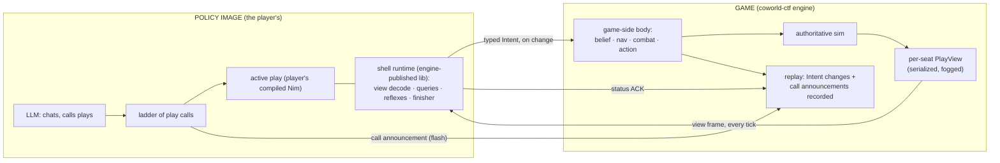

# The Play-Calling Shell: Player-Authored Plays Over a Game-Side Body

**Status:** DESIGN · **Date:** 2026-08-30 (supersedes the 2026-08-29
revisions; see Appendix H for the decision record and revision history) ·
**Author:** James's coding agent, direction from James · **Reviewers:** Codex
(cross-agent, round-gated), Maxwell (coordinating; his `BR_PLAYS.md` supplies
the reference play menu) · **Canonical home:** this file, in `coworld-ctf`.

Companion reading: `docs/reports/maxwell-s2-paradigms-2026-08-29.md` (the
research report on Maxwell's Season 2 substrate, with a plain-language primer
in its section 0) and `docs/recon/paintbot-s2-policy-shell-2026-08-29.md`
(the branch inventory). Citation style: bare paths are this repository;
`PBP:` is `coworld-paintbot-player`; `origin/<branch>:` marks files on
unmerged branches. Stencil, the bot this design borrows its body from, lives
in James's private lab; lab files are cited `LAB:` and are reference
material only. This design changes nothing in that lab.

---

## 1. What this design builds

Season 2 pits language-model "policies" against each other, first in the new
Battle Royale mode and over time in the other modes (classic CTF, and likely
King of the Hill). Each policy directs a robot (a cog) during the match,
and, where a lobby chat exists (today that means Maxwell's local match
app, section 9), talks with the other policies before it starts.

The system this design specifies has three parts, owned by two parties.

**The game owns the body.** The engine hosts, for every Season 2 seat, a
ported and improved version of stencil's execution machinery: per-seat
belief, navigation, the planner, combat, and action resolution. The game
runs that loop every tick. A seat's standing order is a typed `Intent`
(section 4), and the body executes the current `Intent` continuously until a
new one arrives.

**The game owns the interface.** The engine defines and serves everything a
play is allowed to see and say: a read-only, serialized view of the seat's
belief (the `PlayView`, section 5), the query vocabulary over that view
(`play_queries`, which players extend by pull request), the `Intent` wire
message, and the play-call announcement channel. All of it lives in this
repository and is versioned with the game.

**The player owns the plays.** A play is a compiled Nim program the player
writes, links against the engine-published contract, and ships inside their
own policy image. The play API gives it exactly two capabilities, reading
the view and emitting an `Intent`; anything beyond that is outside the API,
and the guarantees that matter competitively are enforced by the server's
seat protocol (section 4.3), not by the library, since the policy image is
arbitrary player-owned code. Players develop, refine, and evolve
their plays and playbooks privately, over time, with experience, forum
discussion, and cooperation. The player's LLM, also inside the policy image,
selects plays from its own playbook and fills in their parameters: it calls
plays; it never writes code at runtime.

The division of labor at runtime, in one pass: each tick, the game sends the
seat a compact view frame; the policy's active play reads it and, whenever
its answer changes, sends back a typed `Intent`; the game's body turns the
standing `Intent` into movement, aim, and trigger decisions, tick after
tick. The policy's LLM sits above all of this at human cadence, chatting in
the lobby, picking plays, and re-calling them mid-match whenever the
situation changes.


Figure 1: The runtime shape. The game computes what a seat may know and
executes what a seat orders. The player's code decides. Four things cross
the boundary: view frames (with the durable statuses) going out, `Intent`
changes and status acknowledgments coming in, and call announcements for
the record.

## 2. Goals and non-goals

Goals:

1. Specify the game-side body: what is ported from stencil, what is improved
   during the port, and how it stays cleanly separated from the rest of the
   engine.
2. Specify the boundary contracts: the `PlayContext` and `PlayView` with
   their query vocabulary, the `Intent` message, the durable status lists
   and their acknowledgment packet, and the play-call announcement.
3. Specify the policy-side shell runtime the engine publishes for players to
   build on: the play contract, the ladder driver, reflexes, the finisher,
   and the default play.
4. Adopt Maxwell's ladder-of-plays call format and his seven-play reference
   menu, and make sure the parameter system covers what those plays need.
5. Keep replays deterministic under the new boundary, reusing the recording
   machinery that already exists.
6. Support multiple game modes from the start. Battle Royale is the first
   target, not the design's shape.

Non-goals:

- Changing James's stencil lab in any way. Stencil is source material; the
  port copies from it and then diverges freely.
- Preserving stencil's CTF strategy or its exact behavior. The port keeps
  what makes stencil good at executing (movement, aiming, fighting,
  validated navigation) and deliberately discards its strategy layer and its
  habit of mutating shared state during decisions.
- The lobby chat transport and UI. Maxwell's pre-round chat phase (a
  local-app feature today) and his front end continue as they are; this
  design plugs into them where they exist, and section 9 states the hosted
  scoping plainly.
- The offline play-authoring pipeline (log harvesting, forum mining). Plays
  are ordinary code; how a player decides what to write is their business.

## 3. The game-side body

- The body is stencil's execution machinery, ported into this repository
  and run by the game for every Season 2 seat.
- It lives in its own module namespace, separate from the sim, and talks to
  the sim through the same narrow surfaces any player does.
- The port discards stencil's strategy layer entirely and makes three
  improvements ratified for this design: one target-acquisition route,
  type-enforced goal validation, and the removal of the pursuit override.

### 3.1 What the body is

Per Season 2 seat, the game maintains and runs:

- **Belief.** The seat's knowledge of the world: tracked enemies and allies,
  item memory, zone state, and the navigation map. Because this now runs
  inside the game, it is fed directly from sim truth filtered through the
  seat's fog rules. The label-string parsing that client-side bots do today
  is unnecessary here, though the sim's fog remains the authority on what a
  seat may know.
- **The world map.** Stencil's spatial model, built once per episode when
  map knowledge is complete: the clearance field, the walkable grid,
  connected components, rooms and chokepoints, cover sectors, and the
  firing-position atlas (`LAB:worldmap.nim:173-209` is the source being
  ported).
- **The executor.** Stencil's action resolution (`LAB:action.nim:402-551`),
  navigation follower with its corridor rule (`LAB:nav.nim`), pure weighted
  A* planner (`LAB:planner.nim`), and combat layer (`LAB:fight.nim`),
  executing the seat's current `Intent` every tick: plan and follow a route
  to the intent's goal, manage micro-movement within the allowed set, pick
  and engage targets under the intent's combat policy, and emit the seat's
  button mask into the sim.

The body executes a *standing order*. An `Intent` persists until the policy
replaces it, and the body re-plans, re-aims, and re-fires under it every
tick without any further policy involvement. A policy that goes silent for
a thousand ticks has a cog that keeps competently doing the last thing it
was told.

### 3.2 Separation from the game logic

The body is not sim code and must not entangle with it. It lives in its own
namespace (`src/shell/`), with three hard rules:

1. The sim never calls into `src/shell/` except at the one seam where seat
   masks are collected each tick, and `src/shell/` reads sim state only
   through the same fog-filtered accessors that build the `PlayView`. The
   body has no privileged view of the world; it knows what its seat knows.
2. The body sits outside the determinism hash boundary, exactly as the
   paintball control layer does (`src/ctf/control.nim:1-13`): it may use
   floating point and hold state, because it is **never re-run during
   playback**. What the replay records for determinism is the body's
   *output*: the per-cog button masks, written every tick through the
   existing mask-change records precisely as paintball writes its compiled
   masks (`src/ctf/server.nim:2062-2089`), and played back through the
   existing mask playback path (`src/ctf/replays.nim:392-400,445-455`).
   Replays, seeking, keyframes, and the WASM viewer therefore need no new
   machinery and no body-state serialization, and the body is free to use
   platform floating point. The `Intent` stream is additionally recorded,
   but as non-hashed annotation records for display and analysis
   (section 4.3), the way paintball records its redacted directive
   records.
3. Nothing in `src/shell/` is reachable from a non-Season-2 configuration.
   The whole subsystem sits behind a config gate that defaults off, per the
   engine's house rule that a gate-off configuration plays byte-identically
   (`AGENTS.md:136-147`).

### 3.3 The three ported-with-improvement rulings

**One target-acquisition route.** The ported combat layer routes every
target choice through the scored selector (`scoreTarget`,
`LAB:fight.nim:162-283`). The nearest-enemy fallback path that stencil's
gun uses outside a firefight, and the spray selector's independent scan,
both collapse into the one scored route with mode-appropriate scoring
terms. The no-shoot filter of section 4.2 applies at that single route,
with a final veto immediately before each weapon's fire decision as defense
in depth.

**Type-enforced goal validation.** Stencil's law that no navigation goal
reaches the executor without passing reachability validation becomes a
compile-time guarantee. `makeIntent` accepts only a `ValidatedGoal`, a type
whose sole constructor is the validation function itself (the port of
`reachableGoal`/`nearestReachable`, `LAB:strategy.nim:107-110`). An
unvalidated goal is a compile error, not a code-review catch.

**No pursuit override.** Stencil's post-decision spray-pursuit override
(`LAB:strategy.nim:504-514`) is not ported. Plays that want pursuit
behavior express it as a play.

### 3.4 Porting verification

The port is verified by a temporary adapter that runs the ported body and
stencil's original side by side on identical inputs and compares executor
outputs. The scope of that comparison is stated honestly, because two
facts bound it. Stencil cannot run Battle Royale at all (its world model
waits for endzones and lacks the zone percepts), so the differential test
covers **CTF only**. And the three rulings of section 3.3 change behavior
on purpose, so blanket output equality is not the expectation: the
differential test targets the *unchanged* subcomponents (the planner's
routes, the follower and corridor behavior, the unmodified combat paths)
with exact-match criteria on fixed-seed cases, plus an explicit allowlist
of expected differences attributable to each ruling. Battle Royale
behavior is validated without a stencil oracle: body invariants (goals
always validated, the corridor rule holds, no-shoot never violated),
golden fixed-seed scenarios, and full-episode runs on the current engine.
The adapter is scaffolding: it is deleted when the gate passes, and there
is no permanent compatibility layer and no goal of preserving stencil's
strategic behavior.

## 4. The Intent contract

- The `Intent` is the one order type that crosses from policy to game. It
  is stencil's ten-field contract plus a combat policy, minus the fields
  the discarded strategy layer owned.
- Intents are validated on receipt, applied at tick boundaries, and
  recorded as annotation records; the determinism artifact is the mask
  stream the body emits under them (section 3.2).
- The combat policy carries the alliance semantics plays need: teams and
  seats that must never be shot, and wards to protect, with threat
  detection that uses aim bearing rather than distance alone.

### 4.1 The type

The wire `Intent` is specified field by field against stencil's ten-field
struct (`LAB:types.nim:189-215`). Each stencil field is deliberately
retained, replaced, or deleted:

| Stencil field | Disposition |
|---|---|
| `kind` (NavigateTo, Hold) | retained |
| `point: Option[Point]` | retained; on the wire it is a plain point in map pixels, and the game re-validates reachability on receipt (the policy-side `ValidatedGoal` type of section 3.3 is authoring discipline, not a wire token) |
| `arriveRadius: float` | retained; pixels, bounded [0, map diagonal] |
| `movingGoal: bool` | retained |
| `profile` (default, carrier, hunter) | retained as an enum |
| `micro` (permission set) | retained as a set of named flags, minus the pursuit flag (deleted with the override) |
| `idleAimCenterBrads: Option[int]` | retained; 0..255 |
| `clampToEndzone: bool` | retained; meaningful in CTF, ignored where no endzones exist |
| `suppressFireFreeze: bool` | retained |
| `reason: string` | retained; telemetry only, capped at 64 bytes |

One field is added, the combat policy:

```nim
type
  CombatPolicy* = object
    noShoot*: ProtectedSet       # teams and seats never fired on
    protect*: ProtectedSet       # wards: bias position + targeting to defend
    prefer*: seq[PreferTag]      # target preference tags, in priority order
    holdFire*: bool              # do not initiate fire (return fire allowed)
  ProtectedSet* = object
    teams*: set[Team]
    seats*: seq[SeatRef]         # cross-team, per-seat references
```

Everything empty or false is the neutral value and the default. Seat-level
references exist because Maxwell's `pact` negotiates alliances with
specific duos, not only whole teams; `prefer` and `holdFire` exist because
his `target_law` is a standing filter over who to shoot and when to start
shooting. Betrayal responses and pact end conditions are play logic, not
policy fields: the overlay play that owns the pact watches the view every
tick and changes the policy it emits.

Wire encoding for v1 is versioned, schema-tagged JSON with declared units
(pixels, brads, ticks), explicit optional fields, canonical ordering and
deduplication for the protected sets, and hard caps on list lengths and
string sizes. A golden byte fixture pins the encoding for both the Nim
runtime and any other producer. "On change" means byte inequality of the
canonical encoding. Message size is small (well under a kilobyte) and
Intent changes are event-rate, not tick-rate, so bandwidth is negligible.

### 4.2 Never-shoot, and what protecting means

Members of the `noShoot` set join the protected set that every friendly-fire
check consults, in every weapon path: they are excluded from target
scoring, the gun's corridor check treats them as blockers, the spray cone
refuses to activate over them, the grenade planner treats them as
must-not-splash and never counts them as target value, and an in-flight
grenade charge is re-validated the tick the policy changes, cancelled
rather than force-released if it now violates the set. A final veto before
each weapon's fire decision refuses a `noShoot` endpoint however it was
acquired.

Protecting a ward means two things the body does and one thing plays do.
The body biases positioning toward a threatened ward when the intent's goal
allows it, and it up-weights threats-to-wards in target scoring, so the cog
prefers shooting whoever endangers its ward. Interposition (physically
blocking the line of fire) is play territory, expressed through movement
goals, as Maxwell's `bodyguard` play does with its `interpose` parameter.

A *threat to a ward* is detected with aim bearing, not proximity alone. An
enemy is threatening a ward when it is within the live weapon range of the
current map and its aim bears on the ward within an angular tolerance; the
same test against the seat's own cog gives `aimedAtUs`. Weapon range is
read from the live `gunRange` configuration field, never a constant,
because the engine derives it per map (stock CTF is 1050 px, effectively
map-wide on small boards; Battle Royale's giant field derives 331 px from
the equal-share territory formula in
`origin/maxwell/ladder-scout-tooling:docs/designs/BR_MAPGEN.md` section
4.1). A proximity term (enemy fresh and near the ward) remains as a
secondary signal for enemies whose aim is not currently readable. Both
tracks must be fresh within the track time-to-live, and threat candidates
never include members of `noShoot` or `protect` (allies are not threats to
each other).

### 4.3 The seat protocol, validation, and recording

Season 2 is a **server-enforced seat protocol**, not a library property. A
seat is marked Intent-capable in the trusted match configuration (per seat,
per episode), and for such seats the server sends the Season 2 view frames
and accepts exactly: Intent messages, call announcements, the
status-acknowledgment packet, ready packets, and chat. Direct input masks (`0x84`) on an Intent seat are ignored,
deterministically and with telemetry, so no player image can drop below the
Intent boundary for an edge. Non-Intent seats (humans, legacy bots) keep
the mask protocol untouched, and mixed rosters are simply per-seat
configuration. The policy image is player-owned arbitrary code, and
nothing about the shell runtime library is a sandbox; the guarantees live
in what the server accepts, records, and refuses. The runtime library is
the recommended authoring model, not a security boundary.

The seat protocol is a small explicit state machine, because startup,
rejection, and reconnect are where implicit contracts rot:

- **Initial state.** When an Intent seat activates, the server installs a
  safe standing `Intent` (hold at spawn, empty combat policy) at call
  epoch zero. A policy that never sends anything, or that dies at
  startup, plays that standing order; there is no undefined window.
- **Sequencing.** Every Intent message carries a monotonic sequence
  number. Each admitted message produces an ordered entry in the durable
  Intent-lane status list (sequence, outcome: accepted or a named
  rejection reason), so every acknowledgment is attributable to a
  specific message. Several Intents arriving within one tick are
  processed in order and the last valid one stands; all admitted ones get
  entries.
- **Rejection.** An unknown field, an out-of-range value, a goal that
  fails game-side reachability re-validation, or a reference to a
  nonexistent team or seat rejects that message and leaves the standing
  `Intent` unchanged. Rejections distinguish transport-shaped problems
  from semantic ones, because the recovery differs. For a semantic
  rejection (an invalid goal above all), blind resending would loop
  forever on a screen-versus-exact disagreement, so the status carries a
  structured reason plus, when one safely exists, the server's nearest
  valid point, and the runtime **suppresses re-sending byte-identical
  rejected content** until a play changes it. The default play, and every
  reference play, consumes its Intent-lane statuses and falls back to a
  validated hold after a bounded number of rejected goals. Automatic
  resend is reserved for transport uncertainty (reconnect, missed
  acknowledgment), where re-sending identical bytes is exactly right.
- **The call transaction.** A call submission carries a client-chosen,
  numerically monotonic proposal identifier. The server admits it,
  assigns the next call epoch at acceptance, and acknowledges per
  proposal, in order, through the durable call-lane status list: a
  `callAccepted(proposalId, epoch, acceptedTick)` entry now, and a
  `callActivated(epoch, firstIntentTick)` entry later if and when the
  first Intent under that epoch is accepted. **The runtime swaps ladders only on that
  acknowledgment**, so it never emits an Intent under a guessed or
  rejected epoch; a rejected proposal (gate, size, malformed) leaves the
  standing ladder and gets a named status. Epoch zero is reserved and
  means "no declaration": the server's safe initial order and the
  runtime's unannounced default play both run under it, and the record
  says so rather than pretending attribution. Every Intent carries the
  epoch it was produced under, and the server validates it against the
  seat's current accepted epoch. A reconnecting or replaced policy
  process reads the authoritative epoch from its fresh `PlayContext`;
  attribution survives process death.
- **Bounded ingress.** Arbitrary player code feeds these queues, so both
  lanes have per-seat admission budgets per tick (message count and
  aggregate bytes), with deterministic overflow: excess messages are
  dropped at receive, reported through aggregate overflow counters in
  the view (dropped-count per lane, never an unbounded list of dropped
  ids). Admitted messages are processed in order at the tick boundary.
- **Statuses are durable, cumulative, and acknowledged by a dedicated
  message.** Outcomes for admitted Intents and call proposals are ordered
  entries in two per-lane status lists. Every entry carries a
  server-assigned, per-lane monotonic **status ordinal**, and the client
  acknowledges with an explicit, small status-acknowledgment packet
  carrying the two ordinal high-water marks. The acknowledgment is a
  dedicated message because the other client packets (Intent, call,
  ready, chat) are not all present in every mode and none is a sound
  carrier (a quiet wall-clock policy sends no ready packets at all). Acknowledgment keys
  are always these server ordinals, never client identifiers. On the
  client side, both lanes use client-monotonic numeric identifiers:
  Intent sequence numbers, and numeric proposal ids that must also
  increase, so "at or below the floor" is well defined on both lanes. The runtime folds control metadata from every
  received frame and coalesces only the world snapshot; a coalesced or
  lost view frame cannot swallow an acknowledgment because unacknowledged
  entries persist. Wherever this document says a status is "in the view,"
  it means an entry in these durable lists.
- **The retained state is hard-bounded, and the release valve cannot
  jam.** Per seat, unacknowledged status entries are capped in count and
  bytes; at the cap, the server stops admitting new Intent and call
  messages and reports the fact through a bounded aggregate backpressure
  counter in every view frame; it does not mint a per-message status it
  has no room to retain. The status-acknowledgment packet gets a **coalescing slot inside a
  total read budget**, with the guarantee scoped honestly, because one
  ordered websocket stream cannot both stop inspecting at a cap and
  promise to find an acknowledgment hidden behind a flood. Per seat per
  tick, the server classifies at most a fixed number of delivered
  messages and bytes across all packet types (64 messages, 16384 bytes;
  see the limits table below); classification happens in the websocket message
  handler, where the transport has already delivered a complete message,
  so the fixed cost per inspected message is one type-byte dispatch, and
  **the first message past either budget disconnects the seat**; that
  number is the abuse threshold, not a vague standard. Within the
  budget, ACK packets coalesce component-wise to the greatest
  well-formed marks and are processed exactly once, before control-lane
  backpressure. The reference runtime sends its ACK as the first message
  after each view frame, so for any conforming client the release valve
  is inspected first and cannot jam; a client that buries its ACK behind
  64 hostile messages disconnects itself, which is the intended outcome.
  The bound must also hold *below* the application callback, because the
  pinned websocket layer assembles each complete message and appends it
  to an uncapped per-socket queue before any handler runs
  (`mummy.nim:551-573,658-752`), and its default single-message limit is
  64 KiB (`mummy.nim:1474-1504`), larger than this protocol's biggest
  valid message. Two transport-level requirements are therefore part of
  the contract, named as P2 work, and both are **per-socket, selected at
  registration**. A global limit would break existing traffic, since
  the shared server also carries legacy player sockets whose
  debug-sprite messages legitimately run to 32 KiB per tick
  (`src/ctf/server.nim:60-66,1123-1146`) and the design promises
  non-Intent seats an untouched protocol. The patch adds a
  per-WebSocket receive limit checked from the frame header before
  allocation: 8192 bytes on Intent-capable seats (the largest valid
  client message, a call announcement, with headroom), and the existing
  effective limit on every other route. It also adds the per-socket
  pending-update cap: at most 128 pending message events or 262144
  pending bytes, counting **every client-originated message event
  including ping and pong**. In the pinned transport, ping and pong are
  ordinary message events on the same per-socket queue
  (`mummy.nim:68-84,710-752`), so exempting them would leave an
  unbounded flood path of legal empty control frames; only the open
  event and the single terminal close/error notification, which a client
  cannot flood, sit outside the caps. Breaching a cap is one atomic
  transition: further enqueue is rejected, queued message events are
  purged, exactly one terminal close/error event is dispatched so the
  application's socket-owned state is cleaned exactly once, and the
  transport queue is removed only after that cleanup runs. The pinned Mummy has
  neither a per-socket receive limit nor an enqueue hook, so this is an
  explicit dependency patch (or fork) in P2; the handler-side counters
  above are semantic admission, not the hostile-input bound, and the
  design does not pretend otherwise. Tests inventory every route on the
  shared server: a valid near-32-KiB debug-sprite message on a legacy
  seat still passes; an 8193-byte message on an Intent seat is rejected
  pre-allocation; a large outbound viewer frame is unaffected (the
  limits are receive-side only); a sender faster than the worker drain
  keeps queued bytes and post-breach callbacks within the caps, with 32
  seats breaching simultaneously, exactly one cleanup callback per
  socket, and no residual entries in the server's socket-owned tables;
  a stalled worker drain flooded with empty ping frames, with empty pong
  frames, and with a mixed control-and-data sequence (each breaching at
  the exact event cap, no post-breach messages, one cleanup, no residual
  state); and a valid ACK placed both before and after 64 hostile
  messages. Each lane's
  acknowledged mark must be monotonically nondecreasing and no greater
  than the highest ordinal the server has issued on that lane; an
  out-of-range or future mark is rejected without changing any state, so
  arbitrary player code cannot compact statuses it never received. Deduplication state compacts with the same
  acknowledgment: outcomes are retained exactly until their entries are
  acknowledged, after which ids at or below the acknowledged floor are
  rejected as stale rather than being replayable forever. A client can
  therefore make the server retain only a bounded window, never an
  episode of history. Tests include a client that floods unique ids for
  many ticks without ever acknowledging (bounded memory, deterministic
  backpressure), a million-duplicate-ACK flood (asserting a fixed upper bound on
  messages and bytes *inspected* in one tick, as well as on retained
  bytes and the final coalesced state), and a quiet wall-clock client that
  acknowledges correctly with no ready traffic.
- **Idempotency, within the window.** Re-sending an unacknowledged
  sequence number or proposal id with byte-identical content returns the
  original outcome (and, for calls, the originally assigned epoch and
  tick) without re-applying or re-recording anything; reusing an id with
  different bytes, or an id below the acknowledged floor, is a named
  rejection. Deduplication state survives reconnect. This is what makes
  "re-send on transport uncertainty" safe: a retry can never allocate a
  second epoch or double-record a call. Tests cover lost frames,
  duplicate sends, duplicates across reconnect, and id reuse.

The limits themselves are wire constants of the protocol version, not
per-deployment configuration, because they define when a correct client
starts losing messages:

| Limit | Value |
|---|---|
| Intent messages admitted per seat per tick | 4 |
| Call proposals admitted per seat per tick | 2 |
| Control bytes admitted per seat per tick (both lanes) | 8192 |
| Retained unacknowledged status entries per seat | 64 |
| Retained unacknowledged status bytes per seat | 16384 |
| Status-ACK packet size (fixed) | 32 bytes |
| Socket messages classified per seat per tick (all types; first over-budget message disconnects) | 64 |
| Socket bytes classified per seat per tick (all types; same disconnect rule) | 16384 |
| Per-socket receive limit, Intent seats (frame header, pre-allocation) | 8192 bytes |
| Per-socket pending message events (transport queue; all client-originated events incl. ping/pong) | 128 |
| Per-socket pending bytes (transport queue) | 262144 |
| Sequence, proposal, epoch, generation, status ordinals | uint64, monotonic, no wrap within an episode |
| Backpressure and discard counters | uint32, saturating |

Boundary tests exercise each value at limit-minus-one, at the limit, and
one past it, across all 32 seats simultaneously.
- **Lifecycle and the control generation.** The context and view carry a
  monotonic per-seat **control generation**, bumped on seat activation,
  death, respawn, reconnect, and policy replacement. The generation drives its own send-state transitions
  (the frame loop in section 7.2 defines them per bump: park on death,
  fresh-sequence application on respawn and activation, uncertain-only
  retry on reconnect and replacement), which closes an otherwise silent
  trap: after a respawn installs the safe order, a controller whose
  canonical bytes match its pre-death output would never re-send under a
  bytes-changed-only rule, and the cog would hold the safe order
  forever. The respawn transition re-applies those bytes under a fresh
  sequence. On death the standing `Intent` is cleared and
  Intent messages are rejected with a named there-is-no-cog status; on
  respawn the server reinstalls the safe order and the generation bump
  makes the runtime speak again. On disconnect the standing order
  persists (an absent policy is an AFK player).
- **Process replacement.** A reconnecting or replaced process receives,
  in its fresh `PlayContext`, the full recovery state: the current
  control generation, the current epoch, the **accepted call itself**
  (canonical bytes and proposal id), the next expected Intent sequence
  and proposal id floors, and the two status-ordinal high-water marks:
  enough to resume both lanes without guessing. It has two
  legal moves: reinstantiate that ladder (private play state reset,
  since the state died with the old process) and continue under the inherited
  epoch, or submit a new call and wait for its acknowledgment. The
  reference runtime enforces the matching convention (it emits Intents
  under an epoch only from that epoch's reinstantiated ladder), and that
  convention is tested in the runtime, not promised as a server guarantee
  (see the attribution invariant below).
- **Two ticks per call, two status events.** A call's `acceptedTick` is
  when the server accepted the announcement; its `firstIntentTick` is
  when the first Intent under its epoch was accepted, which is when
  behavior actually changed and which may never happen at all. They are
  reported as two durable status events, `callAccepted(proposalId,
  epoch, acceptedTick)` and, if and when it occurs, `callActivated(epoch,
  firstIntentTick)`; `firstIntentTick` is equivalently derivable
  from the accepted-Intent annotation stream. A never-activated call
  simply has no activation event. Records, retry results, and viewer copy
  use these two names and nothing else; there is no singular "effective
  tick."
- **What attribution means, precisely.** The server verifies one thing:
  an Intent was submitted while a given declared call epoch was current
  (and from the same seat socket, under the current control generation).
  It does not and cannot verify that the player's code semantically
  executed that call: the policy image is arbitrary code, and a custom
  policy can emit any valid Intent under the current epoch. Viewer and
  analysis surfaces therefore label the linkage "declared call," never
  "executed play." If verified execution ever becomes a requirement, that
  is an attested engine-owned play catalog, which is a different design.

Recording is three streams with three jobs, and their relationship to the
hash chain is stated precisely because the machinery differs.

The **mask stream** is the determinism artifact: the per-cog masks the
body emits, recorded and played back through the existing machinery
(section 3.2), so replay correctness is inherited rather than built.

The **call announcements** ride Maxwell's flash channel with its existing
semantics intact: an accepted call is written into sim bookkeeping fields,
its content hash and a per-seat counter are mixed into the game hash, and
playback re-applies the record deterministically
(`origin/maxwell/br-season2-complete:src/ctf/sim_state.nim:288-306,347-385`,
`replays.nim:579-605`). Those semantics are kept on purpose: the apply
function drives no gameplay, and the hash coupling is what makes a
dropped or shifted announcement detectable, which is the negative-control
property section 8 relies on. Calls are therefore hash-verified recorded
inputs that happen to carry no behavior, not free-floating annotations.

The **Intent stream** is a new, genuinely non-hashed annotation record,
and its physical format is decided here rather than deferred, because the
replay codec rejects unknown versions and unknown record bytes by design
(the reflash lane spent a player-byte flag inside the chat record
specifically to avoid a version bump,
`origin/maxwell/br-season2-complete:src/ctf/replays.nim:253-270`). This
design takes the other path deliberately: **Season 2 replays bump the
replay format version.** The new version adds two dedicated record
arrays: the per-seat behavior annotations and the end-of-episode manifest
(per-seat record counts and ordered-chain hashes). An annotation is a
tagged union with an explicit discriminant and byte-golden layouts:
`acceptedIntentChange(tick, seat, sequence, epoch, canonical Intent
bytes)`; `clearOnDeath(tick, seat, generation)`;
`installSafeIntent(tick, seat, generation, epoch = 0, reason, canonical
bytes)`, written unconditionally at seat activation (`reason:
activation`) and again at each respawn (`reason: respawn`), recording the
exact bytes that became standing, always at the reserved epoch zero
because a server-synthesized order is by definition undeclared (the
accepted call epoch, if any, remains current for the seat's next client
Intent); and `replacementMarker(tick, seat, generation)`, which is
metadata only and never changes the standing order, because a process
replacement does not itself alter what the server holds standing. The
unconditional activation record is what makes the array complete: a
policy that never speaks still has an annotation stating exactly what
stood from activation to death. Same-tick ordering records the transitions in the exact order the
server made them, keyed by (tick, phase, ingress ordinal): the tick
boundary's accepted changes come first (that is when they happened),
then a death caused by that tick's sim step, then, on a later tick,
the respawn install before any post-respawn accepted change. No sort is
imposed over the truth; a viewer's most-recent-record cursor therefore
shows a cog that took an order and died on the same tick as cleared,
which is what actually stood. Goldens pin exactly that pair and its
respawn inverse. Arrival order at equal ticks is
preserved; seeking gets its own cursor, like the existing cursors. The
compatibility contract is stated plainly: new readers load every archived
older version; old viewers cannot load Season 2 replays, which is
acceptable because a Season 2 replay is only interesting in a viewer that
can display strategies anyway. The paintball JSON-in-chat trick is
explicitly not used: that discrimination is enabled only in paintball
configurations (`src/ctf/replays.nim:402-415`), and an Intent-shaped chat
record in another mode would fall through as a real shout. Playback skips
the Intent arrays entirely (no sim mutator in their path); a truncated or
selectively dropped annotation stream fails manifest verification
loudly.

What enters the annotation array is defined exactly by those variants:
server-accepted standing-order changes and the lifecycle records above,
so the array alone tells the truth about what order stood at every tick.
Rejected, overflowed, duplicate, and epoch-mismatched messages never
enter it; their story lives in telemetry, not the behavior record. A
strategy-aware viewer reconstructs the standing order at any seek point
from the array's cursor: the most recent `acceptedIntentChange`,
`clearOnDeath`, or `installSafeIntent` at or before the target tick
(replacement markers annotate but never change the reconstruction), with
epoch zero rendering as "no declaration." Native and WASM viewer goldens
cover seeks landing on epoch zero, across a death and respawn, across a
disconnect, across a replacement, and onto a tick carrying multiple
variants.

## 5. The PlayView and the query vocabulary

- The `PlayView` is a compact, serialized, per-seat, per-tick snapshot of
  everything a play may know. It is the entire observation space of the
  play layer.
- The game builds and sends it; the engine-published runtime deserializes
  it and exposes it through typed query functions. Players extend the
  vocabulary by pull request to this repository.
- The view names the game mode explicitly.

The view is two messages with two lifetimes.

**The `PlayContext`, once per episode** (re-sent on reconnect): the
episode-static facts. The game mode (section 5.1), the pacing mode
(fast-mode recording versus wall-clock league play, which governs whether
readiness packets may be sent at all, section 7.2), the map identity and
dimensions, the roster (teams and seat references), the live weapon
range, the seat's full control-recovery state (the control generation,
the current epoch, the accepted call's canonical bytes and proposal id,
the next-expected sequence and proposal floors, and the two
status-ordinal high-water marks; section 4.3), the static
firing-position and cover atlas the body derives for this map, and the
navigation data for policy-side goal screening. This inventory is
normative: a field the protocol needs at reconnect lives here or nowhere.

That navigation payload is deliberately *not* the game's exact validator.
The exact test operates on per-pixel clearance and component rasters with
specific radius, metric, and tie rules
(`LAB:worldmap.nim:320-404`), which would be megabytes per seat and a
maintenance trap to mirror bit-for-bit in a second implementation. The
context instead carries the cell-resolution walkable grid and its
component labels (about 86 thousand cells on the largest map, tens of
kilobytes compressed; a versioned, checksummed binary field, not a JSON
array), and the policy-side validator is an honest *screen*: it catches
unreachable and out-of-component goals cheaply, and the game's exact
re-validation on receipt remains the authority, with disagreements
surfacing as named rejections in the Intent-lane status list and the
runtime's suppression rule. `ValidatedGoal` is the compile-time discipline
that no goal skips the screen; it is not a server-binding proof.

**The `PlayView`, every tick**: the seat's current fogged knowledge in
structured form. Self state, tracked allies and enemies (position, team,
health where known, aim, and freshness), item memory, zone rectangles and
phase timing in Battle Royale, capture objectives in CTF, the seat's own
standing `Intent`, and the unacknowledged lane statuses. Nothing
about hidden enemies, other seats' orders, or match scoring crosses into
the view; the fog rules that bound a human player bound it.

The tick pipeline is one fixed order, so the policy and the body can
never see different worlds: fog sampling, then belief fold, then the view
snapshot (a direct projection of the seat's belief at that instant), then
body execution under the standing `Intent`, then the sim step. The view a
play reads for tick N is exactly the belief the body executes against at
tick N.

Encoding for both messages is the same versioned, schema-tagged JSON as
the Intent message, with a golden byte fixture. Tagged encoding is what
makes "adding fields is compatible" true: an older runtime ignores tags
it does not know. Per-tick view size is bounded and measured in P0
(tracked entities are capped; the navigation data lives in the once-per-
episode context, not the tick frame).

The query vocabulary (`play_queries`) is the read API over the
deserialized view: fact getters, distance and freshness helpers, the
threat tests of section 4.2 (`aimedAtUs`, threats-to-ward), and the goal
validator that mints `ValidatedGoal` values. Queries return plain values
and never expose mutable internals. The vocabulary is engine code in this
repository, documented for play authors, and deliberately open to
extension: **a player whose play needs a fact the view does not carry
files a pull request extending the view and its queries.** That invitation
is part of the contract and gets stated prominently in the contributor
documentation, because the vocabulary growing with the play ecosystem is
how the design is supposed to work.

Serialization discipline: the view format is versioned with the game, and
adding fields is backward-compatible for compiled plays (unknown fields
ignored on decode). Removing or changing a field's meaning is a
GameVersion event.

### 5.1 Game mode, derived not declared

`GameMode` is a three-value enum: `gmCtf`, `gmKoth`, `gmBr`. It is derived
server-side from the authoritative configuration in one place: `brMode`
true means `gmBr`; otherwise `hill` true means `gmKoth`; otherwise
`gmCtf`. Configuration validation rejects inconsistent gate combinations
(for example `brMode` with `hill`) rather than letting a bare enum
disagree with the mechanics actually enabled, a hazard the existing
config comments already warn about in other forms (team count is not a
mode, `src/ctf/sim_types.nim:1421-1425`). Per mode, the schema tests pin
which observations exist (zone facts only in `gmBr`, capture objectives
only in `gmCtf`, hill facts only in `gmKoth`), which `Intent` fields are
meaningful (`clampToEndzone` only in `gmCtf`), and that a configuration
whose mode the shell does not support cannot mark seats Intent-capable.
The mode is also exposed to guards and plays as three context-backed
boolean paths (`mode.is_ctf`, `mode.is_koth`, `mode.is_br`, exactly one
true), because the guard language deliberately has only numeric and
boolean values and gains no enum or string kind for this. Once-per-episode
context paths and per-frame view paths share one evaluator registry;
golden guard cases cover all three modes and the rejection of a path the
current mode does not provide.

### 5.2 What the reference plays require: the observation matrix

Each reference play's inputs map to a named context, view, or query fact,
**with its fog provenance stated**, because every event fact here must be
derivable from what the seat itself could observe. The engine's internal
event stream (`SimEvent`) records exact shooters and victims for analysis
and is explicitly a global, omniscient channel
(`src/ctf/sim_types.nim:1795-1806`); nothing in the view is ever sourced
from it. The player-visible reality is the baseline: firing is silent, and
a jittered impact is the only trace a shot leaves for bystanders
(`src/ctf/labels.nim:78-80`). Two visibility grants are made deliberately
and documented as such, rather than smuggled: a **public kill feed**
(killer team and victim seat, tick-stamped; this is consistent with
alive-team counts being public, which already reveals deaths), and **victim-private
hit feedback** (a seat knows when it was hit, from which direction, and
the shooter's identity only if the shooter was visible to it at that
moment; otherwise the aggressor is recorded as anonymous-with-direction).
A ward's plight is observable only through the seat's *own* perception:
impacts near a visible ward, and the ward's own track state.

| Fact | Where it lives | Fog provenance | Needed by |
|---|---|---|---|
| alive team count | view (`world.alive_teams`) | public by design | `pact` end conditions, guards |
| zone rectangles, phase index, ticks to next shrink | view, `gmBr` only | public (already on every frame) | `edge_ride`, default |
| tracked entities: position, team, hp where known, aim, freshness | view | seat's own fog | all |
| `aimedAtUs` / aimed-at-ward | query over tracks + live weapon range (section 4.2) | derived from fog-visible aim | `pact` (`protect`), `bodyguard` |
| aggressor events against self, window 120 ticks | view (per-seat event list) | victim-private hit feedback (identity only if shooter was visible; else anonymous + direction) | `pact` (`onBetrayal`), `target_law` return fire |
| aggressor events against a visible ward | query over own perception (impacts near ward + visible shooters) | seat's own fog only | `bodyguard` (peel) |
| kill feed: killer team, victim seat, window 240 ticks | view (event list) | public by design (deliberate grant); carries no killer seat and no location | `jackal` (`joinWhen: afterKill`) |
| active-fight detection: clustered own-perceived impacts and visible/stale tracked positions | query over own perception only | a public off-screen kill may raise awareness but never yields a navigable location; approach targets come only from the seat's own fog | `jackal` |
| both-weakened: min known hp of clustered fighters | query | fog-visible hp only (unknown hp excluded) | `jackal` |
| contested item: enemy track within pickup radius of a known item | query | seat's own fog | `supply_run` (`contested`) |
| partner's live position and aim | view (duo telemetry) | **deliberate grant**: a duo shares live position+aim telemetry, always fresh while both live, documented and tested as a grant rather than fog-derived; no access to the partner's orders or targeting | `crossfire`, `bodyguard` |
| bounty mark on a tracked enemy | view (track attribute) | fog-derived from the visible veteran marker (the ember plume, `origin/maxwell/br-season2-complete:src/ctf/glory.nim:861-867`), with track freshness; never the hidden level itself; an unseen or stale marker, or a mode without one, reads false | `target_law` (`ptBounty`) |
| cover: nearest atlas post toward a threat direction | context (static post/cover atlas) + query | map-static, public | `edge_ride`, `bodyguard`, default |
| own standing `Intent`, call epoch, statuses | view | seat-private | runtime, all |

Hazards get their own rows, because the three reflexes cannot run on
facts the matrix does not carry, and their provenance is the most
delicate (the current player contract distinguishes a visible airborne
grenade, an anonymous jittered landing sound, the thrower's own private
target, and visible blast stages; `src/ctf/labels.nim:66-77`):

| Hazard fact | Where it lives | Fog provenance | Needed by |
|---|---|---|---|
| visible airborne grenade: predicted blast center and ticks to blast (current position is display metadata) | view (Appendix R) | fog-visible object only | `reflex_clear_grenade` |
| anonymous landing cue: jittered position, no thrower | view (audio event; lifetime in Appendix R) | the audible cue every player gets | `reflex_clear_grenade` |
| own thrown grenade: exact target and timing | view (seat-private) | thrower's own knowledge | plays using grenades |
| spray attack evidence: a visible attacker's cone (origin, aim, engine reach/width), or the victim-known impact position and direction | view + victim-private feedback (tagged union, Appendix R) | fog-visible attacker, else anonymous | `reflex_clear_spray` |
| zone damage imminence: outside-with-dps-live, or shrink reaches the cog within the Appendix R horizon | query over zone facts | public zone markers | `reflex_zone_escape` |

The exact serialized fields, units, caps, lifetimes, and each reflex's
trigger, release, goal, and precedence semantics are normative in
Appendix R; P3 builds to that appendix and cannot claim the reflex
runtime until every row there is view-backed.

Adversarial fog tests pin the boundary: an unseen shooter yields an
anonymous aggressor event; an attack on an unseen ward yields nothing; an
off-screen kill appears only as the public feed tuple (killer team,
victim seat, tick) with no location; and the duo telemetry grant ends
exactly when it says it does: the partner's row drops to ordinary
stale-track handling when the partner dies, and never before. A play
never learns another seat's orders: `crossfire` works from the partner's
granted live aim, not its target selection.

The `prefer` tags of the combat policy are a closed enum
(`ptWeakened`, `ptIsolated`, `ptRevenge`, `ptBounty`) with fully
deterministic semantics. Each tag maps to a normalized score in [0, 1]
from facts the body holds: weakened is one minus the target's known hp
fraction (unknown hp scores 0); isolated is the target's distance to its
nearest ally, capped at and normalized by weapon range; revenge is 1 only for a target identified in the seat's own aggressor
events (against self or a ward) within the window (never from the kill
feed, whose team-level tuple cannot name a target seat), and 0 for
anonymous attackers; bounty is 1 if the target's track carries the fresh fog-visible
bounty marker of the matrix row above, and 0 when the marker is unseen,
stale, or the mode has none. Ordering is lexicographic in tag order
(the tuple of tag scores is compared element-wise, so an earlier tag
strictly outranks all later ones), and the final tie-break is the
existing deterministic chain in the ported target scorer. `holdFire`
means the body never initiates: it fires only at targets with a live
aggressor event against self or a ward inside the 120-tick window, and
the permission expires with the window. Tags and `holdFire` never
override the `noShoot` filter. Golden selector cases cover conflicting
tags, stale tracks, an unseen or stale bounty marker, and `holdFire`
against an anonymous attacker (direction known but identity unknown: no
initiation, since no identified target carries the permission).

## 6. Plays and playbooks (the player's side)

- A play is a compiled Nim program implementing the engine-published play
  contract: read the view, hold private typed state, emit an `Intent`.
- Plays and playbooks belong to players. They ship inside the policy
  image, evolve privately, and never enter the engine.
- The engine publishes a reference playbook implementing Maxwell's seven
  evidence-backed plays, as working examples and a competitive floor.

### 6.1 The play contract

Plays come in two classes, because the reference menu demands it: some
plays are standing constraints that must hold *while* another play moves
the cog (Maxwell is explicit that `target_law` is the filter "under every
other play"), and some plays are the mover. The engine publishes (as part
of the shell runtime library, section 7) the types both implement:

```nim
type
  PlayClass* = enum
    pcOverlay      # emits a CombatPolicy contribution; many can be active
    pcController   # emits the movement Intent; exactly one is active

  PlayImpl = ref object         # NOT exported; lives in the runtime module
    name: string                # metadata + the erased callbacks + the
    class: PlayClass            # state-type wrappers all live here
    doc: string
    schema: seq[ParamSpec]
    ...

  Play* = object                # the public handle: one private field
    impl: PlayImpl              # nil for Play()/default(Play) — inert

proc newController*[T: PlayStateRoot](
    name: string, doc: string, schema: seq[ParamSpec],
    init: proc(params: PlayParams, ctx: PlayContext): T,
    step: proc(state: var T, params: PlayParams, view: PlayView): Intent,
    retune: proc(old, new: PlayParams, state: T): bool = nil): Play

proc newOverlay*[T: PlayStateRoot](
    name: string, doc: string, schema: seq[ParamSpec],
    init: proc(params: PlayParams, ctx: PlayContext): T,
    step: proc(state: var T, params: PlayParams,
               view: PlayView): CombatPolicy,
    retune: proc(old, new: PlayParams, state: T): bool = nil): Play
```

The generic constructors are the only route to a **valid** play. The
concrete implementation type is not exported; the public `Play` is a
handle to it, and the constructors generate the erased wrappers and
every cast internally, so mismatched state types and wrong-class
callback pairings cannot be expressed through the public API. What Nim
cannot forbid is a zero value: an importing module can always write
`Play()` or `default(Play)`, and both yield a handle whose private
`impl` is nil. So invalidity is explicit rather than denied: registry
validation rejects a nil-impl handle by name at registration, before
anything reaches the tick loop. Read-only accessors (`name`, `class`,
`doc`, `schema`) are procs on the handle and raise the same named error
on a nil impl. Fixtures cover
`Play()`, `default(Play)`, each typed-constructor mismatch (as
compile-fail where the type system catches it), and the late-activation
runtime path.

Class, callback, and state-type agreement are enforced by construction
rather than by runtime checks that could fire late. The constructors are
generic over the play's own state type: `newController[T: PlayStateRoot]`
takes a typed `init` returning `T`, a typed `stepIntent` over `var T`,
and an optional typed `retune` over `T`, and generates the erased
callbacks and their casts internally; `newOverlay[T]` does the same for
`stepPolicy`. A player therefore cannot pair callbacks of different
state types or of the wrong class (there is no way to write it down),
and a guarded entry that first activates hundreds of ticks after call
validation is still safe, because the only casts in the tick path are
the generated ones. Call-time validation covers what remains checkable
there (names, classes, schemas, guards); a late-activation fixture pins
the lazy-initialization path, alongside fixtures for both classes and
for successful and refused retune migrations.

Overlay contributions fold deterministically (section 7.1): protected sets
union, preference tags concatenate in ladder order, and `holdFire` is true
if any active overlay says so. Bans are monotone by construction: nothing
a later entry emits can un-ban what an earlier entry banned.

Parameters are a small recursive schema, closed but rich enough for the
reference menu's own shapes (which include fixed pairs like `leash` and
`spacing`, tagged unions like `holdFire: {aliveTeams}|{zonePhase}|{tick}`
and `exitAfter: {kills}|{hpFloor}`, mixed seat-or-duo references, and a
condition parameter, `target_law.holdTrigger`): scalars (bounded numbers,
booleans, closed string enums), homogeneous lists, fixed tuples, tagged
unions with a per-arm schema, `SeatOrDuoRef`, points, and a bounded
`ConditionSpec` that reuses the same validated boolean-expression API the
ladder's guards use. Every parameter declares a default or a required
flag; canonical JSON, nesting-depth and list-length caps, and named
validation errors are defined per kind. The normative per-kind JSON
forms, the caps, and the complete schemas for all seven reference plays
live in Appendix P and are golden-validated before P4. The schema exists so the player's own LLM can
be prompted with an exact, machine-checkable description of every knob,
and so calls are validated before they take effect. `PlayState` is the
play's private memory, created by `init` when the play becomes active and
discarded when it is replaced; world knowledge persists across play
changes because it lives in the game-side belief, visible through the
view, so a newly activated play is never amnesiac about the world, only
about its predecessor's internal latches.

A play reads the world only through the view and the query API; the API
deliberately offers no clock, no I/O, and no engine internals. (The
process around the play is the player's own and is not sandboxed; what
keeps competition honest is the server-side seat protocol, section 4.3.)
A play's step functions are expected to be fast, since they run at tick
rate inside the policy process. A slow play costs its own seat decision
freshness always, and in fast-mode recording it can also slow the whole
match's pace through the readiness mechanism (section 7.2).

### 6.2 The reference playbook

The engine repository ships a public reference playbook implementing the
seven plays of `origin/maxwell/br-season2-complete:docs/designs/BR_PLAYS.md`,
each evidence-backed by Season 1 measurement:

| Play | What it does | Key parameters (full schemas: Appendix P) |
|---|---|---|
| `pact` | negotiated alliance: never target partners, optionally defend them, dissolve at an agreed endgame | `partners` (seat/duo refs), `holdFire` end condition, `protect`, `onBetrayal` |
| `edge_ride` | ride the safe zone's inside margin through cover, enter late | `margin`, `coverBias`, `enterLead` |
| `bodyguard` | ward-relative movement: leash, interpose, peel attackers | `ward`, `leash`, `interpose`, `peelHp` |
| `jackal` | loiter at earshot of a fight, join when cheap, leave with the profit | `earshot`, `joinWhen`, `exitAfter` |
| `target_law` | the standing targeting filter: never/prefer lists, hold-fire trigger | `never`, `prefer`, `holdTrigger` |
| `supply_run` | detour to reachable medkits and items when wounded | `whenHpBelow`, `detourMax`, `contested` |
| `crossfire` | duo spacing and angles so both guns bear without friendly-fire geometry | `spacing`, `minAngle` |

These plays exercise every boundary feature: `pact` and `target_law` drive
the combat policy (section 4.2), `bodyguard` drives ward threat detection
and interposition-by-movement, `edge_ride` drives the zone view, and
`supply_run` drives item memory. The reference playbook is public: it is
the worked example play authors copy from, and the competitive floor every
private playbook must beat. James's `avoid_conflict` concept is covered by
`pact` plus `edge_ride`; additional plays (predictive zone rotation beyond
`edge_ride`, and others) are ordinary playbook growth.

Plays are written per mode or made mode-aware through the view's explicit
`GameMode`; a playbook may carry CTF plays, Battle Royale plays, or both,
and the ladder's guards can select by mode.

## 7. The shell runtime and the call format

- The engine publishes a policy-side runtime library players compile into
  their images: view decoding, queries, the ladder driver, reflexes, the
  finisher, and the default play.
- A call is Maxwell's ladder-of-plays: an ordered list of play invocations
  with optional guards. One active ladder stands at a time; the LLM
  replaces it whenever it likes, including mid-match.
- Calls are announced to the game on the existing flash channel, so
  replays and broadcasts know each seat's declared strategy.

### 7.1 The ladder of plays

A call is a JSON document in the shape Maxwell's plays document proposes,
with guards written in the engine's existing JSON expression form:

```json
{ "plays": [
    {"play": "target_law",  "params": {"never": ["duo:navy"], "holdTrigger": ["<", ["get", "world.alive_teams"], 9]}},
    {"play": "pact",        "params": {"partners": ["duo:navy"], "holdFire": {"aliveTeams": 2}, "protect": true}},
    {"play": "supply_run",  "when": ["<", ["get", "self.hp_frac"], 0.4], "params": {"detourMax": 500}},
    {"play": "edge_ride",   "params": {"margin": 220, "coverBias": 0.8}}
] }
```

The runtime's ladder driver evaluates the entries top-down each tick.
Every *overlay* entry whose guard passes is active, and their combat
policies fold in order (union of bans and wards, preferences concatenated,
`holdFire` if any). The first *controller* entry whose guard passes is the
active controller: its `stepIntent` runs, the folded combat policy is
stamped onto its `Intent`, and the result goes to the finisher. In the
example, `target_law` and `pact` stand under whichever of `supply_run` or
`edge_ride` is moving the cog, which is exactly the layering Maxwell's
menu requires. A guardless controller always passes, so the last entry is
the ladder's floor. A single controller with no overlays is the trivial
case, which is James's original one-active-play model.

Guards use the closed operator set of the engine's page-expression
language (`origin/maxwell/br-season2-complete:src/ctf/policy_page.nim`) in
its native JSON s-expression form, over the same view paths plays read.
The module today parses only whole pages and keeps its expression type
private (`policy_page.nim:73-94,260-308`), so P3 includes the scoped work
of exposing a standalone parse-validate-evaluate API for a single boolean
expression, reusing its existing validator and its named-error and
nearest-path suggestions. Grammar limits (expression depth, node count),
rejection of non-finite numbers, and golden validation errors are part of
that API's contract.

Ladder semantics for state: each entry owns one play instance, and each
entry carries a stable `entryId` (a string, unique within the call;
defaulted from play name and position when the caller omits it). An
entry's state is created when its play first becomes active and persists
while the ladder stands, across guard flapping, so a `supply_run` that
triggers twice resumes its own memory. State is policy-local and never
serialized, so its representation is simple Nim: a `ref object of
PlayStateRoot` the play author subtypes. The author's typed callbacks
receive it already at the right type; only the constructor-generated
wrappers ever downcast.

Replacing the ladder discards all entry states, with one exception. A new
entry that carries `"retune": true` and matches an outgoing entry by
`entryId` and play name adopts that entry's state; if its parameters
changed, the play's optional `retune(oldParams, newParams, state)` hook
runs and may accept the migration or refuse it (refusal resets the state,
and a play without the hook always resets on parameter change). Nothing
is preserved silently across a parameter change. This is the knob for
"adjust the plan without forgetting," scoped so that a ladder with two
entries of the same play can never mis-adopt the wrong one.

Call validation is loud and total before anything takes effect: unknown
play names, parameter type or range violations, malformed guards, and
unknown guard paths each reject the whole call with a named error, and the
standing ladder continues. The policy's LLM gets the error text; retrying
is its business.

### 7.2 Reflexes, the finisher, and the default

The runtime ships three fixed pieces above and below the player's plays.

**Reflexes** are engine-authored emergency entries the runtime can splice
above the player's ladder: grenade evasion, spray evasion, and (Battle
Royale) zone escape when damage is imminent. A call opts in by listing
them, in the order it wants, as ordinary ladder entries with engine-defined
names (`"play": "reflex_clear_grenade"` and so on); their priority is
therefore the player's choice, per entry, by position. The reference
ladders in the playbook show the recommended arrangement. Reflex state is
runtime-owned and survives ladder replacement, and reflex observers run
every tick regardless of subscription, so a mid-emergency call change
never blinds the new ladder to an emergency already in progress.

**The finisher** stamps what every `Intent` must carry and no play should
have to remember: the idle-aim center (where the cog scans when it has no
target; the body requires it) and telemetry tagging (`play:<name>` or
`reflex:<name>`), so traces show who decided.

**The default play** ships in the runtime: a competent, parameterless
survival controller per mode (in Battle Royale: rotate ahead of the zone,
hold cover, stay near the partner). It is the ladder's implicit final
entry, always present, so a policy whose LLM never calls anything, or
whose call was rejected, still plays sensibly. If the policy process dies
outright, the game-side body simply continues the last standing `Intent`;
a dead policy is an AFK player, as it is today.

**The frame loop and readiness.** The runtime's per-frame order is fixed:
decode to the newest view frame; run the reflex observers, the ladder
(overlay fold, controller step), and the finisher under a bounded compute
budget; then apply the dirty-state transitions. The steady-state four:
a changed canonical Intent becomes dirty; transport uncertainty (a
missed acknowledgment on an uncertain pending send) keeps the same
sequence and bytes dirty for the idempotent retry section 4.3 reserves
for that case; a confirmed semantic rejection clears the dirty state and
adds those canonical bytes to the suppression set, where they stay
unsendable until a play produces different content or the bounded
fallback produces a validated hold; and a confirmed acceptance clears
the pending send. Control-generation changes are their own transitions,
not any of those four. On the death bump, transmission parks: nothing is
sent while there is no cog, and a no-cog lifecycle outcome never enters
the semantic suppression set. On the respawn or activation bump, the
runtime submits its current non-suppressed canonical Intent as a **fresh
application under the next sequence number**, even when its bytes equal
the pre-death output. The server deliberately replaced the old order
with the safe hold, and a retry of an already-acknowledged old sequence
would, by the idempotency contract, return the old outcome without
re-applying anything, which is exactly the stuck-on-safe-hold failure
this rule exists to prevent. On the reconnect or replacement bump, the
standing server order is preserved; only a genuinely uncertain pending
send retries under its same sequence, and confirmed sends are never
replayed. All socket writes happen here, serialized through the frame loop
(the LLM thread hands calls across; it never writes to the socket
itself), in this order: **the cumulative status acknowledgment first**
(this is the premise of the server's release-valve guarantee for
conforming clients, and it is how a quiet wall-clock policy
acknowledges: the ACK packet is its own message and needs no Intent,
call, or ready traffic to ride on), then the dirty Intent if any, then
any accepted call handoff, then readiness. A wire-order golden pins a
frame that produces all four writes at once, and a frame-loop golden
walks the transitions: accepted; semantically rejected and unchanged (no
resend); semantically rejected then changed or fallen back (sends);
transport-uncertain retry (resends identical bytes under the same
sequence); identical pre-death and post-respawn bytes (fresh sequence,
re-applied); death with a pending send (parked, not suppressed); and
reconnect with a pending send (same-sequence retry, no replay of
confirmed sends). Readiness
is governed by the context's pacing field, because the protocol's own
documentation is emphatic that the ready packet belongs to fast-mode
recording and must not be sent in wall-clock league play, where fast
acknowledgment measurably wrecked bot accuracy (`docs/PROTOCOL.md:26-41`).
In fast mode the runtime always sends ready for the frame it processed,
even on a compute overrun (the prior Intent stands and telemetry notes
the overrun), because a fast-mode server advances early only when every
active seat has reported ready (`src/ctf/server.nim:1019`) and one silent
seat slows the whole match's recording pace. In wall-clock mode it sends
no readiness at all. The skeleton image demonstrates the layout: the tick
loop on one thread, the LLM on another, calls handed across atomically.

### 7.3 Announcing calls

When a call takes effect, the runtime announces it to the game on the
flash channel Maxwell built: the magic-prefixed blob on the seat's socket,
gated by the engine, size-capped, hash-verified, and written into the
replay (`origin/maxwell/br-reflash-integration:src/ctf/labels.nim:602-636`,
`sim_state.nim:347-385`, `replays.nim:272-325`). The announcement is the
record-and-broadcast channel, not the behavior channel: behavior rides the
`Intent` stream. Announcements are what lets a replay's end card say which
strategy each duo declared, and what lets analysis correlate declared
strategy with outcome.

The channel is reused with two scoped changes, named honestly as protocol
work rather than free reuse. First, the one-slot-per-socket inbox becomes
an ordered, admission-bounded queue (section 4.3), so two calls accepted
in one tick both reach the record instead of the last overwriting the
first. Second, calls join the transaction of section 4.3: the client
sends a proposal id, the server assigns the epoch at acceptance and
acknowledges it, the runtime activates the ladder only on that
acknowledgment, and every Intent carries its epoch. The epoch is what
ties an announcement to the behavior stream: analysis can associate every
recorded Intent with its declared-call epoch (or with the reserved epoch
zero, which explicitly means "no declaration"), and a missing or
straddled announcement is detectable rather than ambiguous. Mid-match
calls follow the same transaction, so the record is complete: every
strategy a seat declared while emitting those Intents, with its
`acceptedTick` and, where activation happened, its `firstIntentTick`.

The same protocol work performs the agreed rename of the flash machinery's
vocabulary from "page" to "play call" (the wire magic string, procedure
names, replay decoder, and documentation), coordinated with Maxwell.

## 8. Determinism and validation

- The determinism artifact is the mask stream the body emits, recorded and
  replayed through machinery that already exists and already ships with
  negative controls. Playback never runs the body, any policy code, an
  LLM, or the network.
- Call announcements are hash-coupled recorded inputs that carry no
  behavior; the Intent stream is a genuinely non-hashed annotation array
  in the bumped replay format. The call epoch ties the two together for
  analysis and broadcast.
- Everything above the masks (the body, the runtime, the plays, the LLM)
  sits outside the determinism boundary, exactly where paintball puts its
  control layer and its LLM.

The boundary follows the paintball precedent literally
(`src/ctf/server.nim:2015-2021`, `src/ctf/control.nim:1-13`): the layer
that may use floating point and hold state is never re-run; its per-tick
output is recorded, and playback re-applies recorded masks into the
deterministic sim. This design inherits that machinery unchanged, which is
most of why its replay story is short. The Intent annotation
array and the hash-coupled call announcements make the record
*explicable*: every movement has an attributable order, and every order
has an attributable declared call, or the reserved epoch zero saying
plainly that none was declared.

Acceptance gates, in order:

1. **Port fidelity.** The CTF-only differential test of section 3.4
   passes on its unchanged-subcomponent corpus with the per-ruling
   allowlist, and Battle Royale passes its invariant, golden, and
   end-to-end validations. The adapter is then deleted.
2. **Recording round trip.** A live match with mid-match Intent changes
   and call announcements replays bit-identically off the mask stream,
   including seeking across call boundaries and native-to-WASM viewer
   playback; the announcement channel's paired negative controls (drop
   the records; shift them one tick) each diverge its verification, and
   annotation records survive round-tripping with their epochs intact.
3. **End to end, local.** In the match app: a full Battle Royale episode
   with policies running reference-playbook ladders, chat in the lobby, at
   least one mid-match re-call, and the replay viewer displaying declared
   strategies: the shape of Maxwell's verified 32-seat episodes
   (`origin/maxwell/br-season2-complete:rt_episode/`), upgraded to the
   Intent boundary.
4. **End to end, hosted.** The no-huddle hosted path: a skeleton-image
   policy on the platform's default resource envelope receives its
   context, composes and announces an opening call from its own playbook,
   plays a full episode, and re-calls mid-match.

## 9. Integration with the lobby and the match app

- The pre-round chat phase continues as built; what changes is what a seat
  does with it. A hosted policy is its own LLM and needs none of the app's
  LLM machinery.
- The app's page-generation step and its delivery paraphernalia are not
  used by shell-built policies.

One scoping fact governs this section: **the pre-round huddle exists only
in Maxwell's local match app today.** There is no hosted lobby-chat
transport; the game's only chat is the in-match shout, which refuses to
run before the Playing phase (`src/ctf/sim.nim:2236-2253`). So the first
release draws the line plainly:

- **Local and demo play** gets the full experience. The match app's flow
  (Maxwell's lobby pages, `matchd`, the pre-round phase on
  `PBP:origin/maxwell/lobby-chat`) keeps working; for seats running
  shell-built policies the app launches them early enough to join the
  huddle it hosts, and otherwise stays out of the strategy path. The
  app-side LLM helper and page generation remain for Maxwell's existing
  local bots and are not part of this design's path.
- **Hosted play** works in the first release *without* a pre-game huddle:
  the policy container starts, receives its `PlayContext`, composes its
  opening call from its own playbook and any standing doctrine, and
  negotiates in-match through shouts within their existing limits. A
  hosted pre-round chat phase (who starts containers early, what
  transport carries the huddle, its turn and transcript rules, and its
  start barrier) is a real feature this design wants but does not
  specify; it is named as a separate workstream in section 11, with its
  owner (platform orchestrator versus an engine lobby phase) as the first
  question.

Either way, a Season 2 policy image contains its LLM, its playbook, and
the shell runtime; it connects to its seat and sends Intents once play
begins.

## 10. Work plan

Ordered by dependency; each phase names its acceptance.

- **P0: measure and map the prerequisites.** This phase has two jobs.
  First, measurement:
  time the world-map build at Battle Royale scale, game-side, times 32
  seats. Stencil builds all map knowledge in one tick on a field 6.9 times
  the old area (`LAB:policy.nim:39-50`, `LAB:worldmap.nim:173-209`), and
  the game now pays that cost for every seat; also measure per-tick body
  cost times 32, steady-state memory for 32 bodies, and per-seat view
  bandwidth. If the map build does not fit, construction goes incremental
  before anything is built on it. Second, the prerequisite map: everything
  this design builds on is branch-only today (Battle Royale, the flash
  channel, the expression VM; `br-season2-complete` is the integration
  base and is roughly 300 commits ahead of main), so P0 produces the
  landing plan with Maxwell: which branches merge, in what order, and what
  GameVersion numbers this work claims. Engine changes here are gameplay
  and wire changes, so the repository's standing obligations apply and are
  named per phase: GameVersion bumps with fixture re-records, replay
  format compatibility, and native and WASM viewer parity.
- **P1: port the body, complete with the combat-policy contract.**
  Stencil's belief, world map, planner, follower, combat, and action
  resolution into `src/shell/`, behind the config gate, with the three
  rulings of section 3.3 applied during the port, **and the full
  `CombatPolicy` execution contract built here, not later**: the single
  acquisition route with the `noShoot` filter and final weapon vetoes,
  grenade re-validation, ward scoring, the aggressor-event inputs, and
  the deterministic preference semantics of section 5.2. Gate 1's
  invariants (including "no-shoot never violated") are only claimable
  because that contract is complete in this phase. Includes the Battle
  Royale percepts stencil lacks (16 teams, zone state, duo partner,
  endzone-free world-map build), built directly on sim truth, and the
  side-by-side adapter proving port fidelity (gate 1).
- **P2: the boundary.** The `PlayContext` and `PlayView` serialization;
  the Intent message; the status-acknowledgment packet and the durable
  status/ordinal state machine with its backpressure, idempotency, and
  reconnect/replacement recovery tests; validation, recording (the
  annotation union), and playback (gate 2); the transport hardening of
  section 4.3 (the `maxMessageLen` configuration and the per-socket
  enqueue cap, which is a named Mummy dependency patch or fork). The explicit `GameMode`
  derivation. The flash-channel reuse for call announcements with the
  call transaction, and the page-to-play-call rename with Maxwell.
- **P3: the runtime.** The policy-side shell library: context and view
  decoding, `play_queries`, the play contract with both play classes, the
  ladder driver (overlay fold plus first-eligible controller), the guard
  expression API carved out of the page VM, the retune rule, reflex
  entries, the finisher, the frame-loop-and-readiness contract, and the
  per-mode default play. A skeleton policy image (runtime plus default
  play plus a trivial LLM loop, two-thread layout) that a player can fork,
  tested end to end at the hosted platform's default resource envelope
  (250m CPU, 256 MiB; `personal_paintbot/player-build.md:39`).
- **P4: the reference playbook.** The seven plays of section 6.2, one at
  a time, each with its own evaluation episodes, implemented purely
  against the combat-policy and observation contracts P1 and P2 already
  completed. `pact` and `target_law` are sequenced first because they
  exercise those contracts hardest.
- **P5: end to end.** In the local match app: lobby chat to opening call
  to mid-match re-call to replay display (gate 3), with Maxwell's front
  end reading the recorded announcements. On the hosted platform: the
  no-huddle path (context to opening call to Intents), tested with the
  skeleton image.

## 11. Risks and open questions

1. **Per-seat body cost is unmeasured** (P0). Thirty-two belief-and-body
   instances inside the game process is a real compute bet; the mitigation
   path (incremental map build, staggered seat initialization, shared
   immutable map layers across seats on the same map) is known but
   unpriced.
2. **The Intent boundary is a bigger protocol event than the reflash
   was.** Two new server-to-policy payloads (context and view, carrying
   the durable statuses) and two new policy-to-server messages (Intent
   and the status acknowledgment), gated but substantial. Maxwell's coordination is required and
   the work should land on his integration branch.
3. **View vocabulary pressure.** Every play author will want more paths.
   The pull-request valve (section 5) handles growth, but review standards
   for what the view may reveal (fog discipline above all) need writing
   down with the contributor docs.
4. **Guard-language scope creep.** The guard evaluator is the existing
   closed expression language on purpose. Pressure to add branching or
   state to guards should be answered with "write it in the play."
5. **Policy-process performance.** `step` at tick rate plus an LLM in the
   same container; the runtime should make the fast path allocation-light,
   and the skeleton image should demonstrate a sane two-thread layout.
6. **Interposition fidelity.** "Step in front of the bullet" via movement
   goals may need a dedicated micro behavior in the body if plays cannot
   express it responsively enough; deferred until `bodyguard` is built and
   measured.
7. **The hosted pre-round huddle is unbuilt and unowned.** The first
   release ships hosted play without it (section 9). Building it means
   deciding who starts policy containers before the match, what transport
   carries the huddle, its turn, transcript, and privacy rules, and its
   start barrier, and whether that belongs to the platform orchestrator
   or to a new engine lobby phase. That decision needs Maxwell and the
   platform owners at the table, and it gets its own design.

---

## Appendix P: parameter representation and the reference schemas

### P.1 The `ParamSpec` kinds, normatively

Every kind has one canonical JSON form. Canonicalization (applied before
validation, byte equality, and recording): object keys sorted, no
insignificant whitespace, shortest-round-trip numbers, set kinds sorted and
deduplicated, ordered-list kinds preserved verbatim. Caps, everywhere: nesting depth at most 4,
list length at most 32, string length at most 64 bytes, whole-call size
at most 4096 bytes. Unknown parameter keys are rejected by name, and every violation is a
named error carrying the parameter path. Roster references use exactly
the prefix-tagged syntax (`"seat:12"`, `"duo:navy"`) everywhere: in
calls, contexts, and records; the shorthand spellings in Maxwell's
reference document (`duo03`) are authoring-time sugar his tooling may
normalize, never valid wire input here.

| Kind | Canonical JSON | Validation |
|---|---|---|
| number | `1.5` | finite; within declared `[min, max]`; a spec may add `integer: true`, and every count, tick, hit point, seat number, zone phase, and brad in this document is integral |
| bool | `true` | — |
| string enum | `"cover"` | member of the declared closed set |
| point | `[x, y]` | two integers, map pixels, inside map bounds |
| team list | `["navy", "plum"]` | known team names, deduplicated, sorted |
| set of K | `[k1, k2, ...]` | semantic set: canonicalized by per-element sort + deduplication |
| ordered list of K | `[k1, k2, ...]` | order is meaning; duplicates rejected by name |
| `SeatOrDuoRef` | `"seat:12"` or `"duo:navy"` | prefix-tagged string; the referent exists in the roster |
| tuple | `[a, b]` | fixed arity, per-position kinds (e.g. `leash: [minPx, maxPx]` with `min <= max`) |
| tagged union | `{"aliveTeams": 2}` | exactly one key, drawn from the declared arms, arm-schema validation |
| `ConditionSpec` | `["<", ["get", "self.hp_frac"], 0.4]` | the guard expression API: closed operators, registered paths, depth cap 4, node cap 64, no non-finite literals |

### P.2 The seven reference play schemas

Modes: all seven ship for `gmBr`; `target_law` and `supply_run` are also
meaningful in `gmCtf` and declare both modes. Defaults are literal; a
parameter with no default is required.

**`pact`** (overlay).
`partners: set[SeatOrDuoRef]` (required, 1..8; canonical sorted + deduplicated) ·
`holdFire: union{aliveTeams: number [2..16] | zonePhase: number [1..8] |
tick: number [0..maxTicks]}` (default `{"aliveTeams": 2}`) ·
`protect: bool` (default false) ·
`onBetrayal: enum{"returnFire", "disengage"}` (default "returnFire").

Behavior semantics: the pact stands until its end condition first
becomes true (alive team count `<=` N, zone phase index `>=` k, or tick
`>=` t), and the end **latches**: once ended, the pact's bans and wards
are gone for the life of this ladder instance, surviving retune and
respawn, resetting only with ladder replacement. A betrayal (a fresh
identified aggressor event from a partner) removes that partner from the
pact's protection and, under `returnFire`, from its ban, for the
betrayer only, also latched for the instance; `disengage` keeps the ban
and lets movement plays react.

**`edge_ride`** (controller).
`margin: number px [40..600]` (default 220) ·
`coverBias: number [0..1]` (default 0.8) ·
`enterLead: number ticks [0..600]` (default 120).

**`bodyguard`** (controller).
`ward: SeatRef` (single seat; default: the runtime-resolved duo partner;
guarding a whole duo is not a v1 parameter) ·
`leash: tuple[minPx, maxPx]` each `[0..800]` (default `[60, 220]`) ·
`interpose: bool` (default false) ·
`peelHp: number [0..3]` (default 1).

**`jackal`** (controller).
`earshot: number px [100..1200]` (default 500) ·
`joinWhen: enum{"afterKill", "bothWeakened"}` (default "afterKill") ·
`exitAfter: union{kills: number [1..4] | hpFloor: number [0..3]}`
(default `{"kills": 1}`).

**`target_law`** (overlay; modes `gmBr`, `gmCtf`).
`never: set[SeatOrDuoRef]` (default empty; canonical sorted + deduplicated) ·
`prefer: ordered list[enum{"weakened", "isolated", "revenge", "bounty"}]`
(default empty; order is priority; a duplicate tag is a named rejection) ·
`holdTrigger: ConditionSpec` (optional; when absent the overlay imposes
no hold and the body may initiate freely).

Behavior semantics: this is Maxwell's engagement gate, "when to start."
While the condition has never evaluated true, the overlay emits
`holdFire` (return fire at identified aggressors only); on its first
true evaluation the hold **releases and latches released** for the life
of the ladder instance: flapping back to false does not re-impose it.
The latch survives retune and respawn, resetting only with ladder
replacement. Golden cases pin the equality boundaries and a flapping
condition.

**`supply_run`** (controller; modes `gmBr`, `gmCtf`).
`whenHpBelow: number [1..3]` (default 2) ·
`detourMax: number px [0..1500]` (default 500) ·
`contested: enum{"avoid", "race"}` (default "avoid").

**`crossfire`** (controller).
`spacing: tuple[minPx, maxPx]` each `[0..600]` (default `[120, 320]`) ·
`minAngle: number brads [0..128]` (default 32).

Engine reflex entries take no parameters: `reflex_clear_grenade`,
`reflex_clear_spray`, `reflex_zone_escape` (the last valid only in
`gmBr`).

### P.3 The example call, golden

The section 7.1 example validates against these schemas exactly as
written; its canonical bytes, and one canonical instance of every tagged
union arm above, are checked-in golden fixtures for both the runtime
validator and any other implementation, as are canonicalization pairs
proving that two semantically equal set inputs produce identical bytes
while reversed preference lists remain distinct.

## Appendix R: hazard observations and reflex semantics, normatively

### R.1 Hazard fields

All positions are integer map pixels; all times are ticks (24 per
second). Values marked *knob* are runtime tunables with the given
default; values marked *engine* must equal the engine's own mechanics
constants at build time and are asserted by test, not chosen here. Every
capped list truncates by deterministic urgency, and the serializer and
the reflex share one predicate: hazards whose disc or cone covers the
cog first, then ascending ticks-to-blast (or descending recency for
impacts), then ascending distance, then stable event id, so a cap can
never drop the lethal hazard while keeping harmless ones. Over-cap
goldens place the most dangerous hazard last in source order.

| Field | Serialized as | Lifetime / freshness | Cap |
|---|---|---|---|
| visible grenade | `{pos: [x,y], predictedBlastPos: [x,y], ticksToBlast: int}`: the blast center is the engine's stored projectile target; `blastRadius` and the player body half-extent are versioned *engine* constants of the runtime contract, not per-record fields; `pos` is display metadata and never the safety input | present while the projectile is fog-visible | 8 per frame |
| landing cue (anonymous) | `{pos: [x,y] (jittered by the engine), tick: int}` | expires 24 ticks after receipt (*knob*, default 24) | 4 retained |
| own throw | `{target: [x,y], releaseTick: int, blastRadius: int (*engine*)}` | until blast resolves | 1 |
| spray attack | tagged union: `visibleCone{attacker: SeatRef, origin: [x,y], aimBrads: int, reachPx: int, maxWidthPx: int, coversSelf: bool, tick}` when the attacker is fog-visible; `coversSelf` is **server-computed with the complete engine predicate** (`selectArcVictims` including its `paintPathClear` obstruction term, walls and standing barriers included, `sim.nim:1093-1137`, `:777-794`), because policy-side cone geometry cannot see dynamic barriers; the geometry fields (`reachPx`/`maxWidthPx` linear pixels, victim `bodyRadiusPx` an *engine* constant) are for display and derived judgment, never the safety input; `anonymousImpact{impactPos: [x,y] (the victim-known jittered trace), incomingDir: brads, tick}` otherwise; the anonymous arm never carries identity or cone origin | cone while fog-visible; impacts retained 48 ticks (*knob*, default 48) | 8 retained |
| zone imminence | derived, not serialized: from the zone rectangles and phase timing already in the view | — | — |

### R.2 Reflex semantics

Precedence among simultaneously triggered reflexes is ladder position,
as for any entries; within one reflex, triggers and releases are:

**`reflex_clear_grenade`.** Coverage uses the engine's own predicate,
not a disc: with `dx, dy` the offset from `predictedBlastPos` to the
cog's center, `nearX = max(0, |dx| - bodyHalf)`, `nearY = max(0, |dy| -
bodyHalf)`, and the blast covers the cog when `nearX² + nearY² <=
(blastRadius + margin)²`, the exact circle-versus-body-box rule of
`sim.nim:1910-1929`, with the 24-pixel margin (*knob*) added to the
radius term and nowhere else. Trigger: any visible grenade whose
coverage predicate is true within `ticksToBlast`, or any unexpired
landing cue whose predicate is true at its jittered position. Goal: the
nearest validated point at which **every** triggering grenade's and
cue's coverage predicate (the same rounded-box test, margin included)
is false, with ties broken by greater distance from the nearest blast center,
then by the stable candidate order of the goal validator; if no such
point is reachable before the earliest blast, the fallback scores
candidates over the complete triggering set: it maximizes the minimum
normalized clearance margin (the predicate's `nearX² + nearY²` term over
its threshold) across every hazard that can detonate at or before the
candidate's arrival, breaking ties by later earliest-detonation, then
shorter travel, then stable hazard-and-candidate order, so two
simultaneous blasts are weighed together rather than one being
arbitrarily "the" blast.
Parity goldens hit the on-axis boundary, a corner, a
just-outside-diagonal point, the case where the cog's center lies
outside the raw blast circle while its body box is still covered, and
two fallback cases (same-tick double blast, and one-tick-apart blasts
where optimizing only the first would pick the worse point), all against
the engine's own computation. Release: no
triggering grenade or unexpired cue remains. Anonymous-only evidence
(cue without a visible projectile) triggers identically; there is simply
no thrower to blame.

**`reflex_clear_spray`.** Visible-branch coverage is the serialized
`coversSelf` bit (the server's own complete verdict, geometry and
obstruction together), never a policy-side cone reconstruction, which
would call a cog behind a wall or a standing barrier covered when the
sim cannot hit it. The cap-ordering urgency predicate uses the same bit,
so an obstructed cone never outranks a real threat. Parity goldens cover
point-blank, max-reach, lateral-edge, body-radius-only overlap, a wall,
a standing barrier, and an unobstructed control against
`selectArcVictims` (`sim.nim:1093-1137`). Trigger: a `visibleCone`
record with `coversSelf`, or two or more retained `anonymousImpact`
records within the impact window. Goal: the validated point maximizing
distance from the cone axis (visible branch) or from the centroid of the
retained impact positions (anonymous branch), preferring cover from the
static atlas. Release: no covering
cone and the impact window has drained; a vanished attacker with fresh
impacts does not release.

**`reflex_zone_escape`** (`gmBr` only). One query defines it:
`ticksUntilOutside(point, zoneTimeline)`, the number of ticks until the
interpolated shrink excludes the point, infinite if the point lies
inside the final rectangle of the current phase pair, and zero when the
point is already outside a damage-dealing zone. Trigger:
`ticksUntilOutside(cog) <= 72` (*knob*, default 72). Release:
`ticksUntilOutside(cog) > 96` (the horizon plus a 24-tick hysteresis,
*knob*). Between phases the query uses the currently announced pair of
rectangles, and a point already inside the next rectangle is never
triggered by the current one's shrink. Goal: the nearest validated point
that maximizes `ticksUntilOutside`, preferring the next rectangle's
interior. Because the trigger is time-to-exclusion rather than edge
proximity, a rim-hugging controller and this reflex agree whenever the
margin outruns the shrink; a cross-product test over `edge_ride`'s legal
margins and every reference zone speed pins where they interact, and
ladder position decides when they do.

Fog-negative goldens: an unseen thrower stays anonymous in every field;
no hazard row ever carries a position the seat could not know; and each
reflex's trigger/release pair is exercised at its boundary values.

## Appendix H: decision record and history

This appendix is the design's memory. The body above describes only the
current design; everything decided, superseded, or answered lives here.

### H.1 Ratified decisions (James, 2026-08-29 and 2026-08-30)

- Plays are compiled Nim, never an interpreted language and never
  LLM-written code at runtime.
- The body, belief, view, and query vocabulary are engine code in
  coworld-ctf, run game-side. Plays and playbooks are player-owned and
  policy-side. (2026-08-30, correcting an earlier one-shared-playbook
  reading.)
- James's stencil lab is reference material only: no changes there, and no
  dependency on its validation tooling.
- Stencil's strategy layer and its belief-mutation habits are discarded,
  not ported. No permanent compatibility layer; the porting adapter is
  temporary and must be gone at the end (James: "it has to be gone by the
  time that we're done").
- Maxwell's ladder-of-plays call format is adopted, subsuming the earlier
  one-active-play model as the one-entry case.
- Mid-match calls are in scope from v1 (they cost almost nothing under
  this architecture), though Maxwell's own v1 cut them under his previous
  client-side model.
- Target acquisition becomes a single scored route during the port.
- Goal validation becomes type-enforced (`ValidatedGoal`).
- The spray-pursuit override is deleted, not made optional.
- Cross-play shared memory: not added; world knowledge persists in
  game-side belief, and play state stays per play instance ("keep it
  simple"). The `retune` flag covers same-play parameter updates without a
  state reset.
- Ward-threat detection uses aim bearing plus live per-map weapon range,
  never a fixed radius; `aimedAtUs` and aimed-at-ward are both
  first-class.
- The page-to-play-call rename happens now, with Maxwell's agreement.
- Maxwell's seven `BR_PLAYS.md` plays are the reference menu James
  intended; `avoid_conflict` is covered by `pact` plus `edge_ride`.
- The design is multi-mode from the start; Battle Royale is the first
  target, and the view names the mode explicitly.

### H.2 Superseded architectures

Revisions 1 through 10 of this document (2026-08-29) designed a
client-side shell: stencil adapted as a per-seat bot process, pages
delivered by environment variable, a catalog probe so the lobby could
learn a binary's playbook, an app-side LLM helper generating pages, and a
byte-parity requirement against stencil's lab corpus. That architecture
followed Maxwell's onepage prototype. James redirected on 2026-08-30: the
body belongs in the game, plays belong to players, and stencil is source
material rather than the product. The environment-variable delivery, the
catalog probe, the app-side generation path, the lab-corpus parity
obligation, and the client-side bootstrap choreography all fell away with
the redirection. The mid-match delivery problem (two stub functions and an
unbuilt bridge) dissolved outright, since the policy process now holds
both the LLM and the socket.

### H.3 Questions asked and answered

- Why an environment variable for the startup call? An artifact of the
  client-side model, where the bot was a spawned process with no LLM;
  superseded.
- Why would the lobby need a play catalog? Only because the app's helper
  LLM had to impersonate brainless local bots; a hosted policy knows its
  own playbook. Superseded.
- Is `0x86` the turn-completion message? No; that is `0x85`. `0x86` is
  the debug-overlay blob the flash channel rides on.
- Why 331 px gun range in Battle Royale? Derived, not picked:
  `G = sqrt(W·H/(16π))`, one duo's equal-share territory disc on the
  giant field; stock 1050 px was map-wide by design on small boards.
- Is there a game-mode signal on the wire? There was not, anywhere; this
  design adds one inside the `PlayView` for Season 2 seats. An
  engine-wide lobby/interstitial mode marker remains desirable and out of
  scope.

### H.4 Provenance

Drafted 2026-08-29 from the session's recon and research report;
adversarially cross-reviewed by Codex over nine round-gated iterations to
an explicit converged verdict; prose-rewritten for plain language at
James's direction. Re-architected 2026-08-30 per James's comment batch
(38 comments). A second Codex collaboration then ran seventeen
round-gated iterations to VERDICT: SATISFIED; that review traced the
transport bounds into the pinned Mummy source, corrected the replay
boundary to the recorded-mask pattern, brought the grenade and spray
hazard predicates to engine parity, and produced the seat-protocol
lifecycle matrix. A final humanizer prose pass followed, with no
technical changes. Maxwell's parallel `BR_PLAYS.md`
(2026-08-29 evening) independently converged on player-visible plays with
typed parameters and a ladder-shaped call, and supplies the reference
menu. Full earlier revisions are in the git history of this file and of
its prior home in James's lab.
