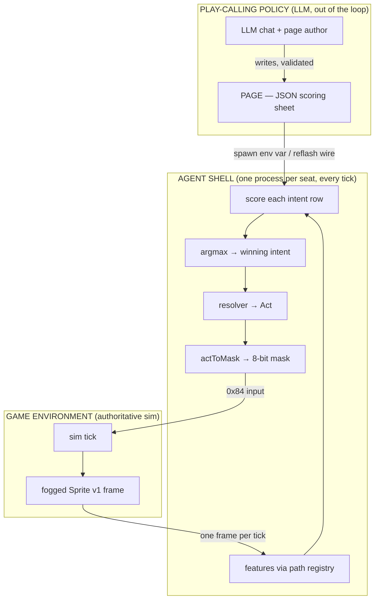
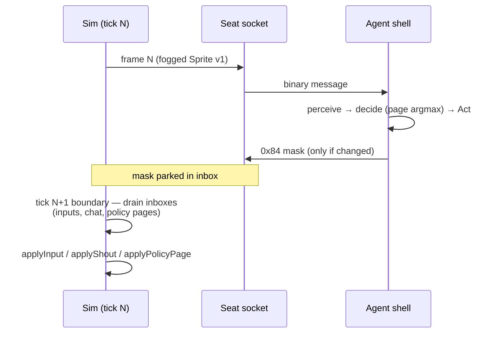
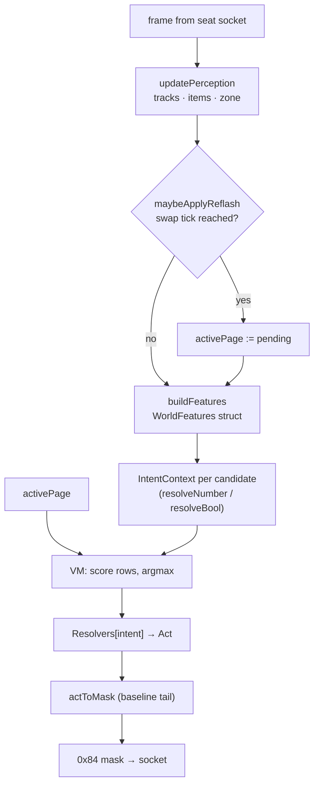
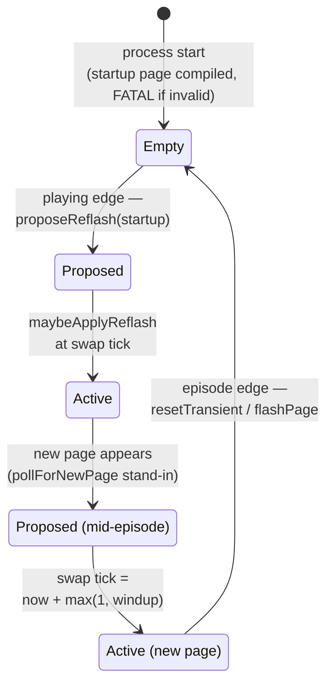
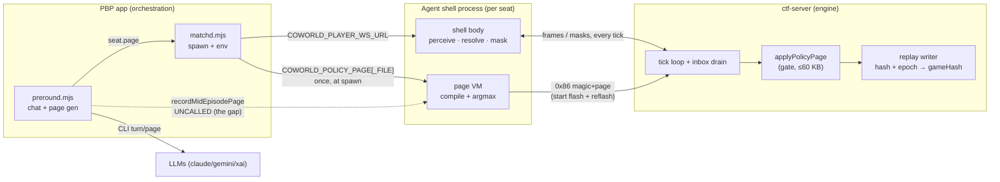
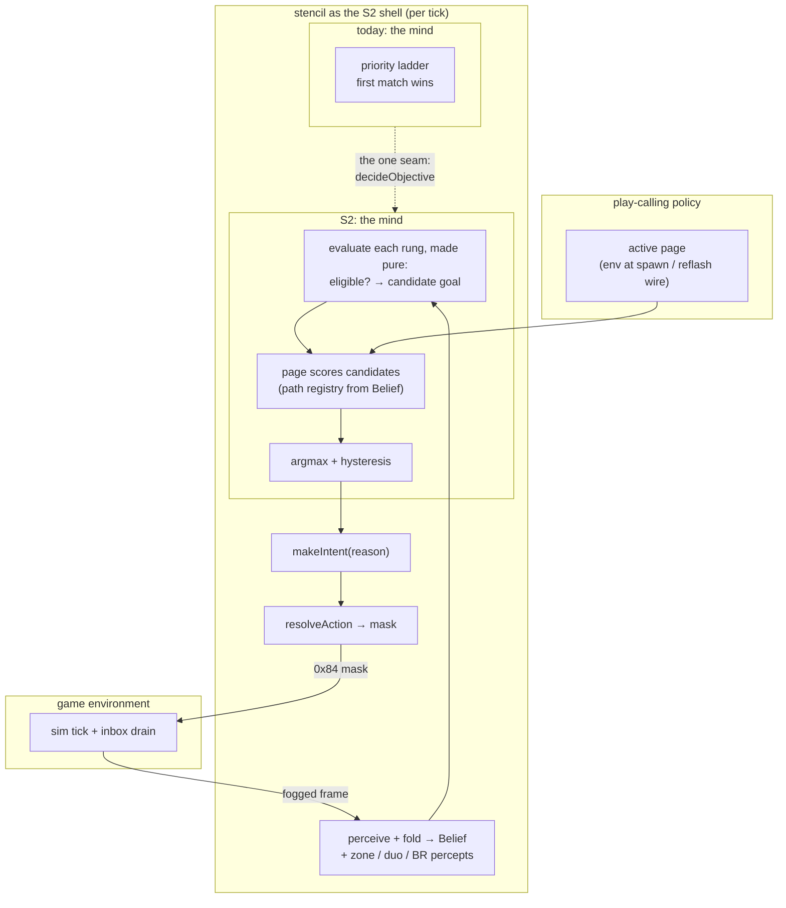

# The Play-Calling Paradigm: Maxwell's Season 2 Architecture and the Policy / Shell / Game Boundary

Research report · 2026-08-29 · for James and the coding agents planning the Season 2
policy shell. Covers the paradigms in Maxwell's Paintbot Season 2 work — onepage
scored-intent policies, the policy-page VM, the reflash wire, and pre-round chat/page
delivery — how they fit the game loop, and what it would take to adapt `stencil` into
the shell.

Repos: `coworld-ctf` (engine; paths are repo-relative), `coworld-paintbot-player`
(match orchestration; prefixed `PBP:`), and `paintbot_lab` (prefixed `LAB:`). Files on
unmerged branches are cited `origin/<branch>:path:line`. Companion recon with full
branch inventory: `docs/recon/paintbot-s2-policy-shell-2026-08-29.md`.

## Executive summary

Maxwell's Season 2 work establishes one paradigm, stated as a ruling and implemented
end to end on branches: **an LLM never plays the game — it authors a "page", a small
declarative scoring sheet that a deterministic in-game shell evaluates every tick.**
The architecture is three strict layers: *STRATEGY* (the page, LLM-authored JSON, no
code), *INTENT* (a fixed named menu the shell offers each tick; the page can only
score it), and *ACTION* (the shell resolves the winning intent into concrete targets
and the same 8-bit input mask any player sends). The page's entire view of the world
is a closed, validated path registry (~22 named scalar/boolean features); it cannot
name an enemy, a pickup, or a coordinate. Pages enter the system at two moments:
once at bot spawn via env var (produced by a bounded pre-round LLM chat phase in
`coworld-paintbot-player`), and mid-episode via a "reflash" — a magic-prefixed blob
on the existing wire that the engine gates, records into the replay with a content
hash, and folds into the determinism hash so a replayed match refuses to diverge
silently. Every piece of this exists and is tested on `maxwell/br-reflash-integration`
and `maxwell/lobby-chat`; the two deliberate gaps are the *delivery trigger* that
tells a running bot a new page is ready, and the reconciliation of two competing page
languages (a proven linear "rows" stub vs. a richer "rules" expression VM).

For the stencil adaptation, the boundary is favorable: the shell's obligations to the
outside world are narrow (speak the seat websocket, load a page from the env, propose
flashes on the wire, argmax the page over a candidate menu), and everything else —
perception, belief, navigation, combat — is shell-internal, which is exactly the part
stencil is strongest at. The mapping is structural: stencil's ladder rungs (its
priority ladder's sub-goal behaviors) play the candidate-menu role — though for BR
roughly half of today's 20 die with CTF's hearts and endzones, so the menu itself
is largely BR_LADDER's proposed new rung set (§7.1); its typed `Intent`
struct is a richer version of the `Act` produced by onepage (Maxwell's prototype
shell bot, §3); its
`decideObjective` is the single call-site seam where a page-scored argmax replaces
first-match-wins — though the rung bodies behind it need a purity refactor before
evaluate-all is safe (§7.3). The integration dive (§7) identifies the real work: BR
perception preconditions (stencil cannot currently field a BR map at all), making
rung evaluation side-effect-free so scoring all candidates is safe, adding selection
hysteresis, choosing the page language and path vocabulary stencil will expose, and
deciding where the shell's determinism boundary sits so the lab's replay-parity
instruments keep working.

## Table of contents

1. [The paradigm: strategy, intent, action](#1-the-paradigm-strategy-intent-action)
2. [The game environment and the seat interface](#2-the-game-environment-and-the-seat-interface)
3. [Inside the agent shell: onepage](#3-inside-the-agent-shell-onepage)
4. [The page: what the policy actually writes](#4-the-page-what-the-policy-actually-writes)
5. [The page lifecycle: pre-round chat, spawn delivery, reflash, replay](#5-the-page-lifecycle-pre-round-chat-spawn-delivery-reflash-replay)
6. [The boundary map, consolidated](#6-the-boundary-map-consolidated)
7. [Adapting stencil as the shell](#7-adapting-stencil-as-the-shell)
8. [Open questions and unreconciled decisions](#8-open-questions-and-unreconciled-decisions)
- [Appendix A: the path registry](#appendix-a-the-path-registry)
- [Appendix B: the reflash wire contract](#appendix-b-the-reflash-wire-contract)
- [Appendix C: pre-round chat and page records](#appendix-c-pre-round-chat-and-page-records)
- [Appendix D: sources](#appendix-d-sources)

---

## 1. The paradigm: strategy, intent, action

- One ruling, three strict layers: the LLM authors a **page** (STRATEGY); the page
  **scores** a fixed intent menu (INTENT); the shell **resolves** the winner into
  buttons (ACTION).
- The page is data, not code: no loops, no branching, no entity references — by
  construction, not by convention.
- The same shape appears three times in the codebase: onepage (BR, branches), the
  paintball KOTH mode (merged precedent), and BR_LADDER's "playbook page" sketch for
  stencil.

Maxwell's ruling is written down twice, in nearly identical words. The page-language
spec states it as the system's constitution
(`origin/maxwell/br-onepage-vm:tools/flash/SCHEMA.md:15-48`):

> STRATEGY — the page. One JSON scoring sheet, LLM-authored, no code.
> INTENT — a fixed, named menu the engine offers each tick. The page *scores* it.
> ACTION — the engine resolves the winning intent into a target + 8-bit button mask.
> The page never sees this. … A strategy that tries to name a specific enemy or a
> specific pickup is a malformed strategy — there is no path for it, so it cannot be
> expressed.

The agent shell's module header restates the same three sentences almost verbatim as
its own architecture, adding only the concrete ACTION shape: the winning intent
resolves to `(moveMask, desiredAim, wantFire)` — the same three values the classic
baseline bot's hand-written tactics tree computes — which a common tail turns into
the 8-bit input mask
(`origin/maxwell/br-reflash-integration:players/onepage/onepage.nim:1-9`).

The consequence worth internalizing before any design work: **the play-calling policy
and the in-game agent never share a data structure richer than the page and the path
registry.** The policy influences behavior only by reweighting a menu; the shell
guarantees the menu's semantics. This is what makes the LLM safely non-real-time
(pages arrive at episode edges and occasional mid-episode flashes), keeps replays
deterministic (the page is a recorded input; everything below it is pure), and keeps
prompt-injection-shaped failure bounded (a malformed page is rejected loudly at
validation, never partially obeyed — `policy_stub.nim:134-158`,
`policy_page.nim:320-344`).


Figure 1 — The three layers. The page crosses into the shell rarely (spawn +
reflash); frames and masks cross every tick; the policy never touches the sim
directly.

This is not the first time the codebase drew this line. The merged paintball
King-of-the-Hill mode (`docs/paintball/`) already runs an LLM against a closed
six-intent enum with a repair-never-reject parser and a deterministic mask compiler
(`src/ctf/directives.nim:22-31`, `src/ctf/control.nim:416`) — but there the LLM is
*in* the loop, called server-side every ~4.5 s turn
(`coworld_manifest_paintbot.json:1866-1911`). Season 2 moves the LLM *out* of the
loop: it authors a reusable policy artifact instead of issuing orders, and the shell
runs client-side at full tick rate. Section 6 tabulates the contrast; the shared DNA
(closed vocabulary, deterministic resolution beneath the LLM, recorded artifacts,
fail-loud-or-fallback) is deliberate and worth preserving.

## 2. The game environment and the seat interface

- To the engine, every player — human, baseline bot, onepage shell, future stencil
  shell — is the same thing: a websocket that receives one fogged frame per tick and
  sends an 8-bit mask.
- All policy-relevant inputs are drained at tick boundaries, which is the anchor of
  the engine's determinism story.
- The BR mode (unmerged) supplies the strategic environment the pages are written
  for: 16 duos, one life, a shrinking zone, placement-dominated scoring.

The seat interface is the outermost boundary and it is old, stable, and symmetric.
A seat connects to `ws://…/player?slot=N&token=T`
(`PBP:server/matchd.mjs:277`); the server streams one binary Sprite v1 frame per tick
per seat and accepts `0x84` input masks, `0x85` ready packets, `0x81` chat, and
`0x87` sprites-off (`src/ctf/server.nim:317-321`; wire spec `docs/PROTOCOL.md`). The
mask's semantics: d-pad bits move (locomotion only), B/Select rotate a continuous
256-brad aim, A fires, and bit 7 (C) charges/releases grenades
(`docs/RULES.md:786-795`, applied at `src/ctf/sim.nim:2352`). The observation is
fogged — a ±60° vision cone out to 1.5× gun range plus a small omnidirectional
bubble (`README.md:37-48`) — and bots read structured *label strings* out of the
frame: HP lines, item markers, and in BR the zone rectangles `zone x0,y0 x1,y1` and
`zonenext …`, re-stated every frame with exactly one phase of lookahead.

Two engine-side patterns matter for everything in this report:

**Tick-boundary draining.** The websocket threads never touch the sim. Inputs are
parked per-socket and drained at the next tick boundary; the reflash branch's page
inbox documents itself as behaving "exactly like chatMessages beside it"
(`origin/maxwell/br-reflash-integration:src/ctf/server.nim:86-93`). Anything that
influences the sim is therefore totally ordered by tick, which is what lets a replay
re-apply the same inputs at the same ticks and demand a bit-identical outcome.

**Config-gated mechanics.** Every new mechanic defaults off and a gate-off config
plays byte-identically to the old game (`AGENTS.md:136-147`). The reflash gate
`allowPolicyReflash` (§5.3) follows this house rule.

The in-match communication channel also lives at this boundary: `applyShout`
(`src/ctf/sim.nim:2236`) refuses outside the `Playing` phase (`:2241-2242`), carries
at most 10 characters once per second (`sim_types.nim:774,819-821`), and is audible
within `MapWidth div 5` ≈ 247 px through walls and fog (`sim_types.nim:1013`,
`sim.nim:2278-2289`). Shout text is hashed into `gameHash` character-by-character,
so mid-episode chat is a determinism-bearing simulation input — a fact the app-side
chat design explicitly defers to
(`origin/maxwell/lobby-chat:docs/preround-chat.md:78-114`).


Figure 2 — One tick at the seat boundary. Everything the shell sends is parked and
applied at the next tick boundary, which totally orders policy inputs for replay.

The strategic environment the pages are written against is Battle Royale (unmerged;
`origin/maxwell/br-integrate` and family): 32 seats as 16 engine-assigned duos, one
life, a rectangular zone that shrinks about a per-episode drawn center and deals no
damage until tick 3528 of 6000 (`origin/maxwell/br-integrate:tools/record_br_match.sh:115-123`),
and a top-heavy, engagement-gated placement bonus — `[5,4,4,3,3,2,2,2,1,1,1,0,0,0,0]`
for places 2..16, zero from 13th (`origin/maxwell/br-integrate:src/ctf/sim_types.nim:522-524`,
gate `sim.nim:2995-3000`), with a team's placement decided by whichever duo member
dies second (`sim.nim:2841-2867`). The path-registry documentation restates this
economy for page authors verbatim (`origin/maxwell/br-onepage-vm:src/ctf/policy_page.nim:148-156`),
because it is the reward function every page is implicitly optimizing.

## 3. Inside the agent shell: onepage

- The shell (`players/onepage/onepage.nim`, ~1,560 lines) is a fork of the baseline
  bot that replaces the hand-written tactics tree with: features → per-intent
  scoring contexts → page argmax → one resolver per intent → the baseline's own
  mask tail.
- Its per-tick pipeline is fixed and pure given (frame history, active page):
  perception, reflash-swap check, feature build, selection, resolution.
- Three internal tables — `Resolvers`, `IntentNames`, `TargetIdx` — are deliberately
  indexed by the same enum so vocabulary, targeting, and behavior cannot drift
  apart.

The onepage runner is the reference implementation of "agent shell" in this
paradigm, and its anatomy is the template stencil would re-implement with better
machinery. Its reuse ledger is explicit (`onepage.nim:11-28`): baseline's CTF
tactics tree (~lines 1547–3310 of `players/baseline/baseline.nim`) is *replaced*;
everything below it — wire decode, label vocabulary, steering primitives, nav-grid
cost field — is imported or copied verbatim with per-site citations.

The per-tick pipeline (`decide`, `onepage.nim:1401-1419`):

1. **Self-location**: lock onto own color, find self; if dead, return mask 0.
2. **Perception fold**: `updatePerception` maintains enemy/partner tracks (~5 s
   memory), item beliefs, and the zone rectangles.
3. **Reflash swap check**: `maybeApplyReflash()` — the only place the active page
   ever changes (§5.4).
4. **Feature build**: `buildFeatures` computes one `WorldFeatures` struct per tick
   (`onepage.nim:1095-1152`) — hp fraction, partner state, enemy distances, zone
   state, item distances.
5. **Selection**: `selectIntentFor` constructs one `IntentContext` — two closures,
   `resolveNumber(path)` and `resolveBool(path)` — per candidate intent and calls
   the VM's argmax (`onepage.nim:1192-1208`).
6. **Resolution**: `Resolvers[intent]` produces an `Act = (moveMask, desiredAim,
   wantFire, holdC)` (`onepage.nim:163-171`), and `actToMask` — a byte-for-byte
   port of baseline's tail (`baseline.nim:3296-3309`) — rotates toward the desired
   aim and edge-fires the trigger.


Figure 3 — The onepage shell's per-tick pipeline. The page touches exactly one box
(selection); everything upstream and downstream is fixed shell code.

Three design moves here are load-bearing for any reimplementation:

**One enum, three tables.** `Resolvers` (behavior), `IntentNames` (the ratified
ALL_CAPS page-facing vocabulary — "the ONLY place that vocabulary is written down",
`onepage.nim:975-992`), and `TargetIdx` (per-intent targeting) are all arrays
indexed by the `Intent` enum. `TargetIdx` exists so the page-visible annotations
`intent.target_hp` / `intent.target_dist` are computed "with the same targeting
call the resolver will actually use for THIS intent this tick — so it can never
disagree with what the engine resolves the winning intent onto"
(`onepage.nim:1023-1062`, `policy_page.nim:196-206`). Related intents deliberately
share a target function: Engage, Peel, and HoldRingSafe all use `targetThreat`
(nearest enemy) so all three "stay consistent about 'who is the threat' instead of
drifting apart" (`onepage.nim:1027-1031`).

**A structurally undriftable path registry.** `fullPathRegistry()`
(`onepage.nim:1073-1089`) is `DefaultPaths` plus a per-intent boolean family
*generated from* `IntentTagName` — the same table the resolvers are indexed by —
plus the two target annotations. The comment states the invariant: "'Declared but
unresolvable' cannot happen structurally: there is no second, hand-maintained path
list to drift from this one." The resolver side (`numberPath` / `boolPath` /
`intentTagBool`, `onepage.nim:1155-1190`) is a set of `case` statements over the
exact registered strings.

**Intent menu discipline.** The enum's doc-comment sets the granularity rule: "Each
has exactly one short resolver below …; if a resolver starts growing, the intent is
too vague and should split instead" (`onepage.nim:146-149`). The 12 ratified
intents: `ROTATE_TO_RING`, `HOLD_RING_SAFE`, `ENGAGE`, `FINISH`, `PEEL`, `HEAL`,
`LOOT`, `REGROUP_PARTNER`, `SUPPORT_PARTNER`, `AVOID_FIGHT`, `THIRD_PARTY`,
`USE_GRENADE`.

Around the per-tick core, the wire loop (`runBot`, `onepage.nim:1466-1520`) handles
the episode lifecycle: on the lobby/interstitial edge (`mapCameraReady` false) it
calls `resetTransient()` — dropping per-episode memory and re-arming the flash edge
(`onepage.nim:1382-1399`) — and on the rising `playing` edge it proposes the
startup page on the wire (§5.4). Startup itself is fail-fatal: an invalid page from
the env kills the process before it ever connects (`onepage.nim:1533-1546`).

## 4. The page: what the policy actually writes

- Two page languages exist. The linear "rows" form is what the live wire round-trip
  was proven with; the "rules" s-expression VM is richer, has the validation and
  authoring tooling, and is not yet wired to the runner.
- Both share the essentials: closed path vocabulary, hard validation with named
  errors, deterministic tie-breaks, and scoring-only semantics.
- The path registry (~22 features) is the policy's entire observation space —
  Appendix A lists it in full.

### 4.1 The "rows" form (policy_stub)

The runner on the reflash branch compiles pages with
`players/onepage/onepage/policy_stub.nim` — a self-described placeholder standing in
behind the interface the real VM's author specified (`policy_stub.nim:1-11`). The
schema is one JSON object (`policy_stub.nim:126-133`):

```json
{"rows": {"ROTATE_TO_RING": {"bias": 3.0, "weights": {"world.zone_dist": 2.0}},
          "ENGAGE":         {"bias": 2.0, "weights": {"self.hp_frac": 1.5,
                                                      "world.nearest_enemy_dist": -0.5}}}}
```

Selection is linear: per candidate row, `bias + Σ weight × resolve(path)`, booleans
as 0/1, **first-listed candidate wins ties** (`policy_stub.nim:160-181`). Rows the
page omits score `0.0` — so an empty page deterministically selects the first menu
entry, `ROTATE_TO_RING`. Validation is fail-loud: an unknown intent key or path name
raises a `ValueError` naming the exact bad key; nothing ever silently scores zero
for a typo (`policy_stub.nim:134-158`).

The swap plan is written into the stub (`policy_stub.nim:20-26`): when the real VM
lands, the module body becomes `import ctf/policy_page` re-exported under the same
four names (`PolicyPage`, `IntentContext`, `compilePage`, `selectIntent`) —
"onepage.nim's own call sites should not need to change at all."

### 4.2 The "rules" form (policy_page VM)

`origin/maxwell/br-onepage-vm:src/ctf/policy_page.nim` (620 lines, zero engine
imports) is the real VM, with the authoring loop in `tools/flash/`. The language is
a small JSON s-expression DSL (`tools/flash/SCHEMA.md:52-67`):

```json
{ "paintbot_policy": 1, "name": "ring hugger", "traits": {"nerve": 0.4},
  "rules": [ {"when": true,
              "score": ["+", ["*", 30, ["get", "intent.is_enemy"]],
                             ["*", -8, ["get", "intent.target_dist"]]]} ] }
```

Its guardrails are the interesting part:

- **Rules sum; they never branch.** Every rule's `when` is evaluated per intent per
  tick; matching rules' `score` expressions are summed. There is no first-match-wins
  and no implicit else (`SCHEMA.md:88-118`).
- **Closed op whitelist**: `get trait + - * / min max abs clamp < <= > >= == and or
  not` — no `!=`, and `"if"` anywhere is a hard parse-time rejection
  (`policy_page.nim:59-65`, `SCHEMA.md:239-245`). No loops, variables, or functions.
- **Unknown paths are rejected with a suggestion**: "rule 0: unknown get path
  'intent.is_shield' (nearest known path: 'intent.is_peel')"
  (`policy_page.nim:320-344`, `SCHEMA.md:270-283`).
- **Pages intern by canonical-AST hash**, so key order and whitespace share one
  compiled object — sixteen cogs on the same page compile once
  (`policy_page.nim:450-476`).
- **Ties fall to the lowest index** (`policy_page.nim:618`), matching the stub's
  first-listed rule.

The authoring loop closes the LLM-quality gap mechanically: `flash author "<brief>"
[--model claude|gemini|xai]` validates the model's output and retries with the
validation errors appended to the conversation until it passes — "an invalid page
never reaches disk" (`tools/flash/flash.nim:1-21`); `flash validate` is the CI
gate; six seed strategies live in `tools/flash/playbook/`.

⚠️ **The two languages are not reconciled.** The wire round-trip proof (§5.3) used
`rows` pages; the authoring loop, validation UX, and richer expressiveness live in
`rules`. `onepage.nim:28-36` names the swap as pending, and `SCHEMA.md`'s path
catalog is already stale relative to the landed `DefaultPaths` (recon §5.4).
Whichever branch the S2 shell builds on silently decides its page language unless
the choice is made deliberately.

### 4.3 The path registry: the policy's whole world

Both languages resolve `get`/weight paths through the same registry concept: a flat
list of `(path, kind)` pairs, `kind ∈ {pkNumber, pkBool}`
(`policy_page.nim:111-134`). The landed vocabulary is ~22 paths across four
namespaces — `self.*`, `partner.*`, `world.*`, `intent.*` — listed in full with
their semantics in Appendix A. Three properties matter architecturally:

1. **It is the entire interface.** The registry is "the injection point"
   (`policy_page.nim:107-108`): a shell exposes its perception by registering paths
   and supplying resolver closures; the page can express nothing else. The
   DefaultPaths header is explicit that the vocabulary is load-bearing — "James
   writes strategies against it" (`policy_page.nim:135-147`).
2. **Sentinels are a real authoring hazard.** Several distances use `-1` for "never
   observed"; a naive negative weight on `world.nearest_enemy_dist` silently
   inverts sign when nothing has been seen. The registry documents the guard idiom
   (`policy_page.nim:158-164`).
3. **Reward-relevant state is deliberately absent.** No `self.placement`, no
   `self.score` — never surfaced mid-episode (`policy_page.nim:148-156`).

## 5. The page lifecycle: pre-round chat, spawn delivery, reflash, replay

- A page reaches a bot exactly two ways: once at spawn (env var, produced by the
  app's pre-round phase) and mid-episode over the reflash wire.
- The pre-round phase is a bounded, fully-open LLM huddle that always produces a
  page per seat — every failure mode degrades to a recorded fallback.
- The reflash channel is engine-complete: gated, size-capped, replay-recorded with
  a content hash, and folded into `gameHash` so replays cannot silently diverge.
- The *trigger* connecting the two — a service telling a running bot "a new page is
  ready" — is explicitly unbuilt on both sides.

### 5.1 End-to-end sequence

```mermaid
sequenceDiagram
    participant UI as Lobby UI
    participant APP as PBP app (matchd + preround)
    participant CLI as lobby_chat CLI (LLMs)
    participant SIM as ctf-server (sim)
    participant BOT as onepage bot (seat N)
    UI->>APP: POST /start {chat: true}
    APP->>SIM: spawn (COGAME_CONFIG_URI)
    APP-->>UI: 200 (booting continues async)
    loop 2 rounds × each seat (≤30 s total)
        APP->>CLI: turn {model, system, history}
        CLI-->>APP: {ok, reply} → Message record
    end
    loop each seat
        APP->>CLI: page {…, maxAttempts: 3}
        CLI-->>APP: {ok, page} → Page record (never null)
    end
    APP->>BOT: spawn with COWORLD_POLICY_PAGE=<json>
    BOT->>SIM: ws connect /player?slot=N&token=T
    SIM-->>BOT: frames… (playing edge)
    BOT->>SIM: 0x86 magic+page (episode-start flash)
    SIM->>SIM: drain → applyPolicyPage → replay record
    Note over BOT: … mid-episode: new page appears …
    BOT->>SIM: 0x86 magic+page (reflash)
    SIM->>SIM: drain → applyPolicyPage → replay record<br/>hash+epoch → gameHash
```


Figure 4 — The page's journey: authored in the pre-round phase, delivered by env
var, flashed on-wire at episode start (so the replay records it), and re-flashed
mid-episode over the same path.

### 5.2 The pre-round phase (app side)

On `origin/maxwell/lobby-chat`, `POST /api/lobbies/:id/start` with body
`{"chat": true}` runs the phase; omitting the flag is byte-identical to pre-feature
behavior. The transcript and pages are readable at
`GET /api/lobbies/:id/preround-chat` — poll-only, deliberately no POST
(`origin/maxwell/lobby-chat:docs/preround-chat.md:162-174`).

The phase is strictly sequential and bounded (`preround.mjs:93-105,366-374`): 2
rounds (hard ceiling 3) over every non-human seat, whole phase ≤30 s
(`PAINTBOT_PREROUND_CHAT_BUDGET_MS`), each turn ≤12 s
(`PAINTBOT_PREROUND_CHAT_TURN_MS`, shrinking to the remaining budget; timeout
SIGKILLs the CLI child), replies capped at 500 chars. The channel is fully open —
every seat hears every seat, no team scoping (`preround.mjs:343-347`) — and the
system prompt tells seats that open collusion is rational because placement pays
nothing below ~12th (`preround.mjs:216-228`). Models round-robin
`claude`/`gemini`/`xai` by slot (`preround.mjs:111,328`). Each turn is a one-shot
subprocess call to the `lobby_chat` CLI (stdin request JSON, one stdout JSON line;
subcommands `turn`/`page`/`default-page`, `preround.mjs:171-211`).

After the chat, one `page` call per seat generates the seat's page — prompted with
the *engine's* `tools/flash/SCHEMA.md` + `prompt.md`, read live off an engine
checkout (`loadPagePromptTemplate`, `preround.mjs:230-248`) — and lands it with
`setSeat(lobby, a.pos, {page: JSON.stringify(pageRec.page)})` (`preround.mjs:412`).
**A page is never null**: every failure (no key, timeout, invalid after 3 attempts,
CLI error, phase disabled) degrades to a fallback page with a recorded
`source`/`reason` (`preround.mjs:389-450`; the taxonomy is in Appendix C). Worth
stating explicitly since BR is a duos mode: **pages are per-seat, not per-duo** —
one chat turn, one page call, and one spawn-env delivery per non-human seat
(`preround.mjs:308,377-413`), and the reflash record addresses a single cog
(Appendix B). Nothing in the shipped code shares a page across a duo.

Delivery is then an env-var at spawn: `pageEnv()` routes inline JSON to
`COWORLD_POLICY_PAGE` and a path to `COWORLD_POLICY_PAGE_FILE`
(`lobby-chat:server/matchd.mjs`), merged into the bot's spawn environment beside
`COWORLD_PLAYER_WS_URL`. Because pages must exist before bots spawn, `startMatch`
defers bot seating: it returns immediately and `finishBooting` awaits the chat,
re-reads the assignment (the pages landed on the lobby seats mid-phase), rewrites
`assignment.json`, and only then seats bots (`preround-chat.md:39-76`). The doc is
honest about the cost: a human joining during the phase sees an empty room, and
closing that gap "needs a live page-reflash channel that does not exist"
(`preround-chat.md:58-69`).

### 5.3 The reflash channel (engine side)

The engine half, complete on `origin/maxwell/br-reflash-integration`, is a page's
mid-episode path into the recorded, hashed simulation:

- **Carrier**: the existing `0x86` debug-sprite blob opcode — no wire version
  change. A reflash is self-identifying by magic prefix:
  `const PolicyPageMagic* = "CTFPOLICYPAGE1\n"` (`src/ctf/labels.nim:602`), whose
  leading `'C'` (0x43) sits outside the legitimate sprite opcodes 0x01..0x06, so
  "no legitimate overlay packet can begin with this magic"
  (`labels.nim:618-627`). One shared definition serves sender and receiver — it was
  once typed in both files with nothing checking (`onepage.nim:1257-1262`).
- **Receive**: `isPolicyPagePacket` / `policyPageFromPacket`
  (`global.nim:2001-2023`); pages park in a one-per-socket inbox
  (`server.nim:86-93,1516-1525`) and drain at the tick boundary
  (`server.nim:2327-2344`).
- **Acceptance**: `applyPolicyPage` (`sim_state.nim:347-385`) checks exactly three
  things — gate on (`allowPolicyReflash`, default off, `sim_config.nim:63`), index
  in range, `0 < len ≤ 60000` (`MaxPolicyPageBytes`, bounded by the replay
  record's uint16 length prefix, `sim_types.nim:823-831`) — and deliberately
  nothing else: "every extra clause here is another way for the live server and
  playback to reach different verdicts" (`sim_state.nim:355-370`). It writes
  bookkeeping only: `policyPage`, `policyPageHash`, `policyPageTick`,
  `policyPageEpoch`.
- **Record**: the replay reuses the chat record with the player byte's high bit
  set; the body is a 16-hex FNV-1a-64 content hash, a space, then the page verbatim
  (`replays.nim:272-305`). Decode re-verifies the hash; playback re-applies the
  page at the identical tick and treats refusal as fatal (`replays.nim:582-602`).
- **Determinism**: `gameHash` mixes both the page hash *and* a monotonically
  increasing epoch (`sim_state.nim:296-306`) — the epoch exists because re-flashing
  the *same* page ("exactly the case an LLM produces most, reasserting the current
  plan") would otherwise replay clean while hiding a dropped record
  (`sim_types.nim:1900-1908`).

The evidence discipline is a model to copy: `tests/test_policy_reflash.nim` (562
lines) includes two *negative* controls — dropping only the reflash records
diverges the replay; keeping them but shifting them one tick later also diverges —
and the live harness (`tools/roundtrip_reflash_match.sh`,
`tools/verify_reflash_roundtrip.nim`) ran a real 16-duo match with two mid-episode
swaps plus a GATE=off control: same seed, same proposals reaching the socket, zero
records (Appendix B).

### 5.4 The bot's side: propose, schedule, swap

The bot-side page state machine (`onepage.nim:1206-1352`) resolves the last
determinism hole — the *starting* page. An env-delivered page "never touches the
wire on its own, so a replay re-simulating the episode has no record of which
strategy a cog actually played" (`onepage.nim:1210-1214`). The fix is structural:
`activePage` changes in exactly one place (`maybeApplyReflash`), fed only by
`proposeReflash` — and the episode-start flash goes through that same call at the
`playing` rising edge, putting the starting page on the wire and into the replay.
Until the first flash lands (a few ticks), the active page is empty, every row
scores 0, and the bot deterministically plays `ROTATE_TO_RING`
(`onepage.nim:1281-1291`).

`proposeReflash` (`onepage.nim:1315-1339`) dedupes on the raw string, validates by
compiling *before* sending (an invalid candidate is "not sent, not applied"),
sends magic+bytes verbatim, and schedules the local swap.
The swap boundary is purely local: `T_effect = T_req + max(1,
fireWindupRemaining)` — never swap your own policy out from under your own pulled
trigger — using a local *estimate* of the fire windup
(`FireWindupTicksLocal = 5`, `onepage.nim:1261-1266`) that the engine never needs
to agree with, because server-side `applyPolicyPage` drives zero sim decisions;
"this process is the ONLY thing that ever turns 'a new page' into a different
button press" (`onepage.nim:1224-1240`).


Figure 5 — The active page's lifecycle inside the bot. Every transition into
"Active" goes through the same propose→schedule→swap path, so the replay's record
of "which strategy this cog played" is complete from tick ~1.

**The seam**: `pollForNewPage` (`onepage.nim:1341-1352`) — the mid-episode trigger
— is a stand-in that re-reads `COWORLD_POLICY_PAGE_FILE` when its content changes.
Its own comment: "The REAL trigger (the field service telling this process 'a new
page is ready') is a different lane's delivery mechanism." The matching app-side
stub, `recordMidEpisodePage` (`lobby-chat:server/preround.mjs:460-466`), stores a
mid-episode Page record with a real tick — and is verified uncalled anywhere in
repo history. These two functions are the two ends of the unbuilt bridge, and the
S2 backend's re-flash work is precisely what meets in the middle.

One caution when reading the app-side comment above `recordMidEpisodePage` (also
flagged in §8's stale-comments list): it says
a page swap "does not itself touch gameHash the way shout text does" — true of the
page *text* (shout text is hashed character-by-character; page text is not), but
the page's *hash and epoch* do enter `gameHash` behind the engine gate. The two
statements are consistent, but only when read carefully. In short: shout text is
hashed character-by-character; page text is not; page hash + epoch are.

## 6. The boundary map, consolidated

- Three actors, four contracts: seat wire (every tick), page language + path
  registry (per flash), reflash wire + gate (rare), spawn env (once).
- The shell owns everything between the frame and the mask; the policy owns only
  the page; the engine owns admission, recording, and determinism.
- The paradigm inverts paintball's merged design on one axis only: the LLM moves
  from inside the turn loop to outside the episode loop.


Figure 6 — The consolidated boundary map. Solid arrows exist and are tested; the
dotted arrow is the unbuilt mid-episode delivery trigger.

The interface inventory, with owners and contracts:

| Interface | Direction | Cadence | Contract & anchor |
|---|---|---|---|
| Seat websocket | engine ↔ shell | every tick | Sprite v1 frames in; `0x84` masks out (`docs/PROTOCOL.md`; `server.nim:317-321`) |
| Spawn env | app → shell | once per process | `COWORLD_PLAYER_WS_URL`; `COWORLD_POLICY_PAGE` / `_FILE` (`matchd.mjs:277`; `onepage.nim:1268-1278`) |
| Page language | policy → shell | per flash | rows (`policy_stub.nim:126-133`) or rules (`SCHEMA.md:52-67`); validated, fail-loud |
| Path registry | shell → policy | per vocabulary change | ~22 `(path, kind)` pairs; the page's whole observation space (`policy_page.nim:135-208`) |
| Intent menu | shell → policy | per vocabulary change | 12 ratified ALL_CAPS names (`onepage.nim:975-992`) |
| Reflash wire | shell → engine | rare | `0x86` + `"CTFPOLICYPAGE1\n"` + raw page (`labels.nim:602-636`) |
| Reflash gate/record | engine internal | per flash | gate + ≤60 KB + hash/epoch in replay & gameHash (`sim_state.nim:347-385`; `replays.nim:272-326`) |
| Pre-round chat API | app ↔ UI/LLMs | per match | `/start {chat:true}`; `GET …/preround-chat`; Message/Page records (`preround-chat.md:124-190`) |
| In-match comms | shell ↔ shells | ≤1/s | 10-char shouts, 247 px radius, Playing-only, hashed (`sim.nim:2236-2289`) |

And the paradigm contrast with the merged precedent:

| | Paintball KOTH (merged) | Season 2 onepage (branches) |
|---|---|---|
| LLM sits | inside the game server, in the turn loop | outside the match, at episode edges |
| LLM output | a directive: per-cog intents + targets, every ~4.5 s (`directives.nim:22-31`) | a page: a scoring sheet over a menu, per flash |
| Bad output | repaired, never rejected (`directives.nim:205-230`) | rejected loudly, never repaired (`policy_stub.nim:134-158`) |
| Real-time obligation | hard turn budget, degrade-never-hang (`decide.nim:11-19`) | none — shell runs full tick rate regardless |
| Determinism artifact | compiled masks recorded (`server.nim:2016-2021`) | page recorded + hashed + epoch'd (`replays.nim:293-305`) |
| Secrets | game container holds the key (`paintball_player.nim:3-8`) | app/CLI holds keys (`flash.nim:64-68`; `preround.mjs`) |

The repair-vs-reject inversion is principled, not accidental: paintball must field
*something* every turn under a clock, so it repairs; a page is authored offline
with retries available, so rejection with a named error (and the authoring loop
feeding errors back to the model) produces better pages than silent repair would.

## 7. Adapting stencil as the shell

- The boundary contract a stencil shell must satisfy is small: four interfaces
  (spawn env, page language + registry, reflash wire, seat wire) — everything else
  is internal.
- The mapping is natural: rungs → candidate menu; `makeIntent` reasons → ratified
  vocabulary; `decideObjective` → the one call-site seam where argmax replaces
  first-match-wins; stencil's `Intent`/body stay intact below the seam.
- The real work splits into five clusters: BR perception preconditions,
  side-effect-free candidate evaluation, the scoring/selection mechanics, page
  plumbing (load/validate/flash/swap), and the determinism/validation story.

This section is a requirements dive, not a design: what the existing code says the
adaptation must handle, with anchors. (Per the lab's own conventions, strategy
changes are consulted before implemented — `personal_paintbot/AGENTS.md:60-63`.)

### 7.1 What stencil already is, in this report's terms

Stencil (`LAB:paintbot/stencil_nim/`, 21 modules, ~7,400 lines of Nim as counted
2026-08-29) is already a
shell in everything but the selection rule. Its process loop speaks the same seat
websocket (`stencil.nim:38-99`, entry `:95-99` reads `COWORLD_PLAYER_WS_URL`); its
per-tick pipeline is perceive → fold → orient → decide → act
(`policy.nim:22-111`); its "decide" is a single exported function
`decideObjective(belief): Objective` called from exactly one place
(`strategy.nim:502-515`, `policy.nim:101`); and its mind→body contract is a typed
ten-field `Intent` — nine behavioral fields plus the telemetry-only `reason`
string (`types.nim:189-219`) — consumed by a fixed-order body
(`resolveAction`, `action.nim:402-551`) with a corridor-bounded follower and a
pure weighted-A* planner. Where onepage resolves a menu intent into a coarse
`Act`, stencil resolves a rung into a *validated* navigation goal plus micro
permissions, cost profile, and aim policy — a strictly richer ACTION layer.

**A terminology collision to defuse before it misdirects a design:** the paradigm's
capitalized *INTENT* layer (the fixed, page-scored menu) and stencil's `Intent`
struct are different things that happen to share a name. In paradigm terms,
stencil's `Intent` struct is an *ACTION*-layer artifact — the resolved order the
body executes, the counterpart of onepage's `Act`. The *INTENT*-layer role — the
named candidate menu the page scores — is played by stencil's rung *reasons*
(`carry_home`, `clear_spray`, …), which today live as the `reason` strings fed to
`makeIntent`. Throughout this report, capitalized INTENT means the menu layer;
backticked `Intent` means stencil's struct.

The current selection rule is the difference: a 20-rung first-match-wins priority
ladder (`strategy.nim:329-500`; enumerated in the companion recon §7.2) plus an
arc-pursuit override. The Season 2 shell replaces exactly this rule with a
page-scored argmax over the rungs — which is what BR_LADDER §6.5 already sketches,
noting that argmax over `baseWeight + Σ modifiers` "reduces exactly to
first-match-wins at default weights," i.e. the ladder is recoverable as a special
case and can serve as the parity baseline.

One continuity caution before the mapping is taken literally: **the selection
*rule* transfers to BR; the rung *identities* largely do not.** BR_LADDER §2's
kill list finds roughly half of the current 20 rungs dead on a BR map —
`carry_home`, `intercept_thief[_heard]`, `escort_carrier[_heard]`,
`early_defense`, `steal`, the squad-order payloads, the defender posts
(`to_post`/`hold_post`, `to_hold`/`hold_line`), and `hunt_fallback`'s terminal
fallback — because their triggers or goal producers address hearts, pedestals,
and endzones that do not exist there. The BR candidate menu is therefore mostly
the *new* 13-rung set of BR_LADDER §4, reusing the six goal-source combinators
rather than today's rung names. The kill list's own headline hazard is worth
carrying forward: the squad-order rung's trigger stays *alive* in BR while its
payload is dead, producing "a meaningless reachable goal" that validates through
`nearestReachable` and walks the agent somewhere pointless "with conviction" —
the silent failure class the kill list exists to catch. For CTF-variant play,
by contrast, today's 20 rungs are the menu as-is.


Figure 7 — The adaptation, anchored to the three-way boundary of Figures 1 and 6:
the game's frames and masks and the policy's page cross the shell boundary exactly
as before; the only change is inside the mind, where the ladder's first-match-wins
rule is replaced by evaluate-all → page-score → argmax, between Belief and
`makeIntent`. Everything else in the shell survives — but "one seam" means one
*call site*: evaluate-all requires first refactoring the rung bodies to be
side-effect-free (§7.3), so the blast radius inside `strategy.nim` is every rung,
not one function.

### 7.2 Cluster 1 — BR perception preconditions (blocking; independent of the paradigm)

Stencil cannot currently field a BR map at all
(`origin/maxwell/br-ladder-design:docs/designs/BR_LADDER.md` §7):

- The `Team` enum is 4-wide; BR needs 16.
- `WorldMap` construction is gated on perceiving endzones; a BR map emits none, so
  the bot holds on `no_worldmap` for the entire episode (`policy.nim:39-50`,
  ladder rung 0 at `strategy.nim:331-332`).
- `seatsPerTeam` resolves to 4 for a duo (`LAB:policy.nim:34-37`) — but do not
  "fix" it in isolation: BR_LADDER §5(a) traces how the wrong 4 accidentally
  routes `squadTable` into the branch that yields exactly the duo pairing
  (seats {0,1}, quorum 2), while correcting it to 2 also feeds `defenderCount`
  (`LAB:roles.nim:6-7`) and `enemyLivesLeft`'s `seatsPerTeam × LivesPerPlayer`
  total (`LAB:squads.nim:133`).
- The zone markers (`zone`/`zonenext`) are not perceived at all.
- A healthy BR cog's lives label reads `x0`.
- The squad-consensus layer hard-breaks for the solo survivor state BR guarantees
  for 15 of 16 teams (BR_LADDER §5 recommends `SquadCommand = 0` for a BR MVP,
  replaced by partner-local rungs).
- **The WorldMap build may not fit the tick budget on a BR map.** The BR field is
  ~6.9× the CTF area (3211×1713 vs 1235×659), and stencil builds *all* map
  knowledge online "in the single tick the init snapshot completes" —
  clearance field, 8 px grid, components, watershed, cover sectors, Dijkstra
  fields, post atlas — over 5.5 M pixels instead of 814 k. BR_LADDER marks this
  OPEN and unmeasured: "it is the kind of thing that shows up as a mysterious
  first-frame stall rather than an error, and it is worth timing before anything
  else is diagnosed" (BR_LADDER §7, item 6; `policy.nim:39-50`,
  `worldmap.nim:173-209`). The same item notes `nearestReachable`'s default
  256 px radius is proportionally much tighter on this map, changing how often
  goal producers fall through.

These are prerequisites for *any* stencil-on-BR work, paged or not. The onepage
bot's zone/partner percepts (`onepage.nim:1095-1152`) are the working reference
for what must be read from the frame.

### 7.3 Cluster 2 — side-effect-free candidate evaluation (the ladder-to-argmax hazard)

An argmax must *evaluate* every candidate before choosing one. Today, rung
evaluation is not a pure query:

- The pre-ladder block runs latch updates and `updateConsensus()` every tick
  before any rung (`strategy.nim:330-347`).
- Several rungs mutate Belief as they fire: the `converting` latch
  (`strategy.nim:434-438` — an in-game wipe-hunt mechanic, unrelated to this
  section's ladder-to-argmax conversion), the six `squadOrderPost*` fields the *body* later
  reads for stance/aim (`strategy.nim:448-455`; body/mind report leak #4 — "a
  real dataflow: mind → belief → body, invisible to the Intent"), and roughly
  eight counters.
- The lab just re-learned this hazard class the hard way: a value that mutated an
  oscillator *by being read*, where eager evaluation of a formerly-lazy expression
  silently changed behavior (`LAB:TENTATIVE_LESSONS.md:20-26`).

The adaptation therefore requires splitting each rung into (eligibility + goal
production) — pure, safe to run for all candidates every tick — and (commitment
effects) — run only for the winner. BR_LADDER §6's combinator analysis says the
goal-production side is tractable: six goal-source combinators cover all 14
existing producers, with two small refactors named (the ring scorer takes its
weight vector as a parameter, `strategy.nim:248-249`; the threat-track filter
takes a predicate, `strategy.nim:168-170`).

Purity is necessary but not sufficient: **evaluate-all is also a per-tick cost
question the ladder never had.** First-match-wins stops at the first eligible
rung; an argmax runs every candidate's eligibility *and goal production* every
tick — and several producers reach into reachability validation or scored
searches (`reachableGoal`/`nearestReachable`, the 16-direction flee scorer, post
ranking). With 13–20 candidates per seat, up to 32 seats on a 6.9×-area map
(§7.2's build-cost item), the compute budget for candidate evaluation is an open
capacity question no source has measured; it belongs on the same
time-it-before-diagnosing list as the WorldMap build. Mitigations (caching,
lazy goal production for clearly-losing rows, evaluating goals only for the top-k
scores) are design territory, deliberately out of scope here.

Two adjacent facts from the same audit round out the hazard list: dead ticks
bypass strategy entirely (`policy.nim:103` hand-builds a `not_alive` Hold, and
`resolveAction` still runs — any new Intent field must be stamped there too,
`LAB:TENTATIVE_LESSONS.md:28-32`), and outbound chat is a second, separate
decision ladder attached after action resolution (leak #3) that a page-driven
design has to either leave alone or bring into the scored menu deliberately.

### 7.4 Cluster 3 — scoring and selection mechanics

- **Candidate vocabulary.** Stencil's rung reasons (`carry_home`, `clear_spray`,
  `escort_carrier`, …) are the natural candidate names; `makeIntent`'s
  case-per-reason table (`strategy.nim:40-99`) is already the centralized
  behavior→Intent-shape mapping, playing the role onepage's `Resolvers` table
  plays. The BR menu would draw from BR_LADDER §4's proposed 13 rungs
  (`zone_escape`, `zone_rotate`, `zone_forecast`, `partner_support`,
  `partner_regroup`, `third_party`, …), which overlap but do not coincide with
  onepage's 12 — nor, per §7.1's kill-list caution, with today's 20 — whether the S2 league ratifies *one* shared vocabulary or
  per-shell vocabularies is an open decision (§8).
- **Path registry.** Stencil's Belief is far richer than onepage's featureset;
  the shell must choose which of it to expose as paths. The discipline to copy is
  onepage's: registry entries generated from the same tables the resolvers use
  (`onepage.nim:1073-1089`), sentinel conventions documented per path
  (`policy_page.nim:158-164`), no aspirational entries.
- **Hysteresis.** The ladder never flickered because priorities are total; a
  scored selector will oscillate near ties unless it carries dwell/margin state.
  The in-house precedent is target selection's `FirefightTargetMinDwellTicks` +
  switch margin (`LAB:fight.nim:278-280`); the six existing weighted-sum sites
  (recon §7.5) share the pattern to imitate: deterministic tie-breaks, validate
  the winner, explicit fallback, score components written to Belief for trace.
- **Ladder parity as baseline.** Because default weights reduce argmax to the
  ladder (BR_LADDER §6.5), the first milestone has a built-in falsifier: a
  "ladder page" should reproduce current behavior decision-for-decision on the
  lab's recorded-wire corpus (`LAB:tools/compare_stencil.py` — v69's bar was
  278,016/278,016 exact decisions).

### 7.5 Cluster 4 — page plumbing

The shell must implement the four boundary behaviors §3–§5 documented, none of
which exist in stencil today:

1. **Load + validate at startup**: `COWORLD_POLICY_PAGE` / `_FILE`, fail-fatal on
   invalid (`onepage.nim:1268-1278,1533-1546`). Stencil's config discipline
   already matches (152 `STENCIL_*` knobs, min/max-validated, raising at process
   start — `LAB:config.nim:7-51`).
2. **A VM**: either import/port `policy_page.nim` (zero engine imports, so it
   compiles anywhere — but note stencil pins the *game's* dependency graph at
   build time, `LAB:Dockerfile:33-36`, so vendoring the module is
   straightforward) or speak the `rows` stub form. This is the page-language
   decision (§8).
3. **Propose/schedule/swap**: the episode-start on-wire flash at the playing edge,
   `proposeReflash`-style dedupe + validate-before-send, and a local swap boundary.
   Stencil's analogue of "don't swap mid-windup" needs defining against its own
   body state (it has real windup/fire-freeze machinery in
   `action.nim:417-432`).
4. **The mid-episode trigger**: whatever the S2 delivery lane builds
   (§5.4's gap). The shell's obligation is only to expose a hook the trigger can
   call — onepage's is the `pendingProposal` field checked each frame
   (`onepage.nim:1445-1462`).

### 7.6 Cluster 5 — determinism and validation

The lab's acceptance instrument is exact replay parity on recorded wire
(`compare_stencil.py`), and the engine's reflash design makes pages *recorded
inputs* — so the composition works: the shell must be deterministic *given* (frame
stream, page stream), and the page stream is captured both by the lab's wire
recorder (pages arrive via env/file + are visible as proposals in stdout) and by
the hosted replay (reflash records). The design decisions this imposes:

- The page-scored argmax must be bit-deterministic: fixed iteration order over
  candidates (onepage: first-listed wins ties, `policy_stub.nim:160-181`; VM:
  lowest index, `policy_page.nim:618`), no wall-clock, no unordered-table
  iteration (the VM sorts `allPaths` for exactly this reason,
  `policy_page.nim:130-134`).
- Replay comparisons must reproduce capture-time page inputs the same way they
  must reproduce capture-time `STENCIL_*` env (`LAB:TENTATIVE_LESSONS.md:33-39`)
  — the comparator likely needs to learn the page file/env as part of a capture's
  identity.
- If stencil adopts the on-wire start-flash pattern, its wire recorder
  (`STENCIL_WIRE_RECORD`, `stencil.nim:10-28`) captures proposals for free, since
  they are outbound frames.

### 7.7 What deliberately does *not* need to change

Worth stating to bound the work: the seat transport and process loop
(`stencil.nim`), perception/belief folding, the WorldMap pipeline (post-BR
percepts), the planner/follower/corridor law, the combat layer, the typed
`Intent` and `makeIntent`, and the body's `resolveAction` order all sit strictly
below the seam and are untouched by the paradigm. (`strategy.nim` as a *module*
is not untouched — §7.3's two goal-production parameterizations live there — but
`makeIntent`'s reason→`Intent` table and everything below it are.) The paradigm's own guarantee —
ACTION is invisible to the page — is what makes stencil's superior body a pure
advantage rather than an integration burden.

## 8. Open questions and unreconciled decisions

- **Page language**: `rows` (wire-proven, minimal) vs `rules` (authoring loop,
  validation UX, expressiveness). The swap is designed (`policy_stub.nim:20-26`)
  but undone; SCHEMA.md's path catalog is stale vs the landed registry. Building
  on either branch decides this implicitly.
- **Vocabulary governance**: one league-ratified intent menu + path registry
  shared by all shells, or per-shell vocabularies? Onepage's fine per-intent path
  family is itself "PENDING MAXWELL'S RULING" (`onepage.nim:1080-1085`). Stencil's
  richer Belief will pressure the registry to grow; who ratifies?
- **The mid-episode delivery lane**: both ends are stubs by design
  (`pollForNewPage`; `recordMidEpisodePage`). For *hosted* play, nothing specifies
  how an external page service reaches a running bot at all — the merged paintball
  precedent argues for LLM-inside-the-game-container (platform secrets,
  no-network-in-loop reproducibility, `src/paintball_player.nim:3-8`), while the
  S2 app model is orchestrator-side. This is the largest unresolved architecture
  fork.
- **Pre-round ↔ reflash convergence**: the chat contract anticipates
  `mid_episode` records but no code emits them; mid-episode *chat* is ruled to
  ride the in-game shout channel (10 chars, 247 px, hashed), a very different
  medium from the open pre-round huddle. How much "re-strategizing" is page
  reflash vs. shout-level coordination is undesigned.
- **Stale comments to not be misled by**: onepage's header still says the server
  receive arm "does not exist yet" (true on the runner lane, false on the
  integration branch, `onepage.nim:40-44`); the app-side note that a page swap
  "does not touch gameHash" refers to page *text*, not the hash/epoch that do
  enter it (detailed reading in §5.4's closing caution).
- **Unmerged substrate**: all of BR + reflash + onepage is branch-only
  (`br-integrate` is 253 commits ahead of main; app branches have conflicting
  bases). Any S2 timeline inherits the BR merge question.

---

## Appendix A: the path registry

The landed, resolver-backed vocabulary
(`origin/maxwell/br-onepage-vm:src/ctf/policy_page.nim:135-208`, cross-checked
against the resolver arms at
`origin/maxwell/br-reflash-integration:players/onepage/onepage.nim:1155-1190`).
`[S]` = sentinel: `-1` means "never observed", not "close" — guard with a
comparison before weighting arithmetically. `†` = registry drift: these three
paths are in the *integration branch's* stub registry and resolver arms
(`policy_stub.nim:73,77,94`; `onepage.nim:1164,1177,1187`) but **absent from the
VM branch's `DefaultPaths`** — one more artifact of the unreconciled lanes
(§4.2's warning).

| Path | Kind | Meaning |
|---|---|---|
| `self.hp_frac` | number | own HP / MaxHp, read from the `lives <hp>hp x<lives>` HUD text |
| `partner.alive` | bool | the duo partner has a live track this life |
| `partner.dist` | number | px to partner's last known position `[S]` |
| `partner.in_combat` | bool | any tracked enemy within 200 px of partner's last known position |
| `world.enemy_count` | number | currently-remembered enemy tracks (~5 s memory) |
| `world.nearest_enemy_dist` | number | px to nearest remembered enemy `[S]` |
| `world.weakest_enemy_hp` | number | lowest HP among enemies ever HP-read `[S]` |
| `world.in_zone` | bool | inside the current BR zone rectangle |
| `world.zone_dist` | number | px to nearest zone edge; 0 if inside or no marker yet |
| `world.medkit_dist` | number | px to nearest medkit believed stocked `[S]` |
| `world.item_dist` | number | px to nearest non-medkit pickup (one bucket) `[S]` |
| `world.third_party_dist` | number | px to the nearest fight-between-others target `[S]` † |
| `world.carrying_nade` | bool | currently holding a grenade † |
| `intent.is_enemy` | bool | row is Engage / Finish / SupportPartner / ThirdParty |
| `intent.is_peel` | bool | row is Peel / AvoidFight (⚠️ unrelated to the Glory deed PEEL) |
| `intent.is_recover` | bool | row is Heal |
| `intent.is_item` | bool | row is Loot |
| `intent.is_partner` | bool | row is RegroupPartner / SupportPartner |
| `intent.is_zone` | bool | row is RotateToRing / HoldRingSafe / AvoidFight |
| `intent.is_grenade` | bool | row is UseGrenade † |
| `intent.target_hp` | number | HP of *this row's* target, via the resolver's own targeting call `[S]` |
| `intent.target_dist` | number | distance to this row's target `[S]` |

The integration branch's registry additionally generates the fine
`intent.is_<name>` boolean per menu entry (12 paths) from the same table the
resolvers index (`onepage.nim:1073-1089`) — additive, pending ruling. Deliberately
absent: `self.placement`, `self.score` (never surfaced mid-episode,
`policy_page.nim:148-156`).

Coarse-tag membership (`onepage.nim:1155-1167`): `is_enemy` = {Engage, Finish,
SupportPartner, ThirdParty}; `is_peel` = {Peel, AvoidFight}; `is_recover` =
{Heal}; `is_item` = {Loot}; `is_partner` = {RegroupPartner, SupportPartner};
`is_zone` = {RotateToRing, HoldRingSafe, AvoidFight}; `is_grenade` = {UseGrenade}.

## Appendix B: the reflash wire contract

Byte layout of a reflash proposal (bot → server), on the `0x86` debug-sprite blob
opcode:

```
"CTFPOLICYPAGE1\n" + <raw page JSON bytes, verbatim>
```

- Magic: `src/ctf/labels.nim:602` (branch `br-reflash-integration`); leading
  `'C'` = 0x43 ∉ {0x01..0x06} (the sprite packet opcodes), so overlay packets
  cannot collide (`labels.nim:618-627`).
- Discrimination: a packet must be *strictly longer* than the magic — a bare
  magic stays on the overlay path (`global.nim:2001-2023`;
  `tests/test_policy_reflash.nim:470-561`).
- Acceptance (`sim_state.nim:347-385`): `allowPolicyReflash` on ∧ valid player
  index ∧ `0 < len ≤ 60000`. No phase, alive, or cooldown checks — minimalism is
  the determinism strategy (`sim_state.nim:355-370`).
- Replay record (`replays.nim:272-305`): chat record, `player = 0x80 | cogIndex`
  (6-bit cog field), body = `toHex(FNV1a64(page), 16) & ' ' & page`. Decode
  verifies the hash (`:307-326`); playback refusal is fatal (`:582-602`).
- gameHash: mixes `policyPageHash` and `policyPageEpoch` when gated on
  (`sim_state.nim:296-306`; epoch rationale `sim_types.nim:1900-1908`).
- Evidence: 4 test suites incl. drop-records and shift-one-tick negative controls
  (`tests/test_policy_reflash.nim:326-405`); live 16-duo round-trip with two
  mid-episode swaps + GATE=off control producing zero records
  (`tools/roundtrip_reflash_match.sh:46-48`, `tools/verify_reflash_roundtrip.nim:15-18`);
  committed replay artifacts in `rt/` on the branch.

## Appendix C: pre-round chat and page records

Message record (`origin/maxwell/lobby-chat:server/preround.mjs:330-339`;
`docs/preround-chat.md:124-136`):

```jsonc
{ "id": "215c6efd1633", "matchId": "e22625",
  "tick": null, "phase": "pre_round",
  "from": { "pos": 1, "slot": 1, "name": "Amber Scout", "team": "blue" },
  "role": "assistant",        // "system" = seat stayed silent this turn
  "text": "…",                // ≤500 chars
  "model": "gemini", "ts": 1788032532751 }
```

Page record (`preround.mjs:389-403`; `preround-chat.md:143-153`):

```jsonc
{ "pos": 1, "slot": 1, "tick": null, "model": "gemini",
  "page": { "paintbot_policy": 1, "…": "…" },   // NEVER null
  "source": "fallback_no_key",                   // see taxonomy below
  "reason": "GEMINI_KEY is not set",             // null when source = "llm"
  "ts": 1788032532866 }
```

Failure-source taxonomy (`preround.mjs:421-427`): `llm` (validated page);
`fallback_no_key`; `fallback_timeout`; `fallback_invalid` (no valid page after 3
attempts); `fallback_error`; `fallback_unavailable` (whole phase couldn't run).
Every fallback still yields a page via `default-page` or an in-process constant
(`preround.mjs:433-450`).

Bounds (`preround.mjs:93-105`): 2 rounds (ceiling 3); phase budget 30 s; per-call
12 s shrinking to remaining budget; 500-char replies; page ≤3 attempts. Field
notes: `matchId` (not `lobbyId`) is the key; `phase` is only ever `"pre_round"`;
`recordMidEpisodePage` (`preround.mjs:460-466`) is defined and uncalled.
Persistence: `.run/<lobbyId>/{config,assignment,preround_chat}.json` + logs.

## Appendix D: sources

### coworld-ctf, branch `origin/maxwell/br-reflash-integration`
- `players/onepage/onepage.nim` — the agent shell (read in depth this session)
- `players/onepage/onepage/policy_stub.nim` — the rows VM stub
- `src/ctf/labels.nim:600-640` — PolicyPageMagic contract
- `src/ctf/global.nim:2001-2053` — receive arm
- `src/ctf/server.nim:86-93,1516-1525,2327-2344` — inbox + drain
- `src/ctf/sim_state.nim:296-306,347-385` — acceptance + gameHash
- `src/ctf/sim_types.nim:823-831,1693,1900-1908` — caps, gate, epoch
- `src/ctf/replays.nim:272-357,582-602` — record + playback
- `tests/test_policy_reflash.nim`, `tools/roundtrip_reflash_match.sh`,
  `tools/verify_reflash_roundtrip.nim`, `rt/` — evidence

### coworld-ctf, branch `origin/maxwell/br-onepage-vm`
- `src/ctf/policy_page.nim` — the rules VM + DefaultPaths
- `tools/flash/SCHEMA.md`, `tools/flash/flash.nim`, `tools/flash/prompt.md`,
  `tools/flash/playbook/` — page language + authoring loop

### coworld-ctf, other branches
- `origin/maxwell/br-ladder-design:docs/designs/BR_LADDER.md` — stencil-BR ladder
  design; §2 kill list, §4 rungs, §5 squads verdict, §6 authorability,
  §7 preconditions (incl. the WorldMap build-cost OPEN item)
- `origin/maxwell/br-integrate:src/ctf/sim_types.nim:509,522-524`,
  `sim.nim:2841-2867,2995-3000`, `tools/record_br_match.sh:115-123` — BR rules
- `origin/maxwell/ladder-scout-tooling:docs/designs/BR_MAPGEN.md` — BR mode spec

### coworld-ctf, main
- `src/ctf/server.nim`, `src/ctf/sim.nim:2236-2289,2352-2386`,
  `src/ctf/sim_types.nim`, `src/ctf/mux.nim` — seat interface, shouts, transport
- `src/ctf/{decide,directives,control,llm}.nim`, `src/paintball_player.nim`,
  `docs/paintball/*`, `coworld_manifest_paintbot.json:1866-1911` — the paintball
  precedent
- `docs/PROTOCOL.md`, `docs/RULES.md`, `README.md`, `AGENTS.md` — wire + rules
- `players/baseline/baseline.nim` — the forked classic shell

### coworld-paintbot-player
- `server/matchd.mjs`, `server/lobby.mjs`, `server/app.mjs` (main) — spawn, seats
- `origin/maxwell/lobby-chat:server/preround.mjs`,
  `origin/maxwell/lobby-chat:server/matchd.mjs`,
  `origin/maxwell/lobby-chat:docs/preround-chat.md`,
  `origin/maxwell/lobby-chat:server/engine.mjs` — chat phase + page delivery
- `bin/vendor-engine.sh`, `server/field.mjs:266-310` — vendor/client-stamp context

### paintbot_lab (LAB:)
- `paintbot/stencil_nim/{stencil,policy,strategy,types,action,nav,planner,fight,
  config}.nim` — the shell candidate
- `docs/reports/stencil-policy-loop-2026-08-29.md` — body/mind pre-read (leaks,
  cadences)
- `docs/designs/nav-layer4-intent-contract-2026-08-13.md` — the Intent contract
- `WORKING_CONTEXT.md:111-172`, `TENTATIVE_LESSONS.md` — rework directives, hazards
- `tools/compare_stencil.py`, `tools/self_play.py`, `Dockerfile` — validation +
  build

### This session
- `docs/recon/paintbot-s2-policy-shell-2026-08-29.md` — companion recon with the
  full branch inventory and merge-state map
