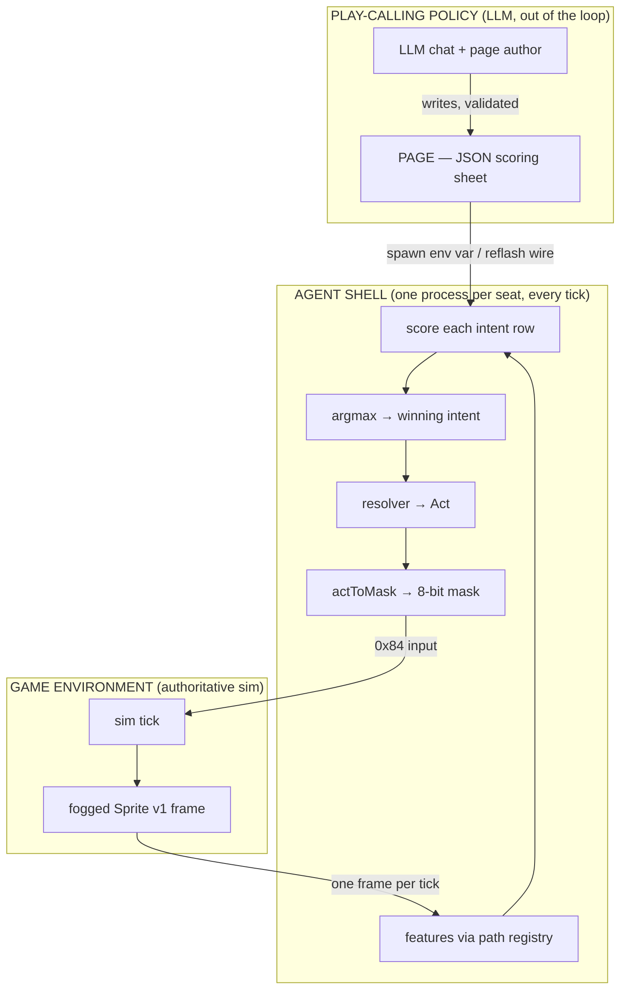
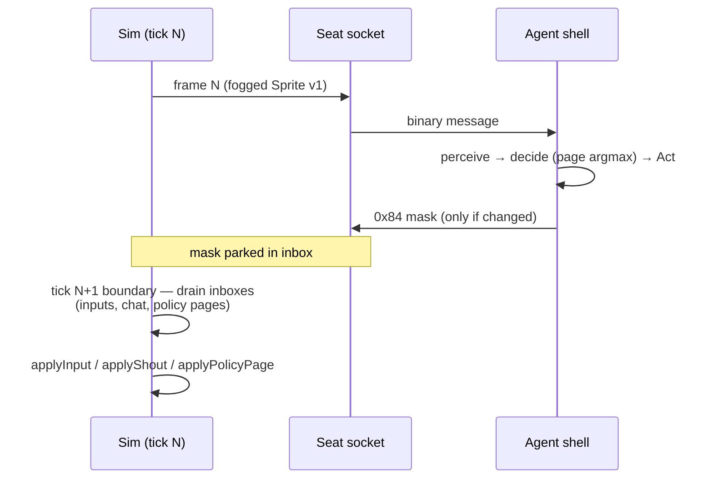
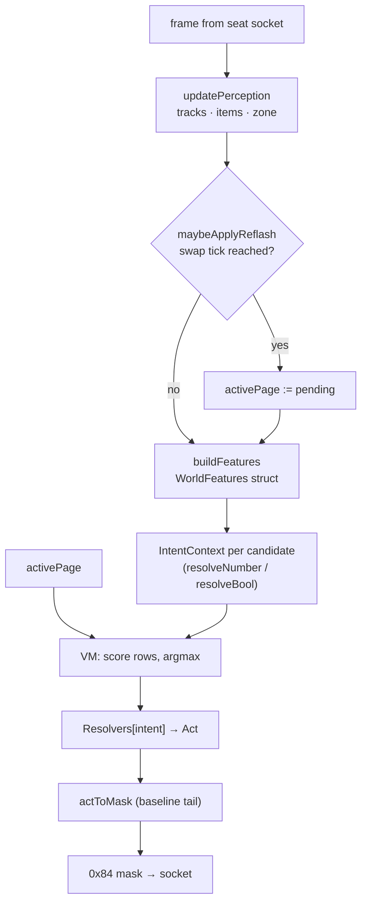
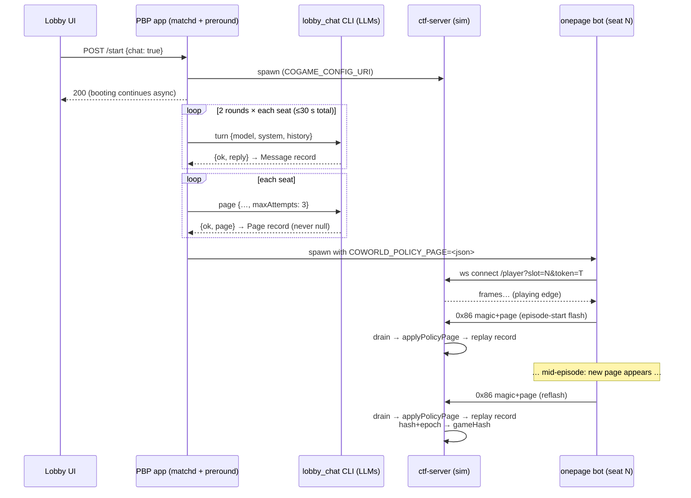
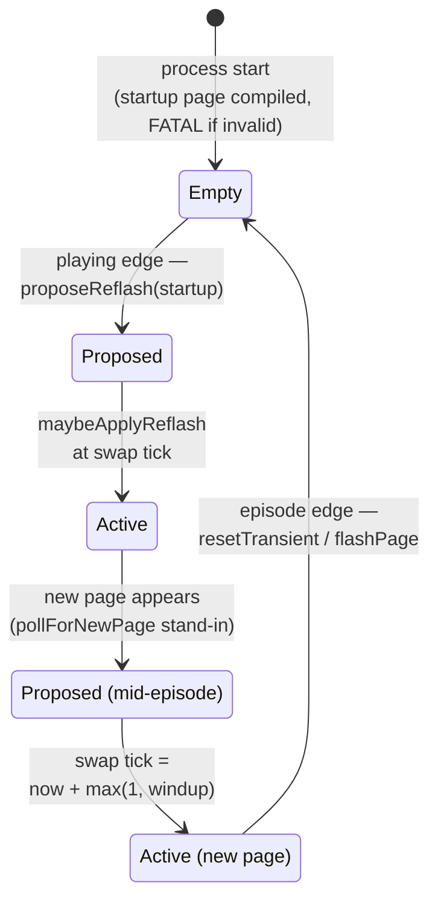
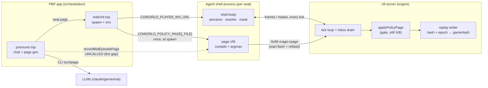
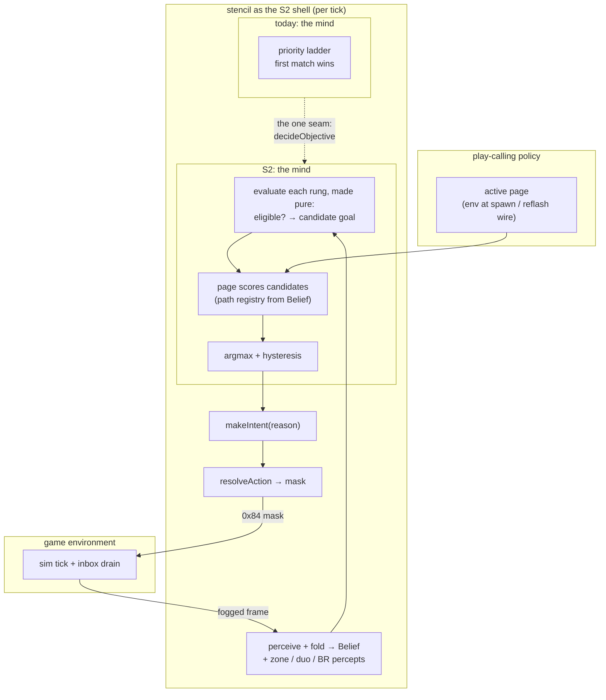

# The Play-Calling Paradigm: Maxwell's Season 2 Architecture and the Policy / Shell / Game Boundary

> **Historical research report (2026-08-29/30).** Branch inventory, default,
> gate, and missing-surface claims below describe the pre-landing tree. They are
> preserved as research evidence, not current Season 2 guidance.

Research report · 2026-08-29, updated 2026-08-30 · for James and the coding
agents planning the Season 2 policy shell. The 2026-08-30 update adds section 0,
which is a plain-language primer on every component plus Maxwell's overnight
commits (his `BR_PLAYS.md` plays document and the page-language unification),
and corrects the body wherever those commits made it stale. The report covers
the paradigms in Maxwell's Paintbot Season 2 work: the onepage scored-intent
policies, the policy-page VM, the reflash wire, and pre-round chat and page
delivery. It explains how they fit the game loop and what it would take to
adapt `stencil` into the shell.

Three repositories appear throughout. `coworld-ctf` is the game engine, and
bare paths refer to it. `coworld-paintbot-player` is Maxwell's match app, and
its paths carry the prefix `PBP:`. James's policy lab carries the prefix
`LAB:`. Files that exist only on unmerged branches are cited as
`origin/<branch>:path:line`. A companion document,
`docs/recon/paintbot-s2-policy-shell-2026-08-29.md`, holds the full branch
inventory.

## Executive summary

Maxwell's Season 2 work establishes one paradigm, stated as a ruling and
implemented end to end on branches: an LLM never plays the game. Instead, it
authors a "page," a small declarative scoring sheet that a deterministic
in-game shell evaluates every tick. The architecture has three strict layers.
STRATEGY is the page: LLM-authored JSON, containing no code. INTENT is a fixed,
named menu the shell offers each tick, which the page can only score. ACTION is
the shell resolving the winning intent into concrete targets and the same 8-bit
input mask any player sends. The page's entire view of the world is a closed,
validated path registry of roughly 22 named scalar and boolean features; it
cannot name an enemy, a pickup, or a coordinate. Pages enter the system at two
moments. The first is bot spawn, through an environment variable produced by a
bounded pre-round LLM chat phase in `coworld-paintbot-player`. The second is
mid-episode, through a "reflash": a magic-prefixed blob on the existing wire
that the engine gates, records into the replay with a content hash, and folds
into the determinism hash, so a replayed match cannot diverge silently. Every
piece of this exists and is tested on `maxwell/br-reflash-integration` and
`maxwell/lobby-chat`. Two gaps were deliberate: the delivery trigger that tells
a running bot a new page is ready, and the choice between two competing page
languages. As of 2026-08-30 the language question is settled (section 0.1); the
delivery trigger remains open.

For the stencil adaptation, the boundary is favorable. The shell's obligations
to the outside world are narrow: speak the seat websocket, load a page from the
environment, propose flashes on the wire, and score the page over a candidate
menu. Everything else, from perception and belief through navigation and
combat, is internal to the shell, and that is exactly the part stencil is
strongest at. The mapping is structural. Stencil's ladder rungs, the sub-goal
behaviors of its priority ladder, play the candidate-menu role, though for
Battle Royale roughly half of today's 20 die with CTF's hearts and endzones,
so the menu itself is largely the new rung set BR_LADDER proposes (section
7.1). Stencil's typed `Intent` struct is a richer version of the `Act` that
onepage produces (section 3). Its `decideObjective` is the single call-site
seam where a page-scored selection would replace first-match-wins, though the
rung bodies behind it need a purity refactor before evaluating all of them
each tick is safe (section 7.3). The integration analysis in section 7 names
the real work: the Battle Royale perception prerequisites (stencil cannot
currently field a BR map at all), making rung evaluation side-effect free,
adding selection hysteresis, choosing the vocabulary stencil will expose, and
deciding where the shell's determinism boundary sits so the lab's
replay-comparison instruments keep working.

## Table of contents

0. [Update (2026-08-30) and a plain-language primer](#0-update-2026-08-30-and-a-plain-language-primer)
1. [The paradigm: strategy, intent, action](#1-the-paradigm-strategy-intent-action)
2. [The game environment and the seat interface](#2-the-game-environment-and-the-seat-interface)
3. [Inside the agent shell: onepage](#3-inside-the-agent-shell-onepage)
4. [The page: what the policy actually writes](#4-the-page-what-the-policy-actually-writes)
5. [The page lifecycle: pre-round chat, spawn delivery, reflash, replay](#5-the-page-lifecycle-pre-round-chat-spawn-delivery-reflash-replay)
6. [The boundary map, consolidated](#6-the-boundary-map-consolidated)
7. [Adapting stencil as the shell](#7-adapting-stencil-as-the-shell)
8. [Open questions and unreconciled decisions](#8-open-questions-and-unreconciled-decisions)
- [Appendix A: the path registry](#appendix-a-the-path-registry)
- [Appendix B: the reflash wire contract](#appendix-b-the-reflash-wire-contract)
- [Appendix C: pre-round chat and page records](#appendix-c-pre-round-chat-and-page-records)
- [Appendix D: sources](#appendix-d-sources)

---

## 0. Update (2026-08-30) and a plain-language primer

- Maxwell pushed six commits to `br-season2-complete` overnight. They include
  his own plays document (`BR_PLAYS.md`, seven plays) and the swap from the
  placeholder page language to the real one. The details are below, and the
  rest of this report has been corrected where those commits made it stale.
- This section also introduces every moving part in plain terms: what runs
  where, what each component is for, and what each wire message does. The
  report originally assumed familiarity it should not have assumed.

### 0.1 What changed overnight (82e7220 to 49d40ec on br-season2-complete)

Maxwell landed six commits on the evening of 2026-08-29. Three things in them
matter here.

**The two page languages are now one.** The prototype bot previously compiled
pages with a placeholder "rows of weights" module, while the real
expression-language virtual machine lived on a different branch. Maxwell
copied the real VM onto the integration branch and rewrote the placeholder
module as a thin adapter around it, so the bot's own call sites did not change
(`origin/maxwell/br-season2-complete:players/onepage/onepage/policy_stub.nim`,
commit a608198). The "which language wins" question this report raised in
section 4.2 is now answered in practice: the expression language won. Two
caveats travel with that. First, the copied VM has already forked from its
tracked original by one bug fix, a crash guard for the moment before the first
page arrives (`origin/maxwell/br-season2-complete:src/ctf/policy_page.nim:616`,
commit 192b297), and Maxwell's own commit message flags that fix as needing a
back-port. Second, the bot gained eleven new observation paths that reconcile
naming drift between the VM's vocabulary and the strategy documents. Two of
those paths are labeled gaps in the code itself and return dummy values
(`self.ticks_to_ring_close` and `intent.exposure`).

**A full, verified 32-seat episode exists.** Commits 90a8d9e and 0e4ad50
record complete Battle Royale episodes: 32 bot seats running six different
strategy pages, every seat's opening page landing on the wire and in the
replay, replay verification passing in both directions, and the glory system
minting scores for all sixteen teams. The second commit fixes a roster bug
(duos were mislabeled and running mismatched strategy pairs) and rebuilds the
in-browser replay viewer, including a Battle Royale end card. Commit 49d40ec
then shortens the episode's dead air by moving the first zone shrink earlier,
through a new `BR_FIRST_WAIT` knob in the recording script.

**Maxwell wrote his own plays document.** `docs/designs/BR_PLAYS.md` (commit
51fe2c6) proposes almost exactly the model James described independently. In
its words, a play is "a hard-coded, named behavior bundle with typed
parameters"; the page becomes "an ordered ladder of play invocations — which
is exactly stencil's first-match-wins priority ladder, one level up"; play
bodies are "engine-versioned code; changing one is a GameVersion event"; and
do-not-shoot lists belong "in BODY-side targeting." He proposes seven plays,
each backed by Season 1 measurements. `pact` is a negotiated alliance with a
do-not-kill list, an agreed end condition, optional active protection, and a
betrayal response. `edge_ride` hugs the safe zone's edge through cover.
`bodyguard` is ward-relative movement: hold a leash to an ally, interpose,
peel attackers off. `jackal` joins someone else's fight when it is cheap.
`target_law` is the standing rule set for who to shoot, who never to shoot,
and when to start shooting. `supply_run` steers to medkits. `crossfire`
manages duo spacing and firing angles. He cut two things from his v1 on
purpose: code interpretation, and mid-match re-flashing ("spawn-boundary
flash is canon"). His list of needed engine work names the same body-side
items this report's section 7 identified: a never-target and prefer-target
filter in the body, ward-relative routing, and partial attacker-of-ward
perception.

### 0.2 The cast of components, in plain terms

**The game** is the `ctf-server` binary, built from the `coworld-ctf`
repository in Nim. It runs the simulation, accepts one websocket connection
per seat, sends each seat one frame of fog-limited observations per tick, and
accepts input messages back. Everything authoritative happens inside this
process: movement, damage, scoring, and replays.

**A hosted policy is a Docker image, not a binary.** On the real Coworld
platform, "a player is a short-lived linux/amd64 container the runner starts
once per slot" (`personal_paintbot/player-build.md:10-11`). The platform's
runner injects environment variables into that container: the websocket
address for its seat (`COWORLD_PLAYER_WS_URL`), and any variables the owner
attached at upload time with `--secret-env`. That upload mechanism is how the
paintball mode's per-policy strategy prompt (`PLAYER_PROMPT`) reaches its
container today (`player-build.md:87-92`). So on the hosted platform,
"delivered by environment variable" means baked in at upload and injected by
the platform when the container starts.

**The match app**, the `coworld-paintbot-player` repository, is a different
animal, and the report should have said so plainly from the start. It is a
small web application Maxwell built for local and demo play on his own
machines. It serves the lobby web pages, starts a local copy of the game
server, launches local bot binaries (not containers) for the non-human seats,
and proxies everything through one address so a human can click "play" in a
browser. Its match daemon, the module `server/matchd.mjs` that this report
calls "matchd," is the part that spawns the game process and the bot
processes and hands each bot its websocket address through an environment
variable. The match app is not the hosted platform, and nothing about it runs
in production. It is simply where Maxwell's lobby, seat-assignment, and
pre-round-chat work lives today.

**The pre-round chat phase** is a feature of that match app, on its
`lobby-chat` branch. When a lobby starts a match with chat enabled, the app
runs a short, bounded conversation before the bots are launched. For each
non-human seat, in turn order, it asks an LLM to say something to the other
seats (two rounds, at most thirty seconds total, twelve seconds per turn).
It then asks an LLM once more per seat to produce that seat's strategy page.
Only after every seat has a page does the app launch the bots, handing each
its page through the environment variable. The "CLI" this report mentions is
the app's LLM helper program. The match app is a small no-dependency Node
server that does not link an LLM SDK, so for each LLM call it launches a
helper executable (`tools/lobby_chat`), writes a JSON request to its standard
input, and reads one JSON line back. A crashed CLI just means that helper
program failed for one call, in which case the phase falls back to a default
page for that seat. None of this helper machinery exists on the hosted
platform, where a policy container is its own LLM client.

**The wire, message by message.** "The wire" in this report always means the
per-seat websocket between a policy and the game. The game sends frames. The
policy can send exactly these message types, whose one-byte identifiers come
from the underlying protocol library (`bitworld/spriteprotocol.nim:34-39`):

| Byte | Name | What it does |
|---|---|---|
| `0x81` | chat | Text from the seat. In normal play it becomes an in-game shout. In paintball squad mode the game instead reads the seat's first chat message as its registration (see below). |
| `0x82` | mouse move | Ignored for policy seats on main. One branch repurposes it for human direct-aim. |
| `0x83` | mouse button | Ignored for policy seats. |
| `0x84` | input | The 8-bit button mask: movement, aim rotation, fire, grenade. This is "an action" on the wire. |
| `0x85` | ready | "I have finished computing this tick." On a fast-mode server, the game skips ahead as soon as every seat has reported ready (`server.nim:1019`). This message, not `0x86`, is the turn-completion signal. |
| `0x86` | debug sprite | A free-form byte blob for drawing private diagnostic overlays. It never affects the simulation (`README.md:176-192`). Maxwell's reflash work rides on this message: a blob that starts with the magic text `CTFPOLICYPAGE1\n` is treated as a page delivery instead of an overlay. |
| `0x87` | sprites off | Asks the server to stop sending cosmetic pixel data. Bots send it once at connect to save bandwidth. |

There is no `0x80` message. The `0x80` that appears in the protocol
documentation is bit 7 inside the `0x84` mask, the grenade button.

**How the game learns a seat's strategy today: over the wire, not from the
environment.** This is the shipped paintball pattern, and it matters because
it is exactly the shape James has asked about. The paintball policy container
reads its `PLAYER_PROMPT` environment variable, wraps it in a small JSON
object, and sends it to the game as its first chat message:
`{"type":"register","prompt":...,"policy":...}`
(`src/paintball_player.nim:33-47`). The game intercepts that chat message,
never publishes it as a shout, stores the prompt server-side, and runs the
entire LLM decision loop inside the game process from then on
(`server.nim:1836-1878`, `decide.nim`). The environment variable exists only
to move the secret from the upload into the policy's own container. The wire
is how it reaches the game. Maxwell's reflash design follows the same
philosophy for pages: the bot reads its page from the environment, then sends
it to the game on the wire at match start, precisely so that the replay
contains it.

**Who "proposes" a call, concretely.** In Maxwell's reflash code, "proposing"
is nothing more than the seat's own bot process sending the magic-prefixed
`0x86` message. The bot composes it (from its environment variable at
startup, or from its file-watching stand-in mid-match), sends it, and
optimistically schedules its own switch. The game receives it, checks three
things (the feature is enabled, the seat index is real, the size is within
bounds; `sim_state.nim:347-385`), stores it, and writes it into the replay.
There is no negotiation, no acknowledgment, and no reply. The acceptance rule
is kept deliberately tiny so the two sides cannot disagree. Nothing outside
the seat's own websocket can deliver a page: the admin route is a read-only
spectator view, the control routes carry no gameplay payload, and the page
inbox has exactly one write site, inside the player-socket handler
(`server.nim:1525`).

**One genuine gap, confirmed:** there is no explicit game-mode announcement
anywhere on the player stream, on main or on any branch. A seat infers the
mode from what the map contains. Capture-zone markers mean CTF; their absence
plus shrink-zone markers means Battle Royale
(`origin/maxwell/br-integrate:src/ctf/labels.nim:157-163,238-259`). The
protocol documentation states there is not even an explicit "game phase"
message; the presence of the map-camera object is the running-match signal
(`docs/PROTOCOL.md:80-86`). If Season 2 wants an explicit mode marker in the
lobby or the interstitial, that is new engine work.

## 1. The paradigm: strategy, intent, action

- One ruling defines three strict layers. The LLM authors a page (STRATEGY),
  the page scores a fixed intent menu (INTENT), and the shell resolves the
  winner into buttons (ACTION).
- The page is data, not code. It has no loops, no branching, and no entity
  references, and the language makes those impossible to write rather than
  merely discouraged.
- The same shape appears three times in the codebase: in onepage on the Battle
  Royale branches, in the merged paintball King-of-the-Hill mode, and in
  BR_LADDER's "playbook page" sketch for stencil.

Maxwell's ruling is written down twice, in nearly identical words. The
page-language specification states it as the system's constitution
(`origin/maxwell/br-onepage-vm:tools/flash/SCHEMA.md:15-48`):

> STRATEGY — the page. One JSON scoring sheet, LLM-authored, no code.
> INTENT — a fixed, named menu the engine offers each tick. The page *scores* it.
> ACTION — the engine resolves the winning intent into a target + 8-bit button mask.
> The page never sees this. … A strategy that tries to name a specific enemy or a
> specific pickup is a malformed strategy — there is no path for it, so it cannot be
> expressed.

The agent shell's module header restates the same three sentences almost
verbatim as its own architecture, adding only the concrete ACTION shape: the
winning intent resolves to `(moveMask, desiredAim, wantFire)`, the same three
values the classic baseline bot's hand-written tactics tree computes, which a
common tail turns into the 8-bit input mask
(`origin/maxwell/br-reflash-integration:players/onepage/onepage.nim:1-9`).

One consequence deserves attention before any design work: the play-calling
policy and the in-game agent never share a data structure richer than the
page and the path registry. The policy influences behavior only by
reweighting a menu, and the shell guarantees the menu's semantics. That is
what makes the LLM safely non-real-time (pages arrive at episode edges and at
occasional mid-episode flashes), what keeps replays deterministic (the page
is a recorded input, and everything below it is pure), and what bounds
prompt-injection-shaped failure (a malformed page is rejected loudly at
validation, never partially obeyed; `policy_stub.nim:134-158`,
`policy_page.nim:320-344`).


Figure 1: The three layers. The page crosses into the shell rarely, at spawn
and at reflashes. Frames and masks cross every tick. The policy never touches
the sim directly.

This is not the first time the codebase drew this line. The merged paintball
King-of-the-Hill mode (`docs/paintball/`) already runs an LLM against a
closed six-intent enum, with a parser that repairs rather than rejects and a
deterministic mask compiler (`src/ctf/directives.nim:22-31`,
`src/ctf/control.nim:416`). The difference is that there the LLM sits inside
the loop, called server-side every 4.5-second turn
(`coworld_manifest_paintbot.json:1866-1911`). Season 2 moves the LLM out of
the loop: it authors a reusable policy artifact instead of issuing orders,
and the shell runs client-side at full tick rate. Section 6 tabulates the
contrast. The shared DNA (a closed vocabulary, deterministic resolution
beneath the LLM, recorded artifacts, and loud failure with a fallback) is
deliberate and worth preserving.

## 2. The game environment and the seat interface

- To the engine, every player is the same thing, whether human, baseline bot,
  onepage shell, or a future stencil shell: a websocket that receives one
  fogged frame per tick and sends an 8-bit mask.
- All policy-relevant inputs are applied at tick boundaries. That rule is the
  anchor of the engine's determinism story.
- The unmerged Battle Royale mode supplies the strategic environment the pages
  are written for: 16 duos, one life each, a shrinking zone, and scoring
  dominated by placement.

The seat interface is the outermost boundary, and it is old, stable, and
symmetric. A seat connects to `ws://…/player?slot=N&token=T`
(`PBP:server/matchd.mjs:277`). The server streams one binary Sprite v1 frame
per tick per seat, and accepts `0x84` input masks, `0x85` ready packets,
`0x81` chat, and `0x87` sprites-off (`src/ctf/server.nim:317-321`; the wire
specification is `docs/PROTOCOL.md`). Inside the mask, the d-pad bits move
the cog (locomotion only), B and Select rotate a continuous 256-brad aim, A
fires, and bit 7 (the C button) charges and releases grenades
(`docs/RULES.md:786-795`, applied at `src/ctf/sim.nim:2352`). The observation
is fogged: a vision cone of plus or minus 60 degrees out to 1.5 times gun
range, plus a small omnidirectional bubble (`README.md:37-48`). Bots read
structured label strings out of the frame: HP lines, item markers, and in
Battle Royale the zone rectangles `zone x0,y0 x1,y1` and `zonenext …`,
restated every frame with exactly one phase of lookahead.

Two engine-side patterns matter for everything in this report.

**Inputs apply at tick boundaries.** The websocket threads never touch the
sim. Inputs are parked per socket and drained at the next tick boundary; the
reflash branch's page inbox describes itself as behaving "exactly like
chatMessages beside it"
(`origin/maxwell/br-reflash-integration:src/ctf/server.nim:86-93`). Anything
that influences the sim is therefore totally ordered by tick, which is what
lets a replay re-apply the same inputs at the same ticks and demand a
bit-identical outcome.

**New mechanics are config-gated.** Every new mechanic defaults off, and a
gate-off configuration plays byte-identically to the old game
(`AGENTS.md:136-147`). The reflash gate `allowPolicyReflash` (section 5.3)
follows this house rule.

The in-match communication channel also lives at this boundary. `applyShout`
(`src/ctf/sim.nim:2236`) refuses to run outside the `Playing` phase
(`:2241-2242`), carries at most 10 characters once per second
(`sim_types.nim:774,819-821`), and is audible within `MapWidth div 5`, about
247 pixels, through walls and fog (`sim_types.nim:1013`,
`sim.nim:2278-2289`). Shout text is hashed into `gameHash` character by
character, so mid-episode chat is a simulation input that affects
determinism. The app-side chat design explicitly defers to that fact
(`origin/maxwell/lobby-chat:docs/preround-chat.md:78-114`).


Figure 2: One tick at the seat boundary. Everything the shell sends is parked
and applied at the next tick boundary, which totally orders policy inputs for
replay.

The strategic environment the pages are written against is Battle Royale
(unmerged; `origin/maxwell/br-integrate` and its family): 32 seats as 16
engine-assigned duos, one life each, and a rectangular zone that shrinks
about a center drawn once per episode and deals no damage until tick 3528 of
6000 (`origin/maxwell/br-integrate:tools/record_br_match.sh:115-123`).
Scoring is a top-heavy placement bonus, `[5,4,4,3,3,2,2,2,1,1,1,0,0,0,0]`
for places 2 through 16 and zero from 13th place on, gated on the team having
made at least one attack
(`origin/maxwell/br-integrate:src/ctf/sim_types.nim:522-524`, gate at
`sim.nim:2995-3000`). A team's placement is decided by whichever duo member
dies second (`sim.nim:2841-2867`). The path-registry documentation restates
this economy for page authors verbatim
(`origin/maxwell/br-onepage-vm:src/ctf/policy_page.nim:148-156`), because it
is the reward function every page is implicitly optimizing.

## 3. Inside the agent shell: onepage

- The shell (`players/onepage/onepage.nim`, about 1,560 lines) is a fork of
  the baseline bot. It replaces the hand-written tactics tree with a
  five-stage pipeline: build features, build a scoring context per intent,
  let the page pick the winner, run that intent's resolver, and reuse the
  baseline's mask tail.
- The per-tick pipeline is fixed, and it is pure given the frame history and
  the active page: perception, the reflash swap check, feature building,
  selection, and resolution.
- Three internal tables (`Resolvers`, `IntentNames`, `TargetIdx`) are all
  indexed by the same enum, on purpose, so that vocabulary, targeting, and
  behavior cannot drift apart.

The onepage runner is the reference implementation of "agent shell" in this
paradigm, and its anatomy is the template a stencil shell would re-implement
with better machinery. Its reuse ledger is explicit (`onepage.nim:11-28`):
baseline's CTF tactics tree (roughly lines 1547 through 3310 of
`players/baseline/baseline.nim`) is replaced, while everything below it (wire
decoding, the label vocabulary, the steering primitives, the nav-grid cost
field) is imported or copied verbatim with a citation at each site.

The per-tick pipeline (`decide`, `onepage.nim:1401-1419`):

1. **Self-location.** Lock onto the bot's own color and find itself; if dead,
   return a zero mask.
2. **Perception fold.** `updatePerception` maintains enemy and partner tracks
   (about five seconds of memory), item beliefs, and the zone rectangles.
3. **Reflash swap check.** `maybeApplyReflash()` runs; it is the only place
   the active page ever changes (section 5.4).
4. **Feature build.** `buildFeatures` computes one `WorldFeatures` struct per
   tick (`onepage.nim:1095-1152`): HP fraction, partner state, enemy
   distances, zone state, and item distances.
5. **Selection.** `selectIntentFor` constructs one `IntentContext` per
   candidate intent (two closures, `resolveNumber(path)` and
   `resolveBool(path)`) and calls the VM's selection function
   (`onepage.nim:1192-1208`).
6. **Resolution.** `Resolvers[intent]` produces an `Act`, the four-field
   record `(moveMask, desiredAim, wantFire, holdC)` (`onepage.nim:163-171`),
   and `actToMask`, a byte-for-byte port of baseline's tail
   (`baseline.nim:3296-3309`), rotates toward the desired aim and edge-fires
   the trigger.


Figure 3: The onepage shell's per-tick pipeline. The page touches exactly one
box, selection. Everything upstream and downstream is fixed shell code.

Three design moves here matter for any reimplementation.

**One enum, three tables.** `Resolvers` (behavior), `IntentNames` (the
ratified ALL_CAPS page-facing vocabulary, and per its comment "the ONLY place
that vocabulary is written down", `onepage.nim:975-992`), and `TargetIdx`
(per-intent targeting) are all arrays indexed by the `Intent` enum.
`TargetIdx` exists so that the page-visible annotations `intent.target_hp`
and `intent.target_dist` are computed, in the code's words, "with the same
targeting call the resolver will actually use for THIS intent this tick — so
it can never disagree with what the engine resolves the winning intent onto"
(`onepage.nim:1023-1062`, `policy_page.nim:196-206`). Related intents share a
target function on purpose. Engage, Peel, and HoldRingSafe all use
`targetThreat` (the nearest enemy) so that all three "stay consistent about
'who is the threat' instead of drifting apart" (`onepage.nim:1027-1031`).

**A path registry that cannot drift.** `fullPathRegistry()`
(`onepage.nim:1073-1089`) is `DefaultPaths` plus a per-intent boolean family
generated from `IntentTagName`, the same table the resolvers are indexed by,
plus the two target annotations. The comment states the invariant:
"'Declared but unresolvable' cannot happen structurally: there is no second,
hand-maintained path list to drift from this one." The resolver side
(`numberPath`, `boolPath`, and `intentTagBool`, `onepage.nim:1155-1190`) is a
set of `case` statements over the exact registered strings.

**Intent menu discipline.** The enum's doc-comment sets the granularity rule:
"Each has exactly one short resolver below …; if a resolver starts growing,
the intent is too vague and should split instead" (`onepage.nim:146-149`).
The 12 ratified intents are `ROTATE_TO_RING`, `HOLD_RING_SAFE`, `ENGAGE`,
`FINISH`, `PEEL`, `HEAL`, `LOOT`, `REGROUP_PARTNER`, `SUPPORT_PARTNER`,
`AVOID_FIGHT`, `THIRD_PARTY`, and `USE_GRENADE`.

Around the per-tick core, the wire loop (`runBot`, `onepage.nim:1466-1520`)
handles the episode lifecycle. On the lobby and interstitial edge (when
`mapCameraReady` goes false) it calls `resetTransient()`, which drops the
per-episode memory and re-arms the flash edge (`onepage.nim:1382-1399`). On
the rising `playing` edge it proposes the startup page on the wire (section
5.4). Startup itself fails fatally: an invalid page from the environment
kills the process before it ever connects (`onepage.nim:1533-1546`).

## 4. The page: what the policy actually writes

- Two page languages existed when this report was written. The linear "rows"
  form is what the live wire round-trip was proven with. The "rules"
  expression VM is richer and has the validation and authoring tooling. As of
  2026-08-30 the rows form has become a wrapper around the rules VM (section
  0.1).
- Both share the essentials: a closed path vocabulary, hard validation with
  named errors, deterministic tie-breaking, and scoring-only semantics.
- The path registry of roughly 22 features is the policy's entire observation
  space. Appendix A lists it in full.

### 4.1 The "rows" form (policy_stub)

The runner on the reflash branch compiles pages with
`players/onepage/onepage/policy_stub.nim`, a self-described placeholder
standing in behind the interface the real VM's author specified
(`policy_stub.nim:1-11`). The schema is one JSON object
(`policy_stub.nim:126-133`):

```json
{"rows": {"ROTATE_TO_RING": {"bias": 3.0, "weights": {"world.zone_dist": 2.0}},
          "ENGAGE":         {"bias": 2.0, "weights": {"self.hp_frac": 1.5,
                                                      "world.nearest_enemy_dist": -0.5}}}}
```

Selection is linear. Each candidate row scores `bias` plus the sum of each
weight times its resolved path value, with booleans as 0 or 1, and the
first-listed candidate wins ties (`policy_stub.nim:160-181`). Rows the page
omits score 0.0, so an empty page deterministically selects the first menu
entry, `ROTATE_TO_RING`. Validation fails loudly: an unknown intent key or
path name raises a `ValueError` naming the exact bad key, and nothing ever
silently scores zero because of a typo (`policy_stub.nim:134-158`).

The swap plan was written into the stub from the start
(`policy_stub.nim:20-26`): when the real VM lands, the module body becomes
`import ctf/policy_page` re-exported under the same four names
(`PolicyPage`, `IntentContext`, `compilePage`, `selectIntent`), so that
"onepage.nim's own call sites should not need to change at all." That is the
swap Maxwell performed overnight (section 0.1).

### 4.2 The "rules" form (policy_page VM)

`origin/maxwell/br-onepage-vm:src/ctf/policy_page.nim` (620 lines, with zero
engine imports) is the real VM, with the authoring loop in `tools/flash/`.
The language is a small JSON s-expression DSL
(`tools/flash/SCHEMA.md:52-67`):

```json
{ "paintbot_policy": 1, "name": "ring hugger", "traits": {"nerve": 0.4},
  "rules": [ {"when": true,
              "score": ["+", ["*", 30, ["get", "intent.is_enemy"]],
                             ["*", -8, ["get", "intent.target_dist"]]]} ] }
```

Its guardrails are the notable part.

- **Rules sum; they never branch.** Every rule's `when` is evaluated per
  intent per tick, and the `score` expressions of the matching rules are
  summed. There is no first-match-wins and no implicit else
  (`SCHEMA.md:88-118`).
- **The operator set is a closed whitelist**: `get trait + - * / min max abs
  clamp < <= > >= == and or not`. There is no `!=`, and an `"if"` anywhere in
  a page is a hard parse-time rejection (`policy_page.nim:59-65`,
  `SCHEMA.md:239-245`). There are no loops, variables, or functions.
- **Unknown paths are rejected with a suggestion**, for example: "rule 0:
  unknown get path 'intent.is_shield' (nearest known path: 'intent.is_peel')"
  (`policy_page.nim:320-344`, `SCHEMA.md:270-283`).
- **Pages intern by a hash of the canonical syntax tree**, so key order and
  whitespace share one compiled object, and sixteen cogs on the same page
  compile it once (`policy_page.nim:450-476`).
- **Ties fall to the lowest index** (`policy_page.nim:618`), matching the
  stub's first-listed rule.

The authoring loop closes the LLM-quality gap mechanically. `flash author
"<brief>"` (with a `--model` choice of claude, gemini, or xai) validates the
model's output and retries with the validation errors appended to the
conversation until it passes; in the tool's words, "an invalid page never
reaches disk" (`tools/flash/flash.nim:1-21`). `flash validate` is the CI
gate, and six seed strategies live in `tools/flash/playbook/`.

**Update, 2026-08-30: the two languages have been reconciled in practice.**
When this report was first written, the wire round-trip proof (section 5.3)
had used rows pages while the authoring loop and the richer expressiveness
lived in rules, and the swap was merely named as pending
(`onepage.nim:28-36`). Overnight, Maxwell performed the swap on
`br-season2-complete`: the placeholder module now wraps the real VM, and the
bot's call sites are unchanged (section 0.1). The rules language won. What
remains open: the copied VM has forked from its tracked original by one
crash-guard fix that still needs back-porting, the SCHEMA.md path catalog
still lags the landed `DefaultPaths`, and eleven vocabulary-reconciliation
paths were added on the integration branch, two of them returning stub
values.

### 4.3 The path registry: the policy's whole world

Both languages resolve their paths through the same registry concept: a flat
list of `(path, kind)` pairs, where the kind is number or boolean
(`policy_page.nim:111-134`). The landed vocabulary is roughly 22 paths across
four namespaces (`self.*`, `partner.*`, `world.*`, `intent.*`), listed in
full with their meanings in Appendix A. Three properties matter
architecturally.

1. **It is the entire interface.** The registry is, in the code's words, "the
   injection point" (`policy_page.nim:107-108`): a shell exposes its
   perception by registering paths and supplying resolver closures, and the
   page can express nothing else. The `DefaultPaths` header says outright
   that the vocabulary carries weight because "James writes strategies
   against it" (`policy_page.nim:135-147`).
2. **Sentinel values are a real authoring hazard.** Several distances use -1
   to mean "never observed." A naive negative weight on
   `world.nearest_enemy_dist` silently inverts its sign when nothing has been
   seen. The registry documents the guard idiom (`policy_page.nim:158-164`).
3. **Reward-relevant state is deliberately absent.** There is no
   `self.placement` and no `self.score`; neither is ever surfaced mid-episode
   (`policy_page.nim:148-156`).

## 5. The page lifecycle: pre-round chat, spawn delivery, reflash, replay

- A page reaches a bot in exactly two ways: once at spawn through an
  environment variable produced by the app's pre-round phase, and mid-episode
  over the reflash wire.
- The pre-round phase is a bounded, fully open LLM huddle that always
  produces a page per seat. Every failure mode degrades to a recorded
  fallback.
- The reflash channel is complete on the engine side: gated, size-capped,
  recorded into the replay with a content hash, and folded into `gameHash` so
  replays cannot diverge silently.
- The trigger connecting the two, a service telling a running bot that a new
  page is ready, is unbuilt on both sides, and that gap was left on purpose.

### 5.1 End-to-end sequence


Figure 4: The page's journey. It is authored in the pre-round phase,
delivered by environment variable, flashed onto the wire at episode start so
the replay records it, and re-flashed mid-episode over the same path.

### 5.2 The pre-round phase (app side)

On `origin/maxwell/lobby-chat`, `POST /api/lobbies/:id/start` with the body
`{"chat": true}` runs the phase. Omitting the flag produces behavior
byte-identical to the app before the feature existed. The transcript and the
pages are readable at `GET /api/lobbies/:id/preround-chat`, which is
poll-only; there is deliberately no POST
(`origin/maxwell/lobby-chat:docs/preround-chat.md:162-174`).

The phase is strictly sequential and bounded (`preround.mjs:93-105,366-374`):
two rounds (with a hard ceiling of three) over every non-human seat, the
whole phase within 30 seconds (`PAINTBOT_PREROUND_CHAT_BUDGET_MS`), and each
turn within 12 seconds (`PAINTBOT_PREROUND_CHAT_TURN_MS`, shrinking to
whatever budget remains; a timeout kills the CLI child process). Replies are
capped at 500 characters. The channel is fully open. Every seat hears every
seat, with no team scoping (`preround.mjs:343-347`), and the system prompt
tells the seats that open collusion is rational because placement pays
nothing below roughly 12th place (`preround.mjs:216-228`). Models rotate
through claude, gemini, and xai by slot (`preround.mjs:111,328`). Each turn
is a one-shot subprocess call to the `lobby_chat` CLI, with a JSON request on
stdin and one JSON line back on stdout; the subcommands are `turn`, `page`,
and `default-page` (`preround.mjs:171-211`).

After the chat, one `page` call per seat generates that seat's page. The
prompt for it is the engine's own `tools/flash/SCHEMA.md` and `prompt.md`,
read live from an engine checkout (`loadPagePromptTemplate`,
`preround.mjs:230-248`), and the result lands with
`setSeat(lobby, a.pos, {page: JSON.stringify(pageRec.page)})`
(`preround.mjs:412`). A page is never null. Every failure (no API key, a
timeout, three invalid attempts, a CLI error, or the phase not running at
all) degrades to a fallback page with a recorded `source` and `reason`
(`preround.mjs:389-450`; the taxonomy is in Appendix C). Since Battle Royale
is a duos mode, one fact deserves stating outright: pages are per-seat, not
per-duo. There is one chat turn, one page call, and one spawn-time delivery
per non-human seat (`preround.mjs:308,377-413`), and the reflash record
addresses a single cog (Appendix B). Nothing in the shipped code shares a
page across a duo.

Delivery is then an environment variable at spawn. `pageEnv()` routes inline
JSON to `COWORLD_POLICY_PAGE` and a file path to `COWORLD_POLICY_PAGE_FILE`
(`lobby-chat:server/matchd.mjs`), merged into the bot's spawn environment
beside `COWORLD_PLAYER_WS_URL`. Because pages must exist before bots spawn,
`startMatch` defers bot seating: it returns immediately, and `finishBooting`
waits for the chat, re-reads the seat assignment (the pages landed on the
lobby seats during the phase), rewrites `assignment.json`, and only then
seats the bots (`preround-chat.md:39-76`). The document is candid about the
cost: a human joining during the phase sees an empty room, and closing that
gap "needs a live page-reflash channel that does not exist"
(`preround-chat.md:58-69`).

### 5.3 The reflash channel (engine side)

The engine half, complete on `origin/maxwell/br-reflash-integration`, is a
page's mid-episode path into the recorded, hashed simulation.

- **The carrier** is the existing `0x86` debug-sprite blob message, with no
  wire version change. A reflash identifies itself by a magic prefix:
  `const PolicyPageMagic* = "CTFPOLICYPAGE1\n"` (`src/ctf/labels.nim:602`).
  The leading `'C'` (0x43) sits outside the legitimate sprite opcodes 0x01
  through 0x06, so "no legitimate overlay packet can begin with this magic"
  (`labels.nim:618-627`). One shared definition serves sender and receiver.
  It was once typed out in both files with nothing checking the copies
  against each other (`onepage.nim:1257-1262`).
- **Receiving**: `isPolicyPagePacket` and `policyPageFromPacket`
  (`global.nim:2001-2023`). Pages park in a one-per-socket inbox
  (`server.nim:86-93,1516-1525`) and drain at the tick boundary
  (`server.nim:2327-2344`).
- **Acceptance**: `applyPolicyPage` (`sim_state.nim:347-385`) checks exactly
  three things. The gate is on (`allowPolicyReflash`, default off,
  `sim_config.nim:63`), the seat index is in range, and the length is between
  1 and 60000 bytes (`MaxPolicyPageBytes`, bounded by the replay record's
  16-bit length prefix, `sim_types.nim:823-831`). It deliberately checks
  nothing else, because "every extra clause here is another way for the live
  server and playback to reach different verdicts" (`sim_state.nim:355-370`).
  It writes bookkeeping only: `policyPage`, `policyPageHash`,
  `policyPageTick`, and `policyPageEpoch`.
- **The record**: the replay reuses the chat record with the high bit of the
  player byte set. The body is a 16-hex-character FNV-1a-64 content hash, a
  space, then the page verbatim (`replays.nim:272-305`). Decoding re-verifies
  the hash, and playback re-applies the page at the identical tick, treating
  a refusal as fatal (`replays.nim:582-602`).
- **Determinism**: `gameHash` mixes in both the page hash and a monotonically
  increasing counter, the epoch (`sim_state.nim:296-306`). The epoch exists
  because re-flashing the same page, which the code notes is "exactly the
  case an LLM produces most, reasserting the current plan," would otherwise
  replay cleanly while hiding a dropped record (`sim_types.nim:1900-1908`).

The evidence discipline here is worth copying. The test file
`tests/test_policy_reflash.nim` (562 lines) includes two negative controls:
dropping only the reflash records makes the replay diverge, and keeping them
but shifting them one tick later also makes it diverge. The live harness
(`tools/roundtrip_reflash_match.sh` and `tools/verify_reflash_roundtrip.nim`)
ran a real 16-duo match with two mid-episode swaps, plus a control run with
the gate off: the same seed and the same proposals reaching the socket
produced zero records (Appendix B).

### 5.4 The bot's side: propose, schedule, swap

The bot-side page state machine (`onepage.nim:1206-1352`) closes the last
determinism hole, which is the starting page. A page delivered by environment
variable "never touches the wire on its own, so a replay re-simulating the
episode has no record of which strategy a cog actually played"
(`onepage.nim:1210-1214`). The fix is structural. `activePage` changes in
exactly one place, `maybeApplyReflash`, which is fed only by
`proposeReflash`, and the episode-start flash goes through that same call at
the rising `playing` edge, putting the starting page on the wire and into the
replay. Until the first flash lands, a matter of a few ticks, the active page
is empty, every row scores zero, and the bot deterministically plays
`ROTATE_TO_RING` (`onepage.nim:1281-1291`).

`proposeReflash` (`onepage.nim:1315-1339`) suppresses duplicates by comparing
raw strings, validates by compiling before sending (an invalid candidate is
"not sent, not applied"), sends the magic plus the bytes verbatim, and
schedules the local swap. The swap boundary is purely local:
`T_effect = T_req + max(1, fireWindupRemaining)`. In plain terms, the bot
never swaps its own policy out from under its own pulled trigger. It uses a
local estimate of the fire windup (`FireWindupTicksLocal = 5`,
`onepage.nim:1261-1266`) that the engine never needs to agree with, because
the server-side `applyPolicyPage` drives no sim decisions at all; as the code
puts it, "this process is the ONLY thing that ever turns 'a new page' into a
different button press" (`onepage.nim:1224-1240`).


Figure 5: The active page's lifecycle inside the bot. Every transition into
"Active" goes through the same propose, schedule, swap path, so the replay's
record of which strategy this cog played is complete from about tick 1.

The seam is `pollForNewPage` (`onepage.nim:1341-1352`), the mid-episode
trigger. It is a stand-in that re-reads `COWORLD_POLICY_PAGE_FILE` when its
content changes, and its own comment says so: "The REAL trigger (the field
service telling this process 'a new page is ready') is a different lane's
delivery mechanism." The matching app-side stub, `recordMidEpisodePage`
(`lobby-chat:server/preround.mjs:460-466`), stores a mid-episode Page record
with a real tick, and it is verified to be uncalled anywhere in the
repository's history. These two functions are the two ends of the unbuilt
bridge, and the Season 2 re-flash work is what meets in the middle.

One caution when reading the app-side comment above `recordMidEpisodePage`
(also flagged in section 8's list of stale comments). It says a page swap
"does not itself touch gameHash the way shout text does." That is true of
the page text, since shout text is hashed character by character and page
text is not, but the page's hash and epoch do enter `gameHash` behind the
engine gate. The two statements are consistent only when read carefully. In
short: shout text is hashed character by character, page text is not, and
the page's hash plus epoch are.

## 6. The boundary map, consolidated

- There are three actors and four contracts: the seat wire (every tick), the
  page language plus the path registry (per flash), the reflash wire and its
  gate (rare), and the spawn environment (once).
- The shell owns everything between the frame and the mask. The policy owns
  only the page. The engine owns admission, recording, and determinism.
- The paradigm inverts paintball's merged design on one axis only: the LLM
  moves from inside the turn loop to outside the episode loop.


Figure 6: The consolidated boundary map. Solid arrows exist and are tested.
The dotted arrow is the unbuilt mid-episode delivery trigger.

The interface inventory, with owners and contracts:

| Interface | Direction | Cadence | Contract and anchor |
|---|---|---|---|
| Seat websocket | engine and shell, both ways | every tick | Sprite v1 frames in; `0x84` masks out (`docs/PROTOCOL.md`; `server.nim:317-321`) |
| Spawn env | app to shell | once per process | `COWORLD_PLAYER_WS_URL`; `COWORLD_POLICY_PAGE` / `_FILE` (`matchd.mjs:277`; `onepage.nim:1268-1278`) |
| Page language | policy to shell | per flash | rules (`SCHEMA.md:52-67`; the rows stub became a wrapper around the real VM on 2026-08-30, section 0.1); validated, failing loudly |
| Path registry | shell to policy | per vocabulary change | about 22 `(path, kind)` pairs; the page's whole observation space (`policy_page.nim:135-208`) |
| Intent menu | shell to policy | per vocabulary change | 12 ratified ALL_CAPS names (`onepage.nim:975-992`) |
| Reflash wire | shell to engine | rare | `0x86` plus `"CTFPOLICYPAGE1\n"` plus the raw page (`labels.nim:602-636`) |
| Reflash gate and record | engine internal | per flash | the gate, the 60 KB cap, and hash plus epoch in the replay and `gameHash` (`sim_state.nim:347-385`; `replays.nim:272-326`) |
| Pre-round chat API | app with UI and LLMs | per match | `/start {chat:true}`; `GET …/preround-chat`; Message and Page records (`preround-chat.md:124-190`) |
| In-match comms | shell to shells | at most 1/s | 10-character shouts, 247 px radius, Playing phase only, hashed (`sim.nim:2236-2289`) |

And the paradigm contrast with the merged precedent:

| | Paintball KOTH (merged) | Season 2 onepage (branches) |
|---|---|---|
| Where the LLM sits | inside the game server, in the turn loop | outside the match, at episode edges |
| What the LLM outputs | a directive: per-cog intents and targets, every 4.5 s (`directives.nim:22-31`) | a page: a scoring sheet over a menu, per flash |
| Bad output | repaired, never rejected (`directives.nim:205-230`) | rejected loudly, never repaired (`policy_stub.nim:134-158`) |
| Real-time obligation | a hard turn budget; degrade, never hang (`decide.nim:11-19`) | none; the shell runs at full tick rate regardless |
| Determinism artifact | the compiled masks are recorded (`server.nim:2016-2021`) | the page is recorded, hashed, and epoch-counted (`replays.nim:293-305`) |
| Secrets | the game container holds the key (`paintball_player.nim:3-8`) | the app and its CLI hold the keys (`flash.nim:64-68`; `preround.mjs`) |

The repair-versus-reject inversion is principled, not accidental. Paintball
must field something every turn under a clock, so it repairs. A page is
authored offline with retries available, so rejection with a named error,
fed back to the model by the authoring loop, produces better pages than
silent repair would.

## 7. Adapting stencil as the shell

*Dated note, 2026-08-30: this section analyzes the adaptation as it was
framed on 2026-08-29, with stencil running as a client-side bot process and
selection done by a page-scored argmax. James has since redirected the
design toward compiled plays running inside the game, and the design
document (`docs/designs/strategy-play-calling-shell-2026-08-29.md`) is where
that direction lives. The analysis below remains the accurate map of what
stencil is and what any adaptation must handle; read its "argmax" framing as
historical.*

- The boundary contract a stencil shell must satisfy is small. It is four
  interfaces (the spawn environment, the page language and registry, the
  reflash wire, and the seat wire), and everything else is internal.
- The mapping is natural. The rungs become the candidate menu, the
  `makeIntent` reasons become the ratified vocabulary, and `decideObjective`
  is the one call site where scoring would replace first-match-wins.
  Stencil's `Intent` and body stay intact below that seam.
- The real work splits into five clusters: the Battle Royale perception
  prerequisites, side-effect-free candidate evaluation, the scoring and
  selection mechanics, the page plumbing, and the determinism and validation
  story.

This section is a requirements analysis, not a design. It reports what the
existing code says the adaptation must handle, with anchors. Per the lab's
own conventions, strategy changes are discussed before they are implemented
(`personal_paintbot/AGENTS.md:60-63`).

### 7.1 What stencil already is, in this report's terms

Stencil (`LAB:paintbot/stencil_nim/`, 21 modules and about 7,400 lines of
Nim as counted on 2026-08-29) is already a shell in everything but the
selection rule. Its process loop speaks the same seat websocket
(`stencil.nim:38-99`, with the entry point reading `COWORLD_PLAYER_WS_URL`
at `:95-99`). Its per-tick pipeline runs perception, belief folding,
orientation, decision, and action (`policy.nim:22-111`). Its decision step
is a single exported function, `decideObjective(belief): Objective`, called
from exactly one place (`strategy.nim:502-515`, `policy.nim:101`). And its
mind-to-body contract is a typed ten-field `Intent`, nine behavioral fields
plus the telemetry-only `reason` string (`types.nim:189-219`), consumed by a
fixed-order body (`resolveAction`, `action.nim:402-551`) with a
corridor-bounded movement follower and a pure weighted-A* planner. Where
onepage resolves a menu intent into a coarse `Act`, stencil resolves a rung
into a validated navigation goal plus micro-movement permissions, a cost
profile, and an aim policy. Its ACTION layer is strictly richer.

One terminology collision needs defusing before it misdirects a design. The
paradigm's capitalized INTENT layer (the fixed, page-scored menu) and
stencil's `Intent` struct are different things that happen to share a name.
In paradigm terms, stencil's `Intent` struct is an ACTION-layer artifact,
the resolved order the body executes, and the counterpart of onepage's
`Act`. The INTENT-layer role, the named candidate menu the page scores, is
played by stencil's rung reasons (`carry_home`, `clear_spray`, and so on),
which today live as the `reason` strings fed to `makeIntent`. Throughout
this report, capitalized INTENT means the menu layer and backticked
`Intent` means stencil's struct.

The current selection rule is the difference. Today it is a 20-rung,
first-match-wins priority ladder (`strategy.nim:329-500`; the companion
recon enumerates it in its section 7.2) plus a pursuit override. The
2026-08-29 framing replaced exactly this rule with a page-scored selection
over the rungs, which BR_LADDER's section 6.5 already sketches, noting that
a selection over `baseWeight + Σ modifiers` "reduces exactly to
first-match-wins at default weights." The ladder is recoverable as a special
case and can serve as the baseline that proves a refactor changed nothing.

One caution before taking the mapping literally: the selection rule
transfers to Battle Royale, but the rung identities largely do not.
BR_LADDER's section 2 kill list finds roughly half of the current 20 rungs
dead on a BR map (`carry_home`, both thief intercepts, both carrier
escorts, `early_defense`, `steal`, the squad-order payloads, the defender
posts, and `hunt_fallback`'s terminal fallback), because their triggers or
goal producers address hearts, pedestals, and endzones that do not exist
there. The BR candidate menu is therefore mostly the new 13-rung set of
BR_LADDER's section 4, reusing the six goal-source combinators rather than
today's rung names. The kill list's own headline hazard is worth carrying
forward. The squad-order rung's trigger stays alive in BR while its payload
is dead, producing what the document calls "a meaningless reachable goal"
that validates through `nearestReachable` and walks the agent somewhere
pointless "with conviction." That silent failure class is what the kill
list exists to catch. For CTF-variant play, by contrast, today's 20 rungs
are the menu as they stand.


Figure 7: The adaptation, anchored to the three-way boundary of Figures 1
and 6. The game's frames and masks and the policy's page cross the shell
boundary exactly as before. The only change is inside the mind, where the
ladder's first-match-wins rule gives way to evaluating every rung, scoring
the candidates with the page, and picking the winner, between Belief and
`makeIntent`. Everything else in the shell survives. Note that "one seam"
means one call site: evaluating every rung first requires refactoring the
rung bodies to be side-effect free (section 7.3), so the blast radius
inside `strategy.nim` is every rung, not one function.

### 7.2 Cluster 1: Battle Royale perception prerequisites (blocking, and independent of the paradigm)

Stencil cannot currently field a BR map at all
(`origin/maxwell/br-ladder-design:docs/designs/BR_LADDER.md`, section 7).

- The `Team` enum has four values; BR needs sixteen.
- `WorldMap` construction is gated on perceiving endzones. A BR map emits
  none, so the bot holds on `no_worldmap` for the entire episode
  (`policy.nim:39-50`; ladder rung 0 at `strategy.nim:331-332`).
- `seatsPerTeam` resolves to 4 for a duo (`LAB:policy.nim:34-37`). Do not
  "fix" it in isolation. BR_LADDER's section 5(a) traces how the wrong 4
  accidentally routes `squadTable` into the branch that yields exactly the
  right duo pairing (seats {0,1}, quorum 2), while correcting it to 2 also
  changes `defenderCount` (`LAB:roles.nim:6-7`) and the
  `seatsPerTeam × LivesPerPlayer` arithmetic in `enemyLivesLeft`
  (`LAB:squads.nim:133`).
- The zone markers (`zone` and `zonenext`) are not perceived at all.
- A healthy BR cog's lives label reads `x0`.
- The squad-consensus layer breaks hard in the lone-survivor state that BR
  guarantees for fifteen of sixteen teams. BR_LADDER's section 5 recommends
  `SquadCommand = 0` for a BR MVP, replaced by partner-local rungs.
- The WorldMap build may not fit the tick budget on a BR map. The BR field
  is about 6.9 times the CTF area (3211×1713 versus 1235×659), and stencil
  builds all of its map knowledge online, "in the single tick the init
  snapshot completes": the clearance field, the 8-pixel grid, the
  components, the watershed, the cover sectors, the Dijkstra fields, and
  the post atlas, over 5.5 million pixels instead of 814 thousand.
  BR_LADDER marks this OPEN and unmeasured: "it is the kind of thing that
  shows up as a mysterious first-frame stall rather than an error, and it
  is worth timing before anything else is diagnosed" (BR_LADDER section 7,
  item 6; `policy.nim:39-50`, `worldmap.nim:173-209`). The same item notes
  that `nearestReachable`'s default 256-pixel radius is proportionally much
  tighter on this map, which changes how often goal producers fall through.

These are prerequisites for any stencil-on-BR work, paged or not. The
onepage bot's zone and partner percepts (`onepage.nim:1095-1152`) are the
working reference for what must be read from the frame.

### 7.3 Cluster 2: side-effect-free candidate evaluation (the ladder-to-scoring hazard)

A scored selection must evaluate every candidate before choosing one.
Today, rung evaluation is not a pure query.

- The pre-ladder block runs latch updates and `updateConsensus()` every
  tick, before any rung (`strategy.nim:330-347`).
- Several rungs mutate Belief as they fire: the `converting` latch
  (`strategy.nim:434-438`, an in-game wipe-hunt mechanic unrelated to this
  section's ladder conversion), the six `squadOrderPost*` fields that the
  body later reads for stance and aim (`strategy.nim:448-455`; the
  body/mind report's leak 4 calls this "a real dataflow: mind → belief →
  body, invisible to the Intent"), and roughly eight counters.
- The lab just relearned this hazard class the hard way, through a value
  that mutated an oscillator merely by being read, where eager evaluation
  of a formerly lazy expression silently changed behavior
  (`LAB:TENTATIVE_LESSONS.md:20-26`).

The adaptation therefore requires splitting each rung into two halves:
eligibility plus goal production, which is pure and safe to run for all
candidates every tick, and commitment effects, which run only for the
winner. BR_LADDER's combinator analysis says the goal-production side is
tractable. Six goal-source combinators cover all fourteen existing
producers, with two small refactors named: the ring scorer takes its weight
vector as a parameter (`strategy.nim:248-249`), and the threat-track filter
takes a predicate (`strategy.nim:168-170`).

Purity is necessary but not sufficient, because evaluating everything is
also a per-tick cost question the ladder never had. First-match-wins stops
at the first eligible rung. A scored selection runs every candidate's
eligibility and goal production every tick, and several producers reach
into reachability validation or scored searches (`reachableGoal` and
`nearestReachable`, the 16-direction flee scorer, post ranking). With 13 to
20 candidates per seat and up to 32 seats on a map 6.9 times the old area
(section 7.2's build-cost item), the compute budget for candidate
evaluation is an open capacity question that no source has measured. It
belongs on the same time-it-before-diagnosing list as the WorldMap build.
Mitigations (caching, lazy goal production for clearly losing rows,
evaluating goals only for the top few scores) are design territory and
deliberately out of scope here.

Two adjacent facts from the same audit round out the hazard list. Dead
ticks bypass strategy entirely: `policy.nim:103` hand-builds a `not_alive`
Hold, `resolveAction` still runs, and any new Intent field must be stamped
there too (`LAB:TENTATIVE_LESSONS.md:28-32`). And outbound chat is a
second, separate decision ladder attached after action resolution (leak 3),
which a page-driven design has to either leave alone or bring into the
scored menu deliberately.

### 7.4 Cluster 3: scoring and selection mechanics

- **Candidate vocabulary.** Stencil's rung reasons (`carry_home`,
  `clear_spray`, `escort_carrier`, and the rest) are the natural candidate
  names, and `makeIntent`'s case-per-reason table (`strategy.nim:40-99`) is
  already the centralized mapping from behavior to Intent shape, playing
  the role onepage's `Resolvers` table plays. The BR menu would draw from
  BR_LADDER section 4's proposed 13 rungs (`zone_escape`, `zone_rotate`,
  `zone_forecast`, `partner_support`, `partner_regroup`, `third_party`, and
  so on), which overlap but do not coincide with onepage's 12, nor, per
  section 7.1's kill-list caution, with today's 20. Whether the Season 2
  league ratifies one shared vocabulary or allows per-shell vocabularies is
  an open decision (section 8).
- **Path registry.** Stencil's Belief is far richer than onepage's feature
  set, and the shell must choose which parts of it to expose as paths. The
  discipline to copy is onepage's: registry entries generated from the same
  tables the resolvers use (`onepage.nim:1073-1089`), sentinel conventions
  documented per path (`policy_page.nim:158-164`), and no aspirational
  entries.
- **Hysteresis.** The ladder never flickered, because priorities are total.
  A scored selector will oscillate near ties unless it carries dwell and
  margin state. The in-house precedent is target selection's
  `FirefightTargetMinDwellTicks` plus its switch margin
  (`LAB:fight.nim:278-280`). The six existing weighted-sum sites (companion
  recon, section 7.5) share the pattern to imitate: deterministic
  tie-breaks, validate the winner, keep an explicit fallback, and write the
  score components to Belief for tracing.
- **Ladder parity as the baseline.** Because default weights reduce the
  scored selection to the ladder (BR_LADDER section 6.5), the first
  milestone has a built-in falsifier. A "ladder page" should reproduce
  current behavior decision for decision on the lab's recorded-wire corpus
  (`LAB:tools/compare_stencil.py`; the bar v69 set was 278,016 of 278,016
  exact decisions).

### 7.5 Cluster 4: page plumbing

The shell must implement the four boundary behaviors sections 3 through 5
documented, none of which exist in stencil today.

1. **Load and validate at startup**: `COWORLD_POLICY_PAGE` and its `_FILE`
   variant, failing fatally on an invalid value
   (`onepage.nim:1268-1278,1533-1546`). Stencil's configuration discipline
   already matches (152 `STENCIL_*` knobs, validated against ranges,
   raising at process start; `LAB:config.nim:7-51`).
2. **A VM**: import or port `policy_page.nim`, which has zero engine
   imports and so compiles anywhere. Stencil pins the game's dependency
   graph at build time (`LAB:Dockerfile:33-36`), so vendoring the module is
   straightforward. (The alternative, speaking the rows form, was mooted on
   2026-08-30 when the rows stub became a wrapper around the VM.)
3. **Propose, schedule, swap**: the episode-start flash on the wire at the
   playing edge, duplicate suppression and validate-before-send in the
   style of `proposeReflash`, and a local swap boundary. Stencil's analogue
   of "don't swap mid-windup" needs defining against its own body state; it
   has real windup and fire-freeze machinery in `action.nim:417-432`.
4. **The mid-episode trigger**: whatever the Season 2 delivery lane builds
   (the gap in section 5.4). The shell's obligation is only to expose a
   hook the trigger can call. Onepage's hook is the `pendingProposal` field
   checked each frame (`onepage.nim:1445-1462`).

### 7.6 Cluster 5: determinism and validation

The lab's acceptance instrument is exact replay comparison on recorded wire
traffic (`compare_stencil.py`), and the engine's reflash design makes pages
recorded inputs. The two compose. The shell must be deterministic given the
frame stream and the page stream, and the page stream is captured both by
the lab's wire recorder (pages arrive via the environment and are visible
as proposals in the outbound traffic) and by the hosted replay (the reflash
records). The design decisions this imposes:

- The page-scored selection must be bit-deterministic: a fixed iteration
  order over candidates (onepage's stub had first-listed-wins,
  `policy_stub.nim:160-181`; the VM uses lowest index,
  `policy_page.nim:618`), no wall-clock reads, and no iteration over
  unordered tables. The VM sorts `allPaths` for exactly this reason
  (`policy_page.nim:130-134`).
- Replay comparisons must reproduce capture-time page inputs the same way
  they must reproduce capture-time `STENCIL_*` environment settings
  (`LAB:TENTATIVE_LESSONS.md:33-39`). The comparator likely needs to learn
  the page file and environment as part of a capture's identity.
- If stencil adopts the on-wire start-flash pattern, its wire recorder
  (`STENCIL_WIRE_RECORD`, `stencil.nim:10-28`) captures proposals for
  free, since they are outbound frames.

### 7.7 What deliberately does not need to change

Stating this bounds the work. The seat transport and process loop
(`stencil.nim`), perception and belief folding, the WorldMap pipeline
(after the BR percepts land), the planner, the follower and its corridor
rule, the combat layer, the typed `Intent` and `makeIntent`, and the body's
`resolveAction` order all sit strictly below the seam and are untouched by
the paradigm. (`strategy.nim` as a module is not untouched, since the two
goal-production parameterizations of section 7.3 live there, but
`makeIntent`'s reason-to-`Intent` table and everything below it are.) The
paradigm's own guarantee, that ACTION is invisible to the page, is what
makes stencil's stronger body a pure advantage rather than an integration
burden.

## 8. Open questions and unreconciled decisions

*Dated note, 2026-08-30: two of these questions have since been answered
outside this report. The page language closed (first item below). And James
has directed that the shell's body should ultimately live inside the game,
in the `coworld-ctf` repository, which resolves the architecture fork in
the fourth item in the direction of the paintball precedent; the design
document carries that discussion.*

- **Page language** (closed as of 2026-08-30): Maxwell performed the
  designed swap (`policy_stub.nim:20-26`) on `br-season2-complete`, and
  rules is the language (section 0.1). The residue: the crash-guard
  back-port to `br-onepage-vm`, the stale SCHEMA.md path catalog, and two
  stub vocabulary paths.
- **Plays convergence** (new): Maxwell's `BR_PLAYS.md` (section 0.1)
  proposes hard-coded, engine-versioned plays with typed parameters and a
  ladder-of-plays page, deliberately cutting mid-match reflash from his v1
  ("spawn-boundary flash is canon"). How his seven-play menu, his
  ladder-of-plays page shape, and his spawn-only v1 ruling combine with
  James's one-active-play, mid-match-callable design is now the live
  design conversation.
- **Vocabulary governance**: one league-ratified intent menu and path
  registry shared by all shells, or per-shell vocabularies? Onepage's fine
  per-intent path family is itself marked "PENDING MAXWELL'S RULING"
  (`onepage.nim:1080-1085`). Stencil's richer Belief will pressure the
  registry to grow. Who ratifies?
- **The mid-episode delivery lane**: both ends are stubs by design
  (`pollForNewPage` and `recordMidEpisodePage`). For hosted play, nothing
  specifies how an external page service reaches a running bot at all. The
  merged paintball precedent argues for the LLM living inside the game
  container (platform secrets, and reproducibility with no network in the
  loop, `src/paintball_player.nim:3-8`), while the Season 2 app model is
  orchestrator-side. When this report was written this was the largest
  unresolved architecture fork; see the dated note above.
- **Pre-round and reflash convergence**: the chat contract anticipates
  `mid_episode` records, but no code emits them. Mid-episode chat is ruled
  to ride the in-game shout channel (10 characters, 247 px, hashed), a
  very different medium from the open pre-round huddle. How much
  "re-strategizing" is page reflash versus shout-level coordination is
  undesigned.
- **Stale comments not to be misled by**: onepage's header still says the
  server receive arm "does not exist yet," which was true on the runner
  lane and is false on the integration branch (`onepage.nim:40-44`). The
  app-side note that a page swap "does not touch gameHash" refers to the
  page text, not the hash and epoch that do enter it (the detailed reading
  is at the end of section 5.4).
- **Unmerged substrate**: all of BR, reflash, and onepage is branch-only
  (`br-integrate` is 253 commits ahead of main, and the app branches have
  conflicting bases). Any Season 2 timeline inherits the BR merge
  question.

---

## Appendix A: the path registry

The landed, resolver-backed vocabulary
(`origin/maxwell/br-onepage-vm:src/ctf/policy_page.nim:135-208`,
cross-checked against the resolver arms at
`origin/maxwell/br-reflash-integration:players/onepage/onepage.nim:1155-1190`).
`[S]` marks a sentinel: -1 means "never observed," not "close," so guard
with a comparison before weighting the value arithmetically. `†` marks
registry drift: these three paths are in the integration branch's stub
registry and resolver arms (`policy_stub.nim:73,77,94`;
`onepage.nim:1164,1177,1187`) but absent from the VM branch's
`DefaultPaths`, one more artifact of the two lanes (section 4.2's update).

| Path | Kind | Meaning |
|---|---|---|
| `self.hp_frac` | number | own HP / MaxHp, read from the `lives <hp>hp x<lives>` HUD text |
| `partner.alive` | bool | the duo partner has a live track this life |
| `partner.dist` | number | px to partner's last known position `[S]` |
| `partner.in_combat` | bool | any tracked enemy within 200 px of partner's last known position |
| `world.enemy_count` | number | currently remembered enemy tracks (about 5 s memory) |
| `world.nearest_enemy_dist` | number | px to nearest remembered enemy `[S]` |
| `world.weakest_enemy_hp` | number | lowest HP among enemies ever HP-read `[S]` |
| `world.in_zone` | bool | inside the current BR zone rectangle |
| `world.zone_dist` | number | px to nearest zone edge; 0 if inside or no marker yet |
| `world.medkit_dist` | number | px to nearest medkit believed stocked `[S]` |
| `world.item_dist` | number | px to nearest non-medkit pickup (one bucket) `[S]` |
| `world.third_party_dist` | number | px to the nearest fight-between-others target `[S]` † |
| `world.carrying_nade` | bool | currently holding a grenade † |
| `intent.is_enemy` | bool | row is Engage / Finish / SupportPartner / ThirdParty |
| `intent.is_peel` | bool | row is Peel / AvoidFight (unrelated to the Glory deed PEEL) |
| `intent.is_recover` | bool | row is Heal |
| `intent.is_item` | bool | row is Loot |
| `intent.is_partner` | bool | row is RegroupPartner / SupportPartner |
| `intent.is_zone` | bool | row is RotateToRing / HoldRingSafe / AvoidFight |
| `intent.is_grenade` | bool | row is UseGrenade † |
| `intent.target_hp` | number | HP of this row's target, via the resolver's own targeting call `[S]` |
| `intent.target_dist` | number | distance to this row's target `[S]` |

The integration branch's registry additionally generates the fine
`intent.is_<name>` boolean per menu entry (12 paths) from the same table
the resolvers index (`onepage.nim:1073-1089`); this family is additive and
pending a ruling. Deliberately absent: `self.placement` and `self.score`,
never surfaced mid-episode (`policy_page.nim:148-156`).

Coarse-tag membership (`onepage.nim:1155-1167`): `is_enemy` covers Engage,
Finish, SupportPartner, and ThirdParty; `is_peel` covers Peel and
AvoidFight; `is_recover` is Heal; `is_item` is Loot; `is_partner` covers
RegroupPartner and SupportPartner; `is_zone` covers RotateToRing,
HoldRingSafe, and AvoidFight; `is_grenade` is UseGrenade.

## Appendix B: the reflash wire contract

The byte layout of a reflash proposal (bot to server), on the `0x86`
debug-sprite blob message:

```
"CTFPOLICYPAGE1\n" + <raw page JSON bytes, verbatim>
```

- The magic: `src/ctf/labels.nim:602` (branch `br-reflash-integration`).
  The leading `'C'` (0x43) is outside the sprite packet opcodes 0x01
  through 0x06, so overlay packets cannot collide (`labels.nim:618-627`).
- Discrimination: a packet must be strictly longer than the magic. A bare
  magic stays on the overlay path (`global.nim:2001-2023`;
  `tests/test_policy_reflash.nim:470-561`).
- Acceptance (`sim_state.nim:347-385`): `allowPolicyReflash` is on, the
  player index is valid, and the length is between 1 and 60000. There are
  no phase, alive, or cooldown checks; that minimalism is the determinism
  strategy (`sim_state.nim:355-370`).
- The replay record (`replays.nim:272-305`): a chat record with
  `player = 0x80 | cogIndex` (a 6-bit cog field), and a body of
  `toHex(FNV1a64(page), 16) & ' ' & page`. Decoding verifies the hash
  (`:307-326`), and a playback refusal is fatal (`:582-602`).
- gameHash mixes in `policyPageHash` and `policyPageEpoch` when the gate is
  on (`sim_state.nim:296-306`; the epoch rationale is at
  `sim_types.nim:1900-1908`).
- Evidence: four test suites including the drop-records and shift-one-tick
  negative controls (`tests/test_policy_reflash.nim:326-405`); a live
  16-duo round trip with two mid-episode swaps plus a gate-off control
  producing zero records (`tools/roundtrip_reflash_match.sh:46-48`,
  `tools/verify_reflash_roundtrip.nim:15-18`); and committed replay
  artifacts in `rt/` on the branch.

## Appendix C: pre-round chat and page records

The Message record (`origin/maxwell/lobby-chat:server/preround.mjs:330-339`;
`docs/preround-chat.md:124-136`):

```jsonc
{ "id": "215c6efd1633", "matchId": "e22625",
  "tick": null, "phase": "pre_round",
  "from": { "pos": 1, "slot": 1, "name": "Amber Scout", "team": "blue" },
  "role": "assistant",        // "system" = seat stayed silent this turn
  "text": "…",                // ≤500 chars
  "model": "gemini", "ts": 1788032532751 }
```

The Page record (`preround.mjs:389-403`; `preround-chat.md:143-153`):

```jsonc
{ "pos": 1, "slot": 1, "tick": null, "model": "gemini",
  "page": { "paintbot_policy": 1, "…": "…" },   // NEVER null
  "source": "fallback_no_key",                   // see taxonomy below
  "reason": "GEMINI_KEY is not set",             // null when source = "llm"
  "ts": 1788032532866 }
```

The failure-source taxonomy (`preround.mjs:421-427`): `llm` (a validated
page); `fallback_no_key`; `fallback_timeout`; `fallback_invalid` (no valid
page after three attempts); `fallback_error`; and `fallback_unavailable`
(the whole phase could not run). Every fallback still yields a page,
through `default-page` or an in-process constant (`preround.mjs:433-450`).

The bounds (`preround.mjs:93-105`): two rounds with a ceiling of three; a
30-second phase budget; 12 seconds per call, shrinking to the remaining
budget; 500-character replies; and at most three page attempts. Field
notes: `matchId` (not `lobbyId`) is the key; `phase` is only ever
`"pre_round"`; and `recordMidEpisodePage` (`preround.mjs:460-466`) is
defined and uncalled. Persistence lives at
`.run/<lobbyId>/{config,assignment,preround_chat}.json` plus the logs.

## Appendix D: sources

### coworld-ctf, branch `origin/maxwell/br-reflash-integration`
- `players/onepage/onepage.nim`: the agent shell (read in depth this session)
- `players/onepage/onepage/policy_stub.nim`: the rows VM stub
- `src/ctf/labels.nim:600-640`: the PolicyPageMagic contract
- `src/ctf/global.nim:2001-2053`: the receive arm
- `src/ctf/server.nim:86-93,1516-1525,2327-2344`: the inbox and drain
- `src/ctf/sim_state.nim:296-306,347-385`: acceptance and gameHash
- `src/ctf/sim_types.nim:823-831,1693,1900-1908`: caps, gate, epoch
- `src/ctf/replays.nim:272-357,582-602`: the record and playback
- `tests/test_policy_reflash.nim`, `tools/roundtrip_reflash_match.sh`,
  `tools/verify_reflash_roundtrip.nim`, `rt/`: evidence

### coworld-ctf, branch `origin/maxwell/br-season2-complete` (2026-08-30 update)
- `docs/designs/BR_PLAYS.md`: Maxwell's seven-play vocabulary
- `players/onepage/onepage/policy_stub.nim`, `src/ctf/policy_page.nim`:
  the stub-to-VM swap and the nil-page guard
- `tools/record_br_episode.sh`, `rt_episode/`: the verified 32-seat episodes
- `tools/dump_glory_from_replay.nim`: glory readback from a replay

### coworld-ctf, branch `origin/maxwell/br-onepage-vm`
- `src/ctf/policy_page.nim`: the rules VM and DefaultPaths
- `tools/flash/SCHEMA.md`, `tools/flash/flash.nim`, `tools/flash/prompt.md`,
  `tools/flash/playbook/`: the page language and authoring loop

### coworld-ctf, other branches
- `origin/maxwell/br-ladder-design:docs/designs/BR_LADDER.md`: the
  stencil-BR ladder design; section 2 kill list, section 4 rungs, section 5
  squads verdict, section 6 authorability, section 7 prerequisites
  (including the WorldMap build-cost OPEN item)
- `origin/maxwell/br-integrate:src/ctf/sim_types.nim:509,522-524`,
  `sim.nim:2841-2867,2995-3000`, `tools/record_br_match.sh:115-123`: BR rules
- `origin/maxwell/ladder-scout-tooling:docs/designs/BR_MAPGEN.md`: the BR
  mode specification

### coworld-ctf, main
- `src/ctf/server.nim`, `src/ctf/sim.nim:2236-2289,2352-2386`,
  `src/ctf/sim_types.nim`, `src/ctf/mux.nim`: the seat interface, shouts,
  and transport
- `src/ctf/{decide,directives,control,llm}.nim`, `src/paintball_player.nim`,
  `docs/paintball/*`, `coworld_manifest_paintbot.json:1866-1911`: the
  paintball precedent
- `docs/PROTOCOL.md`, `docs/RULES.md`, `README.md`, `AGENTS.md`: the wire
  and the rules
- `players/baseline/baseline.nim`: the forked classic shell

### bitworld (vendored protocol library)
- `bitworld/spriteprotocol.nim:34-39,504-570`: the client message opcodes
  and their parsers

### coworld-paintbot-player
- `server/matchd.mjs`, `server/lobby.mjs`, `server/app.mjs` (main): spawn
  and seats
- `origin/maxwell/lobby-chat:server/preround.mjs`,
  `origin/maxwell/lobby-chat:server/matchd.mjs`,
  `origin/maxwell/lobby-chat:docs/preround-chat.md`,
  `origin/maxwell/lobby-chat:server/engine.mjs`: the chat phase and page
  delivery
- `bin/vendor-engine.sh`, `server/field.mjs:266-310`: vendor and
  client-stamp context

### paintbot_lab (LAB:)
- `paintbot/stencil_nim/{stencil,policy,strategy,types,action,nav,planner,fight,
  config}.nim`: the shell candidate
- `docs/reports/stencil-policy-loop-2026-08-29.md`: the body/mind pre-read
  (leaks and cadences)
- `docs/designs/nav-layer4-intent-contract-2026-08-13.md`: the Intent
  contract
- `WORKING_CONTEXT.md:111-172`, `TENTATIVE_LESSONS.md`: rework directives
  and hazards
- `tools/compare_stencil.py`, `tools/self_play.py`, `Dockerfile`:
  validation and build
- `player-build.md` (repository root): the hosted player image contract

### This session
- `docs/recon/paintbot-s2-policy-shell-2026-08-29.md`: the companion recon
  with the full branch inventory and merge-state map
